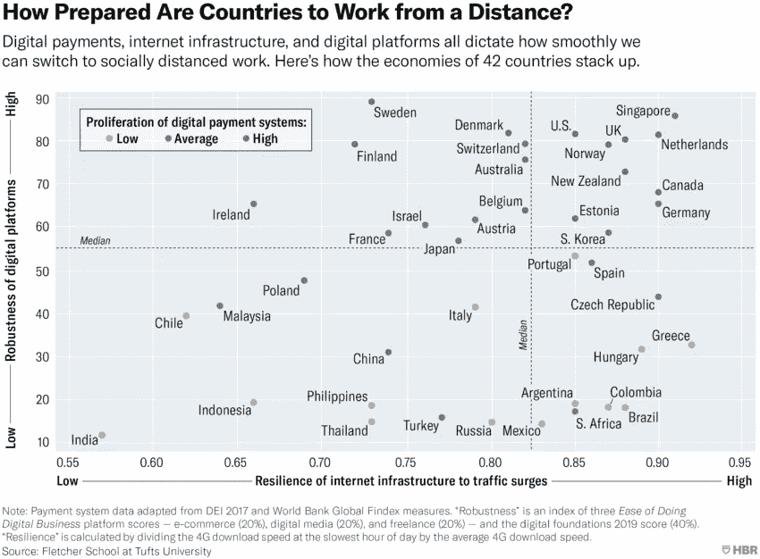
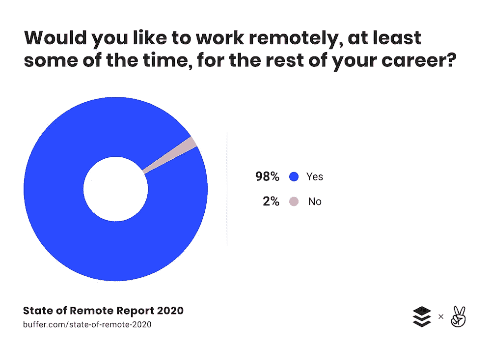
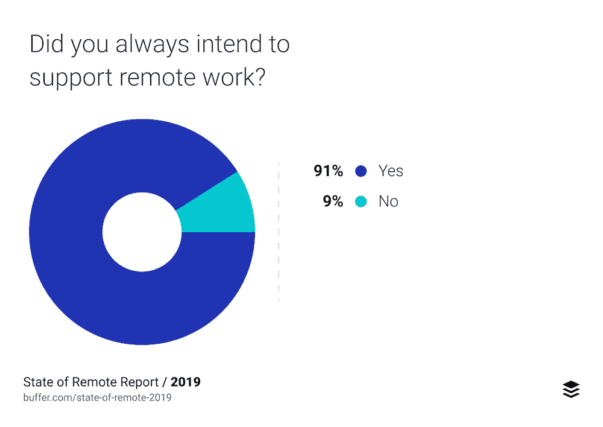
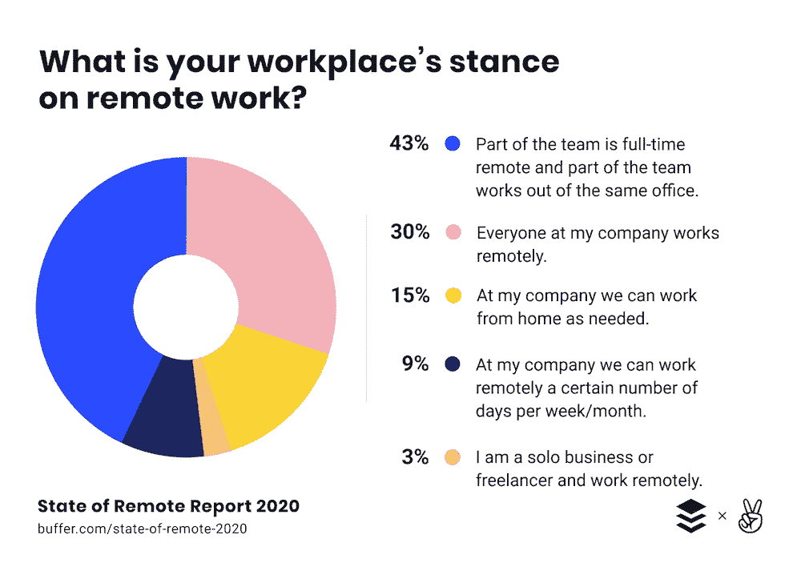

# 远程工作是一种新常态；借助 IT 离岸外包节省成本

> 原文：<https://blog.devgenius.io/remote-work-is-a-new-normal-save-costs-with-it-nearshoring-2f471cea3a91?source=collection_archive---------22----------------------->

今年，全世界都被迫转向远程工作。经验表明，大多数员工在家工作同样富有成效，甚至更有效率。一些公司，包括主要的国际公司，计划坚持这种工作方式，即使在危机爆发后。由于公司已经习惯了远程员工的想法，为什么不通过雇佣工资较低的近岸 IT 专家来节省成本呢？

# 不同国家的远程工作

纵观全球，许多公司发现向远程工作的转变并不顺利。为通常在办公室工作的员工配备电脑设备，重新调整工作文化以保持员工之间的联系，对大多数人来说，这是一个重大转变。许多国家遭受平台的中等强度和脆弱的互联网基础设施。

在文章“[中，哪些国家准备好(或没有准备好)进行远程工作](https://hbr.org/2020/04/which-countries-were-and-werent-ready-for-remote-work)？”作者巴斯卡尔·查克拉沃蒂和拉威·香卡·查图维迪概述了不同的国家如何采取大不相同的措施来阻止病毒的传播，以及向远程工作的过渡有多顺利。

在塔夫茨大学弗莱彻学院(Fletcher School)，在一个由万事达卡影响力基金(Mastercard Impact Fund)资助、由万事达卡包容性增长中心(master card Center for Inclusive Growth)管理的研究项目中，他们通过评估 42 个在全球经济中具有重要地位并已制定了社会距离措施的国家，研究了远程工作的准备情况。一些缺少关键数据的国家没有包括在内。他们使用他们团队开发的三个指数对经济的“社会距离准备度”进行评分，他们的团队包括研究人员格里芬·布鲁尔和克里斯蒂娜·菲利波维奇:

-关键平台的稳健性——以技术为媒介的远程工作、电子商务、数字媒体和国家的数字基础——是业务连续性的关键

-促进交易的数字支付选项的扩散和弹性

-互联网基础设施对流量激增的抵御能力

使用数据来创建一个像这样的国家间的比较，创建了一个简化的图片，但他们认为这是有用的。结果(分数越高，每个指数的表现越好)如下图所示。

资料来源:[哈佛商业评论](https://hbr.org/2020/04/which-countries-were-and-werent-ready-for-remote-work)

富人和穷人之间存在鸿沟，富有弹性的人和脆弱的人之间也存在鸿沟:图表顶端的发达经济体拥有更强大的数字平台，这使它们比底端的发展中经济体为转向在线工作做好了更充分的准备。他们还拥有更强大的数字支付基础设施。然而，互联网弹性存在很大差异，这意味着基础设施可能难以支持增长的需求。图表左侧的国家将经历相对于“正常”表现的连接紧张和速度减慢，这可能会损害生产率。

根据这一排名，新加坡和荷兰被认为是为转换到远程工作做了最好准备的国家。

# 荷兰是在家工作的一个例子

对于荷兰来说，大量的劳动力已经习惯了远程工作，这种调整就不那么引人注目了。

凯蒂·毕晓普(Katie Bishop)在 BBC 的文章《荷兰人可以教给世界的远程工作知识》中指出，荷兰成千上万的工人受益于该国惊人的灵活工作文化。虽然在冠状病毒爆发前，通常远程工作的就业人员比例在英国的[徘徊在 4.7%](https://appsso.eurostat.ec.europa.eu/nui/show.do?query=BOOKMARK_DS-052914_QID_-50734B6_UID_-3F171EB0&layout=TIME,C,X,0;GEO,L,Y,0;SEX,L,Z,0;FREQUENC,L,Z,1;AGE,L,Z,2;WSTATUS,L,Z,3;UNIT,L,Z,4;INDICATORS,C,Z,5;&zSelection=DS-052914WSTATUS,EMP;DS-052914FREQUENC,USU;DS-052914INDICATORS,OBS_FLAG;DS-052914AGE,Y15-64;DS-052914SEX,T;DS-052914UNIT,PC;&rankName1=WSTATUS_1_2_-1_2&rankName2=UNIT_1_2_-1_2&rankName3=AGE_1_2_-1_2&rankName4=FREQUENC_1_2_-1_2&rankName5=INDICATORS_1_2_-1_2&rankName6=SEX_1_2_-1_2&rankName7=TIME_1_0_0_0&rankName8=GEO_1_2_0_1&sortC=ASC_-1_FIRST&rStp=&cStp=&rDCh=&cDCh=&rDM=true&cDM=true&footnes=false&empty=false&wai=false&time_mode=FIXED&time_most_recent=false&lang=EN&cfo=%23%23%23%2C%23%23%23.%23%23%23) 左右，在美国的[为 3.6%](https://globalworkplaceanalytics.com/telecommuting-statistics)，[荷兰的](https://appsso.eurostat.ec.europa.eu/nui/show.do?query=BOOKMARK_DS-052914_QID_-50734B6_UID_-3F171EB0&layout=TIME,C,X,0;GEO,L,Y,0;SEX,L,Z,0;FREQUENC,L,Z,1;AGE,L,Z,2;WSTATUS,L,Z,3;UNIT,L,Z,4;INDICATORS,C,Z,5;&zSelection=DS-052914WSTATUS,EMP;DS-052914FREQUENC,USU;DS-052914INDICATORS,OBS_FLAG;DS-052914AGE,Y15-64;DS-052914SEX,T;DS-052914UNIT,PC;&rankName1=WSTATUS_1_2_-1_2&rankName2=UNIT_1_2_-1_2&rankName3=AGE_1_2_-1_2&rankName4=FREQUENC_1_2_-1_2&rankName5=INDICATORS_1_2_-1_2&rankName6=SEX_1_2_-1_2&rankName7=TIME_1_0_0_0&rankName8=GEO_1_2_0_1&sortC=ASC_-1_FIRST&rStp=&cStp=&rDCh=&cDCh=&rDM=true&cDM=true&footnes=false&empty=false&wai=false&time_mode=FIXED&time_most_recent=false&lang=EN&cfo=%23%23%23%2C%23%23%23.%23%23%23)劳动力中有 14.1%报告通常在办公室以外工作。荷兰长期以来一直引领着全球向远程工作的转变，只有芬兰在最近几年迎头赶上，而其他国家则落在了后面。

荷兰远程办公设施的激增不仅仅让大公司的员工受益。在荷兰，大约有 110 万名员工是个体经营者，虚拟办公室的正常化使得自由职业者和小型创业公司无需专门的办公室就能轻松运营。

当我们开始想象大流行后的未来时，将会有许多人更愿意继续在家里工作。美国在危机中期进行的一项民意调查结果显示，一旦对企业和学校关闭的限制完全解除，59%的远程工作者[希望尽可能多地继续远程工作。](https://news.gallup.com/poll/306695/workers-discovering-affinity-remote-work.aspx)

根据一年一度的“T4 远程工作状态”，98%的受访者表示他们愿意在剩余的职业生涯中至少有一段时间远程工作(兼职)。这一数据每年都保持不变:远程员工几乎一致希望继续远程工作。这是值得注意的数据发现；虽然远程工作有时被描绘成一种趋势，但这些结果似乎表明，这种工作方式将长期存在。此外，似乎一旦有人尝到了远程工作的滋味，他们往往会推荐它:97%的人告诉我们，他们会向其他人推荐远程工作。

包括巴克莱银行和推特在内的主要国际公司已经表示，昂贵的城市办公空间可能会成为过去。两家公司都已经暗示结束其员工的通勤，为疫情之后规划潜在的长期远程工作政策。

# 计划继续远程工作的公司

> *“远程工作是为了确保企业能够应对冠状病毒造成的中断。充分理解并实施‘远程工作解决方案’不仅能让他们在当前的危机中受益，从长远来看也是如此。”*

-英国的 Charlie Dawson，IMSCAD Global 的渠道总监，是“[远程工作:新常态](http://www.theparliamentmagazine.eu/articles/news/remote-working-new-normal)”文章的在线数据专家。

疫情冠状病毒迫使许多公司采用在家工作的解决方案。对一些人来说，这种转变可能会持续下去。

在病毒传播之初[随着新型冠状病毒爆发继续传播](https://edition.cnn.com/2020/03/10/tech/google-work-from-home-coronavirus/index.html)，大型科技公司要求更多员工在家工作。脸书( [FB](https://money.cnn.com/quote/quote.html?symb=FB&source=story_quote_link) )、谷歌( [GOOG](https://money.cnn.com/quote/quote.html?symb=GOOG&source=story_quote_link) )、推特( [TWTR](https://money.cnn.com/quote/quote.html?symb=TWTR&source=story_quote_link) )和亚马逊( [AMZN](https://money.cnn.com/quote/quote.html?symb=AMZN&source=story_quote_link) )已经为他们在全球的许多或所有员工实施了远程工作政策。

谷歌母公司 Alphabet 建议北美、欧洲、非洲和中东的所有员工远程工作。

一些大企业计划让他们的大部分员工永久在家工作，甚至在疫情之后。远程工作可能会成为新常态——至少对一些公司来说是这样。

## 脸谱网

马克·扎克伯格说，在未来的 5 到 10 年内，多达 50%的脸书员工可能会远程工作。扎克伯格将这一想法描述为既满足员工的愿望，又努力创造“更广泛的经济繁荣”。

平衡远程员工和办公室员工是越来越多企业面临的现实。

[在 2019 年远程工作状态](https://buffer.com/state-of-remote-work-2019)中，91%的受访企业主表示他们一直打算支持远程工作。这比前一年报告中的 88%有所上升。

不同工作场所对远程工作有不同的态度。虽然完全远程的公司(如 [Buffer](http://buffer.com) )是 30%受访者的现实，但许多公司以各种方式吸纳远程员工。一些公司混合了全职办公室员工和全职远程员工(43%)；其他公司为员工提供一定数量的“在家工作”日(9%)或根据需要在家工作的灵活性(15%)。

总体而言，超过 60 %的【2020 年远程工作状况报告受访者表示，他们的公司在办公室工作的员工和远程工作的员工之间存在分歧。我们已经看到这在远程工作领域成为一种日益增长的趋势。

**提高弹性，立即调整您的运营**

现在是开始做出改变的时候了，让你的企业为不确定的经济未来做好准备。

“当你把招聘限制在居住在少数大城市的人，或者愿意搬到那里的人，这就排除了许多居住在不同社区、有不同背景、有不同观点的人，”扎克伯格在他的脸书页面上发布的直播中说。

## 推特

Twitter ( [TWTR](https://money.cnn.com/quote/quote.html?symb=TWTR&source=story_quote_link) )将允许一些员工“永远”在家工作，如果他们愿意的话。

该公司没有具体说明哪些角色有资格在家工作。但 Twitter 表示，过去几个月的远程工作经验表明，它可以长期大规模工作。

“如果我们的员工的角色和处境使他们能够在家工作，并且他们希望永远这样做，我们将让这成为现实，”Twitter 的人力副总裁珍妮弗·克里斯蒂在给 [CNN Business 的一份声明中说。](https://edition.cnn.com/2020/05/22/tech/work-from-home-companies/index.html)“如果不是这样，当我们觉得可以安全返回时，我们的办公室将会是热情欢迎的自己，并采取一些额外的预防措施。”

## 购物化

Shopify ( [SHOP](https://money.cnn.com/quote/quote.html?symb=SHOP&source=story_quote_link) )的首席执行官鸢·卢特克宣布，职场已经发生了翻天覆地的变化。

“办公室中心主义结束了，”他[在推特](https://twitter.com/tobi/status/1263483496087064579)上说。“截至目前，Shopify 默认为数字公司。

Lutke 表示，面向小企业的电子商务平台 Shopify 将在 2021 年前关闭其办公室。今年，Shopify 将为这一新的现实重新设计其物理空间。之后，大多数员工将永久远程工作。

“直到最近，工作还在办公室里发生。我们总是有一些远程人员，但他们使用互联网作为通向办公室的桥梁。这种情况现在将会逆转，”卢特克[在推特上写道](https://twitter.com/tobi/status/1263483497261432833)。“办公室的未来将成为一个入口，你可以通过#WFH 设置进入同一个数字工作场所。”

# 雇用远程近岸员工节省成本

让团队成员远程工作可以帮助公司节省办公室租金和设施费用。与近岸的远程同事合作可以避免招聘成本，降低工资成本和项目开发的支出。

随着疫情的复苏，许多公司现在被迫削减成本或非常明智地使用预算。随着向工资成本较低的国家转移，节约的潜力很大。

通过阿姆斯特丹标准的 IT 运营成本可以削减很大一部分。通过我们在波兰的[专业近岸服务](https://amsterdamstandard.com/en/services/dedicated-nearshore-teams)，您可以以比在荷兰或其他西欧国家更低的价格获得更好的质量。在 Amsterdam Standard，我们还优化了软件开发流程，提高了质量，加快了产品交付速度，降低了风险。所有这些因素都将节省项目成本。

离岸和近岸的区别在于距离。我们的[波兰专家](https://amsterdamstandard.com/en/post/what-makes-polish-developers-so-special-for-the-dutch-companies)在同一个时区工作，这简化了沟通并加快了流程。物理距离也不重要，所以在需要时，在几个小时内会见荷兰或波兰的客户是完全可行的。此外，我们的每个专家都会说英语。

通过[外包 IT 运营](https://amsterdamstandard.com/en/post/nearshoring-for-software-development)，客户可以专注于他们的核心业务，再次发展他们的公司，并创造利润。

今天， [Amsterdam Standard](https://amsterdamstandard.com/en) 是一家知名的公司，拥有超过 16 年的经验，分布在 4 个办事处。我们在远程工作方面的长期经验意味着我们有一个准备充分的工作流程，我们可以在相互一致的情况下执行，尽管存在物理距离。所有的程序和通信渠道都已经建立。对客户来说，我们从第一天起就很有效。

**许多荷兰和国际公司已经在 Amsterdam Standard 雇佣了他们的远程软件开发人员，你会是下一个吗？** [**联系我们**](https://amsterdamstandard.com/en/contact) **详谈。**