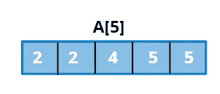
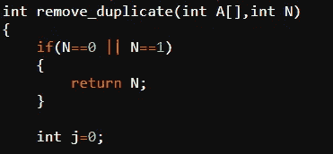
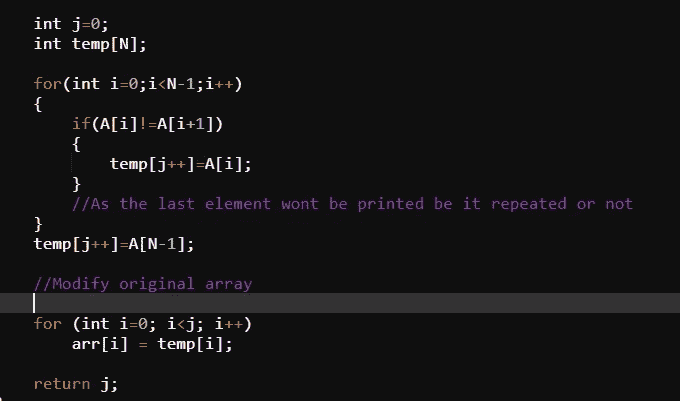
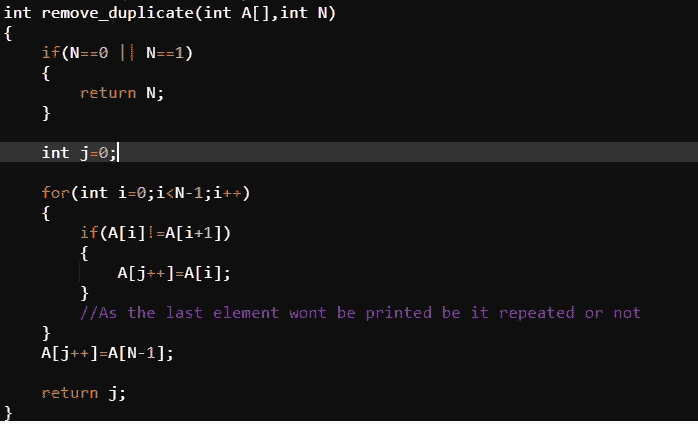

# 删除排序数组中的重复项

> 原文：<https://blog.devgenius.io/remove-duplicates-in-sorted-array-1d33968ed1ff?source=collection_archive---------35----------------------->

你曾经想知道 excel 中的“删除重复”功能是如何工作的吗？

这里有一个代码语言的小预览。

给定 N=5 的数组

现在，假设我们有上面的数组作为输入。

假设这是一个排序数组，我们的任务是从数组中删除重复的元素，即额外的 2 和 5，并返回“无重复”数组的长度。

输出类似于(2，4，5)，返回值是 3，这是更新后的数组的长度。

**方法一** : **利用额外空间**

时间复杂度:O(n)

空间复杂度:O(n)

测试案例 1

测试用例 1 检查输入数组是否有任何元素。它返回数组的长度。

使用了另一个名为 temp 的数组

初始化一个新的数组 temp，然后在比较元素之后，将 A[n]中的唯一元素复制到 temp[n]中。临时数组的长度存储在 j。

最后，临时数组元素被直接复制到原始数组中。

**方法二:常数空间 O(1)**

时间复杂度:O(N)

空间复杂度:O(1)

这里，我们只是为同一个数组维护一个单独的索引，就像在方法 1 中使用“j”为不同的数组维护一样。

方法 2

最初的测试用例是一样的，检查数组是否为空，但是执行 for 循环时没有为存储创建额外的数组。

所以，你有它的人，希望你喜欢它。关于代码的来源，可以参考，

[https://www . geeks forgeeks . org/remove-duplicates-sorted-array/](https://www.geeksforgeeks.org/remove-duplicates-sorted-array/)