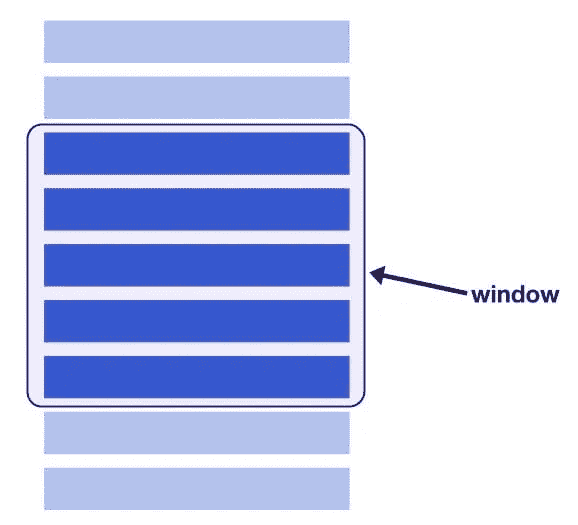

# 在 react 中渲染数千个项目，而不影响虚拟化的性能

> 原文：<https://blog.devgenius.io/render-thousands-of-items-in-react-without-impacting-performance-with-virtualization-932572999a2f?source=collection_archive---------0----------------------->

虚拟化是一种窗口技术。通过虚拟化，我们只呈现视图中所有项目的子集。子集中的项目数量由列表/网格大小和项目大小决定。

你有没有试过在 react 中渲染一个有上千个条目/组件的列表？如果是，你知道痛苦如果不是[克隆并在本地运行这个回购](https://github.com/theBstar/virtualized-demo)。它用 react 在列表中呈现 5000 个条目。尝试更改 App.jsx 上第 11 行的数字。我的网页在 20000 个条目时崩溃了。如果列表项更重/嵌套，页面甚至在 1000 项时也不会有响应。



开窗技术。摘自[https://web dev . imgix . net/virtualize-long-lists-react-window/window-diagram . jpg](https://webdev.imgix.net/virtualize-long-lists-react-window/window-diagram.jpg)

现在，让我们看看这个窗口技术能为我们做什么。我们将使用 [react-window](https://github.com/bvaughn/react-window) 包，它为我们提供了实现虚拟列表的能力。

以下是我在实施虚拟化之前的列表和 listItem。

**List.jsx**

```
import React from 'react';import ListItem from './ListItem'; export default function NaiveList({ items }) {return (<div className="list-content">{items.map((item, index) => (<ListItem key={item.id} item={item} />))}</div>);}
```

**ListItem.jsx**

```
import React, { memo } from "react";import { colors } from './constants';function ListItem({ item }) {const { title } = item;const bg = colors[Math.floor(Math.random() * (colors.length - 1))];return (<div className="list-item" style={{ background: bg }}><p>{title}</p><divstyle={{background: "black",color: "white",padding: "16px"}}><span>{bg}</span></div></div>);}export default memo(ListItem);
```

我正在遍历数据项并呈现 listItem。ListItem 显示从预定义的常量集中随机选择的标题和背景颜色。

该列表平均需要 380 毫秒来呈现 5000 个项目，并且在交互上有明显的滞后。

**虚拟化的时间到了**

从从“react-window”导入导入 FixedSizeList 开始。它需要一个呈现函数来呈现行。一些最常用的道具是:

```
height: height of the listitemCount: total items in our data setitemSize: size/height of individual rowslayout: "horizontal" or "vertical"width: width of the listrender function: A render function which will get index of the item in the list and style as props and returns an row/item Element. We need to apply these style to the root of the component returned from the function. 
```

现在我们已经熟悉了这些概念，是时候在我们的应用中实现虚拟化了

**List.jsx(已更新)**

```
import React, { useCallback } from 'react';import ListItem from './ListItem';import { FixedSizeList as List } from 'react-window';import AutoSizer from "react-virtualized-auto-sizer";export default function VirtualList({ items }) { // new listItem function, this function is passed to the List from react-window as render prop const listItem = useCallback(({ index, style }) => {const item = items[index];return (<ListItem key={item.id} item={item} style={style} />);},[items],);// this function is passed to the AutoSizer which calculates the available height and width and passes that as prop to render prop. const listRender = useCallback(({ height, width }) => (<ListclassName="list-content"itemCount={items.length}itemSize={150}height={height}width={width}>{listItem}</List>),[items],);return (<AutoSizer style={{ height: '90vh' }} >{listRender}</AutoSizer>);}
```

我们已经用`[react-virtualized-auto-sizer](https://npmjs.com/package/react-virtualized-auto-sizer)`包装了我们的列表，这允许我们的列表占据整个可用空间。

**ListItem.jsx(已更新)**

```
import React, { memo, useMemo, useState, useEffect } from "react";import { colors } from './constants';function getBg() {return colors[Math.floor(Math.random() * (colors.length - 1))];}function ListItem({ item, style }) {const { title } = item;const bg = useMemo(getBg, []);const [newStyle, setStyle] = useState(style ? style : {});useEffect(() => {setStyle(style ? style : {})}, [style]);return (<divclassName="list-item"style={{...newStyle,background: bg,}}><p>{title}</p><divstyle={{background: "black",color: "white",padding: "16px"}}><span>{bg}</span></div></div>);}export default memo(ListItem);
```

**现在列表在大约 5 毫秒内渲染，最棒的是我可以毫不费力地渲染成千上万倍的数据集。**

在这个包中还有很多值得探索的东西。这里是 react-window readme 的链接。你可以[去这里看用法示例。](https://react-window.now.sh/#/examples/list/fixed-size)we . dev .[上有一篇关于虚拟化的好文章，下面是链接](https://web.dev/virtualize-long-lists-react-window/)。

如果您有兴趣，您可以在这里阅读更多关于虚拟化的问题、概念和早期讨论。