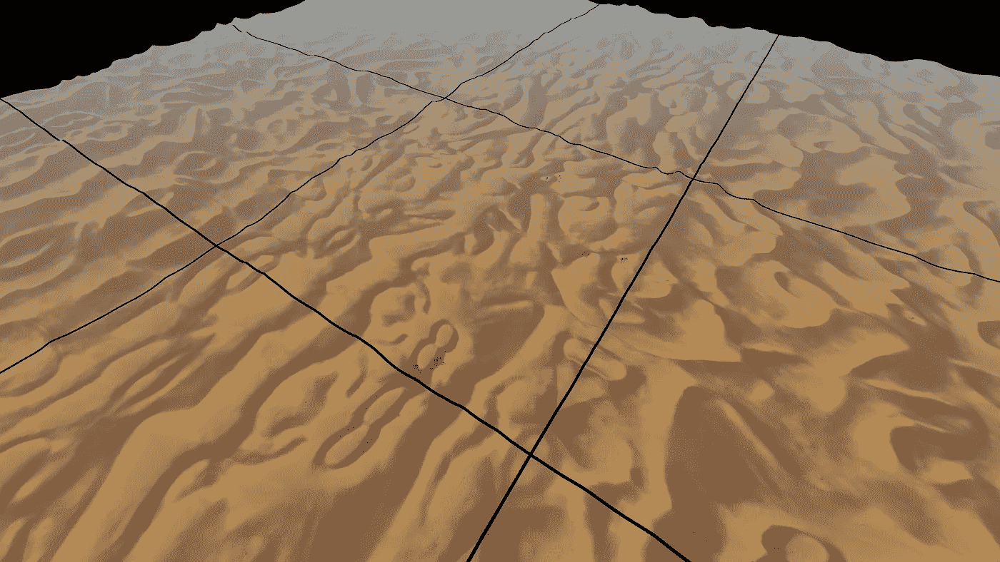

# 在 WebGL 中渲染沙丘地形

> 原文：<https://blog.devgenius.io/rendering-dunes-terrain-in-webgl-ac3dd2c67e8c?source=collection_archive---------1----------------------->

我们发布了一个新的 Android 动态壁纸，同时发布了一个展示应用程序所有功能的实时演示页面。你可以点击查看[网页。](https://keaukraine.github.io/webgl-dunes/index.html)

从历史上看，web 演示是首先创建的，它被用作构建场景和微调着色器的原型操场。此外，这真的有助于两个人的团队分担工作，而不必为两个人都学习 Android Studio。当一切都被打磨得足够漂亮时，一个基于 web 演示代码的 Android 应用程序很快就创建好了。将代码移植到 Android 是一个非常简单的过程，因为我们的 [WebGL 框架](https://github.com/keaukraine/webgl-framework)与 Android 应用中使用的框架具有相同的方法签名。

# 场景构图

场景非常简单，只包含六个对象——地形、天空、尘埃、太阳、鸟和棕榈树。

要检查对象是如何渲染的，您可以看看 [DunesRenderer.ts](https://github.com/keaukraine/webgl-dunes/blob/master/src/DunesRenderer.ts) 中的`[drawScene()](https://github.com/keaukraine/webgl-dunes/blob/master/src/DunesRenderer.ts#L470)`方法——首先我们将深度图渲染到纹理(这是软粒子所需要的)，然后按照从前到后的顺序(首先是最近和最大的对象，然后是较远的对象)渲染屏幕上的对象，以有效地利用 z 缓冲区剔除。

场景中的地形表示为单个方形图块。它的多边形数减少到 31k 个面，以便不分割几何体，并且只需一次绘图调用即可完成绘制。这个多国生产相当好的质量。然而，它的面积不够大，不足以营造一种无限沙漠的感觉——当相机放置在略高于方形地形边界的位置时，它的界限清晰可见:

清晰可见的地形边界

显然，这减少了相机移动的范围，并产生了地形在空间中“浮动”的不必要的感觉。为了消除这种影响，提高场景的沉浸感，我们使用了一种叫做“地形裙”的技术。我们从 GDC 关于《光环战争》中地形的精彩演讲中了解到了这一点。你一定要看完整个视频，因为它解释了许多其他有趣和独特的技术，可能会派上用场。这种地形裙背后的想法是在瓷砖的边缘渲染相同的瓷砖，但镜像远离场景的中心。这大大扩展了地形的面积。此屏幕截图显示了渲染的所有 8 个额外的单幅图块(带有额外的间隙来分隔单幅图块):

附加裙板

您可以在重复瓷砖与主瓷砖连接的边缘看到瓷砖的镜像，但在最终的应用程序中并不明显，因为相机只放置在主瓷砖内，避免直接查看这些边缘。我们渲染了比原来大 1.5 倍的额外瓷砖，有效地增加了 4 倍的地形感知尺寸。这个短片展示了有无裙边的最终延伸地形的外观:

有无裙边的地形

正如你所看到的，这个简单的技巧创建了一个巨大的，看似无穷无尽的地形，几乎不费吹灰之力就可以延伸到地平线，并且重用了现有的几何图形。

# 灰尘颗粒

为了获得灰尘效果，使用了软颗粒。你可以在我们之前的文章中读到更多关于这种技术的内容——[https://medium . com/@ keaukraine/implementing-soft-particles-in-web GL-and-OpenGL-es-b968d 61133 b 0](https://medium.com/@keaukraine/implementing-soft-particles-in-webgl-and-opengl-es-b968d61133b0)。

为软粒子渲染到深度纹理的唯一对象是主地形贴图，因为这是粒子与之相交的唯一几何体。为了使渲染速度更快，使用最简单的片段着色器来渲染该对象，而不是使用复杂的着色器来渲染屏幕上的地形。

# 沙丘着色器

为了模拟风在沙丘表面产生沙波的效果，我们开发了一个非常复杂的着色器。让我们看看它的内部。请注意，虽然我们将解释着色器的 GLSL 代码，但其中使用的通用技术和方法也可以应用于在 Unity/Unreal 引擎中重新创建类似的材质。

着色器的代码可以在[的 DunesShader.ts](https://github.com/keaukraine/webgl-dunes/blob/master/src/shaders/DunesShader.ts) 中找到。我们来分析一下。

# 漫射颜色和光照贴图

Terrain 使用了相当大的纹理——网页演示用的是 2048x2048，安卓 app 中高达 4096x4096。显然它需要相当多的内存，所以为了有效地使用它，我们使用了一些技巧。沙丘的主要漫反射颜色实际上是作为单通道灰度值存储在地形纹理的红色通道中。沙子的实际颜色由`*uColor*` uniform 指定，它乘以灰度漫射值。其他两个通道包含高日照(白天和夜晚)和低日照(日出和日落)的光照贴图。由于不可能使用统一的访问纹理数据，所以为两个光照贴图编译了两个版本的着色器。最终漫射颜色与阴影颜色相乘。

# 流沙效应

接下来，我们来看看动风效果是如何打造的。你可能会注意到沙丘的迎风坡和背风坡是不同的。为了确定哪个效果应用于哪个斜率，我们从表面法线计算混合系数。这些系数是逐顶点计算的，并通过`*vSlopeCoeff*`和`*vSlopeCoeff2*`变量传递给片段着色器。您可以取消注释片段着色器中的相应线条，以不同的颜色显示迎风和背风部分:

可视化斜坡

两个斜坡使用相同的纹理，但是迎风的那个更有弹性。两个坡度的纹理坐标也在顶点着色器中计算，以防止相关纹理读取。风的运动是通过从`*uTime*`均匀添加偏移到纹理坐标来完成的。

# 雾

获得真实效果的下一个重要的事情是应用大气雾。出于性能原因，我们使用简单的线性雾，它是在顶点着色器中计算的。雾化范围由两个制服控制— `*fogStartDistance*`和`*fogDistance*`，用于片段着色器的值被计算并存储在`*vFogAmount*`变量中。片段着色器根据此变量的值应用来自`*uFogColor*` uniform 的雾色。

雾的颜色会根据远处的地形边缘进行调整，以与天空纹理相融合。天空纹理也被编辑为在应该与地形融合的地方有相同雾色的远处薄雾。

# 细节纹理

尽管整个地形纹理很大，但它覆盖了很大的面积，因此对于特写镜头来说仍然不够详细。为了使沙丘不那么模糊，从地面观察时更真实，我们对它应用了细节纹理。这是一个 256x256 的小纹理，在不同坡度的两个通道中有两种不同的沙纹图案。细节纹理可以使漫射颜色变暗或变亮。为了实现这一点，首先我们从细节颜色中减去 0.5，这样它可以有负值，然后这个值被添加到最终的颜色。这样，细节纹理中 50%的灰色不会影响漫反射颜色，较暗的值会使其变暗，较亮的值会使颜色变亮。细节纹理的应用方式与雾相似——它有两种统一的方式来调整不需要细节纹理的截止距离。您可以取消注释片段着色器中的一行，以红色通道显示细节纹理范围:

细节纹理范围

# 结果

你可以在这里看到一个现场演示页面[。它是交互式的，你可以点击来改变一天中的时间。在桌面上，你可以从任意位置查看场景，按下回车键进入自由飞行模式。在这种模式下，要旋转相机按住鼠标右键，要移动相机使用*键，*空格键*向上， *C* 向下。移动加速时按住*换档*。*](https://keaukraine.github.io/webgl-dunes/index.html)

*GitHub 上有完整的源代码，如果你对重现类似的效果感兴趣，你可以根据你的需要克隆和使用它——它是在许可的 MIT 许可下授权的。*