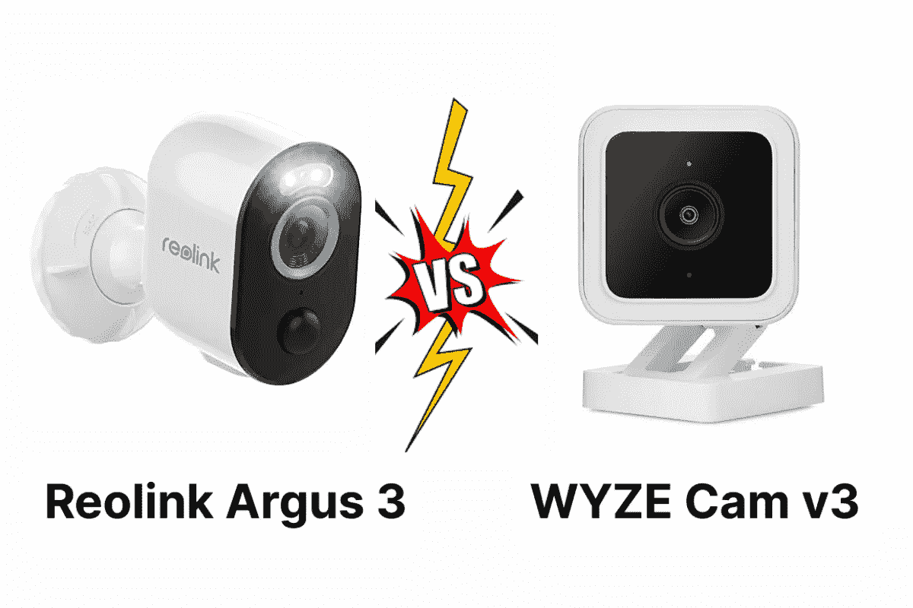
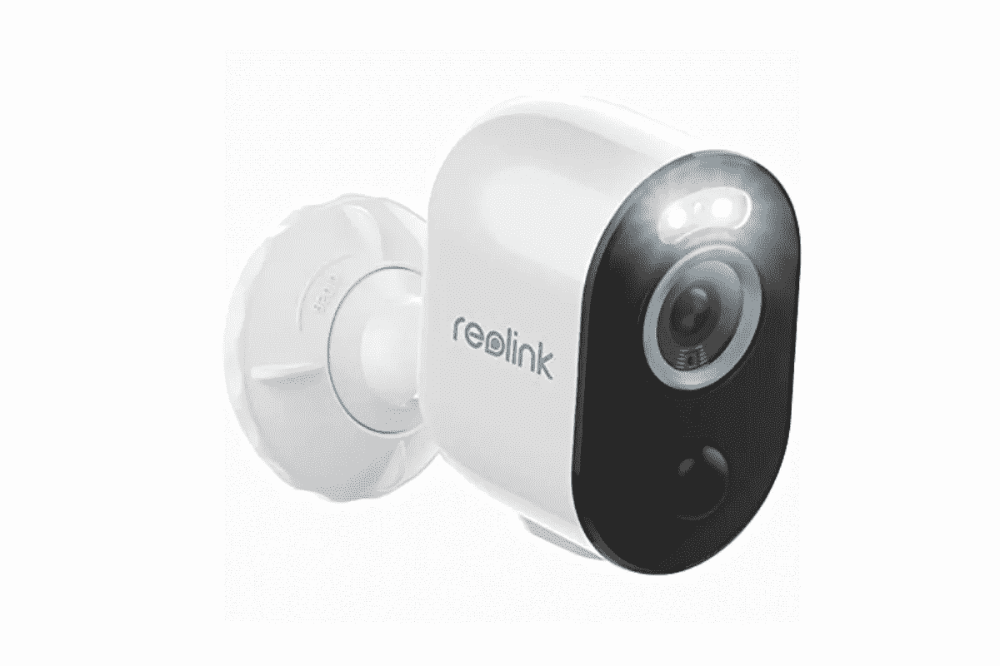
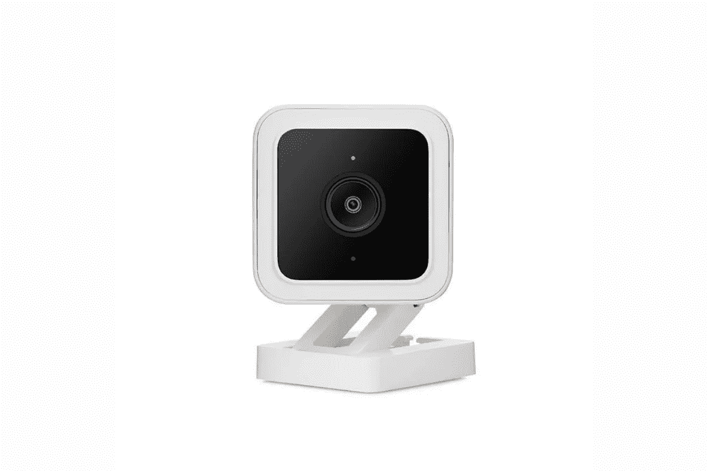
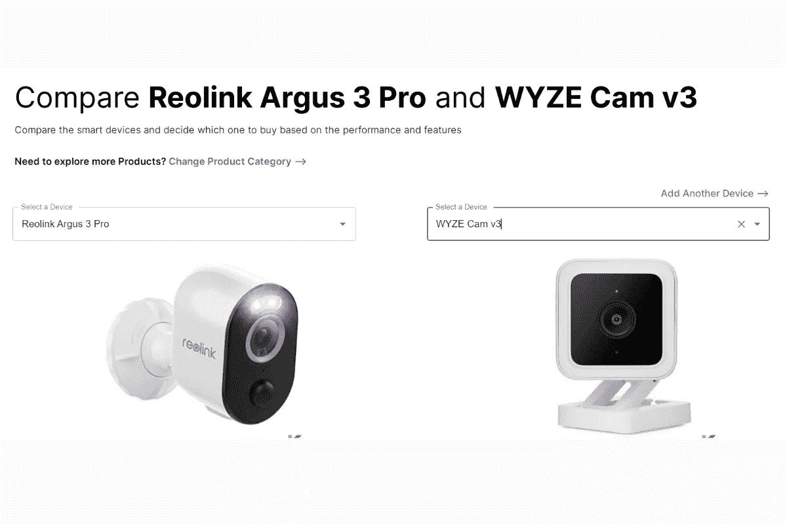
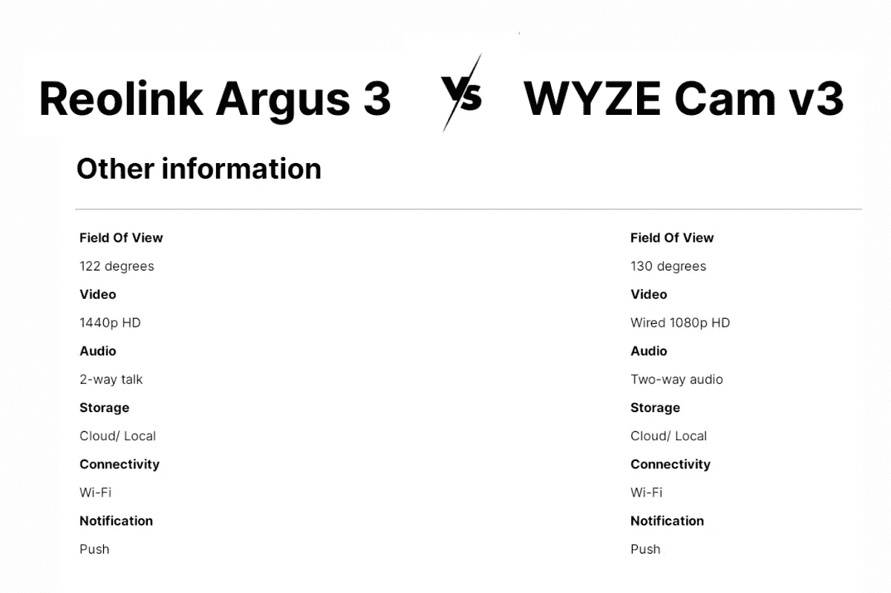
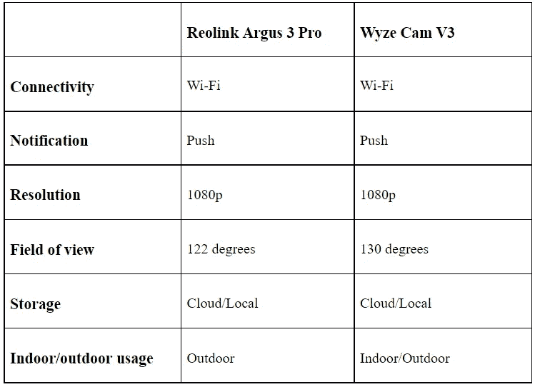
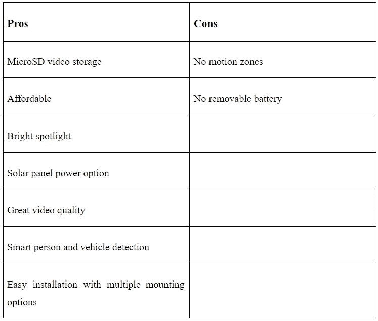
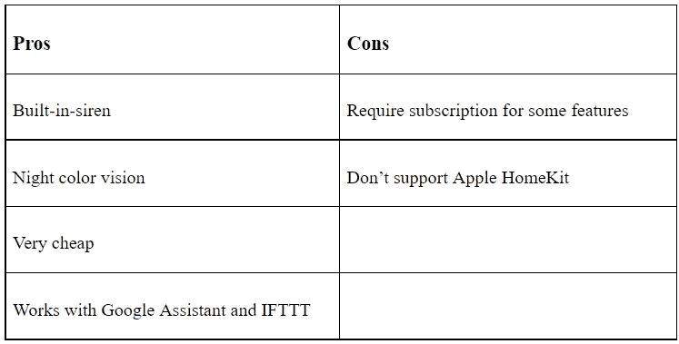
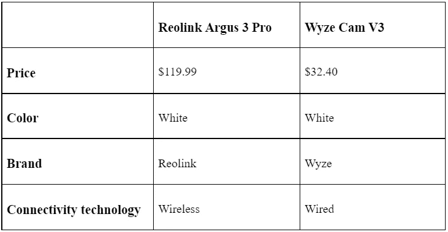

# reo link Argus 3 Pro vs Wyze Cam V3[完整对比和评论]

> 原文：<https://blog.devgenius.io/reolink-argus-3-pro-vs-wyze-cam-v3-970f5a4993c9?source=collection_archive---------0----------------------->

没有争论。我们都想让自己的家安全无虞。许多人目前在家里都有家庭安全摄像机。但是你知道家庭安全摄像头有很多用途可以防止犯罪吗？这包括一些用途，如照看孩子和老人、邻里安全、自然灾害记录、假期监控、家庭自动化等。

Reolink Argus 3 Pro vs Wyze Cam V3

我想过买一个安全摄像头，因为家庭安全可以让我安心。然而，当你为你的家选择最好的赌注时要小心。还有，我在搜索我最喜欢的智能安防摄像头的时候发现了最好的智能对比工具。我可以用这个来选择最好的相机。让我们开始深入了解 Reolink Argus 3 pro 和 Wyze Cam V3。

# **什么是「Reolink Argus 3 Pro」和「Wyze Cam V3」？**

Reolink Argus 3 Pro

[Reolink Argus 3 Pro](https://kodmy.com/best-home-security-cameras/#Reolink-Argus-3-Pro) 是最好的无线安全摄像机，具有 400 万像素的超高视频分辨率。为了与爱洛 Pro 4 竞争，Reolink 加强了其安全摄像头。因此，它的性能几乎与爱洛专业版相同。它只有两个安装支架和一个树带。因此，我不再需要电线或杂物。你是更聪明的人吗？它还支持像谷歌助手、亚马逊 Alexa 等智能助手。如果你想知道谁在那里，你现在可以使用语音命令。

快一点！ [***现在从亚马逊获得 reo link Argus 3 Pro***](https://amzn.to/3lVIs8p)。

Wyze Cam V3

Wyze Cam V3 是一款有线摄像机，具有智能运动检测、本地视频存储、内置警报器、夜视等出色功能。这是最便宜的家庭安全摄像机之一。它方便您在没有订阅的情况下将视频保存在云存储上。它还可以通过 microSD 卡进行 24/7 连续视频录制。就其价格范围而言，这是最实惠的相机。是的。一旦检测到运动，您就可以收到警报。

快一点！ [***现在从亚马逊获得 Wyze Cam V3***](https://amzn.to/3o0WHLu)。

# **reo link Argus 3 Pro 和 Wyze Cam V3 的功能比较**

当我们为家里选择最好的设备时，我们必须比较两个或更多的设备。我认为比较这些的最好方法是使用智能工具。我能够用这个来比较 Reolink Argus 3 Pro 和 Wyze Cam V3。那么，让我们开始比较它们的特性吧。

智能设备比较工具

*   **设计**

Reolink Argus 3 Pro 配有黑色正面和弯曲的塑料机身，其中包括一个镜头和所有传感器。您可以轻松安装支架，并根据其设计直接定位。Wyze 凸轮 V3 类似于 Wyze 凸轮 V2，但有一些差异。两者都有一个方形的黑色相机面和圆形边缘，而不是尖角。此外，Wyze Cam V3 具有 IP65 防风雨等级。所以，它是室内和室外安全的搭配。

*   **设置和移动 App**

您可以轻松设置 Reolink Argus 3 Pro。首先，你想在手机上安装 Reolink 应用程序。然后，扫描二维码，设置密码。它还集成了谷歌助手和亚马逊 Alexa 等语音助手。您可以将它连接到 5GHz 或 2.4GHz 网络，因为它支持双频段 Wi-Fi。

Wyze cam 可以与谷歌助手和亚马逊 Alexa 集成，但苹果 HomeKit 集成则不行。你也可以将它与其他 Wyze 设备集成，如门锁、传感器和智能灯泡。它像所有其他 Wyze 设备一样使用 Wyze 移动应用程序。

*   **动作记录**

当 Wyze cam 检测到声音或动作时，它会在云中免费录制 14 天。此外，您可以安装 32GB 的 microSD 卡，实现 24 小时连续录制。如果您订阅了 Wyze Cam Plus，它将支持动物检测和车辆检测。

一旦检测到运动，Reolink Argus 3 Pro 将被触发，您将能够阻止犯罪。它还可以用聚光灯记录全彩色，用红外线记录黑白。此外，Argus 3 pro 还可以使用智能运动检测技术减少错误警报并发送重要通知。

*   **视频质量**

智能设备比较工具的比较

Reolink Argus 3 Pro 拥有 122 度视野和 1440p 视频分辨率。此外，Wyze cam 拥有 130 度的视野和 1080p 的视频分辨率。然而，两个摄像头都有双向通话音频和推送通知。

*   **其他功能**

# **reo link Argus 3 Pro 和 Wyze Cam V3 的优缺点**

*   **reo link Argus 3 pro 的利弊**

*   **Wyze Cam V3 的利弊**

# **比较工具对我有什么帮助？**

重要的是要告诉你，现在我有了最好的家庭安全摄像头。所以，我认为比较你最喜欢的智能设备的最好方法是拥有一个智能比较工具。我有一些好东西，我很想和你分享。这是我见过的最好的工具。您可以轻松选择和比较您的设备，包括基本信息、最佳价格、发布日期、品牌、最佳价格链接、尺寸、系统要求、连接性、购买理由、避免理由等等。

如果你对智能家居设备感兴趣，可以试试这个智能工具。此外，您可以比较任何智能家居设备，并为您的家庭选择合适的设备。此外，它便于您轻松比较多达 3 台设备。所以，我能够在一个地方得到所有的信息。

# **价格对比**

# **Argus 3 Pro 和 Wyze Cam V3 哪个好？**

如果您正在为您的家庭寻找最好的安全摄像机，Reolink Argus 3 Pro 是最佳选择。因为价格实惠，和爱洛 Pro 4 有一样的功能。此外，它还具有智能人员和车辆检测、带照明聚光灯的锐利 2K QHD 视频、超级有趣的延时、双保险存储等高级功能。然而，如果你考虑你的预算而不是它的先进功能，Wyze cam V3 是最便宜的安全摄像机。