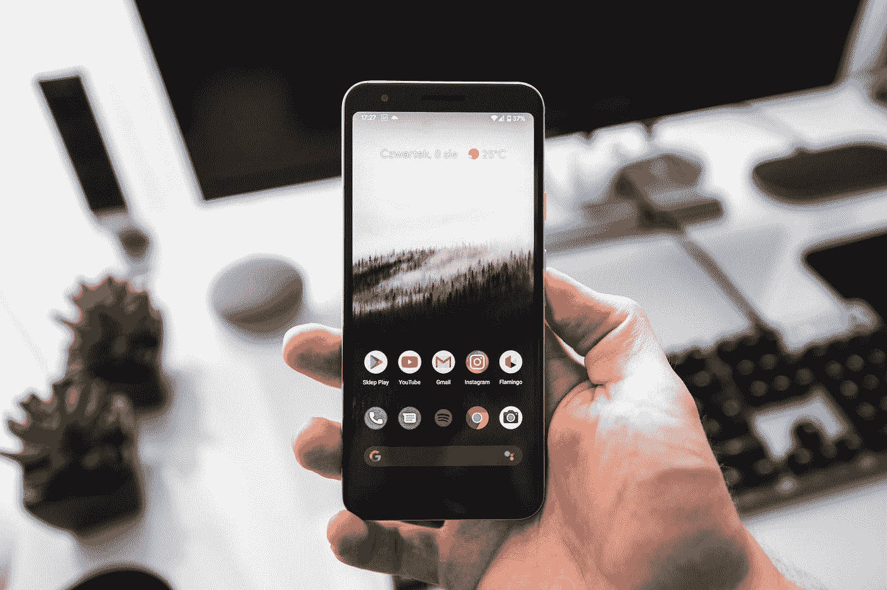

# 重复生命周期+共享流程隐藏陷阱故障排除和处理

> 原文：<https://blog.devgenius.io/repeatonlifecycle-sharedflow-hidden-pitfall-troubleshooting-and-handling-d22e7c16ab84?source=collection_archive---------5----------------------->



塞巴斯蒂安·贝德纳雷克在 [Unsplash](https://unsplash.com?utm_source=medium&utm_medium=referral) 上的照片


# 背景

[《Google Android 架构设计分析及改进建议》](https://medium.com/@kunminx/google-android-official-architecture-example-i-am-waiting-for-you-at-the-starting-line-b4752d97f283)上篇文章重点拆解了官方架构“领域层”的设计误区，并给出了改进建议——让 MVI-Dispatcher 作为事件处理者

然而，一些朋友说，他们不仅想要 MVI-调度员，还想看看 MVI 在科特林手下的实践。


因此，这一次，我们带来了[MVI-调度员-KTX](https://github.com/KunMinX/MVI-Dispatcher-KTX) 库和样本。以下故障排除陷阱故事:

# 共享流也错过结果？

与 MVI-Dispatcher 相同，KTX 版本在示例模块中提供了一系列常规+强力测试，

我们在 ComplexRequester 中安排了 4 组事件选项，事件 1 可以轮询通知事件 4 推回 UI，事件 2 可以延迟 200ms 后推回 UI，事件 3 可以直接推回 UI，

同时，我们通过 MainActivity 中的 output 函数注册观察 MVI-调度员-KTX，通过 input 函数发送事件 1、2、3 给 MVI-调度员-KTX。

结果出乎意料:

```
com.kunminx.purenote_ktx D/e: ---4 0
com.kunminx.purenote_ktx D/e: ---4 1
com.kunminx.purenote_ktx D/e: ---4 2
com.kunminx.purenote_ktx D/e: ---4 3
com.kunminx.purenote_ktx D/e: ---4 4
com.kunminx.purenote_ktx D/e: ---4 5
com.kunminx.purenote_ktx D/e: ---4 6
com.kunminx.purenote_ktx D/e: ---4 7
com.kunminx.purenote_ktx D/e: ---2
com.kunminx.purenote_ktx D/e: ---2
com.kunminx.purenote_ktx D/e: ---2
com.kunminx.purenote_ktx D/e: ---2
com.kunminx.purenote_ktx D/e: ---4 8
com.kunminx.purenote_ktx D/e: ---4 9
com.kunminx.purenote_ktx D/e: ---4 10
com.kunminx.purenote_ktx D/e: ---4 11
com.kunminx.purenote_ktx D/e: ---4 12
```

事件 3 推迟结果如何？

MVI-调度员在测试中没有这个问题，为什么 KTX 版本有？

所以继续玩日志观察:

观察 KTX 版本的基类中的 SharedFlow 收集计时:

继续输出结果:

```
com.kunminx.purenote_ktx D/---: activity.lifecycleScope.launch
com.kunminx.purenote_ktx D/---: ResultTest3-sendResult
com.kunminx.purenote_ktx D/---: ResultTest3-sendResult
com.kunminx.purenote_ktx D/---: ResultTest3-sendResult
com.kunminx.purenote_ktx D/---: activity.repeatOnLifecycle
com.kunminx.purenote_ktx D/e: ---4 0
com.kunminx.purenote_ktx D/e: ---4 1
com.kunminx.purenote_ktx D/e: ---4 2
com.kunminx.purenote_ktx D/e: ---4 3
com.kunminx.purenote_ktx D/e: ---4 4
```

寻找线索— sharedFlow.emit 事件 3 计时早于 activity.repeatOnLifecycle 计时，当 sharedFlow 集合丢失时，

因此，将 sharedFlow replay 值更改为 1 以验证:

这次收到，确实是时机的问题，也就是 sharedFlow 不是人眼感知的“丢失事件”，而是它默认的 replay = 0，不会自动将缓存的数据推回订阅方。这种设计符合“事件”场景。

# 为什么不是 StateFlow？

架构组件应该致力于消除意料之外的错误，而不是相反。

“反应式编程”是理想模型，behavior subject/StateFlow/LiveData 都是过度设计，在“命令式编程”环境下容易滋生不可预测的错误，应该彻底去除或避免。

例如，在这种情况下，如果您期望 replay = 1，则在 3 次发射后您只能接收 1 次，这不利于 MVI 多类型消息响应，因此修改 replay 的计划暂时通过。

```
com.kunminx.purenote_ktx D/---: activity.lifecycleScope.launch
com.kunminx.purenote_ktx D/---: ResultTest3-sendResult
com.kunminx.purenote_ktx D/---: ResultTest3-sendResult
com.kunminx.purenote_ktx D/---: ResultTest3-sendResult
com.kunminx.purenote_ktx D/---: activity.repeatOnLifecycle
com.kunminx.purenote_ktx D/e: ---3
com.kunminx.purenote_ktx D/e: ---4 0
com.kunminx.purenote_ktx D/e: ---4 1
com.kunminx.purenote_ktx D/e: ---4 2
com.kunminx.purenote_ktx D/e: ---4 3
com.kunminx.purenote_ktx D/e: ---4 4
```

我们做什么呢 repeatOnLifecycle 启动的回调相对于发出有延迟。其实在 Activity 中很容易解决，就是通过 View.post 计时，让 emit 在 MessageQueue 中顺序执行，从而保证计时正确，

但是 emit an event 也需要 View.post，显然容易忘记，造成一致性问题，而 MVI-Dispatcher-KTX 采用的是内聚设计，所以这里你不妨把 Activity 注入输入法，然后取里面的 decorView 自动完成 post …

这很好，但是每次输入都注入一个额外的活动，这是不是有点莫名其妙？

而如果我想在子类的 KTX 版本内部输入一个“副作用”呢？所以程序暂时通过。

…还有其他方法吗？

是的，

考虑到“遗漏一个事件”的极端情况，常规操作如“从数据层取数据”由于操作耗时，不易遇到；

如果在页面的 onCreate 链接末尾发送了一个 sealed.object 事件，很容易排在`activity.repeatOnLifecycle(Lifecycle.State.STARTED)`之前，因为不花时间，错过了机会。

所以这里你可以在每次输入时自动延迟 1 毫秒— —

默认设置为 1 毫秒，通过维护延迟映射来取消延迟，从而自动确定延迟:

要查看的输出日志:

```
com.kunminx.purenote_ktx D/---: activity.lifecycleScope.launch
com.kunminx.purenote_ktx D/---: activity.repeatOnLifecycle
com.kunminx.purenote_ktx D/---: ResultTest3-sendResult
com.kunminx.purenote_ktx D/e: ---3
com.kunminx.purenote_ktx D/---: ResultTest3-sendResult
com.kunminx.purenote_ktx D/e: ---3
com.kunminx.purenote_ktx D/---: ResultTest3-sendResult
com.kunminx.purenote_ktx D/e: ---3
com.kunminx.purenote_ktx D/e: ---4 0
com.kunminx.purenote_ktx D/e: ---4 1
com.kunminx.purenote_ktx D/e: ---4 2
com.kunminx.purenote_ktx D/e: ---4 3
com.kunminx.purenote_ktx D/e: ---4 4
```

到目前为止，已经收到了 3 个事件 3。

> *提示 2022.8.16:*
> 
> 【V6.6 版以后，取消初始化延时设置，通过拦截实现“保证消费，只消费一次”的设置。详情见下文附注 2022.8.16。

# UnPeek-LiveData 怎么样？

我们来看看 [UnPeek-LiveData](https://github.com/KunMinX/UnPeek-LiveData) 的性能:

要查看的输出日志:

```
com.kunminx.unpeeklivedata D/----: hahaha
```

鉴于 UnPeek-LiveData 的性能和 MVI-Dispatcher 中定长队列的内部维护，在原生 LiveData 中默认不存在“发送丢失事件”的问题。

# 注 2022.08.16:

# 实行“消费且只消费一次”

有朋友反映，在“关屏-开屏”场景下，开屏后无法响应屏幕时，推送最新数据。

对于这个，我考虑过渠道，但是渠道只能用在一对一的场景，很难做到一对多。

所以采用 replay + version + observerCount 的方法，统一消除“漏收定时”的问题。

重放次数目前与缓存队列长度相同，可以根据实际业务需要，通过在相应的 MVI-调度器-KTX 子类中重写 initQueueMaxLength()来修改。

# 最后

MVI-调度员-KTX +坑排的故事一直分享到现在。目前，MVI 调度员和 MVI 调度员 KTX 是在公共测试。欢迎测试和反馈:

Github:MVI 调度员

[Github:MVI-调度员-KTX](https://github.com/KunMinX/MVI-Dispatcher-KTX)

> *许可:本文封面上的 Android 机器人是在谷歌原创和共享成果的基础上重新创作的，并按照* [*知识共享*](https://creativecommons.org/licenses/by/3.0/) *归属 3.0 许可的条款使用。。*