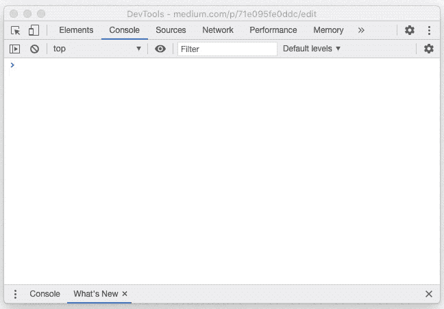
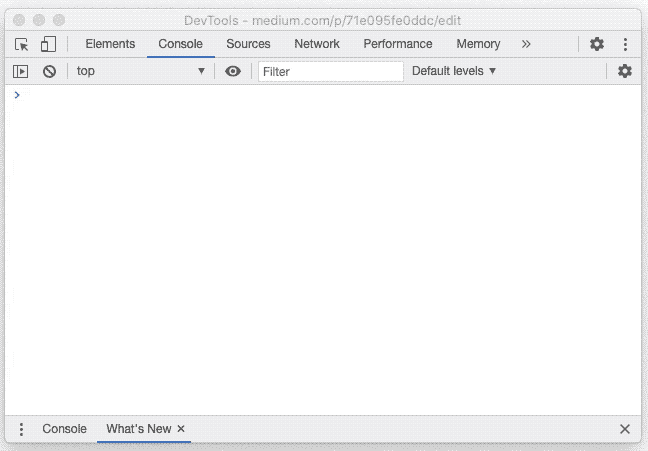

# 用 ES2021 取代它们

> 原文：<https://blog.devgenius.io/replace-em-all-with-es2021-71e095fe0ddc?source=collection_archive---------3----------------------->

## 新引入的“replaceAll()”方法不再需要使用正则表达式！

图片来源:[moroioh.com](https://morioh.com)

如果你曾经和`JavaScript`中的`strings`合作过，你就知道替换一个字符串中所有匹配的子字符串是多么痛苦的事情！

好吧，也许我在这里有点夸张，但是作为一个新手，这绝对不是一件容易的事情。

例如，当我第一次开始使用`JavaScript`(那时我还是编程新手)并想要替换`string`中出现的所有单词时，我只是不知道如何通过阅读`[replace()](https://www.w3schools.com/jsref/jsref_replace.asp)`方法的文档来完成。

我想知道为什么我需要使用如此复杂的东西，比如一个[***regex***](https://en.wikipedia.org/wiki/Regular_expression)*来做一些如此简单的事情，比如替换一个单词在一个字符串中的所有出现(当时我并不喜欢`regex`，坦率地说，我现在仍然不喜欢)。*

*反正到了 ES2021，你就不需要用`regex`来进行上述操作了！*

*这是因为`ES2021`引入了一个新的(期待已久的)实用方法来替换给定字符串中所有出现的子字符串:`replaceAll()`。*

*让我给你们举个例子，让你们更好地理解我所说的:*

*描述“replaceAll()”方法用法的代码段。*

*下面是一个 gif 图，描述了上面的代码在 Chrome 的控制台中的执行情况(是的，Chrome 已经提供了这个功能，其他浏览器也提供了这个功能):*

**

*描述在 Chrome 的控制台中使用“replaceAll()”方法的 gif。图片来源:Pratik Chaudhari*

*`replaceAll()`方法保持原字符串不变，并返回一个新字符串。*

*请注意，`replaceAll()`在搜索目标子字符串时会进行区分大小写的比较。*

*如果我把**【Java】**的大写**【J】**换成小写**【J】**`replaceAll()`不会替换它，新的字符串会和旧的相似。*

*这里有另一个 gif 来说明我的意思:*

**

*描述当我们使用小写字母“j”时“replaceAll()”行为的 gif 图片来源:Pratik Chaudhari*

*和它的表亲`replace()`一样，`replaceAll()`也允许你指定一个`regex`来代替目标子串(也就是要被替换的子串)，但是我认为这样做会违背使用`replaceAll()`的全部目的。*

*如果你想了解更多关于`replaceAll()`的信息，请随意浏览它的 [MDN](https://developer.mozilla.org/en-US/docs/Web/JavaScript/Reference/Global_Objects/String/replaceAll) 文档。*

*本文到此为止，各位！*

*希望你喜欢阅读这篇文章，并学到一些新的东西。*