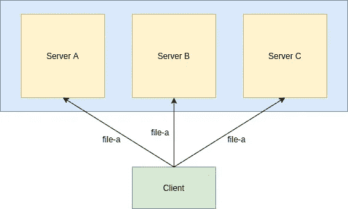

# 复制 glusterfs 中的卷

> 原文：<https://blog.devgenius.io/replica-volume-in-glusterfs-b05324ce1b6f?source=collection_archive---------4----------------------->

这是建立与 glusterfs 一起工作的环境的故事的延续。

现在，我们已经开始了，是时候从 glusterfs 的一些基本特性以及如何使用它们开始了。在这个故事中，我们主要关注的是在 glusterfs 中创建一个复制卷。



作为复制卷的 3 节点集群

为此，我们将使用一个 3 节点集群。因此，应该准备好三台虚拟机(或者服务器，如果有的话)，并在其中安装 glusterfs。(无论是源代码安装还是软件包安装)

## 什么是复制卷？

假设您正在托管一个数据库，您的组织使用该数据库来访问员工记录。

现在，底层存储可能是分布式文件系统，也可能不是(让我们首先关注复制)。所以，这里的操作很简单。任何查询请求到来时，数据库都会执行并发回有效的响应。

假设您的系统有一些停机时间。这意味着在一段时间内，任何请求都不会得到服务，这听起来不太好。所以，你要做的，就是再装配一个系统，这个系统基本上包含与现有系统相同的内容。

因此，现在您有两个系统在运行(假设有两个服务器)，无论何时添加或删除数据，都会对这两个系统进行更改。现在，即使其中一台服务器出现故障，您仍然可以用一台服务器进行管理。还是可以？

这就是我们大脑分裂问题的来源…

假设您有服务器 A 和服务器 b，突然，服务器 A 停机一小时。与此同时，服务器 b 中的操作照常进行。当服务器 A 最终启动时，会发生什么呢？

嗯，服务器 B 应该告诉服务器 A 它的数据已经过时，应该更新它的内容。但是服务器 A 不也会告诉服务器 B 同样的事情吗？

因此，我们有一个先决条件，或者应该说是创建至少包含 3 个节点的群集的最佳实践。在我们的示例中，这意味着至少有 3 台服务器托管数据库。

现在，3 服务器配置将如何帮助我们？

好吧，如果在这个新的场景中，服务器 A 停机并重新启动，两台服务器 B 和 C 将向 A 告知相同的内容。这意味着法定人数，即大多数服务器总是正确的。(在某种程度上，为了获得适当的仲裁，一个集群中最好有奇数个节点)

现在，使用复制系统的优点是它带来了可靠性和数据冗余。

因此，就文件系统而言，使用复制卷，数据将跨一组给定的节点进行复制，这样，即使文件系统后端的一个服务器出现故障，操作也能照常进行，而且非常可靠。

## 创建集群

现在，我有三个装有 glusterfs 的 fedora 32 虚拟机。除了我将在其中安装卷的另一个系统之外。

在继续创建卷之前，如果您经历了 [glusterfs 环境设置](https://medium.com/dev-genius/using-gluster-setting-up-the-environment-and-installation-ef00122ab854)，我提到了添加一个 10 GB 的磁盘。这将作为我们的砖。

砖块只是 glusterfs 中的一个基本存储单元。现在，官方文档推荐 xfs。但是可以使用任何支持扩展属性的文件系统，这正是 glusterfs 所使用的。这就是需要注意的地方，glusterfs 本身并不是一个文件系统。其主要目的是底层存储空间的聚合，并在网络上表现为一个实体(非常粗略的定义。).

回到砖块上，人们可以按照官方文档来格式化砖块并使用它。在我的例子中，我将砖块格式化为 xfs，并将其安装在/data/glusterfs。人们应该浏览来自[砖块命名约定](https://docs.gluster.org/en/latest/Administrator%20Guide/Brick%20Naming%20Conventions/)的推荐命名约定。

我有三台虚拟机，服务器 a、服务器 b 和服务器 c。

现在，这些运行 glusterfs 的服务器应该在创建卷之前连接到一个集群中。这需要节点发现彼此。为此，必须使用 glusterfs 中的对等探测特性。

```
[root@servera ~]# gluster peer probe serverb
peer probe: success
```

我正在从 servera 执行上面的命令。我在/etc/hosts 文件中添加了主机名，以便更容易、更快速地访问。(比一遍又一遍地输入 IP 地址要好)。

初始探测可以从任何节点进行。但是一旦两个节点的集群形成，下一个探测必须从集群中的一台机器上进行。因此，如果 servera 和 serverb 现在处于连接状态，则只有它们可以探测并将 serverc 连接到群集，而 serverc 无法探测并将 servera 和 serverb 连接到群集。

为了检查对等体的状态，

```
[root@servera ~]# gluster peer status
Number of Peers: 2Hostname: serverb
Uuid: 5c90ef04-9c55-490b-aab0-ad60a83b6756
State: Peer in Cluster (Connected)Hostname: serverc
Uuid: a8d8d9f8-977e-425b-8085-adc68baba27c
State: Peer in Cluster (Connected)
```

这将为我们节点的所有对等体显示主机名、UUID 和集群中对等体的状态。

一旦完成，我们就可以继续创建卷了。

## 复制卷创建

现在，我们在集群中有三个节点，并且在用 xfs(或任何支持扩展属性的 fs)格式化磁盘后，也挂载了一个磁盘。

现在，我们可以直接继续创建卷。

```
[root@servera ~]# gluster volume create vol-1 \
> replica 3 severra:/data/glusterfs/vol-1/brick \
> serverb:/data/glusterfs/vol-1/brick \
> serverc:/data/glusterfs/vol-1/brick
volume create: vol-1: success: please start the volume to access data
```

现在，用户可以检查创建的卷的信息，

```
[root@servera ~]# gluster volume info vol-1Volume Name: vol-1
Type: Replicate
Volume ID: b779d906-d75d-4df9-ade6-b1308747063a
Status: Created
Snapshot Count: 0
Number of Bricks: 1 x 3 = 3
Transport-type: tcp
Bricks:
Brick1: severra:/data/glusterfs/vol-1/brick
Brick2: serverb:/data/glusterfs/vol-1/brick
Brick3: serverc:/data/glusterfs/vol-1/brick
Options Reconfigured:
storage.fips-mode-rchecksum: on
transport.address-family: inet
nfs.disable: on
performance.client-io-threads: off
cluster.enable-shared-storage: disable
```

我们现在可以开始播放了，

```
[root@servera ~]# gluster volume start vol-1
volume start: vol-1: success
```

现在可以检查启动卷的状态，

```
[root@servera ~]# gluster volume status vol-1
Status of volume: vol-1
Gluster process                             TCP Port  RDMA Port  Online  Pid
------------------------------------------------------------------------------
Brick severra:/data/glusterfs/vol-1/brick                    49152     0          Y       121759
Brick severrb:/data/glusterfs/vol-1/brick                    49154     0          Y       64949
Brick severrc:/data/glusterfs/vol-1/brick                    49152     0          Y       82330
Self-heal Daemon on localhost               N/A       N/A        Y       121775
Self-heal Daemon on serverb                      N/A       N/A        Y       64965
Self-heal Daemon on serverc                      N/A       N/A        Y       82346

Task Status of Volume vol-1
------------------------------------------------------------------------------
There are no active volume tasks
```

既然已经创建了这个卷，那么只需将它挂载到一个客户机中，其中安装了 glusterfs-client 包。

```
[root@serverd ~]# mount -t glusterfs servera:vol-1 /mnt/vol-1
```

在挂载之后，您可以在挂载中创建一个文件，然后检查服务器中砖块的内容。然后，可以看到该卷的内容在三台服务器上复制。

这是一个非常基本的复制卷(我们将在后面的故事中保留仲裁器的概念)。

停止并删除卷(在此之前，从客户机系统中卸载它)

```
[root@servera ~]# gluster volume stop vol-1
Stopping volume will make its data inaccessible. Do you want to continue? (y/n) y
volume stop: vol-1: success
[root@servera ~]# gluster volume delete vol-1
Deleting volume will erase all information about the volume. Do you want to continue? (y/n) y
volume delete: vol-1: success
```

现在，这是对用于卷创建的 gluster 命令和一个简单的 3 节点复制的非常基本的介绍。在接下来的故事中，我们将更深入地探讨什么是仲裁器，以及在 glusterfs 中可以创建哪些其他类型的卷。

接下来:[在 glusterfs 中分配卷](https://medium.com/@sivakumarsrijan/distribute-volume-in-glusterfs-de167af1d518?source=friends_link&sk=de3dc572d2c4f4e6129102c4fec71128)