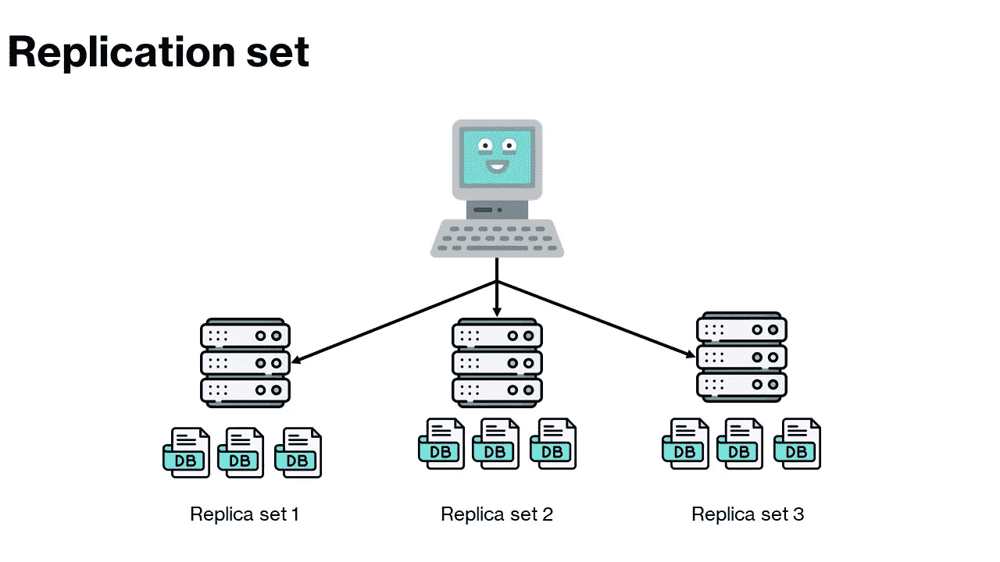
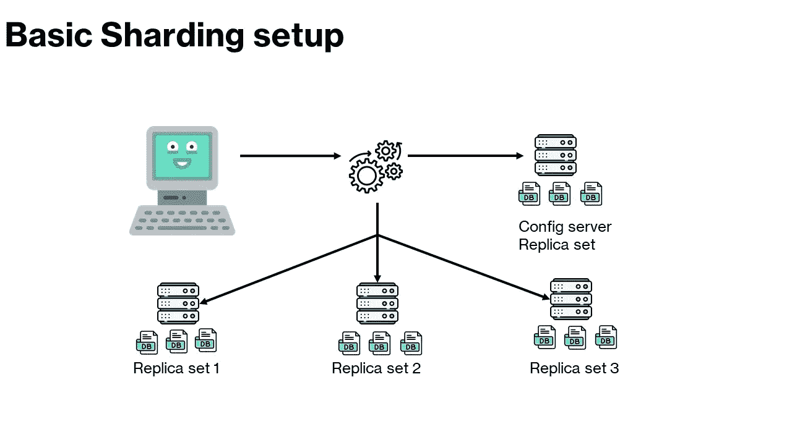

# MongoDB 上的复制和分片

> 原文：<https://blog.devgenius.io/replication-and-sharding-on-mongodb-498997963167?source=collection_archive---------7----------------------->

之前，我们已经了解了如何:

*   [安装 MongoDB](https://medium.com/@ibtissam.makdoun/from-rdbms-to-non-relational-databases-119f4007b214?sk=d382683ac9d718405ba9a31584be7c39)
*   [创建文档、收藏和数据库](/creating-updating-and-deleting-mongodb-documents-94c12219783f?sk=238a6375522fd0b312d2527adb367cbb)
*   [查询数据库](/querying-and-updating-documents-on-mongodb-compass-c9be25ffffb2?sk=ced33a91b8c4ba8b49ddec8140d5a055)
*   [创建索引并使用索引查询文档](/create-indexes-to-enhance-the-performance-of-your-queries-on-mongodb-9baec757d684?sk=90a8843a81d26275848c40b0065a3cbf)
*   [使用 GridFS 存储文件](https://towardsdev.com/how-to-use-gridfs-to-store-documents-on-mongodb-8d551c36f1c0)
*   [用 pymongo 和 mongolite 编码](https://towardsdev.com/coding-with-mongodb-using-python-and-r-programming-languages-85917e8d8d14)

现在，是时候获得更多进步并处理服务器管理了。通过学习如何在 MongoDB 上设置数据复制，了解分片是如何发生的，以及如何在 MongoDB 的后台工作。


# 分身术

[10 分钟内在 MongoDB 上设置副本集— YouTube](https://www.youtube.com/watch?v=1t7D8tVSaiY)

一旦您开始将 MongoDB 用于设计应用程序和生产，您就应该开始考虑复制。复制非常重要，因为如果出现问题，应用程序崩溃或变得不可用，它将保护您的数据库。这对您的公司来说成本很高，您可能会停机，而停机一点也不好。

或者更糟的是，你的数据可能会被破坏，这是另一个噩梦。

好吧，副本集是拯救！



MongoDB 中服务器上的三个复制集

事实上，副本集是 MongoDB 通过一次运行数据库的多个副本或相同副本来帮助您避免这些问题的方法。它通过一个主节点和多个辅助节点来实现这一点，如果出现问题，辅助节点将自动取代主节点。复制还可以帮助您扩展数据库。

在这一节中，我将一步一步地解释如何在 MongoDB 上为数据库和集合设置副本集。如果您不理解本教程中列出的任何命令，请留下您的评论。

我使用 ubuntu docker 镜像来创建一个副本，所以如果你是 docker 新手，请确保查看此视频以了解如何设置 docker 镜像。

所以在我开始本教程之前，让我向你澄清一下，我已经使用下面的命令在这个映像上安装了 MongoDB。

```
apt-get install mongodb
```

首先，我将在主机上创建三个副本集。请注意，在生产环境中，您需要在单独的主机 ie 上创建副本集。服务器。在下一步中，我将连接以使用我创建的副本集。

## 步骤 1:创建副本集

首先创建 ubuntu 容器的三个选项卡，然后开始创建存放数据文件的文件夹。

因此，让我们继续通过复制来创建这些文件夹，并在 shell 中传递所有这些命令。

```
mkdir store/data
cd store/datamkdir rs1mkdir rs2mkdir rs3ls
```

现在，您有三个目录，您的副本集数据将保存在其中。

为了创建副本集，我们将使用一个特殊的命令:

```
mongo –replSet movieSet –dbpath=/store/data/rs1 –port 27017 –smallfiles –oplogSize 200
```

该命令创建副本集，将其命名为 movieSet，注意，该名称对于所有副本集必须是相同的。然后，我们使用 dbpath 设置数据库路径，并将它设置为我们刚刚创建的目录中的一个。我们使用–port 来设置端口，因为每个副本集需要在不同的端口上运行。最后，我们添加了两个额外选项——小文件——oplogSize 200。

一旦您运行这个命令，您将得到一条消息，说:正在端口 27017 上等待连接。

现在，我们将使用与之前相同的命令来创建其他副本集，只是做了一些小的更改。

```
mongo –replSet movieSet –dbpath=/store/data/rs2 –port 27018 –smallfiles –oplogSize 200mongo –replSet movieSet –dbpath=/store/data/rs3 –port 27019 –smallfiles –oplogSize 200
```

如您所见，我们更改了副本文件的位置和每个副本的端口号。类似地，像以前一样，我们运行命令，我们得到两个副本集都在端口上等待连接。

您可以使用以下命令验证所有副本集是否都在您的主机上运行:

```
htop
```

## 步骤 2:配置副本集

既然所有的副本集都在运行，我们需要告诉每个副本集另一个副本集存在，因为它们实际上还不知道。

首先，我将使用以下命令连接到其中一个副本集。

```
mongo — port 27017
```

一旦连接上，您将使用这个配置变量对其进行配置。

```
config = {_id: “movieSet”,“members”: [{_id: 0, host: “localhost:27017”},{_id: 1, host: “localhost:27018”},{_id: 2, host: “localhost:27019”}]}
```

因此，我们给它一个 id，我们将它命名为副本集。然后我们给它成员，这是一个数组。它将由代表我们运行的每一个副本集的对象组成。每个对象都有一个 id 和主机 URL。

一旦我们运行了这个命令，MongoDB 就会为我们很好地格式化它。

现在，我们将在命令 *rs.initiate* 中使用这个变量，如下所示:

```
rs.initiate(config)
```

一旦您运行这个命令，您可以看到它自动切换到辅助副本集。

您可以运行许多命令来获取关于副本集的信息。

```
rs.status()db.isMaster()
```

现在，让我们从主服务器注销，并使用以下命令连接到其中一个辅助服务器

```
exitmongo –port=27018
```

如果您请求使用列出您的数据库

```
show dbs;
```

你可以看到它告诉你不要失败。

请注意，您不能使用辅助节点进行读取或写入。

现在，如果我们再次连接到主节点，并尝试插入一个空文档:

```
db.test.insertOne({})
```

您会注意到收集测试在三个节点上被复制。

太棒了。

最后，为了正确地连接到副本集，您将使用稍微不同的命令，如下所示:

```
mongo “mongodb:localhost:27017, localhost:27018, localhost:27019/?replicaSet=movieSet”
```

这就是如何为您的数据库创建一个副本。

# 分片

分片应用超出了本教程的范围。但是，我将带您了解什么是分片以及它的工作方式。

如果您想过渡到分片服务器设置，分片是很重要的。分片是将数据分散到多个服务器上的概念。这有助于整体性能和基础设施。因此，您可以跨多台服务器扩展数据，而不是扩大数据增长，例如投资购买更大的服务器。例如，如果您需要更多的磁盘空间，但不需要太多的 RAM，您也可以将事情分散开来。您可以充分利用您的服务器，并在其他地方省钱。

现在其他数据库也允许分区。然而，它需要大量复杂的手动设置和干预。有了 MongoDB，你可以自动粉碎你的数据，这太棒了。

现在，让我们简单讨论一下分片和复制的区别。所以分片会将你的数据分散到多个服务器上。这不同于副本集，副本集是数据在多个服务器上的副本。

在副本集中，当您连接时，您的查询会自动委托给副本集中的一个成员。这非常有效，因为每个成员都有一份数据副本。

> 那么 MongoDB 如何处理分片呢？何时数据可能会分散到多个服务器上？

为了在多个服务器之间分解数据，我们使用另一个叫做 **mongos** 的进程，而不是 mongod。这个过程就像一个路由器。它包含类似内容表的东西来跟踪数据的位置。它使用一种叫做共享密钥的东西和配置服务器来实现这一点。

因此，当您连接到 MongoDB 发送查询时，mongos 将处理查找和找到数据的位置，从正确的服务器获取数据，如果数据分散在多个服务器上，则将所有数据合并在一起。好消息是一切都是在幕后完成的。MongoDB 的行为就像是一个普通的查询连接。

您不需要在应用程序端做任何事情，您的客户端连接到 MongoS，然后跟踪您的数据的配置服务器会处理剩下的事情。

正如我们前面解释的，配置服务器跟踪服务器上数据块的位置。如果由于任何意外，我们在配置服务器上丢失了数据，您将不得不手动恢复这些数据，您可以想象这对您来说是多么可怕和巨大的压力。这就是为什么使用分片的最佳实践之一是在配置服务器上复制数据并更频繁地备份。好消息是它只有少量的数据。



# MongoDB 如何分片数据？

您需要做的第一件事是在您的数据库上启用分片，然后告诉它您想要分片哪个集合以及您的共享密钥。MongoDB 将使用该密钥来分解您的数据。关键需要像一个索引，因为它基本上是一个索引。

想象下面的例子:


我们这里有一份按标题分类的电影清单。

如果我们选择电影标题作为分片键，MongoDB 将按标题将其拆分。大概是这样的。


现在，这部电影被分成四个片段，在这种情况下，所有的片段最终会分散开来，每个片段包含两部电影。

现在，在现实中，根据你分解数据的方式，可能有成千上万的碎片。随着我们添加更多的电影，MongoDB 将调查碎片密钥，并将电影添加到破解碎片中。

如果一个碎片变得太大，它被称为不平衡。它会自动将碎片分成两个或更多的新碎片。请注意，您还可以使用 id 作为您的 shard 密钥，您的数据将在文档创建日期之前共享。

同样，数据的位置或存储数据的碎片在配置服务器中。MongoDB 在后台处理所有这些，在大多数情况下，您不需要对应用程序做任何更改。

现在，您对 MongoDB 上的复制和分片及其工作原理有了更多的了解。您可以深入研究并检查 MongoDB 中的身份验证和授权

感谢阅读！更多教程可以关注我。回头再聊！

[分片— MongoDB 手册](https://docs.mongodb.com/manual/sharding/)

[什么是 MongoDB 中的复制？| MongoDB](https://www.mongodb.com/basics/replication#:~:text=How%20do%20I%20enable%20replication%20in%20MongoDB%3F%201,that%20the%20replica%20set%20has%20a%20primary.%20)

[Docker 中的 MongoDB 复制模式|由王业| Medium](https://medium.com/@yewang2018/mongodb-in-docker-replication-11c9514f53c0)