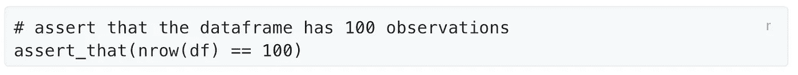

# 可复制的、伦理的和协作的数据科学:图灵之路项目

> 原文：<https://blog.devgenius.io/reproducible-ethical-and-collaborative-data-science-the-turing-way-project-99baf973a620?source=collection_archive---------8----------------------->

## *“让可复制的研究变得太容易而不去做”* —图灵之道座右铭

http://doi.org/10.5281/zenodo.3332807

 [## 图灵之路

### 欢迎来到图灵之路可再生、伦理和协作数据科学手册。图灵路项目是…

the-turing-way.netlify.app](https://the-turing-way.netlify.app/welcome.html) 

图灵之路项目是一个开源项目，它应该会让**对数据科学感兴趣的任何学者**感到兴奋。这是一本关于技术和最佳实践的年鉴，让你的研究更具可重复性，并为**开放科学的未来**做好准备。

在撰写本文时，有超过 250 名贡献者在从事图灵之路项目。它不仅提供了*广泛的* [在线书籍](https://the-turing-way.netlify.com/)，还提供了通过 [GitHub 知识库](https://github.com/alan-turing-institute/the-turing-way)与社区其他成员互动的选项。

他们为数百个帖子提供了足够的材料。然而，你应该亲自检查图灵方式项目！我感兴趣的只是让更多的人了解这个作品，因为我怀疑很多人还没有听说过它。

在这里，我们将只评论他们的*可重复研究*章节中的一些亮点，这占了本书的一小部分。

我想在这里强调的一些子章节是关于*版本控制*、*可复制环境*和*代码测试*的章节。

# 版本控制

版本控制可能是提升你的研究项目的最有效的方法之一。它增强了你与未来的自己和合作者的合作。如果做得好，它可以消除任何“你不小心覆盖了我的修改”，或者“哪个版本是当前版本？”。

为此，我使用 git 和 GitHub。Git 使您能够用*提交*来记录项目的进度，并且还允许您**跳回到**过去的某个特定提交。虽然这也是其他服务(如 Google Drive)的固有特性，但 git 还能处理一个项目的多个分支。

虽然总有一个开发的主路径(理想情况下是你的测试过的工作版本)，你和你的合作者可以从不同的方向分支。

实际上，人 A 处理代码的一个新特性(分支 A)，而人 B 处理另一个特性(分支 B)。之后，两者都可以**将**他们的工作合并回**主分支**，从而通过这两个新特性扩展你的项目。这很方便，因为它允许你**分而治之**。

根据我的经验，如果你事先考虑好，分支和合并会顺利进行:尝试以一种不需要你在同一个脚本中工作的方式分割任务。编辑同一个文件很容易导致合并冲突，这通常很费时。

# 可再生环境

分享你的代码已经对其他研究人员有所帮助，并为你的研究项目提供了明确的文档。然而，**以某种方式共享代码**，以便其他人可以立即复制您的结果，这需要注意一些细节。

这些细节之一是记录您的[计算环境](https://the-turing-way.netlify.app/reproducible-research/renv.html)。

我们需要**可复制的环境**来允许其他人在他们的计算机上建立我们用来编写代码的相同环境。

通常，只需重新创建用于让脚本工作的 Python 或 R 环境就足够了。然而，有时你需要提供整个机器的图像，例如，用一个 [docker 容器](https://the-turing-way.netlify.app/_images/computational-environments.jpg)。下面是一些关于简单提供相同软件环境的小例子的注释。

在 Python 中，最流行的管理解释器的方法是 [conda](https://conda.io/) 。通过 conda 分享你的**环境很简单。您可以创建一个包含您的 conda 环境的 *requirements.txt* ，并将其发送给您的合作者，他们可以自动安装所有必要的软件包:**

在 R 中很少使用 conda，但是当你在脚本中加载**安装包**时，你经常会遇到麻烦。

要自动安装所需的软件包，库`pacman`可以提供帮助。将下面的代码放在 R 脚本的顶部，您应该可以摆脱 99%的环境问题。

# 单元测试

正如在[社区的 5 年数据科学](https://www.ds-econ.com/the-communities-5-years-of-data-science-your-experiences-with-talking-to-stakeholders-asking/)中指出的，单元测试对于数据科学家来说是一项被低估的技能，对于研究人员来说当然也是如此。虽然你应该总是**亲自检查你的数据**(多次)，过一段时间你可以**用单元测试自动化**这些检查。

例如，您可以编写一个简单的测试来检查您的观察 id 是否(仍然)是唯一的，或者某些错误是否导致了重复:

当你准备好成为一名专业的代码测试人员时，可以考虑将多个测试打包到一个函数中:

还要留意单元测试专用的模块，比如`pytest`和`unittest`。还有一个包`[assertthat](https://github.com/hadley/assertthat)`，它实现了 R:

如果这是我在图灵路上的最后一篇文章，我会很惊讶。然而，与此同时，我**再次敦促**你去看看他们的[项目](https://the-turing-way.netlify.app/welcome.html)、 [GitHub](https://github.com/alan-turing-institute/the-turing-way) 和 [Twitter](https://twitter.com/turingway) 。

[图灵之路:可复制、伦理和协作研究手册《图灵之路:可复制、伦理和协作研究手册》图灵之路 2022 年 7 月](https://doi.org/10.5281/zenodo.3233853)。