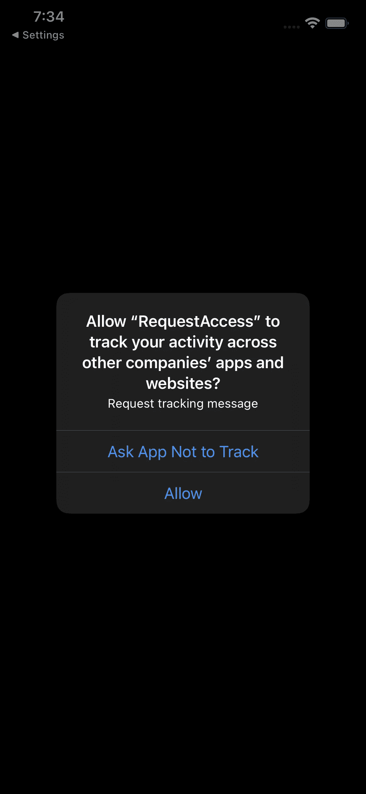

# 在 iOS 中请求跟踪授权

> 原文：<https://blog.devgenius.io/request-tracking-authorization-in-ios-9af50727b885?source=collection_archive---------0----------------------->

使用 Swift 在 iOS 中请求跟踪授权

照片由[威廉·胡克](https://unsplash.com/@williamtm?utm_source=medium&utm_medium=referral)在 [Unsplash](https://unsplash.com?utm_source=medium&utm_medium=referral) 拍摄

对于 iOS 14.5 及以上版本，如果我们希望使用所有用户设备的广告标识符，我们需要为他们请求跟踪授权。苹果公司声明如下:

> 从 iOS 14.5、iPadOS 14.5 和 tvOS 14.5 开始，您需要通过 AppTrackingTransparency 框架获得用户的许可，才能跟踪他们或访问他们设备的广告标识符。跟踪是指将从您的应用程序收集的用户或设备数据与从其他公司的应用程序、网站或离线属性收集的用户或设备数据相链接，以进行有针对性的广告或广告测量。跟踪也指与数据代理共享用户或设备数据。

您可以在以下链接中了解更多信息:[https://developer . apple . com/app-store/user-privacy-and-data-use/](https://developer.apple.com/app-store/user-privacy-and-data-use/)

现在，如何遵守这一点呢？没那么难，那就开始吧。

首先让我们创建一个 RequestManager，如下所示:

我们正在做的是获得广告标识符或 IDFA。让我们打印它。我们应该得到的是:**000000000–0000–0000–0000–000000000**

这是为什么呢？因为我们还没有请求用户授权。将以下函数添加到我们的 RequestManager 中:

我们在这里做的是请求跟踪授权，获取用户选择的状态并返回该状态。在尝试之前，将添加到。plist 文件此***nsurtrackingsagedescription。*** 说明你为什么要求用户这样做。

要测试它，请执行以下操作:

在此之后，您应该会收到请求用户授权进行跟踪的警报。

感谢阅读。

与我们合作:

 [## 阿维拉泰克

### 技术创新的发展

www.avilatek.com](https://www.avilatek.com/en/) 

我的 LinkedIn 个人资料:

 [## Marcelo Laprea - iOS 软件工程师- Kindred Group plc | LinkedIn

### 经验丰富的 iOS 应用程序开发人员，有在计算机软件行业工作的经历。熟练于…

www.linkedin.com](https://www.linkedin.com/in/marcelo-laprea/)