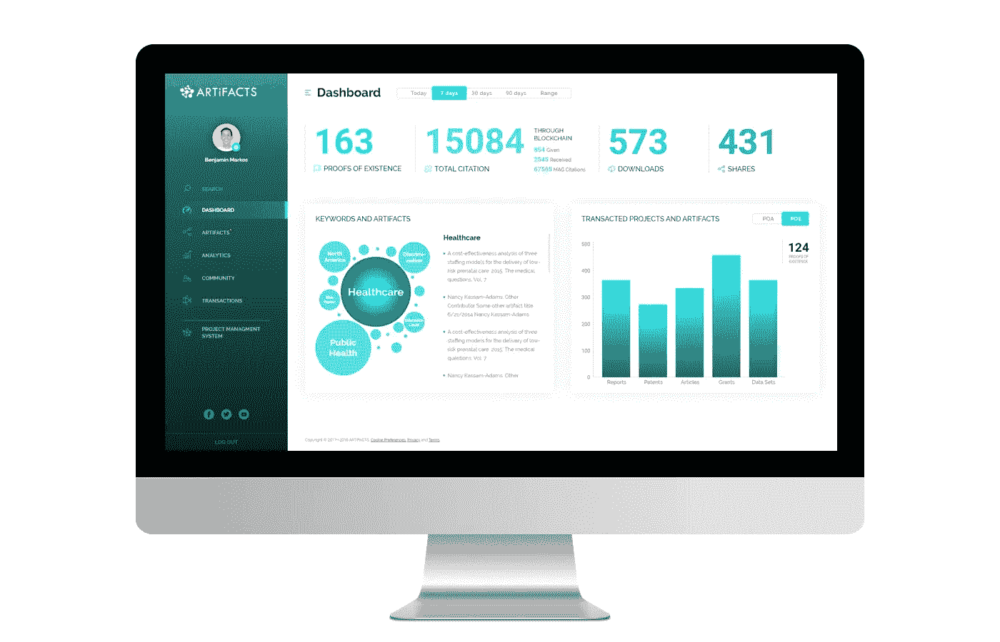
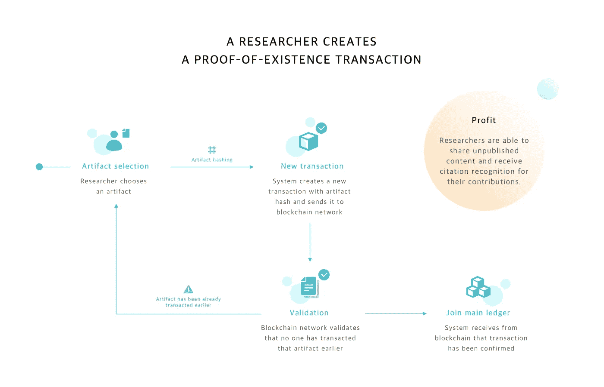
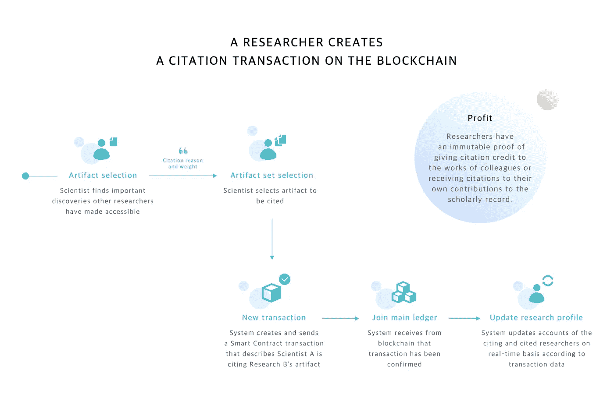

# 研究合作平台是保护和分享科学发现的一种方式

> 原文：<https://blog.devgenius.io/research-collaboration-platforms-as-a-way-to-secure-and-share-scientific-findings-f7f918e0ce8a?source=collection_archive---------38----------------------->

从来没有像现在这样如此关注研究，每个人都在等待冠状病毒疫苗。与此同时，科学界不得不处理一个似乎无法解决的问题──一方面，研究人员需要一个空间和可能性来讨论他们的发现、想法和理论，这需要共同获取研究材料；另一方面，总是存在这样的威胁:盗用他人的研究成果，并声称这是你自己的成果。然而，知道创建者是谁也是有益的，因为这些人与他们的工作文件直接相关，并且能够提供解释、补充信息和其他见解。

现在，当绝对有必要发明疫苗时，科学家之间的合作是成功的关键因素。与此同时，科学家面对面讨论他们的发现的可能性几乎为零。在这种情况下，虚拟研究合作平台(RCP)成为一种必要的解决方案，科学家可以在这个平台上分享他们的成果并证明他们的所有权。

# 研究合作平台:工作原理

建立安全的数据共享，防止盗用结果，是这些平台的主要目标。区块链最著名的研究人员平台之一， [ARTiFACTS](http://artifacts.ai) ，可以保证实现所有这些原则。

该项目有三大支柱:

1.  **安全共享研究成果，加速发现；**

In the world of academic research, especially in the current pandemic situation, a principle rules that the quicker the research is released, the earlier it becomes useful for the scientific community. The more data is published, the more useful insights other scientists can get for their work, and on the other hand 一 the possibility to repeat someone else’s mistake is mitigated significantly. When researchers are aware of what their colleagues all over the world are doing, they understand the general state of the research field, see where white spots are, and know which aspects are already studied well enough. However, on the other side of the coin is the question “How to protect your data from dishonest “borrowing?” And the research collaboration platform provides a secure answer 一 establish proof-of-existence.

**2。快速建立存在证明；**

这些系统就像人工制品一样，允许研究人员保护他们的数据，并以引用其数据的形式获得认可，而不仅仅是科学出版物。ARTiFACTS 通过将科学工作的“数字指纹”(存在证明或 PoE)安全地注册到他们的区块链，帮助保护您的原创想法并与其他研究人员分享。当然，作者总是拥有和控制原始文件。

**3。用不折不扣的归因获得荣誉；**

在任何研究人员的科学传记中，从学术生涯的开始就建立声誉是一个重要的观点。对于研究生和博士生来说，在更大的研究范围内做常规工作或从事更大任务的一小部分是一种常见的做法。通常，他们的贡献被认为不够重要，不足以作为整个科学工作的合著者被提及。然而，基于他们在研究项目中的角色和支持，他们的贡献仍然可以得到认可，因此他们也可以在引用中得到认可，特别是指他们的工作部分。参与研究的每个人都可以通过在分布式账本上交易和标记他的工件来确保出处。

# RCP 对冠状病毒研究的影响

这三项原则在疫情时代变得更加重要。今天，科学家们认识到，合作、相互支持和尽快分享成果比以往任何时候都更加重要。

常规的研究过程看起来是这样的:你为一个想法工作很长时间，填写许多拨款申请，在某个时候你可能会赢得这些拨款，然后他们资助你的后续研究，你组建一个团队，并进行一系列程序。因此，您产生了许多对您的团队有用的文档，并且可能对从事类似工作的其他团队有用。然而，直到你的研究工作看到了这个世界，有人提到了它，许多年过去了。而科学，一旦摆脱了传统的束缚，就会向前发展得更快。在目前的情况下，花这么多时间在研究上而不分享成果是一种不允许的奢侈。

关于冠状病毒的第一个研究立即出现，现在这个数字每天都在增长。ARTiFACTS 对当前状态做出了快速反应，创建了一个[网页](https://sys.artifacts.ai/ac5qu/)，在这里你可以找到新冠肺炎各地正在进行的工作。基于开放数据和存在证据的原则，该平台允许科学家共享中间和最终结果，了解其他研究小组正在进行的工作。

> “我们在 2020 年 4 月创建了这个公共项目，以帮助所有对监测病毒和潜在疗法新研究的重要来源感兴趣的人工制品用户，并邀请研究人员参与，要么将他们自己的研究添加到这个项目中，要么使用这个资源来了解其他地方正在进行的其他研究”。
> 
> *戴夫·科查尔科，神器公司的联合创始人*

该研究平台侧重于如何更好地为新冠肺炎正在进行的工作做出贡献。因此，他们启动了一个公共项目，播种记录，该平台及其用户将不断添加记录，作为研究该病毒的同事的开放资源。

> “我们用近 30 件作品作为项目的种子，并向社区贡献新的发现。这些工作通常分为两类，一类是针对 COVIC-19 疾病的疗法，另一类是针对新型冠状病毒病毒的潜在疫苗的研究。”戴夫·科查尔科说。“创建和播种这个项目的目的是为了展示组织一个公共的社区空间来分享重要的研究是多么的快速和高效。随着经过验证的疗法和疫苗仍在研发中，我们最聪明的科学家还有更多的工作要做，并与世界分享。我们期待他们的调查结果、建议和解决方案。”

现在，当整个科学界动员起来应对病毒带来的挑战时，作为人工制品的研究平台在科学和学术研究的所有领域发挥着越来越重要的作用。

# 下一步是什么？

很明显，在不久的将来，科学、医疗保健和医学研究行业将会增长。各种远程协作工具也是如此。像文物一样的平台结合了硬币的两面。世界各地的科学家现在能够尽快分享他们的成果，确保著作权受到保护，并获得一个安全的空间来讨论他们的发现并向他们的同事学习。通过这种方式，这种平台成为推动科学发展的完美工具，并使我们更接近我们都在等待的解决方案。

NIX 作为一个软件开发专家团队，负责平台的[技术方面。在开发过程中，我们必须组织数据结构，决定在区块链中存储什么部分，以及如何将区块链上的数据与系统内部的数据连接起来。它要求团队实现 SSO(单点登录),以便使用一个身份验证和授权点来访问所有服务；将归属证明实现为智能合同；与开源平台一起运行，处理大量数据，并将科学图表(如 Microsoft Academic Graph)与现有系统集成。该项目让 NIX 在区块链开发方面积累了丰富的专业知识，并增加了我们在与](https://nix-united.com/success_stories/artifacts-a-blockchain-platform/)[协作&交流平台](https://nix-united.com/blog/solutions-to-translate-data-into-words-voice-audio-or-video/)合作中的知识。

如果您正在考虑为您的企业实施类似的解决方案，请立即联系我们，我们的专家将很乐意为您提供帮助。