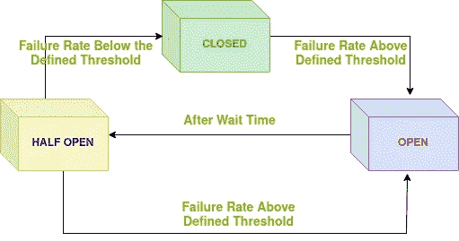
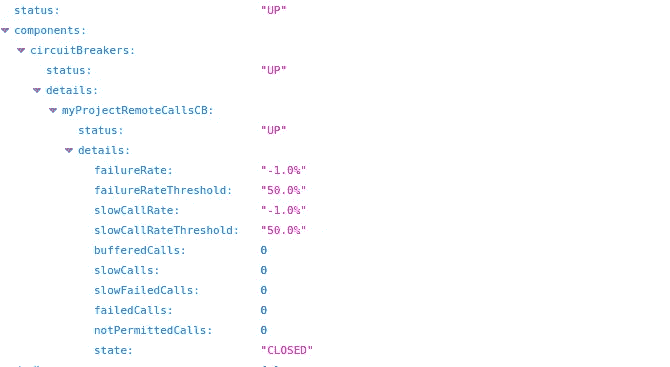

# 带 Spring Boot 的 Resilience4j 断路器

> 原文：<https://blog.devgenius.io/resilience4j-circuit-breaker-with-spring-boot-5fb19a748323?source=collection_archive---------2----------------------->


**resilience 4j Spring Boot 断路器**

覆盖主题:
1。什么是断路器和电阻电路 4j。
2 .如何实现 Resilience4j。
3 .使用执行器进行监控。

**什么是断路器:**
调用远程服务的服务，其功能类似于断路器。
当连续故障的次数超过定义的阈值时，断路器关闭(*断开状态*)，并且在一段超时时间内，所有调用远程服务的尝试将立即失败。超时后，断路器允许有限数量的测试请求通过(*半断开状态*)。如果这些请求成功，断路器恢复正常操作(*闭合状态*)。否则，如果出现故障，超时时间将再次开始。

**Resilience4j:**
Resilience4j 是一个可选的轻量级容错库，灵感来自网飞·海斯特里克斯，是为 Java 8 和函数式编程设计的。它建立在 Java 8 的功能语言扩展之上，没有任何其他外部库依赖。下图解释了 Resilience4j 断路器的工作原理。



断路器流程图

H **如何实施 Resilience4j:**

我们需要在我们的代码库中进行依赖性设置、断路器配置和使用。

**添加依赖项:**在 pom.xml 中添加以下依赖项。

**配置:**我们将通过应用程序 yml 使用以下配置来配置断路器。

让我们看看上面的配置

```
**registerHealthIndicator:** By default the CircuitBreaker or RateLimiter health indicators are disabled, but we can enable them via the configuration by setting it true.**slidingWindowType:** COUNT_BASED/TIME_BASED. Configures the type of the sliding window which is used to record the outcome of calls when the CircuitBreaker is closed
Default value is COUNT_BASED.**slidingWindowSize:**Configures the size of the sliding window which is used to record the outcome of calls when the CircuitBreaker is closed. 
Its value will be in count based if slidingWindowType is COUNT_BASED.
Its value will be in seconds based if slidingWindowType is TIME_BASED.
Default value is 100.**permittedNumberOfCallsInHalfOpenState:** Configures the number of permitted calls when the CircuitBreaker is half open.
Default value is 10.**minimumNumberOfCalls:**Configures the minimum number of calls which are required (per sliding window  period) before the CircuitBreaker can calculate the error rate.
Default value is 100**waitDurationInOpenState:** Configures the wait duration (in seconds) which specifies how long the  CircuitBreaker should stay open, before it switches to half open.
Default value is 60 seconds.**slowCallRateThreshold:** Configures a threshold in percentage. The CircuitBreaker considers a  call as slow when the call duration is greater than  slowCallDurationThreshold
Default value is 100.**slowCallDurationThreshold:** Configures the duration threshold (seconds) above which calls are considered as slow and increase the slow calls percentage.
Default value is 60.**failureRateThreshold:** Configures the failure rate threshold in percentage. If the failure rate  is equal or greater than the threshold the CircuitBreaker transitions  to open and starts short-circuiting calls.
Default value is 50.
```

**执行器配置:**我们将使用以下配置通过 application.yml 启用断路器执行器端点。

配置好断路器后，我们可以通过浏览器进入 url <host>/actuator/health 进行健康检查。在 up 状态下，我们将得到 state ***CLOSED*** 。请查看下面的 Api 响应。</host>



断路器运行状况

在半开启状态<retry>下，状态将是 ***半开启***</retry>

在打开状态<remote api="" down="">下，状态会是 ***打开***</remote>

**代码实现:**现在我们将在微服务 API 调用中实现断路器。
我们将使用 ***@CircuitBreaker*** 标注后跟断路器的 ***名称*** 和***fallback method***。
fallbackMethod:当状态为 HALF_OPEN 或 OPEN 时，我们将从 fallbackMethod 返回默认响应。

注意:确保用***@ circuit breaker***标注的方法不应该在同一个调用者类中。

仅此而已！！

现在，您可以在微维修应用中使用 Resilience4j 断路器了。