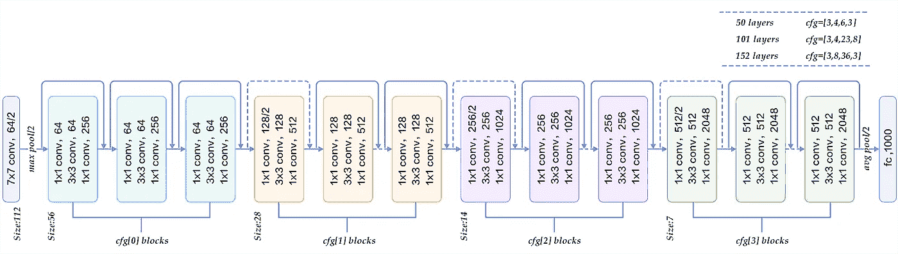
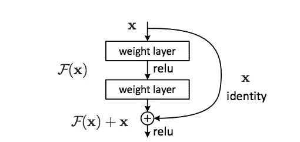
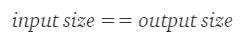
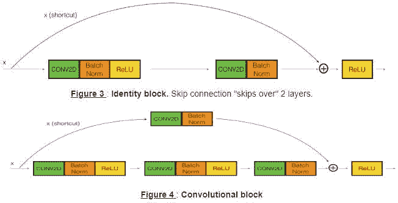
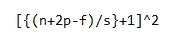
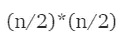
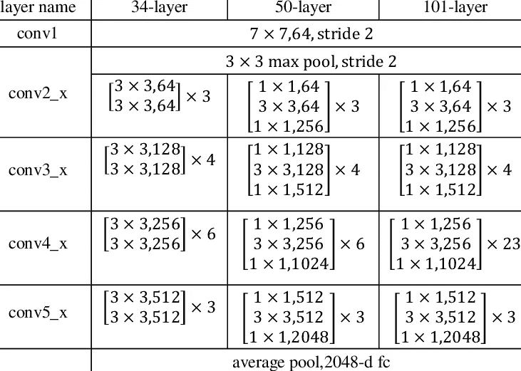

# ResNet50

> 原文：<https://blog.devgenius.io/resnet50-6b42934db431?source=collection_archive---------0----------------------->

ResNet-50 是一个 50 层深的卷积神经网络。ResNet 是残差网络的缩写，是一种经典的神经网络，用作许多计算机视觉任务的主干。ResNet 的根本突破是它允许我们训练具有 150+层的非常深的神经网络。这是一种创新的神经网络，何，，任，在他们 2015 年的计算机视觉研究论文中首次提出，论文名为**‘图像识别的深度残差学习’**。

卷积神经网络有一个主要的缺点——**消失梯度问题**。在反向传播过程中，梯度值显著减小，因此权重几乎没有变化。为了克服这一点，使用了 ResNet。它利用**“跳过连接”。**

## ResNet-50 架构

**跳过连接** — *将原始输入添加到卷积块的输出。*

跳过连接

所有算法都在输出‘Y’上训练，但是 ResNet 在 F(X)上训练。更简单地说，ResNet 试图使 F(X)=0，使 Y=X。

**跳过连接**是跳过模型某些层的直接连接。由于这种跳过连接，输出是不同的。如果没有跳过连接，输入 X 将乘以图层的权重，然后添加一个偏差项。

然后是激活函数 F()，我们得到的输出是:

**F( w*x + b ) (=F(X))**

但是使用跳过连接技术，输出是:

**F(X)+x**

在 ResNet-50 中，有两种类型的块

1.  身份块
2.  卷积块

当且仅当,“x”的值被添加到输出层

如果不是这样，我们在快捷路径中添加一个**‘卷积块’**，使输入大小等于输出大小。

有两种方法可以使输入大小等于输出大小-

1.  填充输入音量，
2.  执行 1*1 卷积。

输出层的大小通过以下公式计算—

在哪里，

n=输入图像大小，

p =填充，

s =步幅，

f =过滤器数量。

对于 1*1 卷积层，输出层的大小=

给定输入大小为“n”。

在 CNN 中，为了减小图像的大小，使用了池。这里，我们使用 stride=2 来代替。

*感谢阅读！如有任何疑问，请随时联系我的*[***Gmail***](http://aditi2507rastogi@gmail.com/)**或我的* [***LinkedIn 个人资料***](https://www.linkedin.com/in/aditi-rastogi-961789191/)**或*[***GitHub***](https://github.com/AditiRastogi250701)*个人资料。***