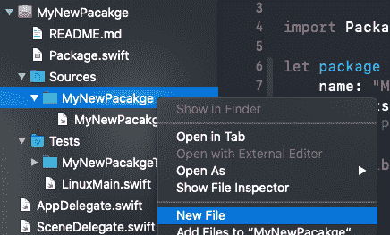

# 资源正在流向 Swift 产品包

> 原文：<https://blog.devgenius.io/resources-are-coming-to-swift-packages-52e5f08ec7ad?source=collection_archive---------4----------------------->


## 现在，您可以在 Xcode 12 中将资源添加到您的 swift 包中。这是什么意思？

# 介绍

在我之前的一篇文章中，我提到过[SPM(Swift Package Manager)如何改变我构建和维护代码的方式](https://medium.com/better-programming/how-swift-packages-changed-the-way-i-build-appsintroduction-fb4ade0f1cec)。我称赞了 Xcode 11 与 Swift 包的深度集成，以及创建巨大的模块化代码是多么容易。

但这个“天堂”并不完美；缺少一样东西——向 Swift 包添加文件而不是代码的能力。您不能添加图像、数据文件，甚至是故事板。

幸运的是，苹果在 Swift 5.3 和 Xcode 12 中做了一些改变。

# 等等。Swift 包…提醒我一下？

Swift 包是 Swift、Obj-c 或 C++库的一个可重用组件，您可以轻松地创建并在您的项目中共享。您可以在本地获得它，或者从专用的 git 存储库中获取它。Swift Package 不仅可以帮助您重用代码，还可以使您的项目更加模块化，并可以帮助您更好地管理您的测试。

# 现在资源也是合法的公民

人人平等！在 Xcode 12 中，您可以将资源添加到包中。什么类型的资源？基本上，你需要的任何东西，从图像，数据文件，故事板，甚至本地化文件。

添加资源非常简单——只需在项目导航器的 sources 文件夹下右键单击 package 文件夹，然后选择“New File ”:



注意:注意不要点击你的包文件夹的根目录。您只能将代码或资源添加到我上面提到的文件夹中。

# 如何从代码中访问我的资源？

好的，我们需要在这里做一些小的调整。

比如说图像。

我们可以向包中添加资产目录。通常，要根据资产分配图像，我们应该这样做:

```
let image = UIImage(named : “rightArrow”)
```

但是在一个不产生任何物质的包装里。这是因为我们的代码在主包中搜索图像。我们需要告诉 UIKit 在我们的模块包中搜索图像:

```
let image = UIImage(named: "rightArrow", in: .module, compatibleWith: nil)
```

如您所见，从代码中访问资源需要提到模块包，否则，您将一无所获。

# 就这样？我在下载 Xcode 12！

等一下。我上面提到的内容与那些目的明确的文件相关，例如:

故事板

-资产目录

- .xib 文件

- Xcdatamodel

- Xcmappingmodel

但是有些文件我们需要告诉 Xcode 如何处理它们——我们是在运行时需要这些文件，还是只在开发任务中需要它们？

例如，假设我们有一个不想与我们的包捆绑在一起的文档文件。

这里我们需要做的是用以下信息更新我们的包的清单文件:

```
.target(name: "MyNewPacakge", dependencies: [], path: nil, exclude: ["notes.txt"]),
```

我们还可以添加一个要忽略的完整目录。它实际上非常类似于 Xcode 中 Target 下的“编译源代码”机制。

如果您确实希望将文件视为资源，请将其添加到软件包清单文件中目标的 resources 部分:

```
.target(name: "MyNewPacakge", dependencies: [], path: nil, exclude: ["notes.txt"], resources:[.process("myImage.png")]),
```

# 好，那么这将如何改变游戏？

想想所有摆在你面前的选择。

-核心数据持久层-核心数据初始化过程需要数据模型，因此创建数据层几乎是不可能的。但是现在，添加 xcdatamodel 文件是一项简单的任务。这一点尤其重要，因为数据层是一个低级层，通常是更高级包的依赖项。

- UI 组件包-UI 组件有时包含图像并依赖于 xib 文件。现在，您可以在项目中共享您的组件。

-视图控制器-如果您有一个特殊的文件选择器或一个想要重用的自定义模态屏幕，现在您可以将其捆绑到一个包中，因为您已经有了它所需要的东西，无论是故事板还是 xib 文件。

-本地化——既然我们可以共享视图控制器，我们需要本地化它们，对吗？lproj 文件可以很容易地添加到包中，没有时间。

# 摘要

苹果正在推动 Swift 包成为你的项目的基本单位。随着 Swift 软件包越来越受欢迎，它们包含资源是很自然的事情。SPM 与 Xcode 12 的集成以及这一新功能使 Swift Packages Manager 成为一款真正出色的工具。