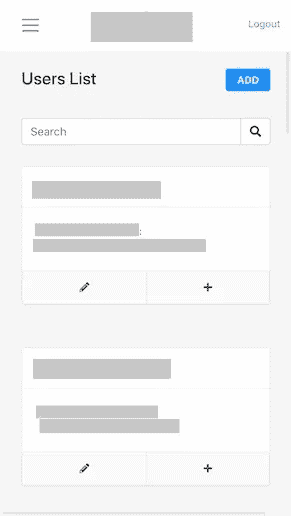
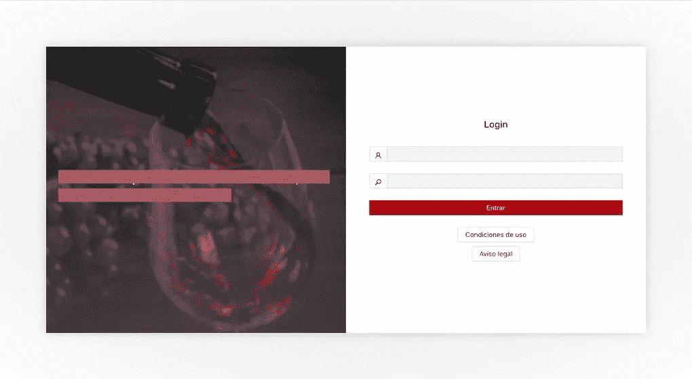
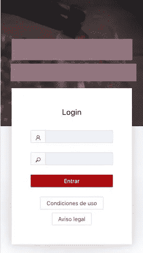

# 响应式设计还是适应性设计？

> 原文：<https://blog.devgenius.io/responsive-design-or-adaptive-design-85f5f421109a?source=collection_archive---------11----------------------->

## 快速响应和适应性设计指南

[欧拉夫瓦尔](https://unsplash.com/@olafval?utm_source=medium&utm_medium=referral)在 [Unsplash](https://unsplash.com?utm_source=medium&utm_medium=referral) 上的照片

使网站具有响应性是非常重要的，因为现在从手机、平板电脑和更多小尺寸设备上浏览网站的人很多。然而，在我的一些项目中，当仅仅依靠响应式设计时，我会面临一些 UX 问题。将适应性设计与响应性设计结合使用是我的项目的灵丹妙药。事不宜迟，让我们进入主题。

## 什么是响应式设计？

一个响应式网站就像(或者应该像)流体。无论你把它放在什么容器里，它都能适应。因此，您可以使用媒体查询进行设计，以适应每个视窗的大小。然而，如果你的容器太小，容纳不了那么多液体，会发生什么呢？这张桌子是这种情况的缩影。去年我在开发一个包含大量表格的网站时遇到了这个问题。我使用媒体查询*、*让应用程序做出响应，但是，我的客户对移动视图不太满意。

## 适应性设计是救世主

自适应设计是为特定视口尺寸定制的静态设计，如果不重新加载，视口尺寸可能不会自动响应。例如:在上面提到的场景中，您可以在移动视图中选择卡片元素，而不是表格。

表格的移动视图表示

同样，您可以为特定设备使用不同的表示或设计。除了数据表示问题，您还可以通过使用单独的特定于设备的设计来增强某些页面的美感。例如，下面我用两种视窗尺寸显示了同一个页面。

## 适应性设计的缺点

自适应设计涉及编码复杂性，因为它需要为每个目标视口尺寸单独编码。因此这很费时间。此外，如果用户体验是令人满意的，则不需要给予美学更多的关注。因此，完全依赖适应性设计不是一个可行的方法。我们可以在大多数情况下支持响应式设计，而当特定设备尺寸存在用户体验问题时，可以选择适应性设计。

> 编码快乐！！！