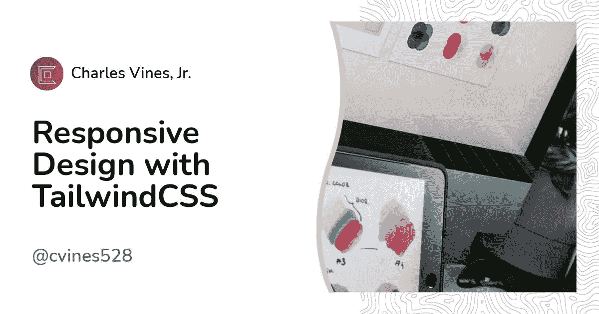
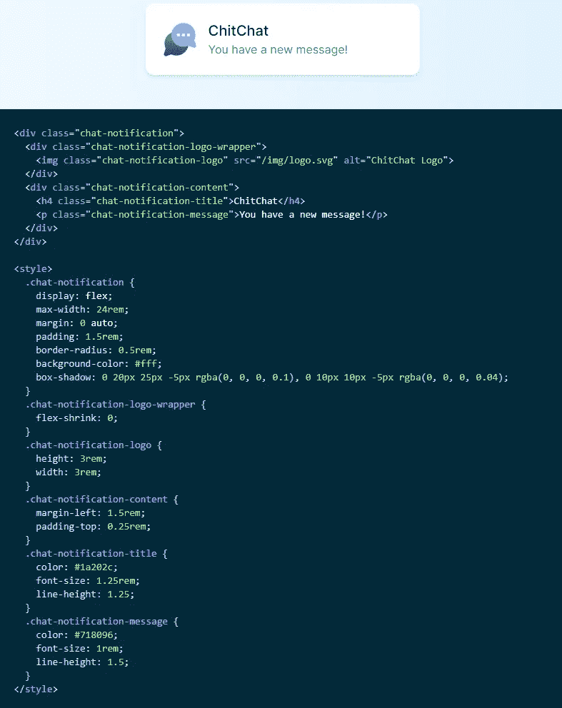
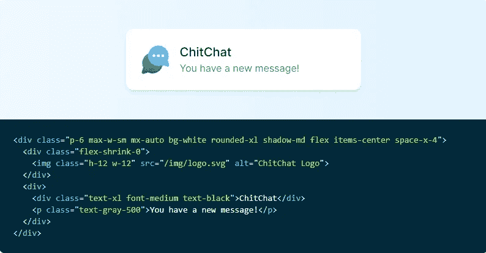
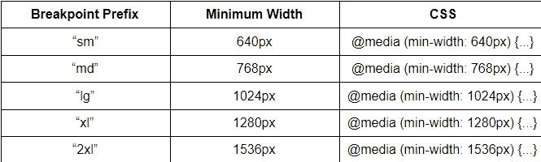

# 带尾翼的响应式设计

> 原文：<https://blog.devgenius.io/responsive-design-with-tailwindcss-df115e8e2f96?source=collection_archive---------8----------------------->

# 介绍

响应式设计在研究代码时，不管是框架、语言还是项目，似乎总有一些东西在讨论响应式设计。这到底是什么意思？全知网站维基百科将其定义为:

“一种网页设计方法，使网页能够在各种设备和窗口或屏幕尺寸(从最小到最大显示尺寸)上很好地呈现。”

因此，无论用户选择使用什么设备，我们都希望通过我们的项目构建自适应的用户界面。通常对于普通的 CSS，我们使用媒体查询并为每个断点设置合适的样式。当从头开始做的时候，这可能是令人厌倦和乏味的，但是有了 tailwind，这是超级简单的。Tailwind 通过使用响应实用程序变体使它变得超级简单。

# 实用程序变体

但是这到底是什么意思呢？Tailwind 是一个实用程序优先的 CSS 框架，这意味着从一组受限的原始实用程序构建复杂的组件。下面你会发现图 1.1 和图 1.2 展示了两种编写 CSS 的方法。两者都可以在[顺风文件](https://tailwindcss.com/docs/utility-first)中找到。

图 1.1

图 1.1 做了很多事情只是为了制作一个简单的警告框。这并不可怕，但是你可以想象随着项目的增长，你的代码也会增长。现在，您必须考虑创建新的类名，记住您使用了哪些类名，然后最重要的是，您必须使每个元素能够响应多种屏幕尺寸。接下来我们来看图 1.2，我们会看到一些非常不同的东西。

图 1.2

图 1.2 显示了我们可以清理多少。不用再为每个元素编写复杂的类名或多行代码，同时仍然实现完全定制的组件设计。对我来说另一个巨大的好处是做出改变看起来更安全。当你使用全局 CSS 的时候，你可能永远不知道你做了什么改变。因为 HTML 类是本地的，所以这意味着您是专门为该元素而不是其他元素设置样式规则。这对容器类有很大的帮助。当我第一次开始学习 css 的时候，我花了几个小时来弄清楚规则、层次和特殊性。不是说这些事情不重要，但是我们真的想把宝贵的时间花在与 css flexbox 在注册模式上的斗争上吗？我认为我们的时间在其他地方会更好。

# 断点

如果使用实用程序有助于使设计变得轻而易举，那么设置我们的响应式设计也同样简单。如果我们想利用 tailwind 的响应式实用程序变体，我们必须知道 5 个断点前缀。这 5 个是:

图 1.3

添加断点实用程序时，您只需添加断点名称，后跟一个冒号(:)，然后添加当屏幕大小达到最小断点时想要覆盖的实用程序。下面是一个例子:

现在，这看起来是不是比用 80 行代码来改变特定屏幕尺寸的特定元素要简单得多？如前所述，为一个元素使用一个示例可能听起来不多，但当您处理大型项目时，会有针对多个不同屏幕大小的多个更改，这种样式化方法可能会根据项目大小节省您的时间。

# 移动优先

Tailwind 使用移动第一断点系统，这意味着无前缀的实用程序在所有屏幕大小上都有效，而有前缀的实用程序(使用“sm”或更大的)只在指定的断点及以上位置有效。鉴于消费者使用互联网的方式，无论如何，你都应该使用移动优先的方法来构建应用。

因此，当您编写代码时，请确保使用这种方法:

把它敲进你的脑袋。使用无前缀的实用程序来定位移动设备，并在较大的断点处覆盖它们。

例如，您可以使用我的 [pokedex web 应用程序](https://svelte-pokedex.vercel.app/)(仍在工作)来查看和操作，并调整屏幕大小，看看布局如何变化。

了解更多关于顺风响应式设计的信息，或者只是了解更多关于顺风本身的信息，看看这里的文档。

【http://datboibecoding.com】最初发表于**。**