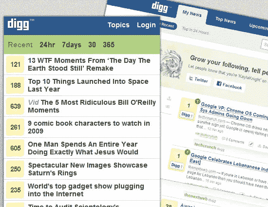
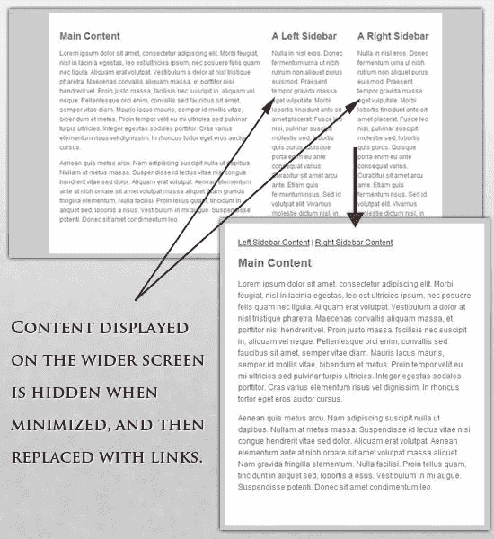

# 🚀响应式网页设计🚀:您为什么应该关注

> 原文：<https://blog.devgenius.io/responsive-web-design-why-to-care-63a83299e412?source=collection_archive---------4----------------------->

## WEB 开发

## 响应式网页设计可以让你大大节省资金，而不是为每个分辨率绘制一个新的设计。


来源:[期限](http://tenor.com)

响应式布局根据用户的行为、平台、屏幕大小和设备方向来改变页面的设计，是现代 web 开发不可或缺的一部分。它可以让你大大节省资金，而不是为每个分辨率绘制一个新的设计，而是改变单个元素的大小和位置。

这篇文章将讨论网站的基本元素以及如何调整它们。

# 屏幕分辨率调整

原则上，你可以把设备分成不同的类别，分别为每一种设备排版，但这需要太长的时间，谁知道五年后会是什么样的标准？此外，根据统计，我们有一系列不同的决议:


来源:[翡翠设计](https://jadeinkdesign.wordpress.com/2012/12/03/responsive-web-design/)

很明显，我们不能继续为每个设备单独编码。但是我们能做什么呢？

# 👉解决方案 1—让一切都变得灵活

当然，这并不理想，但它修复了大多数问题。

这里的整个设计混合了[响应层](http://alistapart.com/article/fluidgrids)、[图像](http://unstoppablerobotninja.com/entry/fluid-images)，在某些地方还有智能标记。创建响应层是一种常见的做法，但响应图像并非如此。但是，如果您需要它们，请考虑以下技术:

*   [隐藏和显示部分图像](http://zomigi.com/blog/hiding-and-revealing-portions-of-images/)；
*   [创建滑动合成图像](http://zomigi.com/blog/creating-sliding-composite-images/)；
*   [随布局缩放的前景图像](http://zomigi.com/blog/foreground-images-that-scale-with-the-layout/)

要了解更多信息，我推荐你去看看 Zoe Mickley Gillenwater 的书《灵活的网页设计:用 CSS 创建流畅的布局》，并阅读章节[《创建灵活的图像】](http://www.flexiblewebbook.com/bonus.html)。

[](http://www.flexiblewebbook.com/bonus.html) [## 用 CSS 创建流畅而有弹性的布局

### 通过这个样本和额外的材料，可以窥见这本书的内容。了解四种基本类型的…

www.flexiblewebbook.com](http://www.flexiblewebbook.com/bonus.html) 

如果缩小整个图像，标签将变得不可读。因此，为了保留徽标，图片被分成两部分:第一部分(插图)用作背景，第二部分(徽标)按比例调整大小。

元素`h1`包含一个图像作为背景，图像与容器(header)的背景对齐。

# 👉解决方案 2 —灵活的映像

使用响应式设计时，处理图像是最大的挑战之一。有许多调整图像大小的方法，其中大多数实现起来相当简单。一种解决方案是在 CSS 中使用 max-width:

图像的最大宽度是屏幕或浏览器窗口宽度的 100%，因此宽度越小，图片就越小。注意这是 IE 不支持的`max-width`，所以用`width: 100%`。

所提出的方法是创建响应图像的好选择，但是通过仅改变大小，我们将保持图像权重不变，这将增加移动设备上的加载时间。

# 👉解决方案#3 —响应式图像

这项技术由 Filament Group 提出，不仅可以调整图像大小，还可以压缩小屏幕上图像的分辨率，以加快加载速度。


来源:[tproger](http://tprogger.ru)

这项技术需要在 [Github](https://github.com/filamentgroup/Responsive-Images) 上提供几个文件。首先，我们抓取 JavaScript 文件( ***rwd-images.js*** )、 ***。htaccess*** 文件，以及 ***rwd.gif*** (图片文件)。然后我们使用一点 HTML 来链接高分辨率和低分辨率:首先是一个带有**T22 的小图片。r** 前缀(表示图像应该有响应)，然后链接到带有`data-fullsrc`的大图像:

对于任何比 **480 px** 宽的屏幕，一个高分辨率的图像(*)会被*加载*，在小屏幕上(***【smallRes.jpg***)。*

# *👉iPhone 的一个有趣功能*

*iPhone 和 iPod Touch 有一个特殊的功能:为大屏幕设计的设计只是在小分辨率的浏览器中缩小，没有滚动或额外的移动布局。但是，图像和文本将不可见:*

**

*来源: [tprogger](http://tprogger.ru)*

*为了解决这个问题，使用了标记`meta`:*

*如果`initial-scale`等于 1，图像的宽度就等于屏幕的宽度。*

# *👉可定制的页面布局结构*

*对于显著的页面大小更改，通常可能需要更改元素的布局。这可以通过单独的样式表方便地完成，或者更有效地通过 CSS 媒体查询来完成。这不应该是一个问题，因为大多数风格将保持不变，只有少数会改变。*

*例如，您有一个主文件，它的样式指定了`#wrapper`、`#content`、`#sidebar`、`#nav`以及颜色、背景和字体。如果您的主要样式使布局太窄、太短、太宽或太高，您可以定义并包含新的样式。*

****style . CSS(main)****:**

****【mobile . CSS】****:**

**

*来源: [tprogger](http://tprogger.ru)*

*在宽屏显示器上，左侧面板和右侧面板在侧面非常合适。在较窄的屏幕上，这些块一个位于另一个的下面，以便于使用。*

# *👉CSS3 媒体查询*

*让我们看看如何使用 CSS3 媒体查询来创建响应式设计。`min-width`设置将应用特定样式的浏览器窗口或屏幕的最小宽度。如果任何值低于`min-width`，样式将被忽略。`max-width`适得其反。*

***例如:***

*媒体查询只有在其`min-width`大于或等于 **600 px** 时才有效。*

*在这种情况下，当屏幕宽度小于或等于 **600 px** 时，(***ClassforSmallscreens***)类将会工作。*

*虽然`min-width`和`max-width`可以应用于屏幕宽度和浏览器窗口的宽度，但我们可能只需要处理设备宽度。例如，忽略在小窗口中打开的浏览器。为此，您可以使用`min-device-width`和`max-device-width`:*

*具体到 iPad，媒体查询有一个*方向*属性，可以是*横向*(水平)或*纵向*(垂直):*

*此外，可以组合媒体查询的值:*

*该代码仅适用于宽度为 **800 到 1200 px** 的屏幕或浏览器窗口。*

*您可以为不同的媒体查询值加载带有样式的特定工作表，如下所示:*

# *👉Java Script 语言*

*如果您的浏览器不支持 CSS3 媒体查询，那么可以使用 **jQuery** 安排样式的替换:*

# *👉可选内容显示*

*能够缩小和交换元素以适应小屏幕是很棒的。但这不是最好的选择。对于移动设备，通常会有更广泛的变化:更容易的导航，更集中的内容，列表，或者以行代替列。*

**

*来源: [digg](http://digg.com)*

*幸运的是，CSS 给了我们以难以置信的轻松来显示和隐藏内容的能力。*

```
*display: none;*
```

*`display: none`用于隐藏对象。*

***示例:***

**

*来源: [tprogger](http://tprogger.ru)*

*以下是我们的标记:*

*在主样式表中，我们改变了列引用，因为我们有足够大的屏幕来显示所有的内容。*

****style . CSS(main)****:**

*现在我们隐藏列并显示链接:*

****mobile.css(简体)*** *:**

*例如，如果屏幕尺寸减小，您可以使用脚本或替代样式文件来增加空白或替换导航，以便更方便。因此，有了隐藏和显示元素、调整图片大小、元素大小等功能，您可以将设计应用于任何设备和屏幕。*

# *阅读更多*

**如果您认为本文有用，请点击💚或者👏点击下面的按钮或分享关于脸书的文章，这样你的朋友也可以从中受益。**