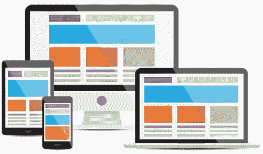

# 通过 CSS 进行响应

> 原文：<https://blog.devgenius.io/responsiveness-through-css-e92fa7d14c6d?source=collection_archive---------11----------------------->


有求必应是什么意思？首先，想想你在不同设备上访问一个网站的次数。例如，台式显示器、笔记本电脑或电话。在所有这些情况下，您可能已经注意到每个设备的格式是不同的。关于网页设计/开发的所有事情，它是关于创建一个根据设备屏幕大小格式化的网站。因为人们可以从如此多的设备访问你的应用或网站，我们必须考虑到这一点，并确保我们的内容对这些设备做出**响应**。例如，请看下图。



为什么让内容具有响应性很重要？


让你的内容具有响应性的最重要的原因是避免像左边的电话这样的东西。可能发生的最糟糕的事情是你的内容实际上被裁剪了！然而，这不仅仅是让你的内容适合网站。这不仅仅是让你的内容具有响应性，而是尽可能地具有响应性。


你觉得哪个反应更快，为什么？不要只看 X，查底部就当理由！看上图左边的手机。虽然这些元素似乎都没有被裁剪，但想象一下，为了使用一个网站，必须不断缩放和调整。你可能不会花太多时间去另一个看起来更像右边的类似网站。所有的元素都成比例地变大，所以你不必不断地放大。

一旦你学会了 CSS，你将开始学习有几种方法可以做到这一点。一种方法是对 px 进行硬编码，但这可能需要大量的工作，即使这样，它也有自己的局限性。我们可以做的一件事是使用*百分比*。例如，假设您想要一个适合浏览器屏幕的图像。而不是做类似`img { width: 1000px px}`的事情。如果浏览器的宽度大于 1000 像素，您的图像会显得太小。如果你的浏览器尺寸小于 1000 像素，你的图像会被裁剪。如果我们不能使用百分比，你将不得不对每一个可能的宽度进行硬编码，或者创建一些迂回的方法来处理它。做`img { width: 100% }`会更简单。

你可能听说过或遇到过一个叫媒体查询的东西。这就是我们处理不同浏览器、设备等的方式。媒体查询允许我们在满足特定条件的情况下更改内容中的元素。比如我要引用 w3schools 的这个[例子](https://www.w3schools.com/css/tryit.asp?filename=trycss_mediaqueries_fontsize)。

```
@media only screen and (min-width: 601px) {
 div.example {
  font-size: 80px;
 }
}@media only screen and (max-width: 600px) {
 div.example {
  font-size: 30px;
 }
}
```

在本例中，如果浏览器宽度等于或小于 600 像素，则字体大小为 30 像素。如果浏览器宽度超过 600 像素，字体大小将为 80 像素。这只是你对媒体提问的无限可能性之一。

**结论**

总的来说，创建尽可能响应迅速的内容，为用户创造最佳体验，这是势在必行的。另外，你可以用它制作一个非常酷的用户界面。查看下面的文档和示例链接。

[](https://developer.mozilla.org/en-US/docs/Web/CSS/Media_Queries/Using_media_queries) [## 使用媒体查询

### 当您想要根据设备的常规类型(如打印等)修改您的站点或应用程序时，媒体查询非常有用

developer.mozilla.org](https://developer.mozilla.org/en-US/docs/Web/CSS/Media_Queries/Using_media_queries) [](https://www.w3schools.com/css/css_rwd_mediaqueries.asp) [## 响应网页设计媒体查询

### 媒体查询是 CSS3 中引入的 CSS 技术。它使用@media 规则来包含 CSS 属性块，前提是…

www.w3schools.com](https://www.w3schools.com/css/css_rwd_mediaqueries.asp)