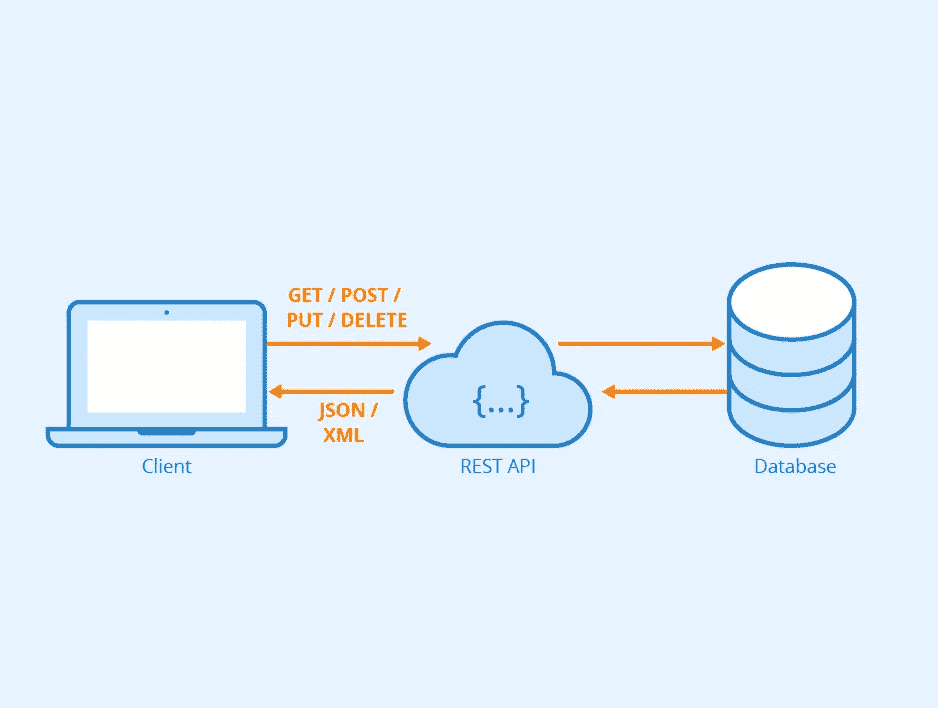

# REST API 设计最佳实践

> 原文：<https://blog.devgenius.io/rest-api-design-best-practices-1a1d5cd6ff48?source=collection_archive---------6----------------------->

作为 RESTful API 进行设计是我们作为 web 开发人员已经习惯的事情，有时我们会蒙着眼睛去做。但是 REST APIs 不仅仅是一个简单的 200 JSON 体响应。

你看，当我们学习 REST 时，我们明确地发现我们可以使用 HTTP 方法(动词)来表达不同的操作，但是有一些细节会使你的 API 更容易理解，更现代，更企业级。



# 回到基础:HTTP

为了更好的设计 REST API，你最好了解 HTTP 协议基础知识，可以查看这个[链接](https://developer.mozilla.org/en-US/docs/Web/HTTP/Overview)了解更多。下面是设计 REST API 之前必须知道的一些事情:

*   HTTP 有**动词**(或方法):GET、POST、PUT、PATCH 和 DELETE 是最常见的。
*   REST 是**面向资源的**，一个资源用一个 **URI** : `/articles/`来表示。
*   **端点**是动词和 URI 的组合，例如`GET: /articles/`。
*   端点可以被解释为对资源的**动作。例如，`POST: /articles/`可能意味着“创造一篇新文章”。**
*   在高层次上，**动词映射到 CRUD 操作** : `GET`表示`Read` , `POST`表示`Create` , `PUT`和`PATCH`表示`Update`,`DELETE`表示...嗯，`Delete`。
*   响应的状态由其**状态代码**指定:`1xx`表示信息，`2xx`表示成功，`3xx`表示重定向，`4xx`表示客户端错误，`5xx`表示服务器错误。

当然，您可以使用 HTTP 协议为 REST API 设计提供的任何东西，但是我认为这些是您需要记住的基本内容。

# 避免纯文本

它显然不是 REST 架构风格强加的，但它们大多使用 JSON 作为数据格式。

如果你认为只返回普通数据就够了，那你就错了，你必须把`**Content-Type**`头也指定为！必须将其设置为值`**application/json**`。

# URIs 工艺

永远不要在 URIs 使用动词，因为你知道 HTTP 方法是动词，所以在你的 URI 中使用动词会显得很尴尬。确保你遵循面向资源的 REST 原则。

使用 HTTP 协议动词来描述在 URI 中定义的所需资源上的操作。

# 复数名词

设计 RESTful API 时，避免使用单数名词来描述资源。请始终将 URI 中的资源视为包含一个或多个相同类型资源的存储库。所以一定要使用复数名词(例如: ***/articles/{id}*** 而不是**/article/{ id }**)。

# 总结你的回答

将您返回的响应包装在一个标准模型中，这将使客户能够在出现问题时知道哪里出错了，并确保您的基线模型结构在数据改变时不会改变。

例如，当使用分页时，使用定义偏移量和页面大小的模型。始终确保您的数据可以通过相同的字段访问，例如:

For GET:/articles？offset=40&limit=10 我们得到:

```
{
  "error": null,
  "didError": false,
  "model": [{
    "title": "I am a test data",
     ...,
  }],
  "offset": 40,
  "limit": 10,
}
```

获取:/articles/156

```
{
  "error": null,
  "didError": false,
  "model": {
    "title": "I am a test data",
  }
}
```

对于 PUT: /articles/156

```
{
  "error": null,
  "didError": false,
  "model": {
    "title": "I am a test data",
  }
}
```

您可以看到，第一个模型将在所有分页列表响应中使用，而另一个模型将在所有单条目响应中使用。

# 状态码是你的朋友

这非常重要，因为所有 HTTP 客户端都依赖于此，请确保您正确使用标准 HTTP 状态代码范围。这意味着您可以使用授权的范围，最重要的是根据用例来使用它们。

在 REST API 设计中，建议您将这些代码用于不同的操作:

```
GET: 200 OK
POST: 201 Created
PUT: 200 OK
PATCH: 200 OK
DELETE: 204 No Content
```

# 避免资源嵌套

REST APIs 处理资源，检索资源的列表或单个实例非常简单。这在使用关系时很常见，当你得到一个 id=1 的用户的文章列表时，你想到的第一件事就是使用这样的 URI“/authors/1/articles”。实际上不建议这样做，因为您的第一意图是返回由用户 1 创作的文章，由此我们可以推断它是一个过滤器。我的朋友，过滤器总是在查询字符串中传递。

所以你最终的 URI 会是这样的？authorId=1。

# 过滤和分页

我想更深入地了解细节，因为我可以给出一篇[文章](https://www.moesif.com/blog/technical/api-design/REST-API-Design-Filtering-Sorting-and-Pagination/),通过示例和最重要的不同方法及其优缺点来明智地解决这个特性。

我想让你知道的是，分页和过滤总是在查询字符串中完成。

# HTTP 中的警察

当处理 API 中的安全错误时，很容易混淆错误是与**认证**还是**授权**(也称为许可)相关，这种情况在我身上经常发生。

以下是我的备忘单，让你知道我根据具体情况在处理什么:

*   用户是否没有提供身份验证凭据？它们无效吗？👉`401 Unauthorized`。
*   用户的身份验证是否正确，但他们没有访问资源所需的权限？👉`403 Forbidden`。

# 使用 202 进行未来处理

我发现`202 Accepted`是`201 Created`的一个非常方便的替代品。它基本上意味着:

我，服务器，已经理解了你的要求。我还没有创建资源，但这很好。

有两种情况我觉得`202 Accepted`特别适合:

*   如果资源将作为未来处理的结果而创建，例如在作业完成之后。
*   如果资源已经以某种方式存在，但是这不应该被解释为错误。

# 结论

在本文中，我们只讨论了 REST API 设计中的基础知识，您可以在 google 中找到更好的资源，这些资源通过更多的示例甚至是示例项目来深入探讨这个主题。

享受设计一个采用良好语义、常识和简单性的 API 的乐趣。

# 参考

[](https://developer.mozilla.org/en-US/docs/Web/HTTP/Overview) [## HTTP 概述

### HTTP 是网络上任何数据交换的基础，它是一个客户机-服务器协议，这意味着请求是…

developer.mozilla.org](https://developer.mozilla.org/en-US/docs/Web/HTTP/Overview) [](https://www.moesif.com/blog/technical/api-design/REST-API-Design-Filtering-Sorting-and-Pagination/) [## REST API 设计:过滤、排序和分页

### 无论 API 是公共的还是内部使用的，API 设计正在成为 API 产品策略的核心支柱。很好…

www.moesif.com](https://www.moesif.com/blog/technical/api-design/REST-API-Design-Filtering-Sorting-and-Pagination/)