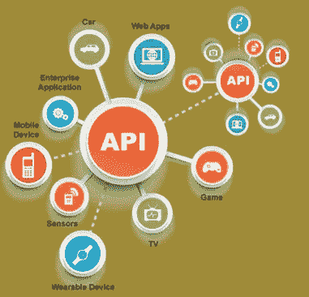

# REST API 开始流行

> 原文：<https://blog.devgenius.io/rest-api-gaining-popularity-785e36c4b30?source=collection_archive---------30----------------------->

最近几年，REST 设计模式出现了，它为客户机和服务器提供了新的好处。在[上，服务器端 REST 扩展](http://entradasoft.com/blogs/rest-api-gaining-popularity)并且性能优于 SOAP。使用 SOAP，解析每个请求并将其路由到本地 web 服务功能实现会有很大的开销。而 REST 利用标准的 HTTP/S 请求，不需要复杂的 SOAP 信封数据重新打包。

全篇:【http://entradasoft.com/blogs/rest-api-gaining-popularity】
T3

## 什么是 API？

[应用程序接口](http://entradasoft.com/blogs/rest-api-gaining-popularity) (API)是一组用于构建软件应用的例程、协议和工具。基本上，API 规定了软件组件应该如何交互。换句话说，API 是一个信使，它将您的请求传递给请求它的提供者，然后将响应传递给您

## 我们为什么需要 API？

[移动设备应用的发展](http://entradasoft.com/blogs/rest-api-gaining-popularity)意味着组织需要允许用户通过应用而不仅仅是通过互联网来访问信息。在公共部门中，API 用于允许机构轻松共享信息，也让公众与政府互动。API 的重要性从技术的角度来看，它们允许一个计算机程序的能力被另一个使用。它们是两个不同程序进行通信的一种方式。

## 什么是 REST API？

REST API 以类似的方式工作。您搜索一些东西，然后从您请求的服务返回一个结果列表。开发人员在服务器上创建 API，并允许客户端与之对话。REST 决定了 API 的外观。它代表“代表性状态转移”。REST 或 RESTful APIs 被设计成利用现有的协议。虽然 REST 或[表述性状态转移](http://entradasoft.com/blogs/rest-api-gaining-popularity)几乎可以在任何协议上使用，但当用于 web APIs 时，它通常利用 HTTP。REST APIs 的一个关键优势是它们提供了很大的灵活性。

# REST 架构的原则

**统一接口:**

REST API 中资源的概念定义了用户可以将任何信息或任何模块定义为资源。当我们想到 [RESTful 架构](http://entradasoft.com/blogs/rest-api-gaining-popularity)时，一切都可以被认为是资源。例如，如果您试图创建一个员工管理系统的应用程序。这个应用程序可以在任何平台上使用任何语言创建。类似地，任何数据库都可以用来处理后端服务。

**无国籍:**

在 RESTful 架构中，所有的响应和请求，所有服务器之间的通信都是无状态的。这意味着服务器不维护系统的任何状态，因此客户端必须发送一个本身完整的请求。该请求不依赖于先前提出的任何请求。

**可缓存:**

在 RESTful 架构的情况下，所有的缓存都发生在客户端。每当客户端向服务器发送请求时，服务器都会返回包含实际数据和其他元数据的响应，这些元数据告诉客户端是否必须在本地存储响应。

**分层系统:**

REST 原则指出，每当客户端和服务器之间有通信时，中间可以有多个层，这些层可以用于许多目的，如消息翻译以提高性能、缓存和许多其他东西。

**按需编码:**

这是 RESTful Web 服务的一个可选约束，当用户发送一个请求来获得一个响应时，它就会起作用。响应能够在客户端运行一些代码；这个原则扩展了正在发生的通信的功能。

REST 比 SOAP 等其他方法简单得多，这使得开发人员在 HTTP 请求操作方面不必重新发明轮子。SOAP 还需要独立的服务器和客户端程序。

因为 [REST 是基于标准的 HTTP](http://entradasoft.com/blogs/rest-api-gaining-popularity) 操作，所以它使用了具有特定含义的动词，比如“get”或“delete ”,这样可以避免歧义。资源被分配给单独的 URIs，增加了灵活性。

有了 REST，生产和消费的信息与促进生产和消费的技术分离开来。因此，REST 表现良好，高度可伸缩，简单，易于修改和扩展。

更多阅读:
[http://entradasoft.com/blogs/rest-api-gaining-popularity](http://entradasoft.com/blogs/rest-api-gaining-popularity)