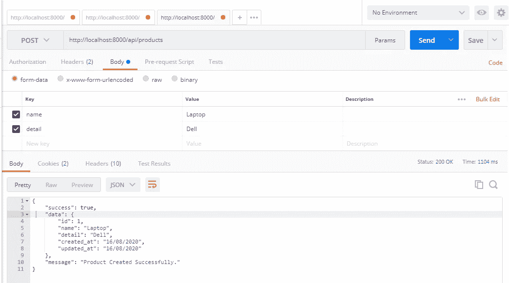

# Laravel 中的 REST API

> 原文：<https://blog.devgenius.io/rest-api-in-laravel-354d755a553a?source=collection_archive---------1----------------------->

朋友们好，

今天我将向大家介绍 REST API，REST API 是一个应用程序接口，它使用 HTTP 请求来获取、上传、发布和删除数据。

在本教程中，我将使用 REST API 执行 CRUD 操作，您可以学习如何在 laravel 6/7 应用程序中使用 passport 创建带身份验证的 REST API。这里我们将从 API 获取数据。

Laravel 提供了创建 API 的简单方法。如果您的应用程序中有身份验证，那么您可以使用 passport 轻松完成。Laravel Passport 提供了创建验证用户身份令牌的方法。如果你一步一步地遵循下面的例子，那么你一定会得到输出。

```
Step 1 : Install Laravel
Step 2 : Install Passport
Step 3 : Passport Configuration
Step 4 : Add Table and Model
Step 5 : Create API Routes
Step 6 : Create Controller
Step 7 : Create Eloquent API Resources
```

> ***第一步:安装 Laravel***

在终端中键入以下命令创建新项目。

```
composer create-project --prefer-dist laravel/laravel REST_API
```

> ***第二步:安装护照***

现在，我们需要通过 Composer 软件包管理器安装 passport，所以在您的终端中运行以下命令:

```
composer require laravel/passport
```

安装软件包后，我们需要获得默认迁移，以便在我们的数据库中创建新的 passport 表。所以运行下面的命令。

```
php artisan migrate
```

现在，我们将使用 passport:install 命令安装 passport，它将为安全性创建令牌密钥。

```
php artisan passport:install
```

> ***第三步:护照配置***

现在，我们必须在三个地方配置模型、服务提供者和授权配置文件。

1) **在**用户模型**中增加了 Passport 的**hasa pitokens 类，

在 **app/User.php** 中添加以下代码

```
<?phpnamespace App;use Illuminate\Contracts\Auth\MustVerifyEmail;
use Illuminate\Foundation\Auth\User as Authenticatable;
use Illuminate\Notifications\Notifiable;
use Laravel\Passport\HasApiTokens;class User extends Authenticatable implements MustVerifyEmail
{
    use Notifiable,HasApiTokens; /**
     * The attributes that are mass assignable.
     *
     * @var array
     */
    protected $fillable = [
        'name', 'email', 'password',
    ]; /**
     * The attributes that should be hidden for arrays.
     *
     * @var array
     */
    protected $hidden = [
        'password', 'remember_token',
    ]; /**
     * The attributes that should be cast to native types.
     *
     * @var array
     */
    protected $casts = [
        'email_verified_at' => 'datetime',
    ];
}
```

2)在 **AuthServiceProvider** 中，我们添加了“ **Passport::routes()**

在下面添加代码**app/Providers/authserviceprovider . PHP**

```
<?phpnamespace App\Providers;use Illuminate\Foundation\Support\Providers\AuthServiceProvider as ServiceProvider;
use Illuminate\Support\Facades\Gate;
use Laravel\Passport\Passport;class AuthServiceProvider extends ServiceProvider
{
    /**
     * The policy mappings for the application.
     *
     * @var array
     */
    protected $policies = [
        'App\Model' => 'App\Policies\ModelPolicy',
    ]; /**
     * Register any authentication / authorization services.
     *
     * @return void
     */
    public function boot()
    {
        $this->registerPolicies(); //
    }
}
```

3)我们在**auth.php**中增加了 **api auth** 配置。

在 **config/auth.php** 中添加下面的代码。

```
<?phpreturn [ 'guards' => [
        'web' => [
            'driver' => 'session',
            'provider' => 'users',
        ], 'api' => [
            'driver' => 'passport',
            'provider' => 'users',            
        ],
    ],
];
```

> ***第四步:添加表格和模型***

在这一步中，我们将使用 php artisan 命令创建**产品**表的迁移，因此，在您的终端中运行以下命令:

```
php artisan make:migration create_products_table
```

运行上述命令后，您将在此路径中找到迁移**数据库/迁移**。因此，在您的迁移文件中添加以下代码来创建 products 表。

```
<?phpuse Illuminate\Database\Migrations\Migration;
use Illuminate\Database\Schema\Blueprint;
use Illuminate\Support\Facades\Schema;class CreateProductsTable extends Migration
{
    /**
     * Run the migrations.
     *
     * @return void
     */
    public function up()
    {
        Schema::create('products', function (Blueprint $table) {
            $table->id();
            $table->string('name');
            $table->text('detail');
            $table->timestamps();
        });
    } /**
     * Reverse the migrations.
     *
     * @return void
     */
    public function down()
    {
        Schema::dropIfExists('products');
    }
}
```

现在，在终端中运行下面的代码来创建迁移。

```
php artisan migrate
```

并在 **app/Product.php** 文件中添加以下代码

```
<?phpnamespace App;use Illuminate\Database\Eloquent\Model;class Product extends Model
{
    protected $fillable = [
        'name', 'detail'
    ];
}
```

> ***第五步:创建 API 路由***

在步骤 5 中，我们将创建 api 路由。Laravel 为编写 web 服务路径提供了 api.php 文件。所以，让我们在 **routes/api.php 文件中添加 route。**

```
<?phpuse Illuminate\Http\Request;
use Illuminate\Support\Facades\Route;Route::middleware('auth:api')->get('/user', function (Request $request) {
    return $request->user();
});Route::post('register', 'API\RegisterController@register');
Route::post('login', 'API\RegisterController@login');

Route::middleware('auth:api')->group( function () {
    Route::resource('products', 'API\ProductController');
});
```

> ***第六步:创建控制器***

现在，我已经在 api 文件夹中创建了 **BaseController、ProductController** 和 **RegisterController** 。

**app/Http/Controllers/API/base controller . PHP**

```
<?phpnamespace App\Http\Controllers\API;use App\Http\Controllers\Controller;
use Illuminate\Http\Request;class BaseController extends Controller
{
    public function sendResponse($result, $message)
    {
    	$response = [
            'success' => true,
            'data'    => $result,
            'message' => $message,
        ];
        return response()->json($response, 200);
    } public function sendError($error, $errorMessages = [], $code = 404)
    {
    	$response = [
            'success' => false,
            'message' => $error,
        ]; if(!empty($errorMessages)){
            $response['data'] = $errorMessages;
        }

        return response()->json($response, $code);
    }}
```

**app/Http/Controllers/API/product controller . PHP**

```
<?phpnamespace App\Http\Controllers\API;use App\Http\Controllers\Controller;
use Illuminate\Http\Request;
use App\Product;
use Validator;
use App\Http\Controllers\API\BaseController as BaseController;
use App\Http\Resources\Product as ProductResource;class ProductController extends BaseController
{
    /**
     * Display a listing of the resource.
     *
     * @return \Illuminate\Http\Response
     */
    public function index()
    {
        $products = Product::all(); return $this->sendResponse(ProductResource::collection($products), 'Products Retrieved Successfully.');
    } /**
     * Show the form for creating a new resource.
     *
     * @return \Illuminate\Http\Response
     */
    public function create()
    {

    } /**
     * Store a newly created resource in storage.
     *
     * @param  \Illuminate\Http\Request  $request
     * @return \Illuminate\Http\Response
     */
    public function store(Request $request)
    {
        $input = $request->all();

        $validator = Validator::make($input, [
            'name' => 'required',
            'detail' => 'required'
        ]);

        if($validator->fails()){
            return $this->sendError('Validation Error.', $validator->errors());       
        }

        $product = Product::create($input);

        return $this->sendResponse(new ProductResource($product), 'Product Created Successfully.');
    } /**
     * Display the specified resource.
     *
     * @param  int  $id
     * @return \Illuminate\Http\Response
     */
    public function show($id)
    {
        $product = Product::find($id);

        if (is_null($product)) {
            return $this->sendError('Product not found.');
        }

        return $this->sendResponse(new ProductResource($product), 'Product Retrieved Successfully.');
    } /**
     * Show the form for editing the specified resource.
     *
     * @param  int  $id
     * @return \Illuminate\Http\Response
     */
    public function edit($id)
    {
        //
    } /**
     * Update the specified resource in storage.
     *
     * @param  \Illuminate\Http\Request  $request
     * @param  int  $id
     * @return \Illuminate\Http\Response
     */
    public function update(Request $request, $id)
    {
        $input = $request->all();

        $validator = Validator::make($input, [
            'name' => 'required',
            'detail' => 'required'
        ]);

        if($validator->fails()){
            return $this->sendError('Validation Error.', $validator->errors());       
        }
        $product = Product::find($id);   
        $product->name = $input['name'];
        $product->detail = $input['detail'];
        $product->save();

        return $this->sendResponse(new ProductResource($product), 'Product Updated Successfully.');
    } /**
     * Remove the specified resource from storage.
     *
     * @param  int  $id
     * @return \Illuminate\Http\Response
     */
    public function destroy($id)
    {
        $product = Product::find($id);
        $product->delete();

        return $this->sendResponse([], 'Product Deleted Successfully.');
    }
}
```

**app/Http/Controllers/API/register controller . PHP**

```
<?phpnamespace App\Http\Controllers\API;use App\Http\Controllers\Controller;
use Illuminate\Http\Request;
use App\Http\Controllers\API\BaseController as BaseController;
use App\User;
use Illuminate\Support\Facades\Auth;
use Validator;class RegisterController extends BaseController
{
    public function register(Request $request)
    {
        $validator = Validator::make($request->all(), [
            'name' => 'required',
            'email' => 'required|email',
            'password' => 'required',
            'c_password' => 'required|same:password',
        ]);

        if($validator->fails()){
            return $this->sendError('Validation Error.', $validator->errors());       
        }

        $input = $request->all();
        $input['password'] = bcrypt($input['password']);
        $user = User::create($input);
        $success['token'] =  $user->createToken('MyApp')->accessToken;
        $success['name'] =  $user->name;

        return $this->sendResponse($success, 'User register successfully.');
    } public function login(Request $request)
    {
        if(Auth::attempt(['email' => $request->email, 'password' => $request->password])){ 
            $user = Auth::user(); 
            $success['token'] =  $user->createToken('MyApp')->accessToken; 
            $success['name'] =  $user->name;
            return $this->sendResponse($success, 'User login successfully.');
        } 
        else{ 
            return $this->sendError('Unauthorised.', ['error'=>'Unauthorised']);
        } 
    }
}
```

> ***第七步:创建口才 API 资源***

现在我们必须创建 api 资源，Laravel 的资源类允许我们有表现力地轻松地将我们的模型和集合转换成 JSON。

```
php artisan make:resource Product
```

现在，在这个**app/Http/Resources/product . PHP**路径上创建了新文件。

```
<?phpnamespace App\Http\Resources;use Illuminate\Http\Resources\Json\JsonResource;class Product extends JsonResource
{
    /**
     * Transform the resource into an array.
     *
     * @param  \Illuminate\Http\Request  $request
     * @return array
     */
    public function toArray($request)
    {
        return [
            'id' => $this->id,
            'name' => $this->name,
            'detail' => $this->detail,
            'created_at' => $this->created_at->format('d/m/Y'),
            'updated_at' => $this->updated_at->format('d/m/Y'),
        ];
    }
}
```

添加完所有代码后，我们就可以在 laravel 中运行完整的 restful api 了。

现在，我已经使用 **POSTMAN API** 进行测试， **Postman** 是 **API** 开发的协作平台。 **Postman 的**特性简化了构建 **API** 的每一步，并简化了协作，因此您可以更快地创建更好的**API**。

为了让你更好的理解，我在这里添加了一些描述邮递员的截图。

首先我们需要在 postman 中**注册来检查我们的例子。**

> **1 —注册 API:动词:GET，URL:http://localhost:8000/API/Register**


Laravel REST APIs 寄存器

> 在 postman 中成功注册后，我们需要在标题中添加访问令牌。


在标题中添加授权

> **3 —登录 API:动词:GET，URL:http://localhost:8000/API/log in**


Laravel REST APIs 登录

> **4 —创建产品 API:动词:GET，URL:http://localhost:8000/API/products**



Laravel REST APIs 创建

> **5 —产品更新 API:动词:PUT，URL:http://localhost:8000/API/products/{ id }**


Laravel REST APIs 更新

> **从 GitHub 下载代码:**[**Laravel-REST-API**](https://github.com/websolutionstuff/Laravel-REST-API)

最后，我们完成了代码，现在是时候在项目中实现了。

> **阅读还:** [**如何在 Laravel 中集成 Paypal 支付网关**](https://websolutionstuff.com/post/how-to-integrate-paypal-payment-gateway-in-laravel)

请不要忘记“**就像“**”、“**分享“**”和“**鼓掌”**。

感谢阅读！！