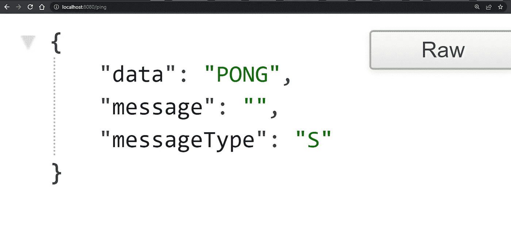

# Rest API 上传图片 Golang

> 原文：<https://blog.devgenius.io/rest-api-to-upload-images-go-2316de61db82?source=collection_archive---------2----------------------->


在本文中，我们将了解如何创建 rest api 来上传图像，我们还将确保我们的 api 也将处理多个图像上传，我们还将设置文件上传限制，这样就不会使我们的系统不稳定，因为长时间的文件上传会导致系统故障问题，所以最好为文件添加一个限制。 我们将确保我们只接受图像，因此我们还需要为我们的 api 添加文件类型检查，如果您希望图像和文档来自同一个 api，您可以删除类型检查过滤器，api 已准备好处理多种类型的文件。

让我们的 rest api 上传图片需要遵循的步骤。

*   创建存储库。
*   Setup go.mod
*   创建 main.go 文件
*   使用 gorilla mux 包设置 http 服务器。
*   创建 api。
*   用 http 处理程序连接 rest api。
*   测试 api。

让我们一步一步地创建成功的 rest api 来上传图像。

# 1.为我们的 rest api 创建一个存储库

首先，我们需要创建一个文件夹，在那里我们可以设置我们的代码库。

创建一个名为 *upload-images-rest-api* 的文件夹。下面是创建目录/文件夹的命令。

```
$ mkdir upload-images-rest-api
```

# 2.Setup go.mod

我们还需要在 *upload-images-rest-api* 文件夹中设置 go.mod 文件，这样我们就可以将我们的代码作为一个包/模块使用，下面是生成 go.mod 文件的命令。

```
$ go mod init upload-images-rest-api
```

如果您是 go 新手，那么您可能需要首先了解 Go 打包，以理解这个命令的作用。

# 3.创建 main.go 文件

在你的 *upload-images-rest-api* 文件夹中创建另一个名为 *main.go.* 的文件

```
$ touch main.go
```

现在我们已经创建了我们的 *main.go* 文件，现在我们可以开始开发我们的 http 服务器了。

# 4.使用 gorilla mux 包设置 http 服务器

为了创建服务器，我们将使用 [*gorilla mux*](https://github.com/gorilla/mux) 包，所以首先我们需要先下载包，然后我们可以开始开发。

下面是下载 gorilla mux 包的命令。

```
$ go get -u github.com/gorilla/mux 
```

安装 gorilla mux 后，我们可以开始开发我们的代码。

## 1.创建主函数。

首先我们需要编写 Go 的锅炉板代码，下面是代码。

```
package main

func main() {

}
```

截至目前，这是一个锅炉板代码，这就是为什么我们还没有任何包加载。

## 2.创建 HTTP 服务器。

下面是 http 服务器的代码。

```
package main

import (
    "log"
    "net/http"

    "github.com/gorilla/mux"
)

const PORT = "8080"

func main() {
    r := mux.NewRouter()
    r.HandleFunc("/ping", nil).Methods("GET")
    r.HandleFunc("/upload", nil).Methods("POST")

    log.Printf("Server is running on http://localhost:%s", PORT)
    log.Println(http.ListenAndServe(":"+PORT, r))
}
```

首先，我们添加了希望服务器运行的端口变量`8080`，在我们调用了`gorilla mux`包的`mux.NewRouter`函数的主函数中，然后我们创建了代码中提到的路由，还附加了它们的方法，正如你看到的，我们有两个 API， 第一个`/ping`是检查我们的服务器是否运行，第二个`/upload`是我们上传图像的主要工作，然后我们将我们的 mux 路由器传递给`http.ListenAndServe`函数，同时传递我们希望我们的服务器运行的端口。

如果您尝试运行服务器并测试任何 api，您会得到这样的错误，因为我们只是传递了路径，但对于提供的路径，没有处理程序可以读取并处理该请求。

```
2022/11/27 19:16:00 http: panic serving [::1]:56663: runtime error: invalid memory address or nil pointer dereference
goroutine 18 [running]:
net/http.(*conn).serve.func1()
        C:/Program Files/Go/src/net/http/server.go:1850 +0xbf
panic({0xe08000, 0x1025de0})
        C:/Program Files/Go/src/runtime/panic.go:890 +0x262
net/http.HandlerFunc.ServeHTTP(0xc000148000?, {0xebd248?, 0xc0001360e0?}, 0x800?)
        C:/Program Files/Go/src/net/http/server.go:2109 +0x1e
github.com/gorilla/mux.(*Router).ServeHTTP(0xc000130000, {0xebd248, 0xc0001360e0}, 0xc000096100)
        C:/Users/KDSINGH/go/pkg/mod/github.com/gorilla/mux@v1.8.0/mux.go:210 +0x1cf
net/http.serverHandler.ServeHTTP({0xc000088120?}, {0xebd248, 0xc0001360e0}, 0xc000096100)
        C:/Program Files/Go/src/net/http/server.go:2947 +0x30c
net/http.(*conn).serve(0xc00009e000, {0xebd680, 0xc000073320})
        C:/Program Files/Go/src/net/http/server.go:1991 +0x607
created by net/http.(*Server).Serve
        C:/Program Files/Go/src/net/http/server.go:3102 +0x4db
```

为了解决这个问题，让我们为我们的`/ping` api 创建一个 http 处理程序，它将被用作 api 心跳来检查服务器是否正在运行。

让我们为`/ping`路线添加处理程序:

```
func Ping(w http.ResponseWriter, r *http.Request) {
    answer := map[string]interface{}{
        "messageType": "S",
        "message":     "",
        "data":        "PONG",
    }
    w.Header().Set("Content-Type", "application/json")
    w.WriteHeader(200)
    json.NewEncoder(w).Encode(answer)
}
```

我们添加了`Ping`函数来处理`/ping`路由，在`Ping`函数中，我们添加了响应结构`map[string]interface`，这样我们就可以根据需要添加动态响应，我们不依赖于 struct。我们已经添加了`messageType, message`和`data`作为我们的响应，我们将为我们的`/upload` api 使用相同的响应 json，预计`data`将会转到具有多个字段的结构。

接下来，我们将编写头部内容类型和 http 代码，然后进行编码，并以 json 形式直接返回我们的响应。

## 3.将`Ping`功能添加到处理器中

现在我们有了我们的`Ping`函数，让我们把它添加到我们的`/ping`处理程序中。

```
r.HandleFunc("/ping", Ping).Methods("GET")
```

现在我们已经添加了我们的`Ping`处理程序，让我们测试 API。
你可以使用 postman 或者你的浏览器来测试 api，因为 ping 不接受任何参数，所以它也可以在浏览器上测试。

**邮递员:**


ping API-邮递员

**浏览器:**



ping api 浏览器

工作正常，现在是时候实现我们的主处理程序了。

# 4.创建 api 来上传图像

下面是上传图像 rest api 的完整代码

```
// handler to handle the image upload
func UploadImages(w http.ResponseWriter, r *http.Request) {
    // 32 MB is the default used by FormFile() function
    if err := r.ParseMultipartForm(BULK_FILE_SIZE); err != nil {
        http.Error(w, err.Error(), http.StatusInternalServerError)
        return
    }

    // Get a reference to the fileHeaders.
    // They are accessible only after ParseMultipartForm is called
    files := r.MultipartForm.File["file"]

    var errNew string
    var http_status int

    for _, fileHeader := range files {
        // Open the file
        file, err := fileHeader.Open()
        if err != nil {
            errNew = err.Error()
            http_status = http.StatusInternalServerError
            break
        }

        defer file.Close()

        buff := make([]byte, 512)
        _, err = file.Read(buff)
        if err != nil {
            errNew = err.Error()
            http_status = http.StatusInternalServerError
            break
        }

        // checking the content type
        // so we don't allow files other than images
        filetype := http.DetectContentType(buff)
        if filetype != "image/jpeg" && filetype != "image/png" && filetype != "image/jpg" {
            errNew = "The provided file format is not allowed. Please upload a JPEG,JPG or PNG image"
            http_status = http.StatusBadRequest
            break
        }

        _, err = file.Seek(0, io.SeekStart)
        if err != nil {
            errNew = err.Error()
            http_status = http.StatusInternalServerError
            break
        }

        err = os.MkdirAll("./uploads", os.ModePerm)
        if err != nil {
            errNew = err.Error()
            http_status = http.StatusInternalServerError
            break
        }

        f, err := os.Create(fmt.Sprintf("./uploads/%d%s", time.Now().UnixNano(), filepath.Ext(fileHeader.Filename)))
        if err != nil {
            errNew = err.Error()
            http_status = http.StatusBadRequest
            break
        }

        defer f.Close()

        _, err = io.Copy(f, file)
        if err != nil {
            errNew = err.Error()
            http_status = http.StatusBadRequest
            break
        }
    }
    message := "file uploaded successfully"
    messageType := "S"

    if errNew != "" {
        message = errNew
        messageType = "E"
    }

    if http_status == 0 {
        http_status = http.StatusOK
    }

    resp := map[string]interface{}{
        "messageType": messageType,
        "message":     message,
    }
    w.Header().Set("Content-Type", "application/json")
    w.WriteHeader(http_status)
    json.NewEncoder(w).Encode(resp)
}
```

我们已经添加了新的处理程序`UploadImages`，并为我们的`/upload`端点添加了对有限大小数据上传的检查，我们正在将`BULK_FILE_SIZE`传递给`r.ParseMultipartForm`函数。

在下一步中，我们使用`r.MultipartForm.File["file"]`获取所有上传的文件，它给了我们`map[string][]*multipart.FileHeader`，我们在上面依次迭代我们的循环。

在循环内部，我们首先使用`fileHeader.Open()`打开文件并处理返回的信息`file`，接下来我们使用`file.Read(buff)`函数读取块`buff := make([]byte, 512)`中打开的文件信息:我们将打开的`file`传递给`Read`方法，同时传递我们需要从打开的`file`中读取的`bytes`。

从文件中读取小块后，我们传递块`http.DetectContentType`函数，它返回文件类型，下一步我们检查文件类型，我们只接受 JPEG，JPG 和 PNG 图像。

在下一步中，我们调用`file.Seek(0, io.SeekStart)`从给定的偏移位置查找图像数据，然后我们在项目的根级别创建`uploads`文件夹，在创建文件夹后，我们创建一个文件来保存我们打开的图像数据，接下来我们调用`io.Copy(f, file)`并将数据`file`传递到我们新创建的文件`f`。

在函数的最后，我们只是处理请求，如果函数在处理图像时有任何错误，它将返回错误，否则它将返回 json 响应类型的成功消息。

# 5.用 http 处理程序连接 rest api

现在我们有了用于`/upload` api 的处理程序，但是它还没有连接，所以让我们连接它，然后测试我们的代码，我们只需要将`UploadImages`函数作为第二个参数添加到我们的`/upload` handlefunc 中。

```
r.HandleFunc("/upload", UploadImages).Methods("POST")
```

# 6.测试 API。

我们已经将处理器与路由器连接起来，现在是测试`/upload`路由的时候了:


上传图像 api


上传的文件

*本文原贴于*[*【programmingeeksclub.com】*](https://programmingeeksclub.com/rest-api-to-upload-image-in-golang/)

*我的个人博客网址:* [*编程极客俱乐部*](https://programmingeeksclub.com/)
*我的脸书页面:* [*编程极客俱乐部*](https://www.facebook.com/profile.php?id=100086258693659)
*我的电报频道:* [*编程极客俱乐部*](https://t.me/dpgcl)
*我的推特账号:* [*库尔迪普辛格*](https://twitter.com/kusinghofficial)
*我的*