# REST API 与 OIDC、斯普林和福辛纳乌斯。

> 原文：<https://blog.devgenius.io/rest-api-with-oidc-spring-and-fusionauth-f8a7915e4d06?source=collection_archive---------6----------------------->

# 目标

本文将创建一个非常简单的 Spring 应用程序示例，该应用程序使用 FusionAuth 作为身份提供者，提供一个由 OIDC 保护的基本 REST API。用户将能够有三个角色，“基本”，“编辑”，和“管理”，“管理”提供访问一切。将有一个任何人都可以调用的 API 端点，一个用于具有“基本”角色的已验证用户的端点，一个用于具有“编辑”角色的用户的端点，以及一个用于“管理”用户的端点。我们还将使用 OpenAPI 3 和 Swagger 来记录 API，并提供一个 Swagger UI 来测试我们的调用。

这是为那些了解 Java 和 Spring 的人准备的。如果您刚刚开始使用其中任何一种，那么在继续本文之前，您可能需要为那些初学者寻找一些资源。此外，这个例子主要是关于用 FusionAuth 保护 REST API，而不是详细研究 Spring 对 REST 的支持。

# 先决条件

Java(我在示例中使用的是 Java 17)

FusionAuth 实例(我正在本地网络上使用安装)

curl(或某种访问端点的方式)

Spring Boot、Java 和 FusionAuth 的一些基础知识

# 源代码

这个例子的源代码可以在 https://gitlab.com/welarson/spring-rest-fusionauth-example 的[git lab 找到](https://gitlab.com/welarson/spring-rest-fusionauth-example)

有一个名为 step1 的分支，它拥有完成 step1 后的源代码。还有一个名为 step2 的分支，它拥有完成 step2 后的源代码。最后，有一个名为 step4 的分支，它拥有位于 step4(最后一步)末尾的源代码。主分支是最新的。

# 步骤 1——创建 Spring 项目

我们将从一个非常简单的提供 REST API 的服务器开始。为了加快速度，让我们在 [https://start.spring.io](https://start.spring.io) 使用 Spring Initializr

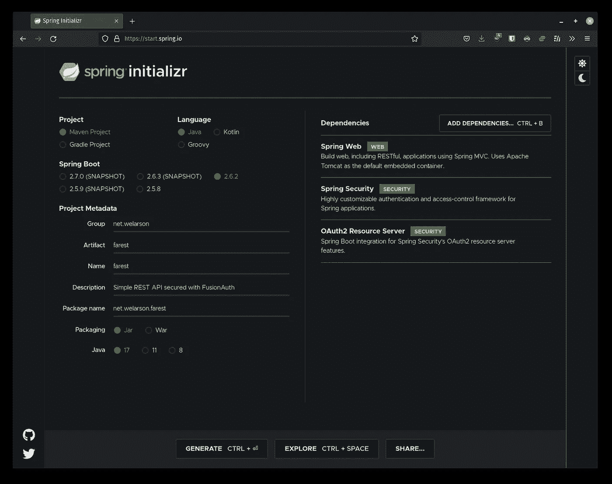

对于依赖项，我们将只使用 Spring Web、Spring Security 和 OAuth2 资源服务器。这就是这个基本例子所需要的。

至于其他选择，这是我在这个例子中要做的。

项目:Maven 项目(我觉得 Maven 更常见)

语言:Java

Spring Boot: 2.6.2(目前最新发布的版本)

Group: net.example

神器:最远的

姓名:farest

描述:用 FusionAuth 保护的简单 REST API

包名:net.example.farest

包装:广口瓶

Java: 17

这将创建一个名为“farest.zip”的 zip 文件，其中包含生成的项目。一旦提取出来，这个项目看起来就像这样。

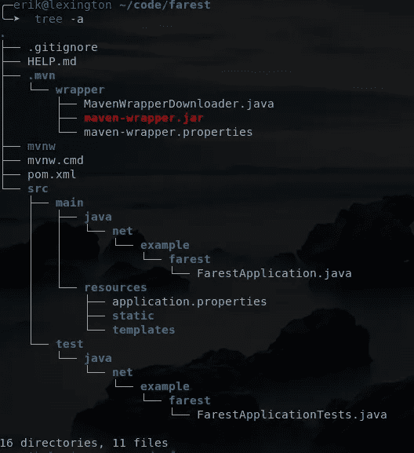

我们现在有一个项目模板，但到目前为止它什么都不做。是时候进行第二步了。

# 步骤 2——创建 REST API

在这一步中，我们将创建一个 REST API，创建一个完全不安全的安全配置，以便我们可以访问该 API，并添加一个 Swagger UI 接口，以便我们使用一个漂亮的 GUI 测试该 API。

首先，让我们添加一个属性来设置服务器将使用的端口。项目生成器将两个空目录和一个空属性文件放在`{root}/src/main/resources`目录中。因为 Spring 也支持在 YAML 文件中定义属性，所以让我们来代替它。所以删除`{root}/src/main/resources`中的所有内容，创建`{root}/src/main/resources/application.yml` 来代替。

项目树现在看起来像这样:

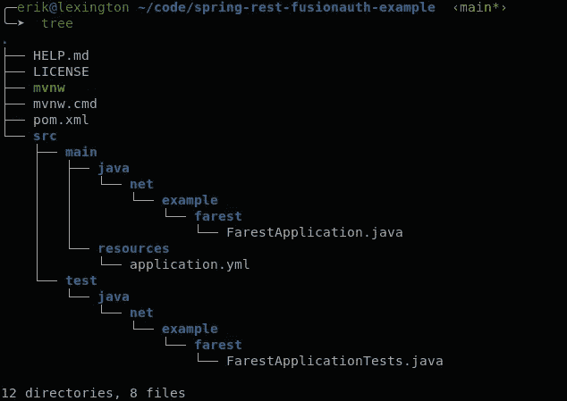

因为这个项目现在在 git 中，所以我没有显示隐藏文件和所有与 git 相关的 cruft。此外，您将看到我添加了一个许可证文件，但这对本例来说无关紧要。

现在，对于应用程序属性，我们唯一需要的是设置服务器端口。我在这个例子中使用 9080，但是当然你可以使用任何你想使用的端口，只要记住与你使用的端口保持一致。所以，我们来编辑一下`{root}/src/main/resources/application.yml`

**application.yml**

```
server:
  port: 9080
```

暂时就这样了。

现在来定义 API。API 中的所有端点都是简单的 GET 方法，只返回允许哪些用户使用 API 端点、发出调用的用户的身份验证状态以及用户拥有的权限。

让我们为将从 API 返回的数据创建一个 POJO。我们 API 中的所有方法都将以相同的格式返回数据，所以我们只需要一个名为… SomeData 的类。

让我们创建一个新包`net.example.farest.model`，并在新包中创建类 SomeData。我们将使用一个记录类来保持事物的整洁。

**SomeData.java**

```
package *net.example.farest.model*;

public record *SomeData*(*String* allowed, 
                       boolean authenticated,
                       *String* authorities) {
}
```

现在让我们为我们的 API 创建 REST 调用。为此，让我们在名为`net.example.farest.controller`的新包中创建一个控制器类 BasicController。

**BasicController.java**

```
package *net.example.farest.controller*;

import *net.example.farest.model.SomeData*;
import *org.springframework.web.bind.annotation.GetMapping*;
import *org.springframework.web.bind.annotation.RequestMapping*;
import *org.springframework.web.bind.annotation.RestController*;

*@RestController
@RequestMapping*("/api/v1")
public class *BasicController* {

    *@GetMapping*("/anyone")
    public *SomeData* allowAnyone() {
        return new SomeData("Anyone",
                isAuthenticated(),
                getAuthorities());
    }

    *@GetMapping*("/basic")
    public *SomeData* allowBasicUser() {
        return new SomeData("Basic User",
                isAuthenticated(),
                getAuthorities());
    }

    *@GetMapping*("/editor")
    public *SomeData* allowEditorUser() {
        return new SomeData("Editor User",
                isAuthenticated(),
                getAuthorities());
    }

    *@GetMapping*("/admin")
    public *SomeData* allowAdminUser() {
        return new SomeData("Admin User",
                isAuthenticated(),
                getAuthorities());
    }

    private boolean isAuthenticated() {
        return false;
    }

    private *String* getAuthorities() {
        return "";
    }
}
```

如您所见，基本控制器确实非常简单。因为我们还没有实现任何安全性，所以我们只返回经过验证的状态和权限的占位符。

此时，我们有了一个 REST API，但是没有安全配置。调用端点只会给出 401 错误，因为我们使用默认的 Spring 安全性，并且默认情况下它使用基本的 auth。因此，让我们创建另一个新的包，并添加一个不安全的安全配置，以便我们可以使用端点。

我们将在新的包`net.example.farest.config`中创建 SecurityConfig 类。

**SecurityConfig.java**

```
package *net.example.farest.config*;

import *org.springframework.context.annotation.Configuration*;
import *org.springframework.security.config.annotation.web.builders.HttpSecurity*;
import *org.springframework.security.config.annotation.web.configuration.EnableWebSecurity*;
import *org.springframework.security.config.annotation.web.configuration.*WebSecurityConfigurerAdapter;
import *org.springframework.security.config.http.SessionCreationPolicy*;

*@Configuration
@EnableWebSecurity* public class *SecurityConfig* extends WebSecurityConfigurerAdapter {

    *@Override* protected void configure(*HttpSecurity http*) throws *Exception* {
        *http*.cors()
            .and()
                .sessionManagement()
                    .sessionCreationPolicy(*SessionCreationPolicy*.STATELESS)
            .and()
                .csrf().disable()
                .authorizeRequests()
                    .anyRequest()
                        .permitAll();
    }
}
```

让我们快速看一下这个。SecurityConfig 扩展了 WebSecurityConfigurerAdapter，因此我们继承了很多配置，而不必实现整个 WebSecurityConfigurer 接口。此外，我们需要用`@Configuration`注释 SecurityConfig，让 Spring 知道这个类需要作为配置加载，并用`@EnableWebSecurity`注释来指示我们想要激活的安全类型。

```
*@Configuration
@EnableWebSecurity* public class *SecurityConfig* extends WebSecurityConfigurerAdapter {
```

现在我们来看看配置本身。虽然我们非常简单的服务不会对 CORS 配置做任何事情(不要担心，我们稍后仍会处理一些 CORS 问题)，但通常您需要激活 CORS 支持。

```
*http*.cors()
```

接下来，我们指定不使用会话，因为这个 REST API 服务是无状态的。

```
.sessionManagement()
    .sessionCreationPolicy(*SessionCreationPolicy*.STATELESS)
```

由于我们不使用会话，我们也不需要 CSRF 保护，因此我们将禁用它。同样，因为这个服务非常简单，所以这并不重要，但是，一般来说，如果您的 API 是无状态的，您应该禁用 CSRF 保护。

```
.csrf().disable()
```

最后，我们将配置访问端点所需的内容。此时，我们将只允许来自任何人的所有请求，无论是否经过身份验证。

```
.authorizeRequests()
    .anyRequest()
        .permitAll();
```

现在让我们试一试。

从项目目录的根目录运行 Maven 命令来构建和打包项目。

`./mvnw package`

然后执行 Spring 应用程序。

`java -jar target/farest-0.0.1-SNAPSHOT.jar`

现在使用 curl 来练习应用程序的端点。

```
curl [http://localhost:9080/api/v1/anyone](http://localhost:9080/api/v1/anyone)curl [http://localhost:9080/api/v1/](http://localhost:9080/api/v1/anyone)basiccurl [http://localhost:9080/api/v1/](http://localhost:9080/api/v1/anyone)editorcurl [http://localhost:9080/api/v1/](http://localhost:9080/api/v1/anyone)admin
```

您应该看到 JSON 向我们展示了谁(理论上在这一点上)被允许使用端点，而身份验证总是为假，并且没有权威机构存在。

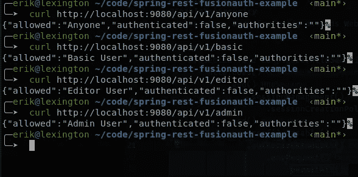

使用 curl 来测试端点并不特别方便，而且一旦我们获得了 API，使用 curl 来测试端点就不那么方便了，所以现在让我们将 Swagger 的 UI 添加到组合中。由于 Swagger 的 UI 是基于 OpenAPI 3 文档构建的，这意味着我们也将添加 API 文档。

我们将使用 OpenAPI 3 的 Springdoc 实现，它不是由我们当前的任何依赖项提供的，所以让我们将这些依赖项添加到我们的 Maven pom.xml 文件中。首先，让我们添加一个包含我们将使用的 Springdoc 实现版本的属性。目前，最新版本是 1.6.3，所以我们将使用它。

**在 pom.xml 中…**

```
...
<properties>
   <java.version>17</java.version>
   **<springdoc.version>1.6.3</springdoc.version>**
</properties>
...
```

现在我们将添加实际的依赖项，使用版本的新属性。

```
...
<dependency>
   <groupId>org.springframework.boot</groupId>
   <artifactId>spring-boot-starter-web</artifactId>
</dependency>
**<dependency>
   <groupId>org.springdoc</groupId>
   <artifactId>springdoc-openapi-ui</artifactId>
   <version>${springdoc.version}</version>
</dependency>
<dependency>
   <groupId>org.springdoc</groupId>
   <artifactId>springdoc-openapi-data-rest</artifactId>
   <version>${springdoc.version}</version>
</dependency>** ...
```

现在让我们为 rest 控制器 BasicController 添加一些注释，以便更好地记录事情。

**在 BasicController.java 中…**

```
*...* ***@Operation*(summary = "Get some data for anyone")
*@ApiResponses*({
  *@ApiResponse*(responseCode = "200",
    description = "Success",
    content = {
      *@Content*(mediaType = "application/json", 
        schema = *@Schema*(implementation = *SomeData*.class))})
})**
*@GetMapping*("/anyone")
public *SomeData* allowAnyone() {
    return new SomeData("Anyone",
            isAuthenticated(),
            getAuthorities());
}

***@Operation*(summary = "Get some data for basic users")
*@ApiResponses*({
  *@ApiResponse*(responseCode = "200",
    description = "Success",
    content = {
      *@Content*(mediaType = "application/json",
        schema = *@Schema*(implementation = *SomeData*.class))})
})**
*@GetMapping*("/basic")
public *SomeData* allowBasicUser() {
    return new SomeData("Basic User",
            isAuthenticated(),
            getAuthorities());
}

***@Operation*(summary = "Get some data for editor users")
*@ApiResponses*({
  *@ApiResponse*(responseCode = "200",
    description = "Success",
    content = {
      *@Content*(mediaType = "application/json",
        schema = *@Schema*(implementation = *SomeData*.class))})
})**
*@GetMapping*("/editor")
public *SomeData* allowEditorUser() {
    return new SomeData("Editor User",
            isAuthenticated(),
            getAuthorities());
}

***@Operation*(summary = "Get some data for admin users")
*@ApiResponses*({
  *@ApiResponse*(responseCode = "200",
    description = "Success",
    content = {
      *@Content*(mediaType = "application/json",
        schema = *@Schema*(implementation = *SomeData*.class))})
})**
*@GetMapping*("/admin")
public *SomeData* allowAdminUser() {
    return new SomeData("Admin User",
            isAuthenticated(),
            getAuthorities());
}
...
```

@Operation 注释让我们提供端点所做工作的摘要，而@ApiResponses 注释提供了可能响应的描述。为了简单起见，我们将只记录成功的结果以及响应数据的类型和形状。

如果您再次构建并启动应用程序，您现在可以在`[http://localhost:9080/v3/api-docs](http://localhost:9080/v3/api-docs)`访问 OpenAPI 文档

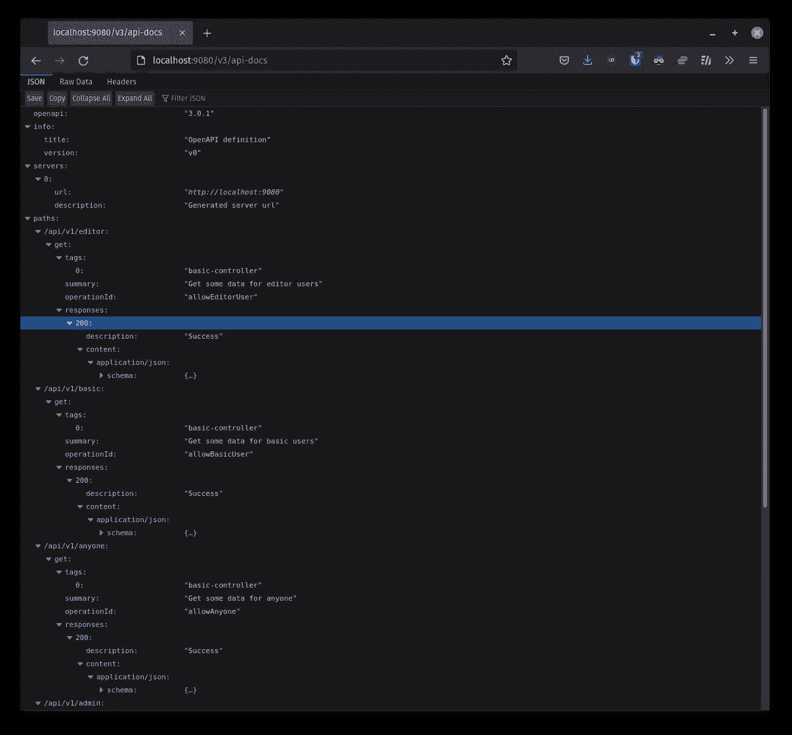

这很好，但是我们需要为 REST 服务提供一个实际的 UI。可以在`[http://localhost:9080/swagger-ui/index.html?configUrl=/v3/api-docs/swagger-config](http://localhost:9040/swagger-ui/index.html?configUrl=/v3/api-docs/swagger-config)`访问

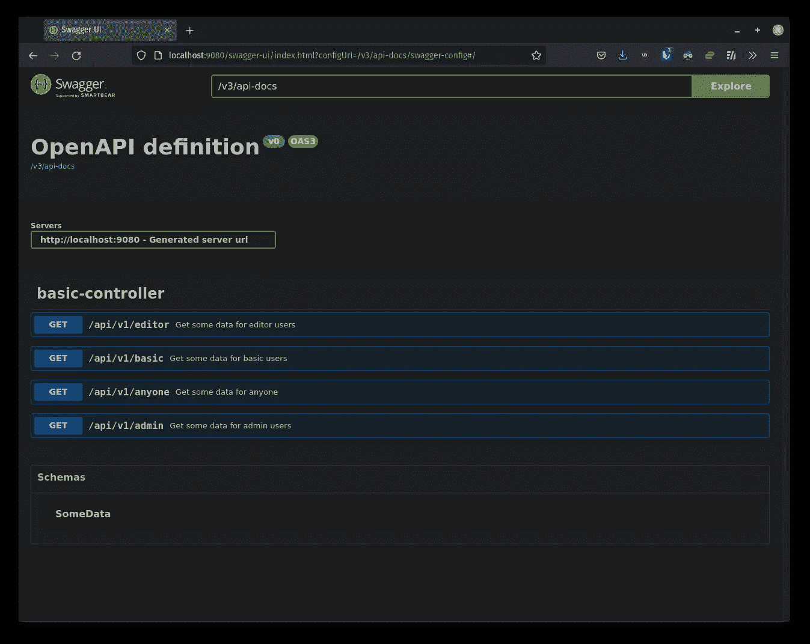

很好。但是你会注意到标题是版本 0 的“OpenAPI 定义”。我们可以通过更多的改变来改善这一点。首先，我们将对 Maven pom.xml 文件进行另一项添加，以提供我们的服务构建信息。我们通过在 spring-boot-maven-plugin 声明中添加一个执行来做到这一点。

```
...
<plugin>
   <groupId>org.springframework.boot</groupId>
   <artifactId>spring-boot-maven-plugin</artifactId>
   **<executions>
      <execution>
         <id>build-info</id>
         <goals>
            <goal>build-info</goal>
         </goals>
      </execution>
   </executions>**
</plugin>
...
```

现在我们将使用 OpenApi3Config 类向`net.example.farest.config`包添加另一个配置。

【OpenApi3Config.java 

```
package *net.example.farest.config*;

import *io.swagger.v3.oas.models.OpenAPI*;
import *io.swagger.v3.oas.models.info.Info*;
import *org.springframework.beans.factory.annotation.Autowired*;
import *org.springframework.boot.info.BuildProperties*;
import *org.springframework.context.annotation.Bean*;
import *org.springframework.context.annotation.Configuration*;

*@Configuration* public class *OpenApi3Config* {
    private final *BuildProperties* buildProperties;

    *@Autowired* public OpenApi3Config(*BuildProperties buildProperties*) {
      this.buildProperties = *buildProperties*;
    }

    *@Bean* public *OpenAPI* openAPI() {
      return new OpenAPI()
        .info(new Info()
        .title("Simple Example REST Service")
        .description("""
Simple REST Service used to demonstrate
securing a Spring REST service with
FusionAuth.
                     """)
        .version(buildProperties.getVersion())
      );
    }
}
```

我们所做的只是为 OpenAPI 提供一个标题、描述和当前版本。项目结构现在将如下所示。

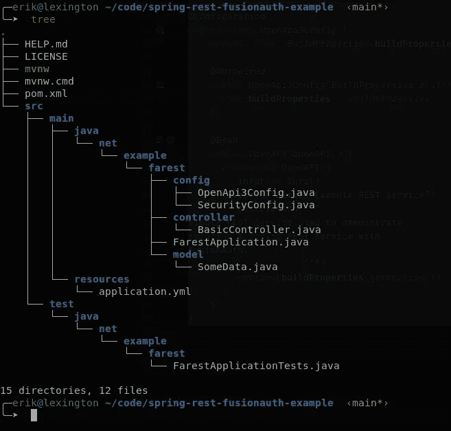

现在重新构建并再次运行服务器，然后再次加载 Swagger UI(IntelliJ IDE 提示，在从 IDE 再次运行之前，使用 Maven 编译任务或重新构建项目，否则将不会创建 BuildProperties 对象。)`[http://localhost:9080/swagger-ui/index.html?configUrl=/v3/api-docs/swagger-config](http://localhost:9040/swagger-ui/index.html?configUrl=/v3/api-docs/swagger-config)`

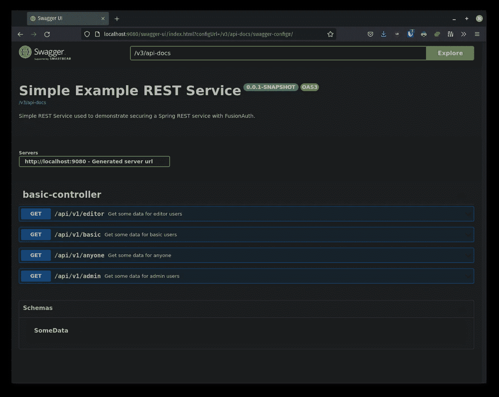

那更好。现在，如果我们尝试一个端点(使用“尝试”然后“执行”按钮)，我们得到预期的结果。

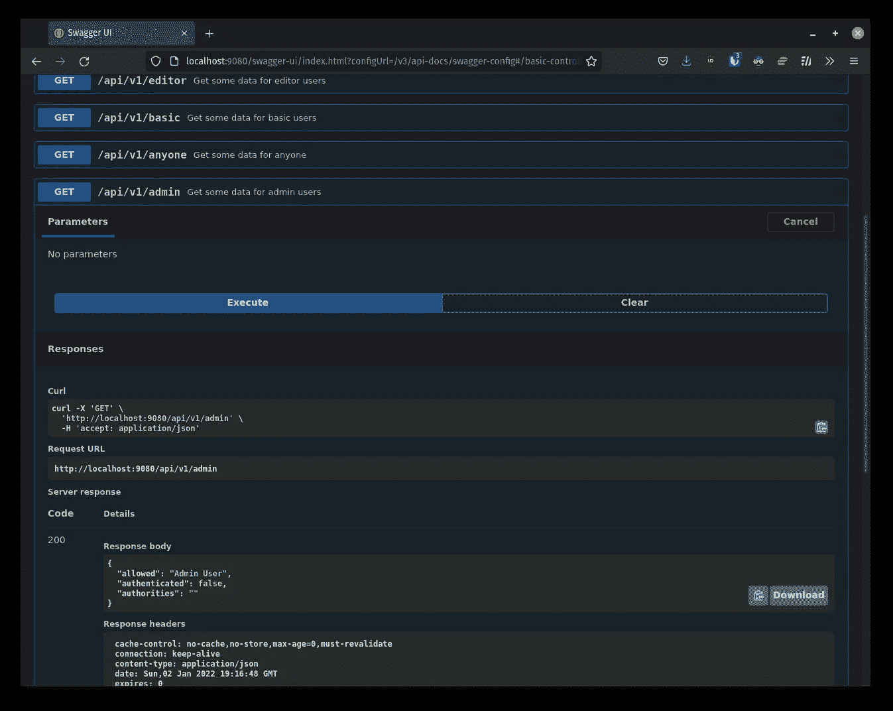

我们可以使用/api/v1/admin 端点，因为我们允许所有内容，并获得占位符值。

这个简单的例子显然不适合生产环境，所以我们不用担心在生产环境中禁用 OpenAPI 3 文档和 Swagger，但这可以通过几个 springdoc 属性轻松完成。

```
springdoc.api-docs.enabled=false
springdoc.swagger-ui.enabled=false
```

好了，我们现在有了一个简单的 REST API 和文档以及一个测试 UI。现在让我们用融合术来保护它。

# 步骤 3 —在 FusionAuth 中创建一个租户和应用程序

我在我的本地网络 yorktown.net.lan 上安装了 FusionAuth，您需要替换托管 FusionAuth 实例的地址(或者如果它安装在您用来构建示例的同一台机器上，则只替换 localhost)。我在端口 9011 上运行 FusionAuth，这是安装 FusionAuth 时的默认端口。本文不打算介绍如何设置 FusionAuth 安装，但是您可以在 FusionAuth 的网站 [https://fusionauth.io](https://fusionauth.io) 上找到您需要的所有信息。

我们将从一个新的租户开始，以避免与您可能已经在 FusionAuth 实例上设置的任何其他应用程序的设置发生冲突。

在创建租户之前，让我们创建一个用于它的密钥。根据我的经验，使用默认密钥会导致 Spring OAuth 2 库出现问题，但是生成一个新的 RSA 密钥就可以了。为此，点击 FusionAuth 侧边栏中的“设置”，然后选择“密钥管理器”。从显示“生成椭圆”的下拉列表中，选择“生成 RSA”选项，并生成一个名为“Example Key”的 RSA 密钥对。

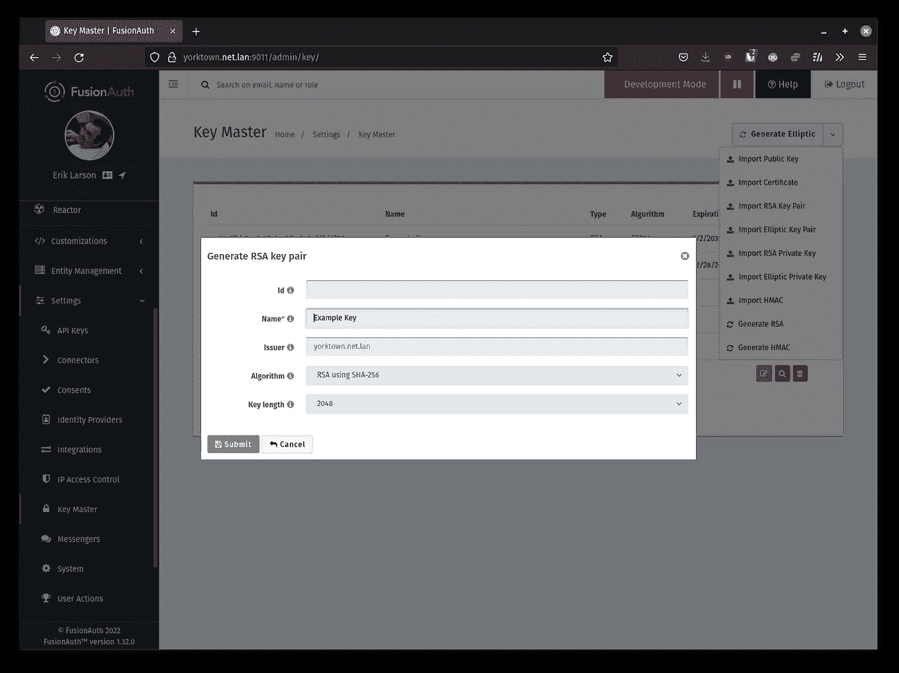

现在我们准备创建一个租户。点击侧边栏中的“租户”，然后点击添加按钮(带加号的那个)。给新租户一个名称“Example ”,我们将对发行者使用“example.net”。

作为一个公平的警告，我提到点击带有磁盘图标的蓝色按钮来保存很多次，因为我很容易忘记它。抱歉，如果它变得重复。

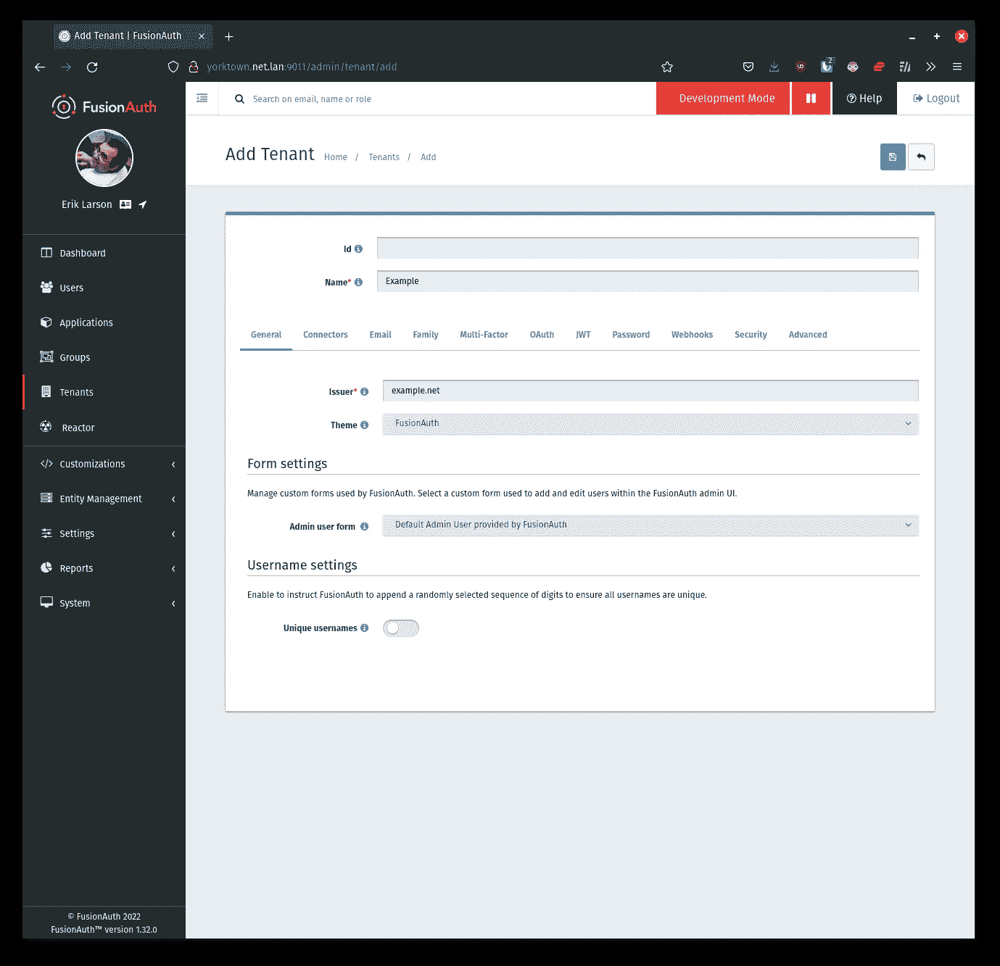

现在切换到“JWT”选项卡，并将“访问令牌签名密钥”和“Id 令牌签名密钥”的值都设置为“示例密钥(RS256)”。(截图是在编辑中，不是添加，但是 UI 是一样的。)

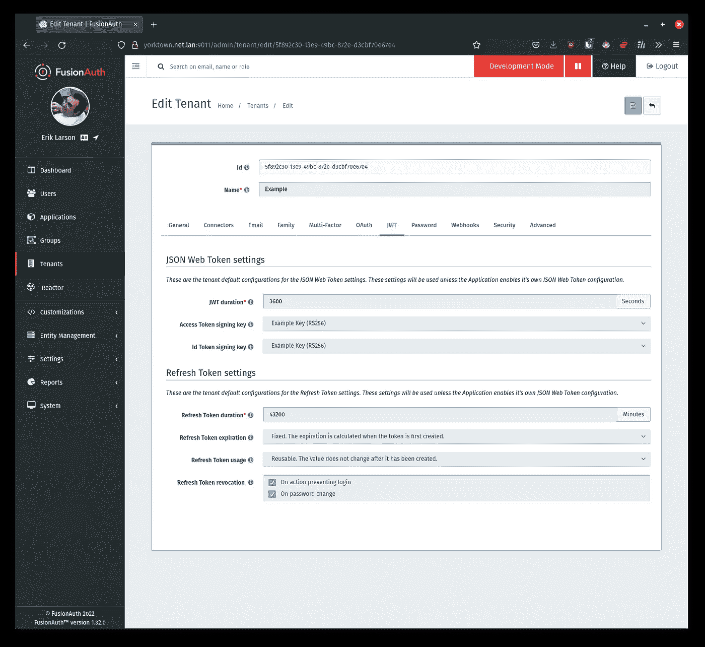

通过单击带有磁盘图标的蓝色按钮来保存新租户。

现在，我们需要添加一个新的应用程序。点击侧边栏上的“应用程序”并添加一个新的。我们将应用程序命名为“SimpleREST”。为租户选择“示例”。然后添加我们的三个角色，基本、编辑和管理。“基本”应该是默认角色，而“管理员”是超级角色。

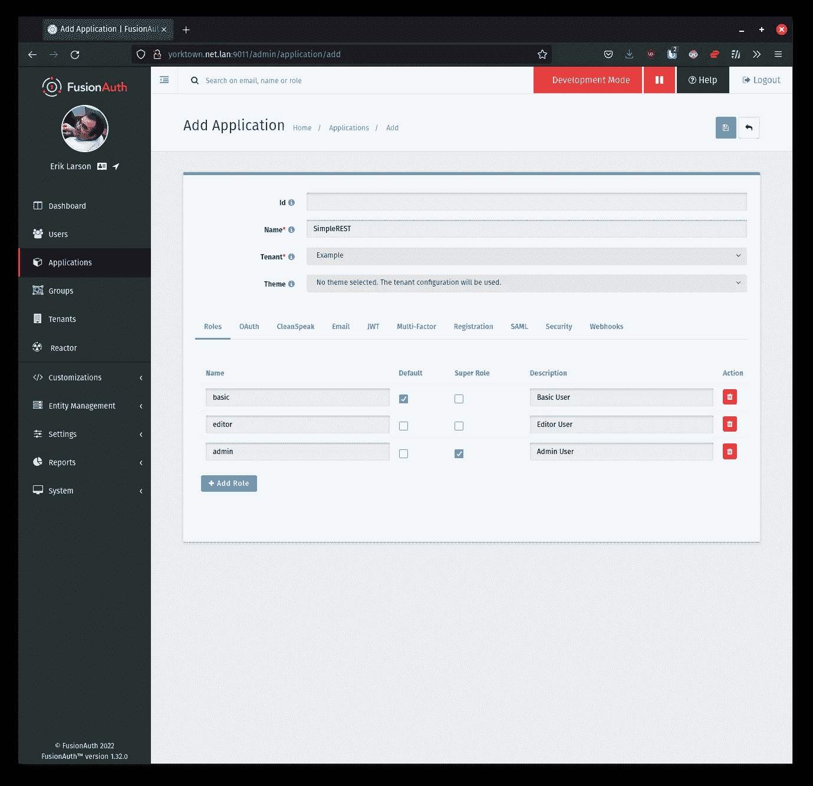

再次单击蓝色磁盘按钮进行保存。现在，单击编辑我们的新应用程序并设置 OAuth 设置。我们需要做的唯一更改是添加一个授权的重定向 URL:[http://localhost:9080/swagger-ui/oauth 2-redirect . html](http://localhost:9080/swagger-ui/oauth2-redirect.html)。在这里，复制“客户端 Id”和“客户端机密”的值，因为我们稍后会用到它们。

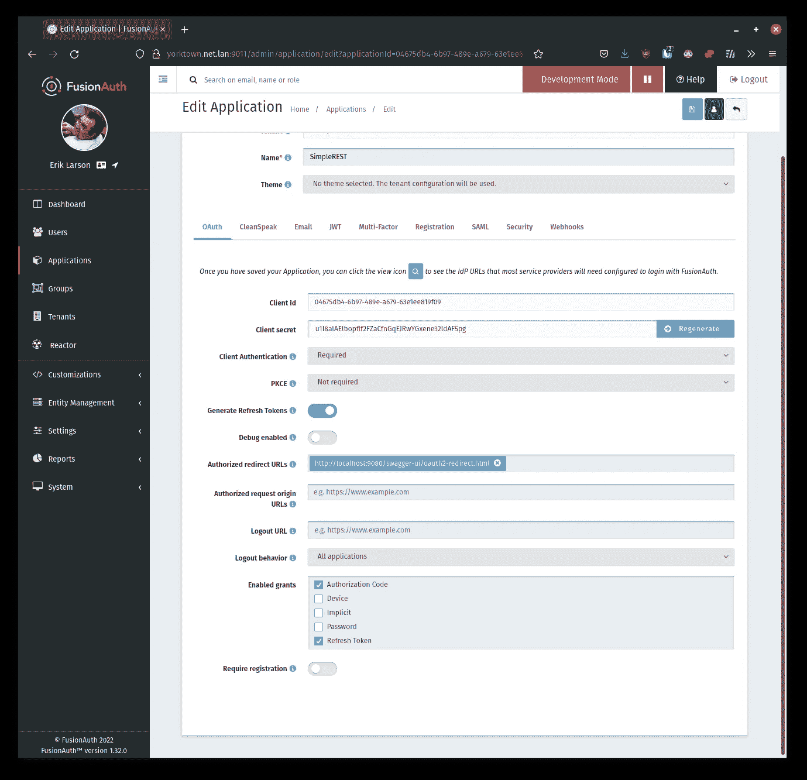

单击蓝色磁盘按钮保存应用程序，现在添加一个新用户。将租户设置为“Example”，然后输入电子邮件和用户名。由于我们没有为租户或应用程序设置电子邮件，因此关闭发送电子邮件选项以设置密码并手动创建密码(可能需要记下该密码，因为您稍后会需要它)。

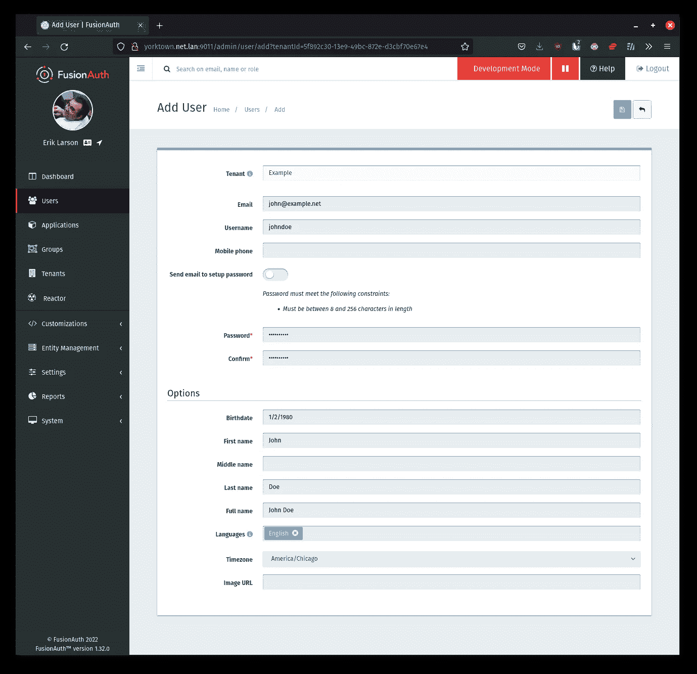

保存用户。这应该会将您带到新用户的详细信息页面。在这里，向 SimpleREST 应用程序注册用户。我现在只给用户分配基本角色。

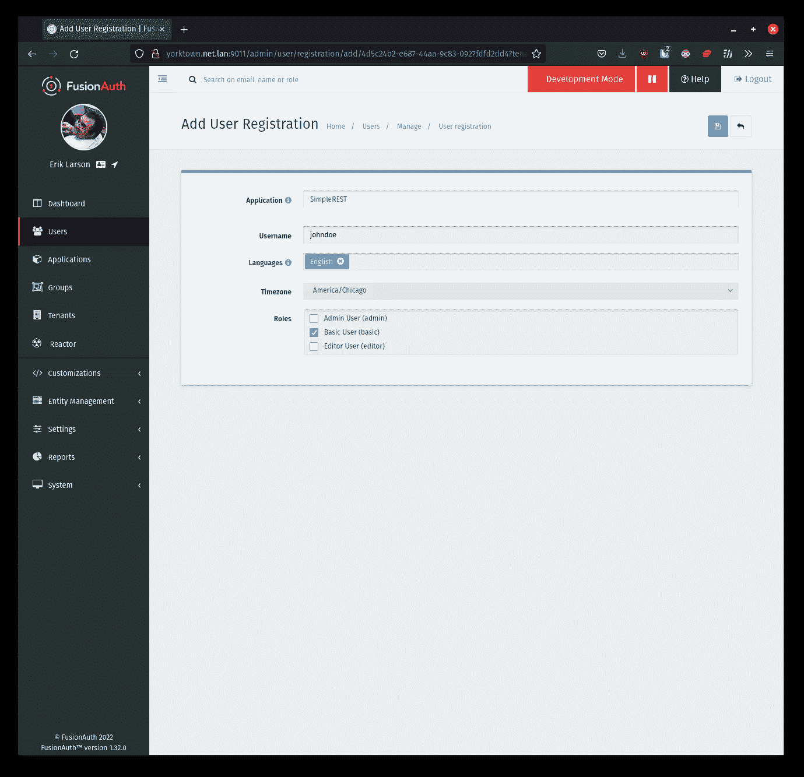

快到了。我承诺了一个 CORS 问题，现在我们要解决它。我们需要添加一些 CORS 设置，让我们的 Swagger-UI 为 FusionAuth 进行登录。选择 FusionAuth 侧边栏上的“设置”，然后选择“系统”并编辑 CORS 滤波器。

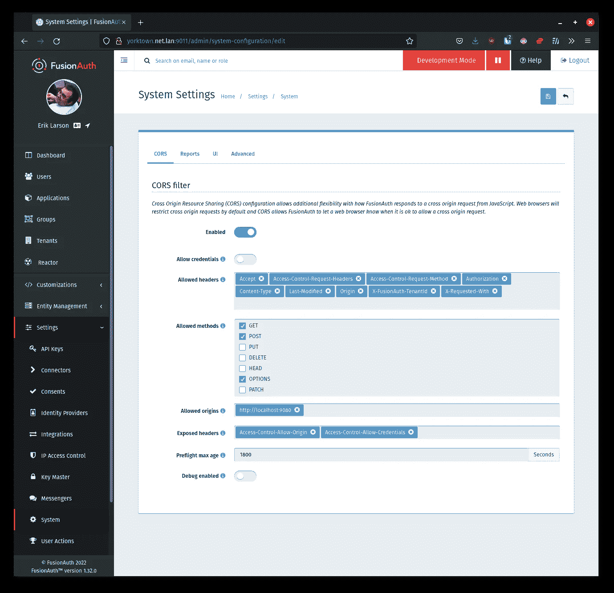

记得再次用蓝色磁盘按钮保存。

好了，FusionAuth 已经为我们的应用程序设置好了。是时候回到 java 代码并保护它了。

# 步骤 4 —保护 REST 服务

我们需要给我们的`application.yml`添加一些属性来处理所有这些 OAuth 的东西。您的 FusionAuth 实例的配置值应该在`{FusionAuth Instance Address}/.well-known/openid-configuration`可用。您可能会注意到发行者并不是我们之前设置的“example.net”。这是因为这是默认租户，而不是我们创建的租户。我们可以使用 tenantId 查询参数来指定租户，但是所有重要的东西都是一样的。我们将使用另一个属性来设置正确的发行者。

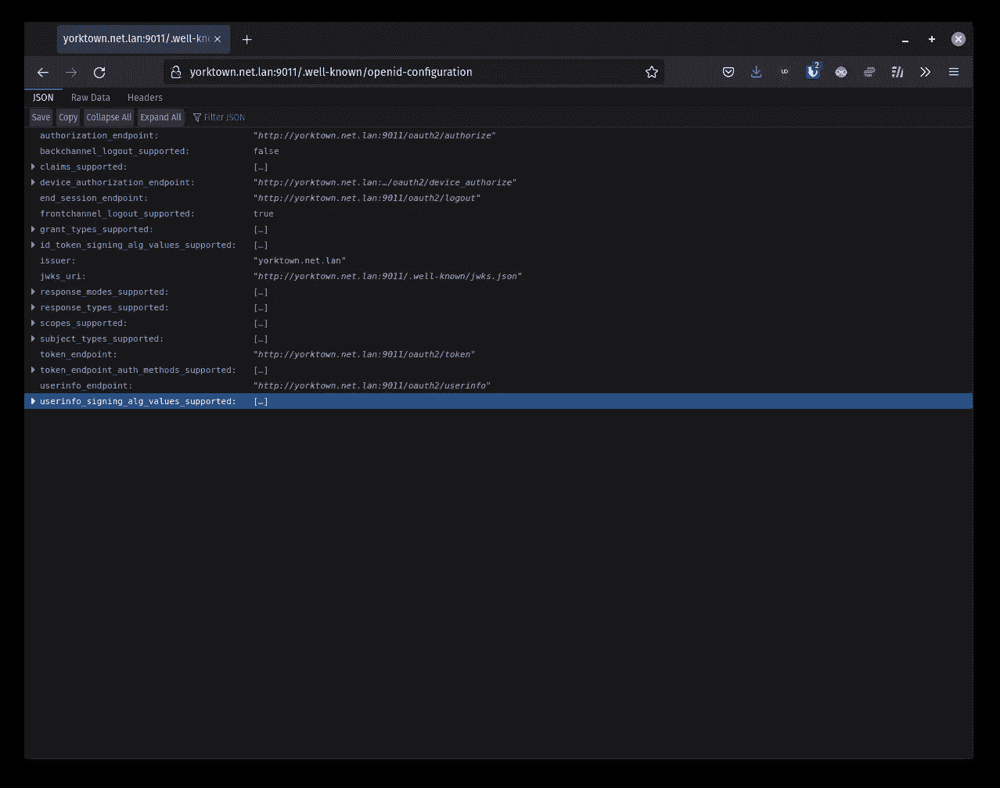

Spring 将能够通过使用 openid 配置信息来配置 issuer-uri 中的大多数值。然而，我们还需要为 JWT 解码器的实现设置 jwk-set-uri 值。所以我们将设置属性`spring.security.oauth2.resourceserver.jwt.issuer-uri`和`spring.security.oauth2.resourceserver.jwt.jwk-set-uri`。

```
spring:
  security:
    oauth2:
      resourceserver:
        jwt:
          jwk-set-uri: http://yorktown.net.lan:9011/.well-known/jwks.json
          issuer-uri: http://yorktown.net.lan:9011/
```

然后，我们将添加一些我们自己的属性，我们将使用这些属性来提供适当的颁发者，并为我们的 OpenAPI3 配置提供一些值。发行者属性将是`oidc.issuer`，并设置为“example.net”以匹配我们的租户。授权端点将被设置为`oidc.auth-url`，令牌 _ 端点将被设置为`oidc.token-url`。

```
oidc:
  issuer: example.net
  auth-url: http://yorktown.net.lan:9011/oauth2/authorize
  token-url: http://yorktown.net.lan:9011/oauth2/token
```

Swagger UI 必须实际进行登录，因此它需要我们在 FusionAuth 中创建 SimpleREST 应用程序时复制下来的 client-id 和 client-secret 值。这将允许 Swagger 执行一个用户登录的验证码流。在实际的应用程序中，您不希望将原始值放在 yml 文件中，但是对于这个简单的示例来说，它可以做到。

```
spring:
  security:
    oauth2:
      resourceserver:
        jwt:
          jwk-set-uri: http://yorktown.net.lan:9011/.well-known/jwks.json
          issuer-uri: http://yorktown.net.lan:9011/
```

结尾`application.yml`应该是这样的:

```
server:
  port: 9080

spring:
  security:
    oauth2:
      resourceserver:
        jwt:
          jwk-set-uri: http://yorktown.net.lan:9011/.well-known/jwks.json
          issuer-uri: http://yorktown.net.lan:9011/

oidc:
  issuer: example.net
  auth-url: http://yorktown.net.lan:9011/oauth2/authorize
  token-url: http://yorktown.net.lan:9011/oauth2/token

springdoc:
  swagger-ui:
    oauth:
      client-id: <YOUR CLIENT ID>
      client-secret: <YOUR CLIENT SECRET>
```

我们需要对我们的安全配置做一些大的改变，但是其中一部分将告诉 Spring 如何计算用户的权限。如果任其自生自灭，Spring 将添加一个名为“ROLE_USER”的角色，并将任何 OAuth2 范围添加到用户的权限中。然而，我们想要的是我们在 FusionAuth 中为用户定义的角色。为此，我们将为从 JWT 到身份验证令牌的转换器创建自己的实现。

```
package *net.example.farest.security*;

import *org.springframework.core.convert.converter.Converter*;
import *org.springframework.security.authentication.*AbstractAuthenticationToken;
import *org.springframework.security.authentication.UsernamePasswordAuthenticationToken*;
import *org.springframework.security.core.GrantedAuthority*;
import *org.springframework.security.core.authority.SimpleGrantedAuthority*;
import *org.springframework.security.oauth2.jwt.Jwt*;
import *org.springframework.util.*StringUtils;

import *java.util.Arrays*;
import *java.util.Collection*;
import *java.util.Collections*;
import *java.util.stream.Collectors*;

public class *OidcJwtAuthConverter* implements *Converter*<*Jwt*, AbstractAuthenticationToken> {
    private static final *String* EMAIL_CLAIM = "email";
    private static final *String* ROLES_CLIAM = "roles";

  *@Override* public AbstractAuthenticationToken convert(final *Jwt jwt*) {
    return new UsernamePasswordAuthenticationToken(
            getUserName(*jwt*), "n/a", getAuthorities(*jwt*));
  }

  private *String* getUserName(final *Jwt jwt*) {
        return *jwt*.getClaimAsString(EMAIL_CLAIM);
    }

  private *Collection*<*GrantedAuthority*> getAuthorities(final *Jwt jwt*) {
    return this.getRoles(*jwt*).stream()
      .map(*role* -> new SimpleGrantedAuthority(*role*.toLowerCase()))
      .collect(*Collectors*.*toSet*());
  }

  private *Collection*<*String*> getRoles(final *Jwt jwt*) {
    final var claim = *jwt*.getClaims().get(ROLES_CLIAM);
    if (claim instanceof *String roles* && StringUtils.*hasText*(*roles*)) {
      return *Arrays*.*asList*(*roles*.split(" "));
    }
    if (claim instanceof *Collection*<?> *roles*) {
      return *roles*.stream()
              .map(*Object*::toString)
              .collect(*Collectors*.*toSet*());
    }
    return *Collections*.*emptyList*();
  }
}
```

这也是将您可能需要的任何附加用户信息加载到 usernamepasswordtauthenticationtoken 的绝佳位置。第一个参数(Principal)是一个对象，所以当我们将它设置为用户的电子邮件地址时，您可以放入任何您想要表示用户的对象。

至于权威，我们将从“角色”声明中得到它们。FusionAuth 将提供该声明中的角色作为集合。

现在让我们修改我们的安全配置。新的安全配置如下所示。

```
package *net.example.farest.config*;

import *net.example.farest.security.OidcJwtAuthConverter*;
import *org.springframework.beans.factory.annotation.Autowired*;
import *org.springframework.beans.factory.annotation.Value*;
import *org.springframework.boot.autoconfigure.security.oauth2.resource.OAuth2ResourceServerProperties*;
import *org.springframework.context.annotation.Bean*;
import *org.springframework.context.annotation.Configuration*;
import *org.springframework.security.config.annotation.method.configuration.EnableGlobalMethodSecurity*;
import *org.springframework.security.config.annotation.web.builders.HttpSecurity*;
import *org.springframework.security.config.annotation.web.configuration.EnableWebSecurity*;
import *org.springframework.security.config.annotation.web.configuration.*WebSecurityConfigurerAdapter;
import *org.springframework.security.config.http.SessionCreationPolicy*;
import *org.springframework.security.oauth2.jwt.JwtDecoder*;
import *org.springframework.security.oauth2.jwt.JwtValidators*;
import *org.springframework.security.oauth2.jwt.NimbusJwtDecoder*;

*@Configuration
@EnableWebSecurity
@EnableGlobalMethodSecurity*(prePostEnabled = true)
public class *SecurityConfig* extends WebSecurityConfigurerAdapter {
  private final *OAuth2ResourceServerProperties* oauth2Properties;
  private final *String* issuer;

  *@Autowired* public SecurityConfig(*OAuth2ResourceServerProperties oauth2Properties*,
                        *@Value*("${oidc.issuer}") *String issuer*) {
    this.oauth2Properties = *oauth2Properties*;
    this.issuer = *issuer*;
  }

  *@Override* protected void configure(*HttpSecurity http*) throws *Exception* {
    *http*.cors()
      .and()
        .sessionManagement()
          .sessionCreationPolicy(*SessionCreationPolicy*.STATELESS)
      .and()
        .csrf().disable()
        .authorizeRequests()
          .antMatchers("/api/v1/anyone").permitAll()
          .antMatchers("/swagger-ui/**").permitAll()
          .antMatchers("/v3/api-docs/**").permitAll()
          .anyRequest()
            .fullyAuthenticated()
      .and()
        .oauth2ResourceServer()
          .jwt()
            .jwtAuthenticationConverter(new OidcJwtAuthConverter());
  }

  *@Bean* public *JwtDecoder* jwtDecoder() {
    final var jwtDecoder =
      *NimbusJwtDecoder*.*withJwkSetUri*(oauth2Properties.getJwt().getJwkSetUri())
              .build();
    final var withIssuer = *JwtValidators*.*createDefaultWithIssuer*(issuer);
    jwtDecoder.setJwtValidator(withIssuer);
    return jwtDecoder;
  }
}
```

我们添加了一个值为`prePostEnabled=true`的`@EnableGlobalMethodSecurity`注释。这将允许我们使用注释来指定访问端点所需的权限。

```
*...
@Configuration
@EnableWebSecurity* ***@EnableGlobalMethodSecurity*(prePostEnabled = true)**
public class *SecurityConfig* extends WebSecurityConfigurerAdapter {
...
```

我们以前不需要注入任何 bean 或值，但是随着我们的配置更加复杂，我们将需要具有 Spring 的 OAuth2 属性的 bean。除此之外，我们还需要为我们的租户定义的发布者(“example.net”)，它位于 oidc.issuer 属性中。

```
...
public class *SecurityConfig* extends WebSecurityConfigurerAdapter {
  **private final *OAuth2ResourceServerProperties* oauth2Properties;
  private final *String* issuer;

  *@Autowired* public SecurityConfig(*OAuth2ResourceServerProperties oauth2Properties*,
                        *@Value*("${oidc.issuer}") *String issuer*) {
    this.oauth2Properties = *oauth2Properties*;
    this.issuer = *issuer*;
  }**
...
```

我们的 HTTPSecurity 配置开始时是一样的，但是我们不允许任何人的任何请求，而是只允许任何人的少数请求。在我们的 API 中，任何人都可以使用一个端点，无论是否经过身份验证，因此需要允许所有人都使用一个端点。我们还需要允许未经认证的用户访问 api 文档和 Swagger UI，这样我们就可以测试我们的 API。所有其他请求都要求用户经过完全身份验证。

```
*...
@Override* protected void configure(*HttpSecurity http*) throws *Exception* {
  *http*.cors()
    .and()
      .sessionManagement()
        .sessionCreationPolicy(*SessionCreationPolicy*.STATELESS)
    .and()
      .csrf().disable()
      .authorizeRequests()
        **.antMatchers("/api/v1/anyone").permitAll()
        .antMatchers("/swagger-ui/**").permitAll()
        .antMatchers("/v3/api-docs/**").permitAll()
        .anyRequest()
          .fullyAuthenticated()**
...
```

接下来，我们需要指定我们的身份验证将由 OAuth2 提供。为此，我们使用 oauth2ResourceServer()配置，并告诉它我们希望使用我们的客户转换器 OidcJwtAuthConverter 将 JWT 令牌转换为身份验证实例。

```
...
*@Override* protected void configure(*HttpSecurity http*) throws *Exception* {
  *http*.cors()
    .and()
      .sessionManagement()
        .sessionCreationPolicy(*SessionCreationPolicy*.STATELESS)
    .and()
      .csrf().disable()
      .authorizeRequests()
        .antMatchers("/api/v1/anyone").permitAll()
        .antMatchers("/swagger-ui/**").permitAll()
        .antMatchers("/v3/api-docs/**").permitAll()
        .anyRequest()
          .fullyAuthenticated()
    **.and()
      .oauth2ResourceServer()
        .jwt()
          .jwtAuthenticationConverter(new OidcJwtAuthConverter());**
}
...
```

我们还需要提供一个 JWT 解码器 bean。Spring 的 OAuth 库为我们提供了 NimbusJwtDecoder，所以我们将使用它来构建我们的 JwtDecoder，给它我们在 Spring 的 OAuth 属性中设置的 jwt-set-uri。然后我们为发行者创建自己的验证器，因为 Spring 无法为我们的租户计算出正确的值。我们告诉解码器使用发行者验证并返回解码器。

```
*...* ***@Bean* public *JwtDecoder* jwtDecoder() {
  final var jwtDecoder =
    *NimbusJwtDecoder*.*withJwkSetUri*(oauth2Properties.getJwt().getJwkSetUri())
            .build();
  final var withIssuer = *JwtValidators*.*createDefaultWithIssuer*(issuer);
  jwtDecoder.setJwtValidator(withIssuer);
  return jwtDecoder;
}**
...
```

现在，让我们修改 REST 控制器，根据用户的权限限制对端点的访问，并实际判断用户是否经过身份验证并列出权限。

```
package *net.example.farest.controller*;

import *io.swagger.v3.oas.annotations.Operation*;
import *io.swagger.v3.oas.annotations.media.Content*;
import *io.swagger.v3.oas.annotations.media.Schema*;
import *io.swagger.v3.oas.annotations.responses.ApiResponse*;
import *io.swagger.v3.oas.annotations.responses.ApiResponses*;
import *net.example.farest.model.SomeData*;
import *org.springframework.security.access.prepost.PreAuthorize*;
import *org.springframework.security.core.Authentication*;
import *org.springframework.web.bind.annotation.GetMapping*;
import *org.springframework.web.bind.annotation.RequestMapping*;
import *org.springframework.web.bind.annotation.RestController*;

*@RestController
@RequestMapping*("/api/v1")
public class *BasicController* {

    *@Operation*(summary = "Get some data for anyone")
    *@ApiResponses*({
      *@ApiResponse*(responseCode = "200",
        description = "Success",
        content = {
          *@Content*(mediaType = "application/json",
            schema = *@Schema*(implementation = *SomeData*.class))})
    })
    *@GetMapping*("/anyone")
    *@PreAuthorize*("permitAll()")
    public *SomeData* allowAnyone(*Authentication authentication*) {
        return new SomeData("Anyone",
                isAuthenticated(*authentication*),
                getAuthorities(*authentication*));
    }

    *@Operation*(summary = "Get some data for basic users")
    *@ApiResponses*({
      *@ApiResponse*(responseCode = "200",
        description = "Success",
        content = {
          *@Content*(mediaType = "application/json",
            schema = *@Schema*(implementation = *SomeData*.class))})
    })
    *@GetMapping*("/basic")
    *@PreAuthorize*("hasAuthority('basic') or hasAuthority('admin')")
    public *SomeData* allowBasicUser(*Authentication authentication*) {
        return new SomeData("Basic User",
                isAuthenticated(*authentication*),
                getAuthorities(*authentication*));
    }

    *@Operation*(summary = "Get some data for editor users")
    *@ApiResponses*({
      *@ApiResponse*(responseCode = "200",
        description = "Success",
        content = {
          *@Content*(mediaType = "application/json",
            schema = *@Schema*(implementation = *SomeData*.class))})
    })
    *@GetMapping*("/editor")
    *@PreAuthorize*("hasAuthority('editor') or hasAuthority('admin')")
    public *SomeData* allowEditorUser(*Authentication authentication*) {
        return new SomeData("Editor User",
                isAuthenticated(*authentication*),
                getAuthorities(*authentication*));
    }

    *@Operation*(summary = "Get some data for admin users")
    *@ApiResponses*({
      *@ApiResponse*(responseCode = "200",
        description = "Success",
        content = {
          *@Content*(mediaType = "application/json",
            schema = *@Schema*(implementation = *SomeData*.class))})
    })
    *@GetMapping*("/admin")
    *@PreAuthorize*("hasAuthority('admin')")
    public *SomeData* allowAdminUser(*Authentication authentication*) {
        return new SomeData("Admin User",
                isAuthenticated(*authentication*),
                getAuthorities(*authentication*));
    }

    private boolean isAuthenticated(*Authentication authentication*) {
        return *authentication* != null && *authentication*.isAuthenticated();
    }

    private *String* getAuthorities(*Authentication authentication*) {
        return isAuthenticated(*authentication*)
                ? *authentication*.getAuthorities().toString()
                : "";
    }
}
```

有了更新的安全配置，我们可以使用@PreAuthorize 注释来设置端点方法的安全性。端点/api/v1/anyone 对于任何人都是允许的，所以我们将允许每个人访问它。

```
*@Operation*(summary = "Get some data for anyone")
*@ApiResponses*({
  *@ApiResponse*(responseCode = "200",
    description = "Success",
    content = {
      *@Content*(mediaType = "application/json",
        schema = *@Schema*(implementation = *SomeData*.class))})
})
*@GetMapping*("/anyone")
***@PreAuthorize*("permitAll()")**
public *SomeData* allowAnyone(*Authentication authentication*) {
    return new SomeData("Anyone",
            isAuthenticated(*authentication*),
            getAuthorities(*authentication*));
}
```

端点/api/v1/basic 可供具有“基本”或“管理”角色的用户使用，因此我们将使用一个允许“基本”权限或“管理”权限的表达式。

```
*@Operation*(summary = "Get some data for basic users")
*@ApiResponses*({
  *@ApiResponse*(responseCode = "200",
    description = "Success",
    content = {
      *@Content*(mediaType = "application/json",
        schema = *@Schema*(implementation = *SomeData*.class))})
})
*@GetMapping*("/basic")
***@PreAuthorize*("hasAuthority('basic') or hasAuthority('admin')")**
public *SomeData* allowBasicUser(*Authentication authentication*) {
    return new SomeData("Basic User",
            isAuthenticated(*authentication*),
            getAuthorities(*authentication*));
}
```

端点/api/v1/editor 可供具有“编辑”或“管理”角色的用户使用，因此我们将使用一个允许“编辑”权限或“管理”权限的表达式。

```
*@Operation*(summary = "Get some data for editor users")
*@ApiResponses*({
  *@ApiResponse*(responseCode = "200",
    description = "Success",
    content = {
      *@Content*(mediaType = "application/json",
        schema = *@Schema*(implementation = *SomeData*.class))})
})
*@GetMapping*("/editor")
***@PreAuthorize*("hasAuthority('editor') or hasAuthority('admin')")**
public *SomeData* allowEditorUser(*Authentication authentication*) {
    return new SomeData("Editor User",
            isAuthenticated(*authentication*),
            getAuthorities(*authentication*));
}
```

端点/api/v1/admin 仅对 admin 用户可用，因此表达式将只允许具有“admin”权限的用户。

```
*@Operation*(summary = "Get some data for admin users")
*@ApiResponses*({
  *@ApiResponse*(responseCode = "200",
    description = "Success",
    content = {
      *@Content*(mediaType = "application/json",
        schema = *@Schema*(implementation = *SomeData*.class))})
})
*@GetMapping*("/admin")
***@PreAuthorize*("hasAuthority('admin')")**
public *SomeData* allowAdminUser(*Authentication authentication*) {
    return new SomeData("Admin User",
            isAuthenticated(*authentication*),
            getAuthorities(*authentication*));
}
```

我们还需要用实际的实现替换我们的 isAuthenticated()和 getAuthorities()方法。所有的端点现在都有一个认证参数，Spring 会自动为我们填充这个参数。然后，我们可以将该身份验证实例传递给更新后的方法，以获取身份验证和授权信息。

```
**private boolean isAuthenticated(*Authentication authentication*) {
    return *authentication* != null && *authentication*.isAuthenticated();
}

private *String* getAuthorities(*Authentication authentication*) {
    return isAuthenticated(*authentication*)
            ? *authentication*.getAuthorities().toString()
            : "";
}**
```

我们的 REST API 现在是安全的，但是我们仍然需要配置我们的 Swagger UI，以便我们有一个方便的测试工具。让我们给 OpenAPI3Config 类添加一些安全设置。

```
package *net.example.farest.config*;

import *io.swagger.v3.oas.models.Components*;
import *io.swagger.v3.oas.models.OpenAPI*;
import *io.swagger.v3.oas.models.info.Info*;
**import *io.swagger.v3.oas.models.security.**;**
import *org.springframework.beans.factory.annotation.Autowired*;
import *org.springframework.beans.factory.annotation.Value*;
import *org.springframework.boot.info.BuildProperties*;
import *org.springframework.context.annotation.Bean*;
import *org.springframework.context.annotation.Configuration*;

import *java.util.List*;

*@Configuration* public class *OpenApi3Config* {
  private final *BuildProperties* buildProperties;
  **private final *String* authUrl;
  private final *String* tokenUrl;**

  *@Autowired* public OpenApi3Config(*BuildProperties buildProperties***,
                        *@Value*("${oidc.auth-url}") *String authUrl*,
                        *@Value*("${oidc.token-url}") *String tokenUrl***) {
    this.buildProperties = *buildProperties*;
    **this.authUrl = *authUrl*;
    this.tokenUrl = *tokenUrl*;**
  }

  *@Bean* public *OpenAPI* openAPI() {
    return new OpenAPI()
      **.components(new Components()
        .addSecuritySchemes("oauth2", new SecurityScheme()
          .type(*SecurityScheme*.*Type*.OAUTH2)
          .description("OAuth2 Flow")
          .flows(new OAuthFlows()
            .authorizationCode(new OAuthFlow()
              .authorizationUrl(authUrl)
              .tokenUrl(tokenUrl)
              .scopes(new Scopes())
            )
          )
        )
      )
      .security(*List*.*of*(new SecurityRequirement()
              .addList("oauth2")))**
      .info(new Info()
        .title("Simple Example REST Service")
        .description("""
Simple REST Service used to demonstrate
securing a Spring REST service with
FusionAuth.
                     """)
        .version(buildProperties.getVersion())
    );
  }
}
```

所以让我们快速看一下这里发生了什么。首先，我们需要从应用程序属性中注入一些值，这样我们就可以在 OAuth 流中配置授权 url 和令牌 url。

```
*@Configuration* public class *OpenApi3Config* {
  private final *BuildProperties* buildProperties;
  **private final *String* authUrl;
  private final *String* tokenUrl;**

  *@Autowired* public OpenApi3Config(*BuildProperties buildProperties***,
                        *@Value*("${oidc.auth-url}") *String authUrl*,
                        *@Value*("${oidc.token-url}") *String tokenUrl***) {
    this.buildProperties = *buildProperties*;
    **this.authUrl = *authUrl*;
    this.tokenUrl = *tokenUrl*;**
  }
```

接下来，我们将实际的安全方案添加到 OpenAPI 配置中。我们使用 OAUTH2 类型的安全性，并添加一个授权代码流来认证用户。我们需要配置授权 url 和令牌 url，以便 Swagger 可以执行登录操作。我们不关心示波器，所以我们就让它空着。因为我们还为客户端 id 和 secret 添加了 springdoc 属性，所以 Swagger 用户不必知道这些值就可以执行身份验证流程。

```
...
return new OpenAPI()
      **.components(new Components()
        .addSecuritySchemes("oauth2", new SecurityScheme()
          .type(*SecurityScheme*.*Type*.OAUTH2)
          .description("OAuth2 Flow")
          .flows(new OAuthFlows()
            .authorizationCode(new OAuthFlow()
              .authorizationUrl(authUrl)
              .tokenUrl(tokenUrl)
              .scopes(new Scopes())
            )
          )
        )
      )
...**
```

最后，我们将安全方案添加到 API 的已配置安全需求列表中。

```
**...
      .security(*List*.*of*(new SecurityRequirement()
              .addList("oauth2")))**
      .info(new Info()
...
```

是时候再次构建和执行服务了。

```
./mvnw packagejava -jar target/farest-0.0.1-SNAPSHOT.jar
```

我建议打开一个私有或匿名窗口进行测试，以避免与同时登录 FusionAuth 实例发生冲突。我们可能还好，因为它是一个不同的租户，但这是一个少担心的事情。现在使用 Swagger url 来打开 Swagger。[http://localhost:9080/swagger-ui/index . html？configUrl =/v3/API-docs/swagger-config](http://localhost:9080/swagger-ui/index.html?configUrl=/v3/api-docs/swagger-config)

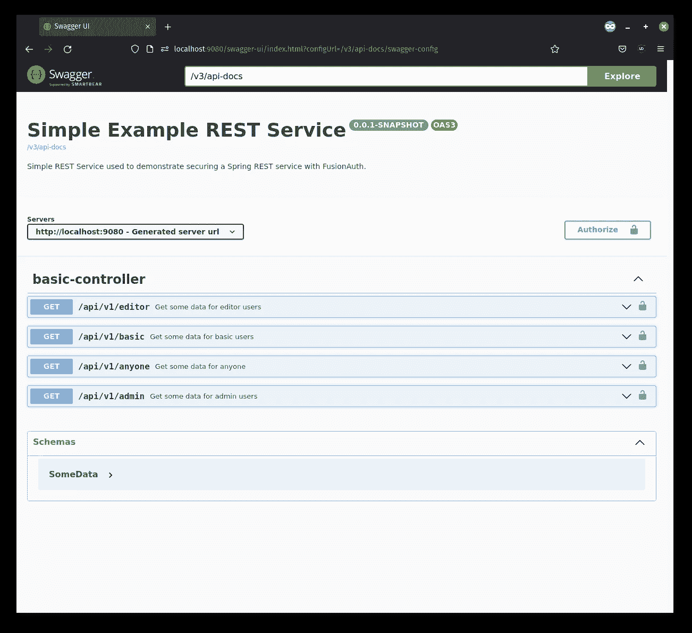

你会看到现在有一个“授权”按钮。单击该按钮将允许我们使用 FusionAuth 进行身份验证。然而，在认证之前，让我们尝试几个端点。首先，我们将尝试我们配置为每个人都可以访问的/api/v1/anyone 端点。

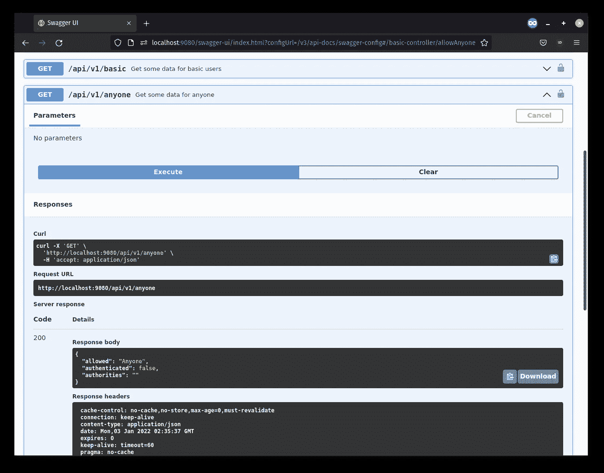

它工作，我们被告知用户是未经认证的，没有权力。当然，这正是以前的工作方式。

接下来，让我们试试/api/v1/basic，它需要一个具有“basic”或“admin”角色的认证用户。

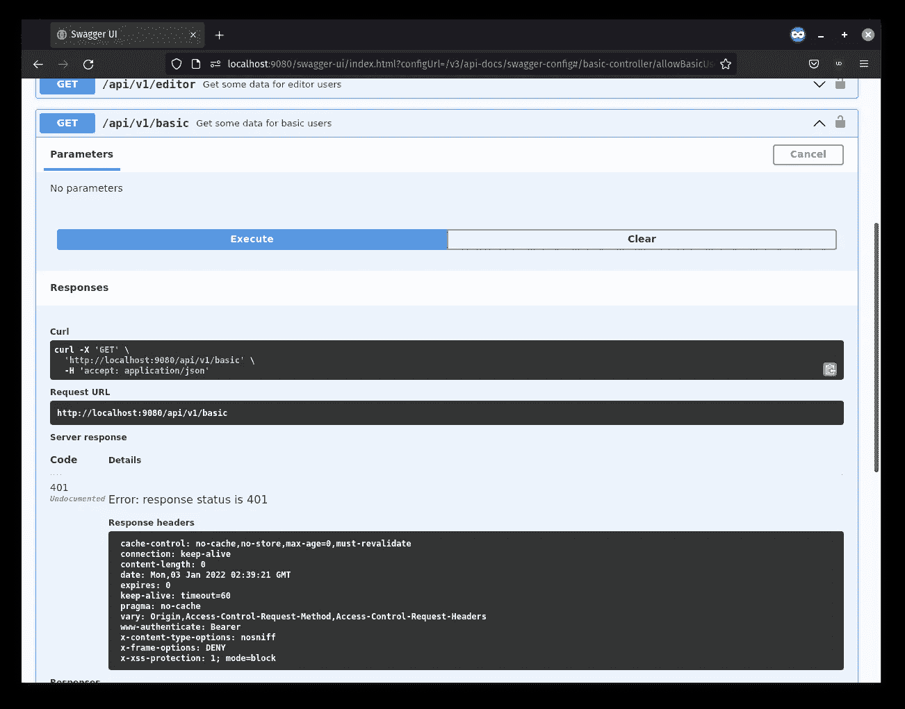

这一次，我们得到一个 401 错误，因为用户未经身份验证。到目前为止，一切顺利。

现在，单击“授权”按钮，我们将看到一个对话框，显示可用的授权。唯一可用的是 OAuth2 授权码。client_id 和 client_secret 字段是预先填充的，因此我们不必担心它们。

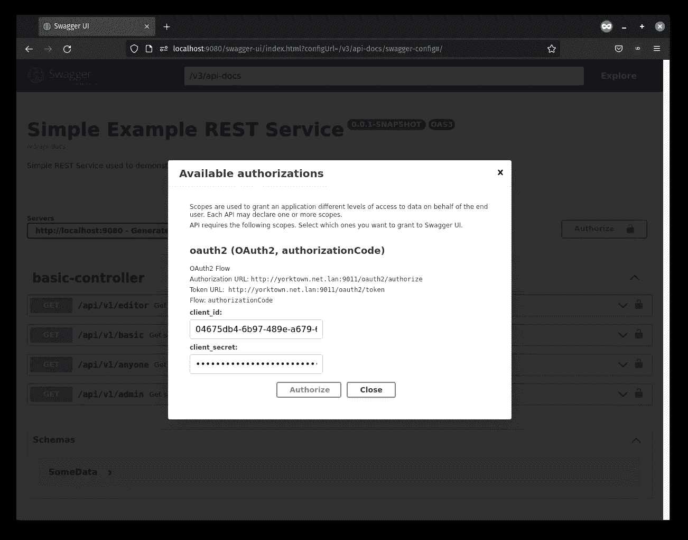

点击“授权”会将我们带到 FusionAuth 进行身份验证。继续，以我们在 FusionAuth 中创建的基本用户身份登录。

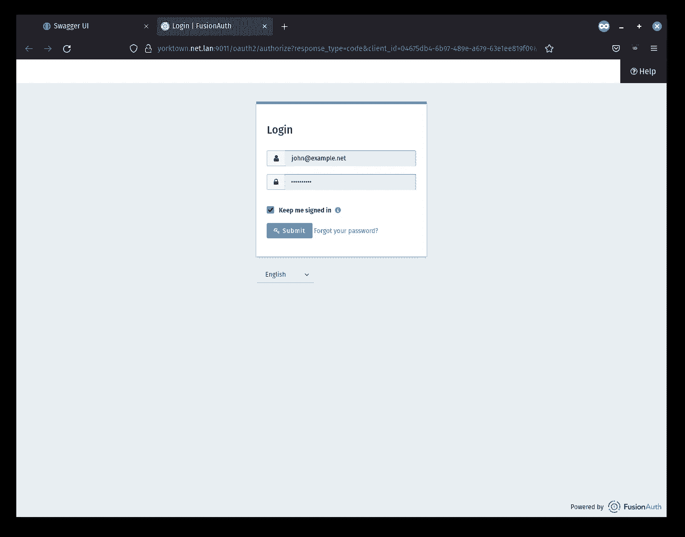

这让我们回到了斯瓦格。关闭授权对话框，让我们再次尝试/api/v1/anyone 端点。

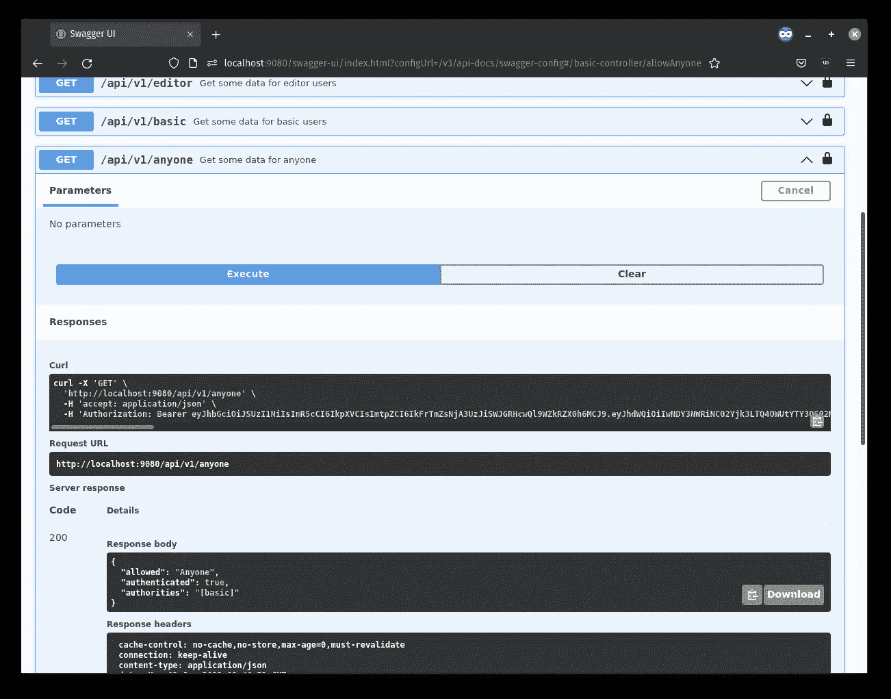

调用再次成功，但是现在我们可以看到用户已经过身份验证，并且拥有“基本”权限。

现在让我们再次尝试/api/v1/basic 端点。

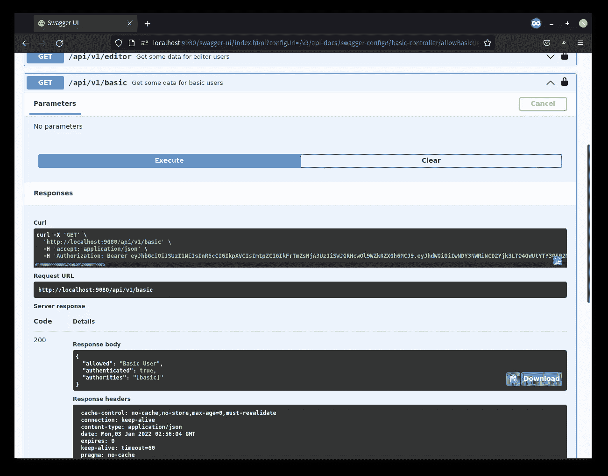

与上次不同，这次调用是成功的，再次告诉我们用户已经过身份验证，并且拥有“基本”权限。

最后，让我们试试/api/v1/admin 端点。

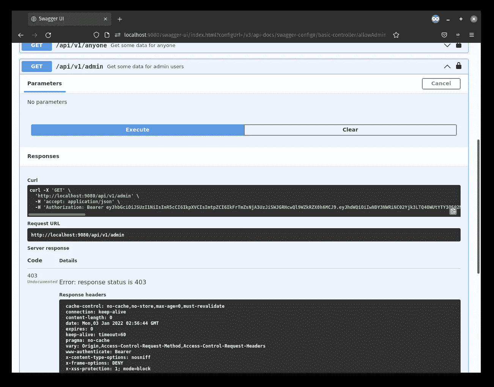

现在，我们得到一个 403 禁止错误，因为用户已经过身份验证，但是没有使用端点所需的权限。您可以随意尝试其他权威机构的用户，但是您可能已经准备好结束本文了。

如您所见，实现 FusionAuth 支持并不需要太多代码，而且在很大程度上，相同的代码也适用于其他身份提供者。Spring 会为您处理大部分工作。即使添加对 Swagger UI 的支持也不需要太多的努力，尽管从文档中并不总是显而易见如何做。

我希望这对你有所帮助。

如前所述，你可以在 Gitlab 的[https://gitlab.com/welarson/spring-rest-fusionauth-example](https://gitlab.com/welarson/spring-rest-fusionauth-example)找到这个例子的源代码。

编码快乐！