# 用 Python 实现 REST APIs

> 原文：<https://blog.devgenius.io/rest-apis-with-python-f330c7ffc6ab?source=collection_archive---------1----------------------->

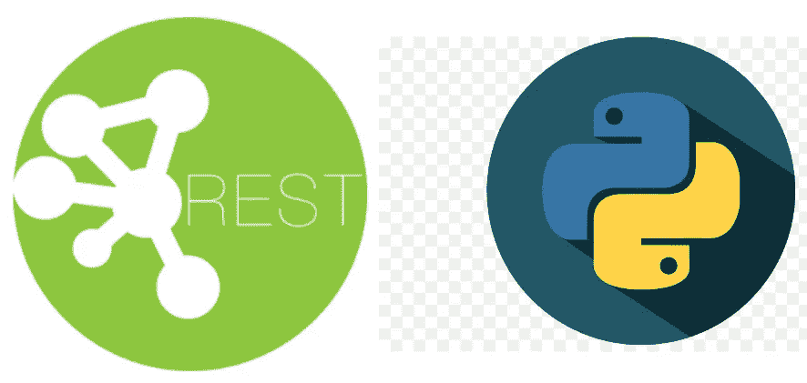

本文旨在概述 REST 架构的基础，并通过使用 [flask](/getting-started-with-flask-python-cbdeca3dcfe) 构建 REST APIs 来创建一个简单的项目。

## **什么是 API？**

应用程序编程接口或简称 API 是两个或多个服务相互通信的一种方式。简而言之，它定义了一个契约，即两个服务如何使用请求和响应相互通信。

## **什么是 Web 服务？**

它是一种策略，使一个应用程序的服务对网络上的其他应用程序可用，并且它是独立于平台的。REST API 是 web 服务的一种类型。

## 什么是休息？

*   表述性状态转移或 REST 是一种架构风格
*   它围绕着资源(一个实体)和使用 HTTP 标准方法通过公共接口访问/修改这些资源的客户机。
*   每个资源由 URI(统一资源标识符)标识
*   资源的状态是当前的资源属性

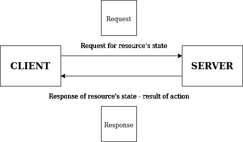

REST 请求和响应

## **请求结构**

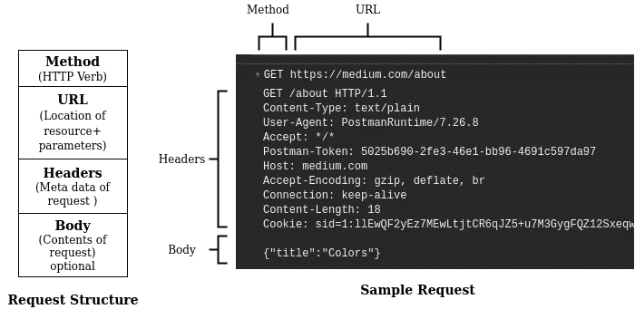

请求结构和示例请求

*   ***HTTP 动词***

HTTP 动词用于设置要执行的操作。最常用的 HTTP 方法有:

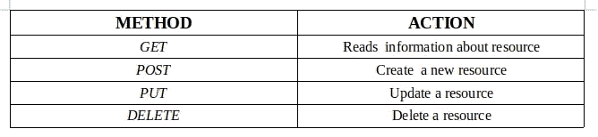

HTTP 方法

*   ***URL 结构***

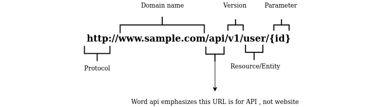

URL 结构

查询参数用于查询 GET 方法中的资源。这些参数在末尾，也就是在'？'之后和用“&”连接。下面是一个例子

*http://www.sample.com/api/v1/stadium?country=india&邦=卡纳塔克*

## 响应结构

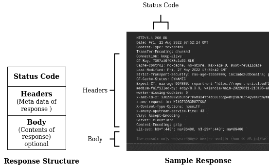

响应结构和样本响应

*   ***状态码***

状态代码通知请求的状态。这是一个 3 位数的整数，其中第一个数字表示响应的类别。

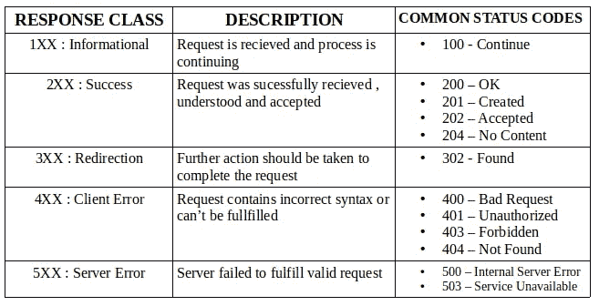

响应代码

# 入门指南

我们将通过构建下面列出的几个 REST APIs 来创建一个简单的项目。这里我们将对一个 *python 列表*而不是一个数据库执行 CRUD 操作。这个列表中有几个字典，每个字典代表一个*玩家*。每个球员字典都有诸如球衣号码、姓名、年龄、角色和合同等关键字。

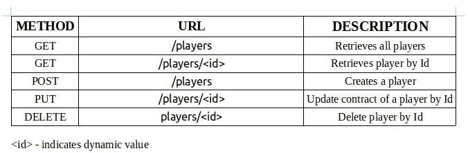

## 1.装置

*   安装库[烧瓶](https://flask.palletsprojects.com/en/2.1.x/installation/)
*   下载[邮递员](https://www.postman.com/downloads/)

## 2.密码

*   app.py

## 3.测试

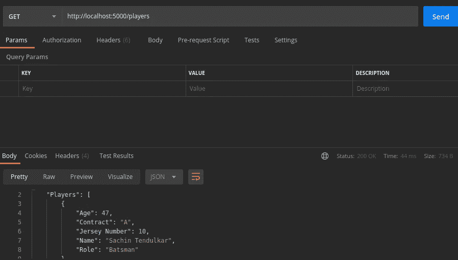

获取[http://localhost:5000/players](http://localhost:5000/players)—状态 200

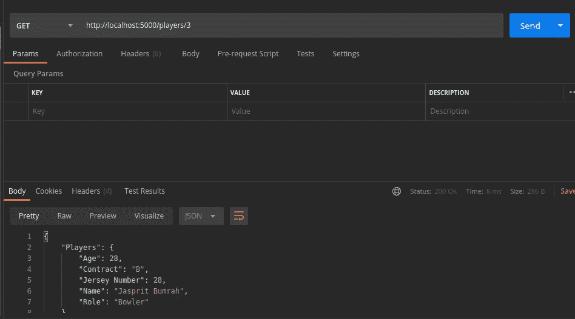

GET[http://localhost:5000/players/](http://localhost:5000/players)3—状态 200

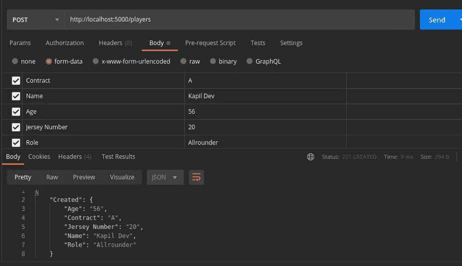

帖子[http://localhost:5000/players](http://localhost:5000/players)—状态 201

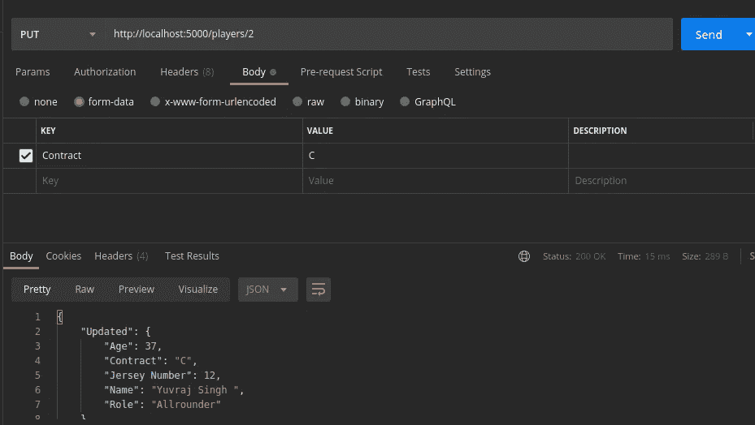

放[http://localhost:5000/players/2](http://localhost:5000/players/2)—状态 200

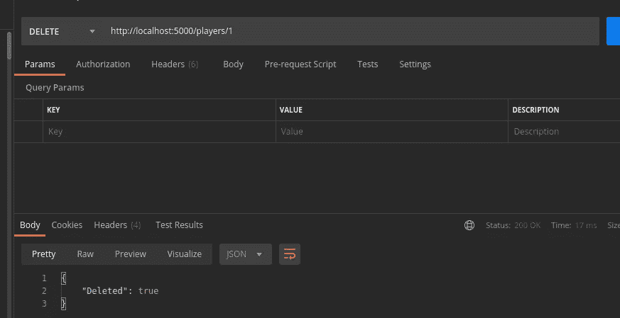

删除[http://localhost:5000/players/1](http://localhost:5000/players/1)—状态 200

# 结论

在这个故事中，我们已经看到了 REST 架构的基础，并通过使用 [flask](/getting-started-with-flask-python-cbdeca3dcfe) 在三个简单的步骤中构建 REST APIs，创建了一个简单的项目。希望你已经理解了 REST API 的基础知识。

感谢阅读！

[Github](https://github.com/ashish-mj/REST_API) [网站](https://ashishmj.vercel.app/) [Linkedin](https://www.linkedin.com/in/ashish-mj/)