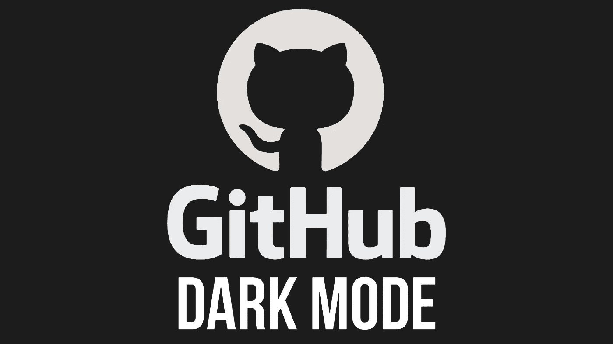

# 让你的眼睛休息一下:黑暗模式即将来到 GitHub

> 原文：<https://blog.devgenius.io/rest-your-eyes-dark-mode-is-coming-to-github-eaab05fa44e2?source=collection_archive---------4----------------------->

黑暗模式爱好者:我们打断你们的常规节目，报告[黑暗模式正式来到 GitHub](https://github.com/isaacs/github/issues/66#issuecomment-733446758) ，根据 [Mennaruuk](https://github.com/Mennaruuk) 。

GitHub 首席执行官 Nat Friedman 在 2020 年 9 月 14 日发布了一条推文，调侃黑暗模式，似乎提高了人们已经很高的期望:

在 11 月 23 日，他似乎确认了不仅黑暗模式即将到来，而且其他用于辅助目的的颜色模式也即将到来:

黑暗模式是一个从[通过一个问题在 GitHub 上最初请求](https://github.com/isaacs/github/issues/66#issue-16434919)到现在已经惊人地持续了 7 年的请求。一个名为[isgithubdarknet . XYZ](https://www.isgithubdarkyet.xyz/)的网站甚至被创建来回答这个简单的问题，即该特性是否已经到来。

本期 GitHub 主题中的请求很能说明问题(也很有趣):

> [**Elias 89**](https://github.com/elias89)**2018 年 11 月 27 日评论**
> 
> **在一个花几个小时看代码的地方没有黑暗模式的事实……2018 年的今天，让人无法接受。Github 真的应该思考一下这个问题，这个话题至少应该有一个正式的答案。**
> 
> **👍 83❤️ 13**
> 
> **[**andrej 730**](https://github.com/Andrej730)**8 月 2 日评论****
> 
> ****请在晚上保护我们的眼睛。****
> 
> ****我不明白为什么 Github 不认为这个问题重要到可以优先考虑和解决。****
> 
> ****👍 5****
> 
> ****[**stephenwithav**](https://github.com/stephenwithav)**10 月 7 日评论******
> 
> ******颠簸。GitLab 现在在 alpha 中有很棒的黑暗模式。GitHub 需要迎头赶上。******
> 
> ******👍 19👀 3******
> 
> ******[**瓦克字节**](https://github.com/wackbyte)**10 月 18 日评论********
> 
> ******七个。几年。******
> 
> ******👍 14😕 4👀 7******
> 
> ******[**10 月 25 日**](https://github.com/MPieter) **评论********
> 
> ******是时候切换到 GitLab 了。******
> 
> ******👍 5😄 8😕 6❤️ 1******

******在弗里德曼所谓的非官方声明后，人们的反应也很大:******

> ******[**克鲁曼**](https://github.com/Kruhlmann)**9 小时前评论********
> 
> ******技术终于出现了******
> 
> ******😄 5******
> 
> ******[**Leonard ssh**](https://github.com/LeonardSSH)**9 小时前评论********
> 
> ******来自 2027 年的问候(ps。汽车仍然由人驾驶)******
> 
> ******😄 3******

******在一天结束的时候，我和许多其他人，正如这篇文章所阐明的，很高兴这种变化即将到来。这表明对你的用户界面/UX 进行改进永远不会太迟。******

******同样，看到 [isgithubdarkyet.xyz](https://www.isgithubdarkyet.xyz/) 最终说“是”也是很光荣的。******

****** [## 通过我的推荐链接加入媒体

### 作为一个媒体会员，你的会员费的一部分会给你阅读的作家，你可以完全接触到每一个故事…

tremaineeto.medium.com](https://tremaineeto.medium.com/membership)******