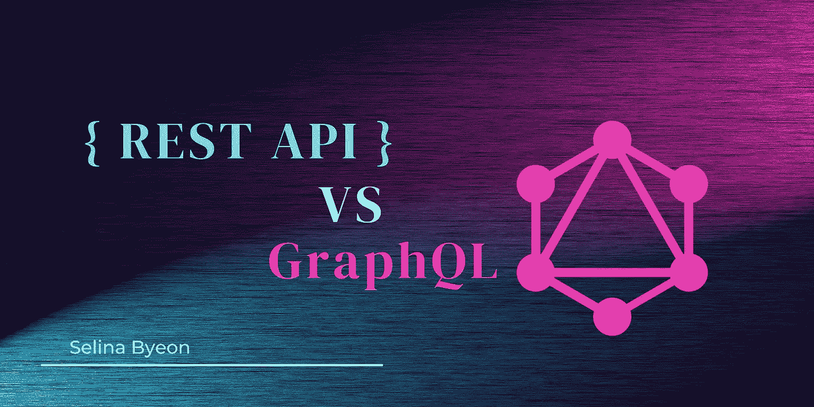
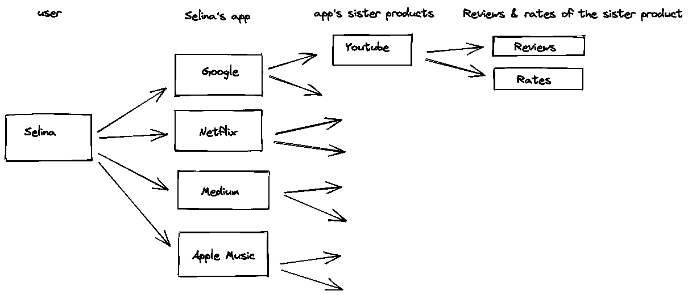
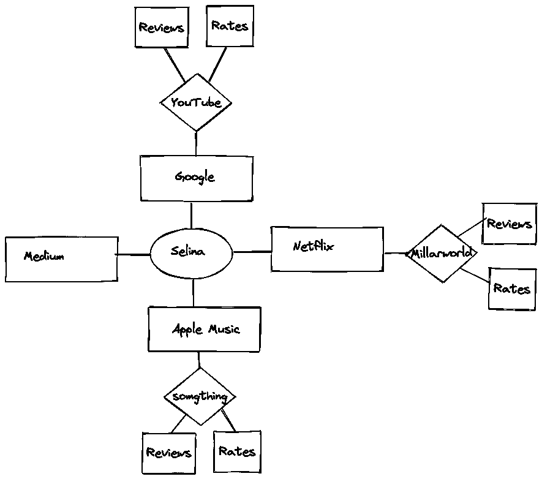

# RESTful 路由与 GraphQL

> 原文：<https://blog.devgenius.io/restful-routing-vs-graphql-4646d264c306?source=collection_archive---------6----------------------->



我有机会在许多使用 RESTful 路由的应用程序上工作，并逐渐理解了它的一些缺点。在快速和频繁的产品更新环境中，RESTful 路由经常变得不太理想。这促使我深入研究 GraphQL 的应用程序，它被证明是一个很好的替代方案！

在这篇文章中，我将回顾以下内容:

1.  **什么是 RESTful 路由？它的缺点还有更多！**
2.  **graph QL 是什么？它如何填补休息的空白？GraphQL 有哪些弱点？**
3.  **总结**

非常明确地说，我并不主张 GraphQL 完全取代 REST 或者 GraphQL 比 REST 更好。相反，我只是在反思我在工作中对 GraphQL 及其应用的了解。

# 1.什么是 RESTful 路由？

什么是休息？

**静止**代表**表象状态转移**。

**RESTful routing** 是一种命名约定/风格，用于以可重用和可预测的方式定义路由和 API。

它还映射出 HTTP 方法(GET、POST、PUT、Delete)和 CRUD 操作(Create、Read、Update、DELETE)。总的来说，RESTful 路由应该有利于开发人员高效地完成应用程序，以提供一致的 URL 路径。

然而，当处理**高度相关的数据**或者处理**快速变化的产品迭代**时，RESTful 路由的缺点就出现了。



注意，这是一个树状结构！

例如，假设我们正在获取 YouTube 应用程序的评论和评级。

为了做到这一点，在 REST 中，我们可以编写如下的 URL 路由参数:

```
GET/app/:appId/sisterProduct/:sisterProductId/reviews/:reviewsId
GET/app/:appId/sisterProduct/:sisterProductId/rates
```

注意，您可能需要进行两次单独的 API 调用来获得`rates`和`reviews`。这将返回如下所示的数据:

```
// review
{ "id": "1", "userId: "1", "description": "it's a nice app!", "likes": 10}
// rate
{
  "id": "1",

  "rate": 5
}
```

从这个例子中，您可能已经注意到了使用 REST 的以下难点:

1.  复杂的 URL 路径
2.  太多 HTTP 请求
3.  过度共享数据-无法只获取特定字段
4.  阻碍了快速部署过程，尤其是当 API 路由由于其静态特性而必须频繁修改时(太不灵活，无法跟上客户端快速变化的特性)

这就是 GraphQL 派上用场的地方，因为它在客户机-服务器通信中更加灵活！

# 2.GraphQL 是什么？

> GraphQL 是 API 的查询语言，也是使用您为数据定义的类型系统执行查询的服务器端运行时。

我认为 GraphQL 比 REST 更高效，原因如下:

1.  声明性数据获取——我们可以决定我们到底想要什么数据，因此它可以防止数据的过度共享
2.  它不公开具有固定数据结构的多个端点，而是只公开单个端点，并响应查询中非常精确的数据
3.  有利于持续部署，因为改变 API 路径既简单又快速！

**什么是图？**见下图:



这是一个粗略的设计草图。**注意，这不是一个树状结构，而是一个图形！**

图形可以为开发人员提供更直观的 API 模型，因为它们类似于内在的心理过程，并且易于捕捉底层过程。

**我们将如何使用 GraphQL？**

1.  首先，我们需要通过定义类型和这些类型上的必要字段来创建 GraphQL 服务。
2.  为每种类型的每个字段编写函数。

3.当 GraphQL 服务运行时，服务器接收 GraphQL 查询以验证类型和字段，然后执行函数以返回结果。

例如，查询:

```
query fetchReviewAndRate ($sisterProduct_id : ID!){ sisterProduct(sisterProduct_id: $sisterProduct_id) { review {      description }    rate {       rate } }}
```

可能会产生以下 JSON 结果:

```
"data" { "sisterProduct" { "review" { "description": "details": "it's a nice app!", } "rate" { "rate": 5 } }}
```

像任何其他产品一样，GraphQL 也有其弱点，尤其是在安全性方面。我并不是说 GraphQL 比其他的更好，但是它确实有闪光的地方。

如需更多阅读，以下是一些有用的参考资料:

[](https://0xn3va.gitbook.io/cheat-sheets/web-application/graphql-vulnerabilities#security-issues) [## GraphQL 漏洞

### 输入类型是特殊的对象类型，它允许您提供分层数据作为字段的参数(与…

0xn3va.gitbook.io](https://0xn3va.gitbook.io/cheat-sheets/web-application/graphql-vulnerabilities#security-issues) [](https://www.howtographql.com/) [## 如何使用 graph QL——graph QL 的完整教程

### 免费的开源教程，全面了解 GraphQL 从零到生产。给你带来的是…

www.howtographql.com](https://www.howtographql.com/) 

# **3。总结**

最后，我认为 REST 中的一些路由问题和数据溢出问题可以通过使用 GraphQL 的一个查询来解决。通过使用 GraphQL 只获取需要的数据，我认为开发前端会更快更容易。

展望未来，我希望了解使用 GraphQL 编写安全 API 的最佳实践，因为它容易受到一些安全攻击。

感谢阅读！

当你喜欢我的帖子并订阅时，你是在支持我的科技之旅，我非常感谢:)

编码快乐！