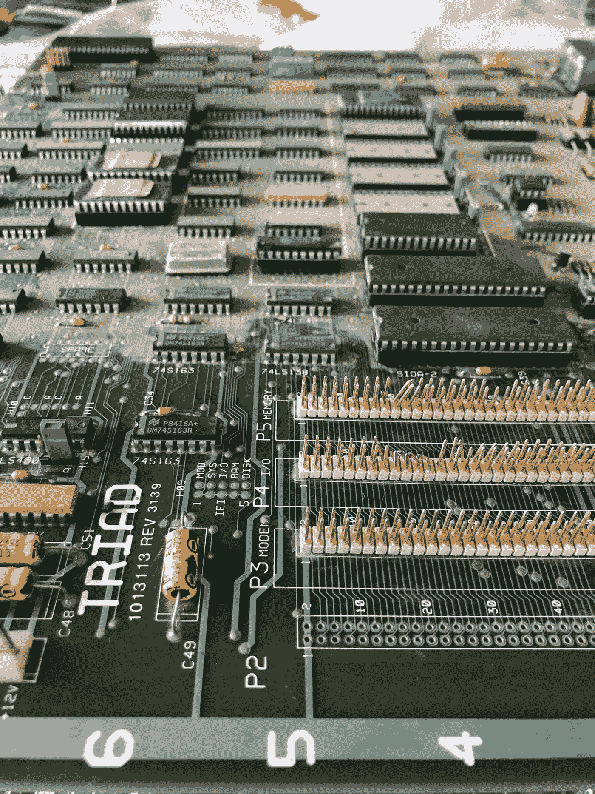
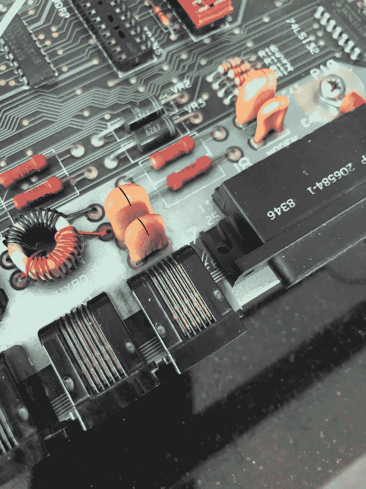
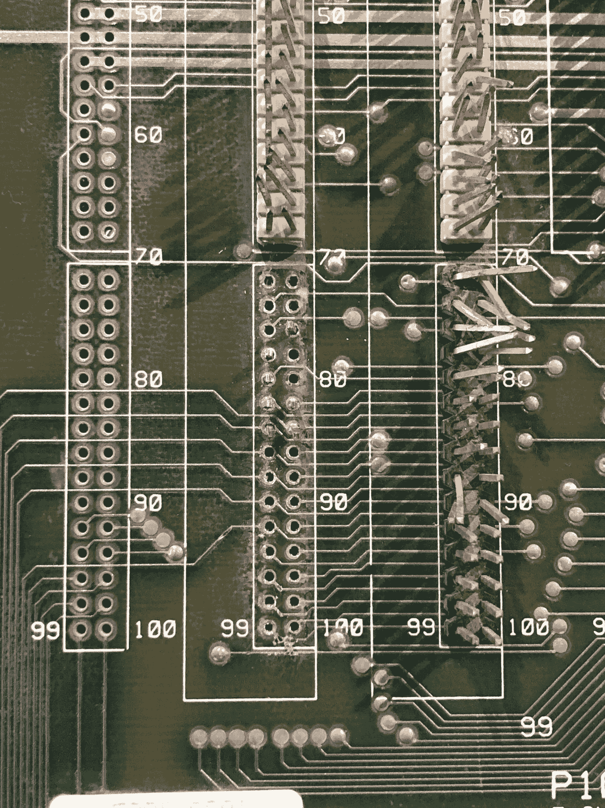
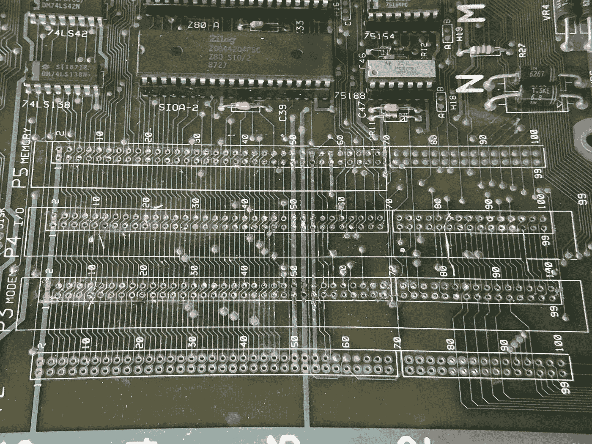
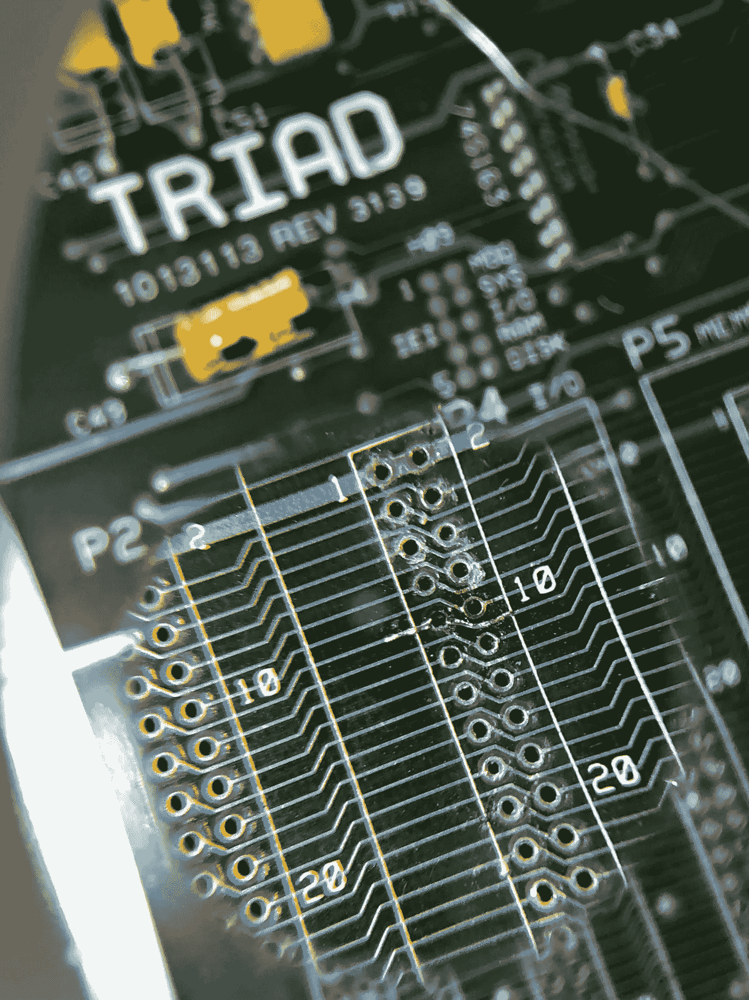
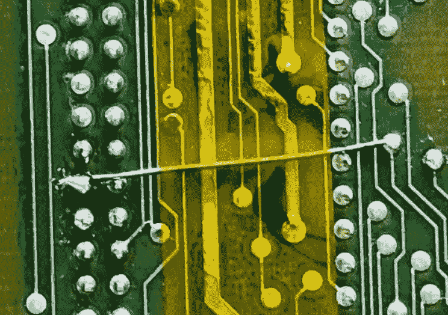

# 恢复三元组 T2556

> 原文：<https://blog.devgenius.io/restoring-the-triad-t2556-b967ccb4c457?source=collection_archive---------17----------------------->

## T2556 三联体系列之二

在这个系列的第一部分中，我意识到我还有很多工作要做。第一步是清洁外壳、布线、PCB 和电子管。然后有一些修理要做。

惊人的对比

这台机器已经在汽车零部件商店的柜台上呆了*年*，或者可能是*几十年*，所以它一路上沾上一些灰尘也就不足为奇了。

在我年轻的时候，我会不顾一切，用一股热水把木板炸开，然后把它放在一个温暖的有大量气流的地方晾干。但我年纪大了，这块板是独一无二的。

然后，第一步是用异丙醇和大量棉签清洁 PCB。我是说真的，一大堆棉花蕾。对于一些更难处理的区域，如轴组件和各种连接器的脊部下方，我首先使用浸泡了酒精的牙刷，然后用棉签擦拭该区域。这整个过程花了两三关，结果却很壮观。

当我这样做时，很明显这确实是一个旧电路板:除了特殊情况，现代工艺只去除了足够的铜以确保走线(元件之间的连接)被隔离，而这里你可以看到大部分铜已经被去除。此外，来回(在电路板的顶面)和上下(在背面)的走线数量似乎多得离谱，所有走线都通过大量过孔(将电路板一侧的走线电连接到另一侧的孔)相连。组件之间的连接路由可能是由一些自动化完成的，但这将是另一个时间要考虑的事情。

缓慢但扎实地

现在来移除那些旧的连接器。你可以在这里看到，我试图删除这个 30 针连接器开始，这是可笑的艰苦工作。用烙铁一次熔化所有 30 个焊点或多或少是不可能的，尤其是当电路板的每一面都有焊料时。

所以我知道我必须剪断每一对针底部的塑料，然后一个一个地把它们取出来。

虽然一卷焊芯有助于移除，但我后来学到的几个教训将被证明是非常有用的。

1.  更早地在焊点上涂上新的焊料会使它们更容易使用。
2.  也许如果我花 50 美元买了一个焊接再加工站，我就可以省下几个小时的痛苦和努力，因为热空气更能温和地将热量分散到一个区域。
3.  有一种特殊的焊料合金，其熔点比普通焊料低得多。把这个加到关节上可能会使整个过程更容易。
4.  使用助焊剂笔可能也有帮助。

万岁！

然而最终，战斗胜利了，所有的连接器都让位于下面的东西。

你可以看到的棕色斑点区域是助焊剂的残留物，尽管当你刚刚在电路板上倾倒了一吨焊料以说服零件分离时，这种现象很常见，但它很难看，而且很明显，我很久没有做过这样的事情了。可能永远不会。

幸运的是，可以用异丙醇和丙酮的混合物轻轻擦洗，然后用拖把擦干。这是一个很好的教训，我现在身边总是有一瓶丙酮。

不对不对。

不幸的是，这不全是好消息。

有一些地方我用了太多的力或者太多的热，铜的痕迹从电路板上脱落了。

不太好。

通过强力胶粘住丢失的痕迹，用细线穿过缝隙来修复丢失的痕迹是可能的，但不是全部。在某些情况下，损坏太严重了，我不得不使用 PCB 背面的 bodge 电线进行桥接。

这种永久性的损坏是这个项目中最令人沮丧的部分，令人非常遗憾。至少我有一个清单，如果我决定再次做这样的事情，我会做不同的事情。

PCB 下侧的一根 bodge 线，用 kapton 胶带保护

剩下的清理工作简单明了:对于隔热材料和塑料，我用温水和洗洁精小心翼翼地涂抹，牙刷在难处理的角落再次派上了用场。

另一个唯一具有挑战性的清洁部分是米色的箱子。洗洁精和水去除了一些污垢，酒精多一点，丙酮什么也没做(我还担心丙酮会熔化外壳，但结果是奶油色是某种耐磨的瓷漆。

最后，唯一有实质性改变的是用小苏打轻轻摩擦表面。或许《酒吧老板的朋友》中的磨料也能起到同样的作用？

接下来我检查了主板上的电解电容，电源和灯管驱动。这些往往会随着时间的推移而腐烂，最终爆裂，但它们看起来都没问题。这是一个质量好、经久耐用的产品。可能在某个时候，这对我来说是一个令人讨厌的惊喜，但当它发生时，我会担心的。

我仍然有安装支架要修理，电位计要更换，但我的耐心越来越少。我想把 PCB 插回电源，看看会发生什么。

结果是一连串 R2-D2 风格的哔哔声，接着是连续的*哔哔声*警报声。这是什么意思？好吃吗？

我找到答案的唯一方法是学习更多关于硬件的知识。但那是为了[改天](https://medium.com/@alexwking/tracing-the-triad-t2556-1c9ff7822f0e)。