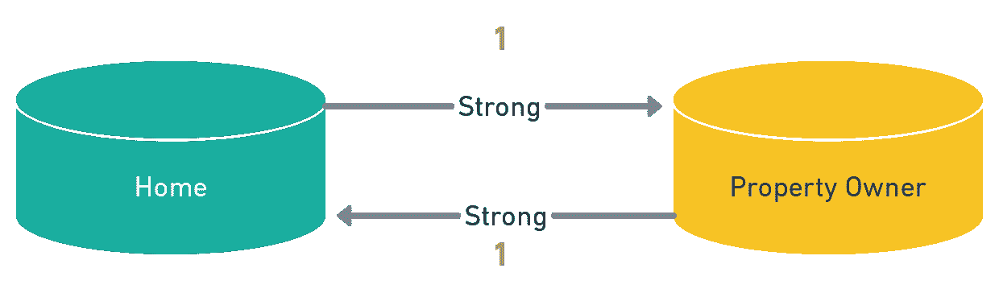
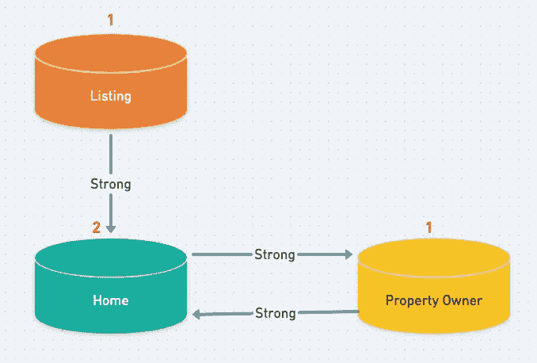
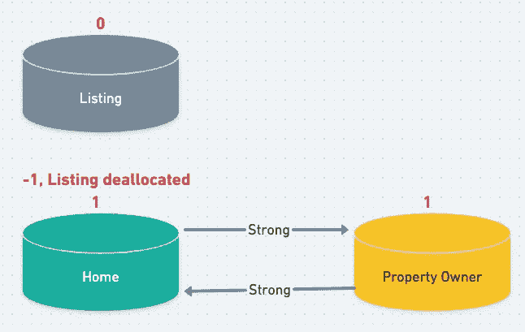
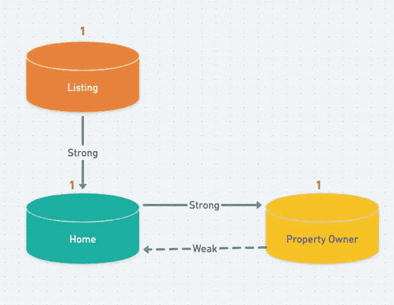
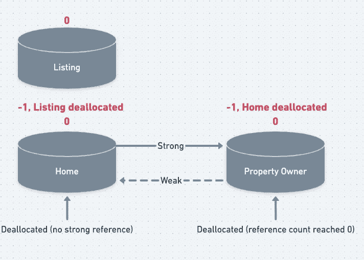

# 保留周期和弱对无主

> 原文：<https://blog.devgenius.io/retain-cycles-and-weak-vs-unowned-643c676821fc?source=collection_archive---------2----------------------->

## 形影不离的二人组

## 什么是保留周期？我为什么要用弱？我什么时候使用无主？

## 在本文中，您将了解到:

*   内存管理
*   自动参考计数
*   保留周期
*   强对弱对无主的含义，以及何时使用它们

保留周期导致你的应用程序抓住它应该放下的东西不放

# 引入了内存管理

在软件开发中，内存管理是高效、可维护的应用程序的一个重要方面。当我们谈论移动开发时，内存管理绝对是*至关重要的，因为我们的设备拥有更少的资源，并且比他们的嵌入式设备更频繁地消耗这些资源。在 iOS 世界中，如果你的应用的内存空间达到一个 ***未知* *极限*** ，糟糕的内存管理会导致 OS 杀死你的应用。*

内存是我们在应用程序中用来临时存储数据的东西。如果你创建了一个类的实例，它会在内存中存储一次。内存是一种有限的资源，通常由 Swift 妥善管理。这种管理是在后台完成的，使用了一种叫做自动引用计数(ARC)的东西。ARC 为我们管理了大量的内存空间，但它不能完成所有的工作。

# 自动参考计数

我前面提到过，当你创建一个类的实例时，它只在内存中存储一次。ARC 做的是记录这个实例被指向的次数。每指向一次，计数就增加 1。当指向它的某个对象被释放时，计数减 1。

这很有用，因为如果没有保存对实例的引用(也就是当计数达到 0 时)，它将被从内存中完全删除。这释放了内存空间让其他东西使用，并防止我们达到任何会杀死我们的应用程序的极限！

你可能已经意识到，尽可能好地管理你的内存是至关重要的，因为你不知道操作系统什么时候会终止你的应用。糟糕的内存管理也会导致丢帧(不稳定的性能)，奇怪的错误，以及其他的一些问题。所以让我们来学习如何管理这个空间的一部分。

# 保留周期

在某些情况下，ARC 会导致两个实例永远保持在一起——即使没有其他东西指向(使用)它们。最常见的情况是，我们有一个类具有一种类型的属性，而它们都有另一种类型的属性。例如，一个家有一个财产所有者，一个财产所有者有一个家。

如果我们像往常一样建模并创建示例实例，我们可能会得到这样的结果:

`house`和`owner`属性都是`Strong`。`Strong`是 Swift 中的默认值，导致参考计数保存在 ARC 中。

Strong 具有内存计数器的属性。默认情况下，属性是强的。他们在 ARC 进行计数

在我们的弧形图中可能是这样的，红色数字是引用计数。

在我们的应用程序中，一个家必须有一个产权所有者，产权所有者必须有一个家

我们对这段代码所做的就是创建一个保留循环。属性所有者将一直保留在内存中，因为它的引用计数至少为 1，Home 也是如此。

因此，假设这个家是一个住宅和财产所有者的县数据库中的列表，我们的应用程序负责显示所有列表。现在我们可能有一个`Listing`类。这个类有一个`Home`，(并且记住`Home`有一个`PropertyOwner`)—

这就是我们引用计数的样子。

即使当列表被释放时，Home 仍然有一个来自 PropertyOwner 的强引用

好的，记住这是我们应用程序中众多 列表中的 ***之一。假设我们将它显示在一个数组中，其中每个`Listing`实例都是可选的。稍后当一个`Listing`被释放(从内存中移除)时，将会发生的是我们的家和财产所有者将会保留。通常 ARC 会看到`Home`没有引用计数，两者都会被释放——但是它们指向对方。因为它们指向彼此，所以都不会自动从内存中删除。***

列表被释放，但是 Home 和 PropertyOwner 仍然保留，因为它们相互引用

所以现在这个`Home`和`PropertyOwner`仍然在内存中，但是没有在任何地方被使用。这是一个问题——记住，我们有许多`Listing`,它们中的任何一个都可能被释放，并且随时会添加更多。假设我们在一个`TableView`中展示它们。随着用户滚动，我们将添加新的`Listing`实例。当单元格滚动出屏幕时，`Listing`将被释放，但是他们的家和财产所有者将保留在内存中。最终，我们可能会撞上 iOS 内存墙，我们的应用程序会被杀死…或者性能会受到影响。这就是保留循环造成的伤害。

## 防止保留周期

我们可以通过设置`Home`或`PropertyOwner` `weak`或`unowned`中的属性来解决这个问题。为了我们的图，让从`PropertyOwner`到`Home`的关系变弱可能是最有意义的。但是这两个方向都解决了保留周期问题。

因为从 PropertyOwner 到 Home 的关系是弱的，这不再增加 Home 的引用计数

当任何属性不再有`***strong***` 引用时，它将被标记为解除分配，并在需要时从内存中删除。这意味着当`Listing`被移除时，没有任何东西有对`Home`的`strong`引用——所以`Home`被释放。现在，当`Home`被释放时，`PropertyOwner`的引用计数减少到 0，它也被释放。你打破了保留周期！

现在，当列表被释放时，每个对象都被释放，因为所有计数都减少到 0

# 软弱？无主？

`Weak`和`unowned`是向 iOS 发出信号的两种不同方式，表明我们不希望它为我们管理引用计数。我们希望一旦没有其他东西持有对它的引用，就释放它。

## 无力的

弱属性是不包含引用计数的可选属性。弱属性可以为零，如果某个对象以“干净”的方式访问一个属性(比如用可选的链接)，执行可以继续。

弱-此可选引用可以随时取消分配。它在 ARC 中没有计数

## 无主的

像`weak`属性一样，`unowned`属性也是可选的，不包含计数。但是要注意，与 weak 不同，它们是隐式展开的(`!`)，这意味着它们被暗示总是有一个值。如果有东西访问一个没有主人的零属性，应用程序就会崩溃。

无主-如果它没有值，并且您尝试访问它，您的应用程序将会崩溃。类似于强制展开的属性，但它不包含强引用，因此它不包含计数。

# 如何决定何时使用无主或弱

unowned 和 weak 之间的主要区别本质上是当一个被访问并且它持有一个 nil 值时执行会发生什么。因此，你决定使用其中一个而不是另一个应该基于这一点。如果你还没有这样做很长时间，或者像我一样已经被困在有限的用例中很长时间，你可能会问为什么你会 ***曾经*** 想要你的应用崩溃。安全是一个原因。再一个就是用户体验。

没错， ***有时候*** 让应用崩溃比让它继续使用错误的数据更好的用户体验。本质上，如果你想让应用程序在一个属性被访问时崩溃，并且它的值为零，那么就让它成为无主的。否则，弱可能是更安全的选择。还需要考虑设计决策——可选属性会增加复杂性。所以如果你确定它总是有一个非零值，并且你觉得很勇敢，也许可以让它无主，即使没有其他含义。

希望我已经给了你一个好主意，如何开始管理你的 iOS 应用程序的内存，也许是你的应用程序缓慢或不断崩溃的原因。说到这里，[剖析工具](https://developer.apple.com/library/archive/technotes/tn2434/_index.html)是一个捕捉内存问题的好方法…但那是以后的事了！

无论如何，有了一些知识，你就可以开始决定如何避免你的应用程序中的保留周期，以及为什么有些片段会使用`unowned`和`weak`。

评论里见！⏬