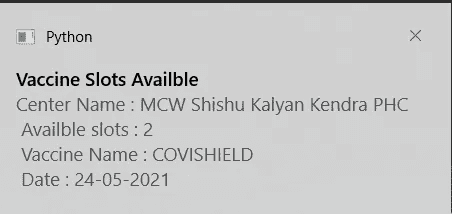

# 检索您所在地区的疫苗槽(Python Web-screwing)

> 原文：<https://blog.devgenius.io/retrieve-vaccine-slots-in-your-locality-python-web-scrapping-e0005c42c5b0?source=collection_archive---------4----------------------->


丹尼尔·施鲁迪在 [Unsplash](https://unsplash.com/?utm_source=unsplash&utm_medium=referral&utm_content=creditCopyText) 上拍摄的照片

我知道很难买到疫苗。在过去的两周里，我一直在努力争取一个职位；仍然没有得到它。因此，我决定创建一个 python 脚本来通知我关于疫苗接种时段的信息。

为此，我们将使用印度政府提供的 API，并废弃该页面。如果您尝试向服务器发出大量请求，您的 IP 地址可能会被阻止。当心！！！！！！！！！！！

# **什么是网页抓取**

**网页抓取**是使用机器人从网站提取内容和数据的过程。

# **Cowin-API**

您可以从这个页面检查 API。([链接](https://apisetu.gov.in/public/marketplace/api/cowin#/Appointment%20Availability%20APIs/calendarByPin))

让我们来看看我们将要对网络做出的响应。我们必须创建一个模型来提取这些信息。

演示 API 调用:[https://cdn-API . co-vin . in/API/v2/appointment/sessions/public/calendar bypin？pin code = 110001&date = 23-05-2021](https://cdn-api.co-vin.in/api/v2/appointment/sessions/public/calendarByPin?pincode=110001&date=23-05-2021)


我们必须为每个中心的每个会议找到`available_capacity`字段。

# **编码部分**

首先，安装`requests`和`plyer`库。

`pip install requests`和`pip install plyer`

导入这些库，它们将是必需的。`requests`用于发出 HTTP 请求，`plyer`用于发送桌面通知。`time`和`datetime`用于处理日期时间相关的事情，需要将它们转换成合适的格式。

```
import requests
import time
from datetime import datetime,timedelta
from plyer import notification
```

现在，我们将定义一些用于搜索的参数。你必须输入年龄，密码和你想搜索的天数。API 允许我们搜索未来 7 天的可用性。

```
user_age = 55
pincodes=["782411","782410"]
num_days = 6
```

我们还必须将日期转换成合适的格式，以便我们可以进行 API 调用。我们从`datetime`中提取今天的日期，并相应地转换下一个`num_days`。

```
actual = datetime.today()
list_format = [actual + timedelta(days=i) for i in range(num_days)]
actual_dates = [i.strftime("%d-%m-%Y") for i in list_format]
```

现在是主要部分。我们必须搜索所有给定日期的所有密码。此外，需要对所有会议的所有中心进行搜索。如果满足任何条件，我们将打印结果。该结果将作为通知发送到桌面。搜索完成后，我们将等待 5 分钟(使用睡眠功能)并再次继续搜索。

```
while(True) :
    availbleCenters = 0

    #We have to search for all pincodes for all the given dates
    for pincode in pincodes:
        for date in actual_dates:
            #The API to hit for our operation
            URL = f"https://cdn-api.co-vin.in/api/v2/appointment/sessions/public/calendarByPin?pincode={pincode}&date={date}"
            header = {
                'User-Agent': 'Mozilla/5.0 (Windows NT 6.1; WOW64) AppleWebKit/537.36 (KHTML, like Gecko) Chrome/56.0.2924.76 Safari/537.36'}

            result = requests.get(URL, headers=header)
            #If the response is 200 then proceed
            if result.ok:
                response_json = result.json()
                #We have to search for available capacity in each session for each center
                for center in response_json['centers']:
                    for session in center['sessions']:
                        #If the condition is satisfied like the available capacity is not zero and age limit is also satisfied then print them
                        if (session['available_capacity']>0 and session['min_age_limit']<=user_age and session["date"] == date ):
                            availbleCenters = availbleCenters+1
                            print('Center Name : ' , center['name'])
                            print('Available slots : ' , session['available_capacity'])
                            print('Pincode : ' , pincode)
                            print('Vaccine Name : ' , session['vaccine'])
                            print('Date : ', session['date'])
                            print('----------------------------------')

                            centerName = center['name']
                            availbleSlots = session['available_capacity']
                            dateOfSlot = session['date']
                            vaccineName = session['vaccine']
                            #plyer is used here to notify people in desktop.
                            notification.notify(
                                title="Vaccine Slots Availble",
                                # the body of the notification
                                message=f"Center Name : {centerName} \n Availble slots : {availbleSlots} \n Vaccine Name : {vaccineName} \n Date : {dateOfSlot}",
                                #You can add a icon here also in the .ico format
                                # the notification stays for 5sec
                                timeout=5
                            )

            else:
                print("No Response")

    if availbleCenters==0:
        print("No availble slots in these areas...")
        notification.notify(
            title="No Vaccine Slots are available",
            # the body of the notification
            message="Sorry, there is no available slot in your area",
            # You can add a icon here also in the .ico format
            # the notification stays for 5sec
            timeout=5
        )
    else:
        print(f"Hurray. Found {availbleCenters} results...")
    #The process will resume after 300 seconds. That means we will make the APi call again after 5 minutes.
    time.sleep(300)
    print("Waited for 5 minutes. Start searching again")
```

运行此脚本后，如果您所在的区域有任何可用的插槽，您将每 5 分钟收到一次通知。万岁！！！！！我们已经完成了工作。

通知会像这样显示。



结果也会像这样打印在控制台上。


如果这些 pin 码中没有可用的插槽，您将在控制台上收到“无响应”。您将收到通知，说明没有可用的疫苗槽。您可以轻松调整通知时间、密码和天数。去玩吧。

完整的作品可以在这里找到。

[](https://github.com/sksaikia/Cowin-Notifier) [## sksaikia/Cowin-通知程序

### 这是一个 python 脚本，它可以通知您可用的疫苗接种位置。它使用 CoWIN 提供的 API 和…

github.com](https://github.com/sksaikia/Cowin-Notifier)