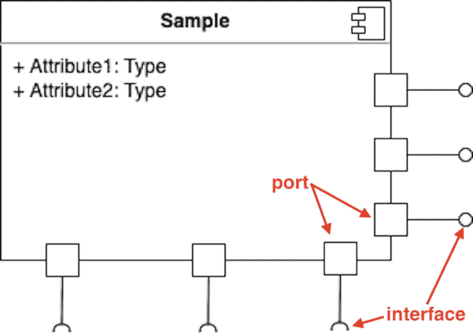
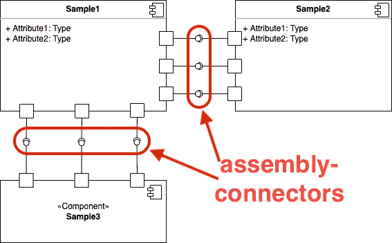
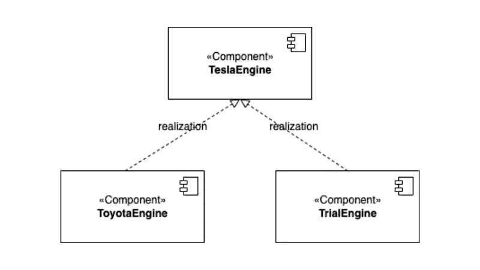

# 可重用部分 UML 中的组件图

> 原文：<https://blog.devgenius.io/reusable-pieces-the-component-diagram-in-uml-5fe0b5951dfd?source=collection_archive---------9----------------------->

# 与首席执行官的随意交谈

上周，我有机会与一位首席执行官和一位项目经理共进午餐，讨论如何在他们当前的团队中实施 Scrum 框架。首席执行官指出，敏捷寻求的是“**工作软件，而不是全面的文档**”，这让我很惊讶，因为我从来没有听说过任何一位经理会对敏捷精神有这样的认知。

他指出这一点的原因是，在他的团队中，有一个成员似乎沉迷于采用许多工程技术，如坚实的原则、设计模式等。，而不是按时交付所需的功能。

嗯，即使在 DDD(领域驱动设计)，它也专注于制作满足商业目标的软件，而不是纯粹的技术需求，所以过度设计在实际开发中应该是可以避免的。相反，我们应该注意的是哪里可以模块化以及为用户生成有意义的功能。

为了找出我们可以经常重用的地方，在软件工程中，我们倾向于提取所需的特性并将它们模块化。在分析阶段，我们将应用**组件图**来描述。

# 永恒软件与可重用部分

开发人员总是在寻找不需要重构的永恒特性，这看起来像是白日做梦。但是我们可以发现经常使用的部分，使其成为其他组件实现的模板。

在 UML 中，我们倾向于利用一个**组件图**来描述什么应该是可重用的。在 [OOAD](https://www.amazon.com/Object-Oriented-Analysis-Design-Applications-3rd/dp/020189551X) 中，它给出了如下精确定义:

> 组件图是一个可重用的软件，它提供了有意义的功能集合。

该定义透明地呈现了组件图的两个视角。首先，它代表的是可以在真实场景中反复使用的软件的一部分。第二，它提到了功能的集合，这意味着一个组件可以为其他模块提供各种功能。因此，我们需要进一步研究组件图包含的细节属性。

# 组件图的要点

以我的拙见，我想从三个方面来讨论组件图的要点。

*   **组件符号**

如上图所示，一个组件图可以被描绘成一个矩形，在右上角有一个类似书签的符号。为了描述其可重用性和功能的集合，添加了**端口**和**接口**来支持组件的可扩展性。

一般来说，端口被视为与其他组件通信的端点，具有预定义的接口。具体来说，我们可以将一个接口进一步分为两部分:**提供的接口**和**需要的接口**。

前者表示组件为外部组件使用提供了实现的规范。例如，被称为资源访问器的 RESTFul APIs 被发布供用户调用。后者描述了一个组件需要一个由附加组件提供的规范，这意味着它需要其他组件的帮助。以汽车引擎为例，它必须包含一个插件来接收来自电板的信号。因此，它需要一个接口来帮助自己从另一个接口获取资源。

*   **元件图**

在组件的定义中，我们知道它是软件的可重用部分。所以进一步的问题是如何利用一个组件来不断地提供它的功能。关键部分在于它的接口。总的来说，我们倾向于将其接口称为**装配连接器**或**接口连接器**，因为它们的行为就像胶水一样与不同的组件协作。

以上图为例，组件 **Sample1** 分别包含 3 个提供的接口和 3 个需要的接口。这意味着它可以提供功能，也需要外部功能来完成自己的任务。组件 **Sample2** 需要来自 **Sample1** 的功能，因此它需要与 **Sample1** 组合。另一方面， **Sample1** 也获得组件 **Sample3** 提供的能力，因此它必须与 **Sample3** 的规格兼容。

*   **组件实现**

作为一个组件，它是一个与其他模型协作的可重用规范。它本质上是一个模板，可以由各种分类器实现，以再现它的行为并提供专门的功能。在 UML 中，我们通常用实现关系来处理实现组件规格说明的模型。

例如，如果有一个组件 **TeslaEngine** 指定了特斯拉引擎的标准，那么其他汽车工厂可以遵循该组件提供的接口来实现自己的专用引擎。以这种方式，实现关系隐含了客户(ToyotaEngine，TrialEngine)和供应商(TeslaEngine)之间的契约。因此，供应商必须保证提供所有功能，而客户必须遵守供应商制定的规则。

# 蔻驰杂音

从商业的角度来看，我更喜欢发现可以标准化的软件的核心逻辑，这样我们就可以从它的可重用性中获益。此外，一个组件帮助我们认识到它是否可以进一步优化，因为它必须与其他组件协作。简单性和可重用性成为组件图表现的优势。

—

如果你认可我与你分享的价值，请做如下:
1。**鼓掌**文章
2。**订阅**我最新内容
3。**在其他平台关注**我了解更多信息
-IG:[@ ur _ Agile _ coach](https://www.instagram.com/ur_agile_coach/)
-播客(中文):[敏捷火箭](https://player.soundon.fm/p/7f7dc3df-d738-405c-8cf9-02157a92ec61)
- Youtube: [你的敏捷蔻驰](https://www.youtube.com/channel/UCzD0wQmD1n4MuTKk-JocACA)
- LinkedIn: [吴宗祥](https://www.linkedin.com/in/tsung-hsiang-wu-8542409b/)

如果您需要咨询或其他形式的合作，请发送邮件至:【urscrummaster@gmail.com】