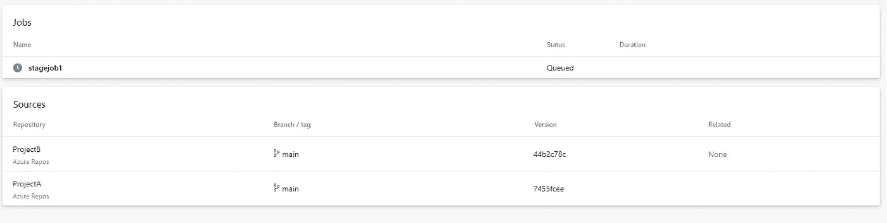

# 跨组织和项目重用 Azure DevOps Pipeline Yaml 模板

> 原文：<https://blog.devgenius.io/reuse-azure-devops-pipeline-yaml-templates-across-organizations-and-projects-aedd03390e08?source=collection_archive---------4----------------------->


工作流程

在本文中，我将解释跨组织和项目共享 Azure DevOps pipeline yaml 模板的过程。

**先决条件:**

1.  您可以访问 2 个 Azure DevOps 组织

> 要创建新组织，请遵循下面提供的官方文档

[](https://docs.microsoft.com/en-us/azure/devops/organizations/accounts/create-organization?view=azure-devops) [## 创建一个组织- Azure DevOps

### 了解如何使用个人 Microsoft 帐户、GitHub 帐户或工作或…

docs.microsoft.com](https://docs.microsoft.com/en-us/azure/devops/organizations/accounts/create-organization?view=azure-devops) 

> 要创建新项目，请遵循下面提供的官方文档

[](https://docs.microsoft.com/en-us/azure/devops/organizations/projects/create-project?view=azure-devops&tabs=browser) [## 创建一个项目- Azure DevOps

### Azure DevOps 服务| Azure DevOps 服务器 2020 | Azure DevOps 服务器 2019 | TFS 2018 您创建一个 Azure DevOps…

docs.microsoft.com](https://docs.microsoft.com/en-us/azure/devops/organizations/projects/create-project?view=azure-devops&tabs=browser) 

# 在 Azure DevOps 组织中共享模板

首先，假设您有权访问 2 Azure DevOps 组织。

**步骤:**

1.  登录 dev.azure.com，进入您的第一个组织，例如——**adotemplatdemo**


2.转到您的 Azure DevOps 项目→ Azure Repo 并创建一个文件“stage.yaml ”,如下所示


来源

> stage.yaml

```
stages:
  - stage: stage1
    jobs:
      - job: 
        steps:
          - bash: echo Reusing Template from ADOTemplate Collection
```

3.生成个人访问令牌

点击用户设置→个人访问令牌


单击新令牌，提供详细信息并创建 PAT

保存 PAT，以便在将来的活动中使用。


4.转到你的第二个组织，例如- **ADOCollection** 并转到你的项目


5.创建服务连接

转到项目设置→服务连接

单击“新建服务连接”并选择“Azure Repos/Team Foundation Server”


提供之前创建的组织 url 和 PAT 令牌

给服务连接起一个有意义的名字，然后点击 Verify and save


服务连接

6.转到管道，用下面的 yaml 文件创建一个新的管道

```
trigger: noneresources:
  repositories:
    - repository: templates
      type: git
      name: TemplateProject/TemplateProject
      endpoint: 'ADOCollection-ADOTemplateDemo-ProjectB'
      ref: refs/heads/main
pool:
  vmImage: 'ubuntu-latest'stages:
  - template: stage.yaml@templates
```

请注意，端点值应该是您创建的端点，名称应该是“项目名称/存储库名称”

还要提到您想要从中获取数据的分支，默认情况下是 ref/heads/master

7.执行管道以查看结果


管道

# 跨 Azure DevOps 项目共享模板

首先，假设你有 2 个 Azure DevOps 项目的访问权限。

**步骤:**

1.  登录 dev.azure.com 并转到您的组织

2.转到您的 Azure DevOps 项目，例如项目 A → Azure Repo，并创建一个文件“stage.yaml ”,如下所示


来源

> stage.yaml

```
stages:
  - stage: stage1
    jobs:
      - job: stagejob1
        steps:
          - bash: echo Share Template Across Projects
```

6.转到您的 Azure DevOps 项目，例如项目 B → Azure 管道，并使用以下 yaml 文件创建一个新管道


项目 B

```
trigger: noneresources:
  repositories:
    - repository: templates
      type: git
      name: ProjectA/ProjectA
pool:
  vmImage: 'ubuntu-latest'stages:
  - template: stage.yaml@templates
```

请注意，端点值应该是您创建的端点，名称应该是“项目名称/存储库名称”

7.执行管道以查看结果



结果

**其他资源:**

[](https://docs.microsoft.com/en-us/azure/devops/pipelines/process/templates?view=azure-devops) [## 模板- Azure 管道

### 模板允许您定义可重用的内容、逻辑和参数。模板有两种作用。你可以插入…

docs.microsoft.com](https://docs.microsoft.com/en-us/azure/devops/pipelines/process/templates?view=azure-devops) 

我希望你喜欢阅读这篇文章，随时添加你的评论、想法或反馈，不要忘记在 linkedin 上联系。