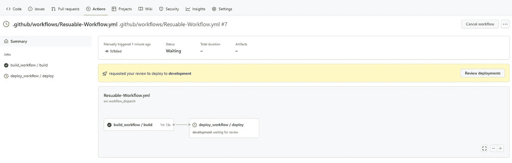

# 在 GitHub 操作中重用工作流

> 原文：<https://blog.devgenius.io/reuse-workflow-in-github-actions-21d8374133f3?source=collection_archive---------1----------------------->


工作流程

在本文中，我将演示重用 GitHub Action 工作流的过程，以避免重复和重用现有的工作流。

在本文中，我们将使用 GitHub workflow 在两个环境中部署一个 angular 应用程序。

在本文中，我将演示使用 GitHub 将 angular 应用程序部署到 Azure Web App 的过程

该演示将用于将应用程序部署到一个 web 应用程序，但是流程保持不变，并且可以用于部署多个应用程序。

**先决条件:**

1.  你有一个带有角度代码的 GitHub Repo

请点击此处找到本演示中使用的回购的链接

2.您拥有有效的 Azure 订阅

3.您已经在本地计算机中配置了 Azure CLI

**安装 Azure CLI:** 按照[安装 Azure CLI](https://docs.microsoft.com/en-us/cli/azure/install-azure-cli) 中提供的说明来设置您的 Azure CLI 环境。

# 步骤:

1.  **创建资源组**

```
az group create --name AzureWebAppDemo --location "eastus"
```

**2。创建应用服务计划**

> *我们正在创建一个免费层应用服务计划，用于演示目的*

```
az appservice plan create -g AzureWebAppDemo -n MyFreePlan --sku Free
```

**3。创建 Azure Web 应用程序来托管 Angular 应用程序**

```
az webapp create -g AzureWebAppDemo --runtime "node:14LTS" -p MyFreePlan -n AzureAngualrWebAppaz webapp create -g AzureWebAppDemo --runtime "node:14LTS" -p MyFreePlan -n AzureAngualrWebApp-QA
```

> 我们在相同的资源组中创建 web 应用程序，因为它是用于演示的，但是对于您的实际工作负载，它将位于不同的订阅/租户中

**4。使用以下命令创建服务主体并保存信息**

> *请创建具有所需适当权限的服务主体*

```
az ad sp create-for-rbac --name rgContributorSP --role Contributor --scopes subscriptions/<<subscriptionid>>/resourceGroups/AzureWebAppDemo
```

**5。使用步骤 4 中创建的凭证创建一个 json 内容**

```
{
    "clientId": "client id valur",
    "clientSecret": "client sercret",
    "subscriptionId": "subscription id",
    "tenantId": "tenant id"
  }
```

**6。创造环境和秘密**

> 环境不适用于私人回购。它可用于公共回购和 GitHub 企业

登录 GitHub，进入 GitHub Repo →设置→环境

点击新环境


将环境名称命名为“development ”,然后单击 Configure Environment


点击添加密码


名称:“AZURE_CREDENTIALS”

值:上面创建的 json

**7。重复步骤 6，创建 qa 环境和秘密**


8。添加批准

登录 GitHub，进入 GitHub Repo →设置→环境

单击环境名称

输入批准人姓名，然后单击保存保护规则

对两种环境进行相同的操作


8.**创建工作流程**

对于可重用的工作流，`on`的值必须包括`workflow_call`:

```
on:
  workflow_call:
```

我们将创建 3 个工作流

在下创建工作流。github/工作流文件夹


构建. yml

```
name: Buildon:
  workflow_call:
    inputs:
      NODE_VERSION:
        required: true
        type: stringjobs:
  build:
    runs-on: ubuntu-latest
    steps:
    - uses: actions/checkout@v3- name: Set up Node.js
      uses: actions/setup-node@v3
      with:
        node-version: ${{ inputs.NODE_VERSION }}
        cache: 'npm'- name: npm install and build
      run: |
        npm install
        npm run build --if-present
    - name: Upload artifact for deployment job
      uses: actions/upload-artifact@v3
      with:
        name: node-app
        path: ./dist
```

部署. yml

```
name: Deployon:
  workflow_call:
    inputs:
      AZURE_WEBAPP_NAME:
        required: true
        type: string
      AZURE_WEBAPP_PACKAGE_PATH:
        required: true
        type: string
      ENVIRONMENT:
        required: true
        type: string
    secrets:
      AZURE_CREDENTIALS:
        required: truejobs:
  deploy:
    permissions:
      contents: none
    runs-on: ubuntu-latest
    environment:
      name: ${{ inputs.ENVIRONMENT }}
      url: ${{ steps.deploy-to-webapp.outputs.webapp-url }}steps:
    - name: Download artifact from build job
      uses: actions/download-artifact@v3
      with:
        name: node-app
    - uses: azure/login@v1
      name: Login to Azure
      with:
        creds: ${{ secrets.AZURE_CREDENTIALS }}
    - name: 'Deploy to Azure WebApp'
      id: deploy-to-webapp 
      uses: azure/webapps-deploy@v2
      with:
        app-name: ${{ inputs.AZURE_WEBAPP_NAME }}
        package: ${{ inputs.AZURE_WEBAPP_PACKAGE_PATH }}
    - name: logout
      run: |
        az logout
```

可重用工作流. yml

```
on:
  workflow_dispatch:jobs:
  build_workflow:
    uses: ./.github/workflows/build.yml
    with:
      NODE_VERSION: '14.x'
  deploy_dev:
    needs: [build_workflow]
    uses: ./.github/workflows/deploy.yml
    with:
      AZURE_WEBAPP_NAME: 'AzureAngualrWebApp'
      AZURE_WEBAPP_PACKAGE_PATH: '.' 
      ENVIRONMENT: 'development'
    secrets:
      AZURE_CREDENTIALS: ${{ secrets.AZURE_CREDENTIALS }}
  deploy_qa:
    needs: [deploy_dev]
    uses: ./.github/workflows/deploy.yml
    with:
      AZURE_WEBAPP_NAME: 'AzureAngualrWebApp-QA'
      AZURE_WEBAPP_PACKAGE_PATH: '.' 
      ENVIRONMENT: 'qa'
    secrets:
      AZURE_CREDENTIALS: ${{ secrets.AZURE_CREDENTIALS }}
```

**工作流执行:**

因为我们已经将基本工作流设置为仅手动触发。

请转至“操作”,并单击“可重用工作流”的“运行工作流”

在构建之后，它将在部署之前请求批准



样本结果


结果

## GitHub 工作流的局限性

*   您最多可以连接四级工作流程。有关更多信息，请参见“[调用嵌套的可重用工作流](https://docs.github.com/en/actions/using-workflows/reusing-workflows#calling-a-nested-reusable-workflow)
*   存储在专用存储库中的可重用工作流只能由同一存储库中的工作流使用。
*   在调用方工作流的工作流级别定义的`env`上下文中设置的任何环境变量都不会传播到被调用的工作流。有关`env`上下文的更多信息，请参见“[GitHub 动作的上下文和表达式语法](https://docs.github.com/en/actions/reference/context-and-expression-syntax-for-github-actions#env-context)”

**其他资源:**

[](https://docs.github.com/en/actions/using-workflows/reusing-workflows) [## 重用工作流- GitHub 文档

### 您可以使工作流可重复使用，而不是从一个工作流复制并粘贴到另一个工作流。你和任何有…

docs.github.com](https://docs.github.com/en/actions/using-workflows/reusing-workflows) [](https://docs.github.com/en/actions/using-workflows/about-workflows) [## 关于工作流程- GitHub 文档

### 工作流是一个可配置的自动化流程，将运行一个或多个作业。工作流由 YAML 文件定义…

docs.github.com](https://docs.github.com/en/actions/using-workflows/about-workflows) [](https://github.com/DvLearnOps/GithubWorkflow) [## GitHub-DvLearnOps/GitHub 工作流

### 此时您不能执行该操作。您已使用另一个标签页或窗口登录。您已在另一个选项卡中注销，或者…

github.com](https://github.com/DvLearnOps/GithubWorkflow) 

我希望你喜欢阅读这篇文章，随时添加你的评论、想法或反馈，不要忘记在 linkedin 上联系。