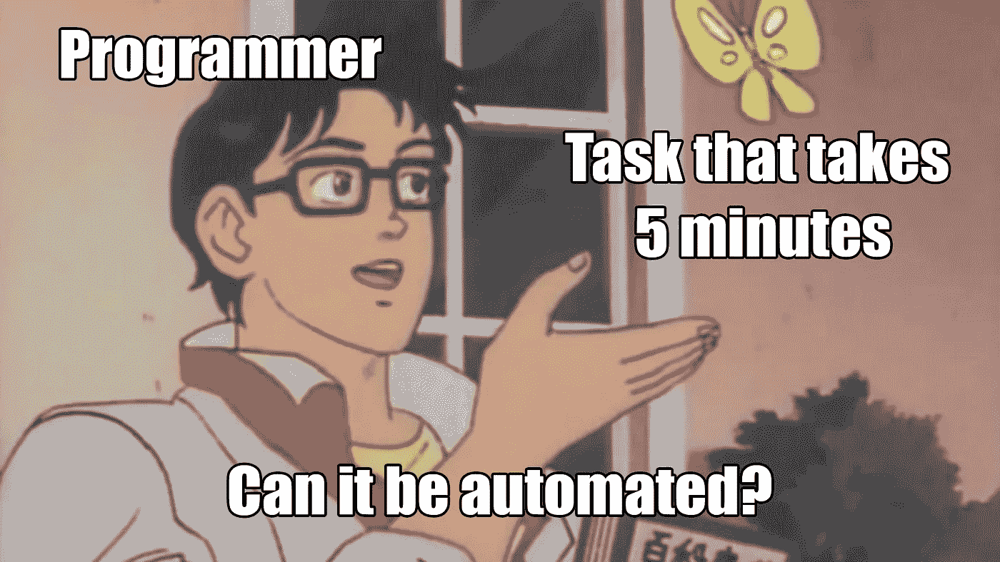
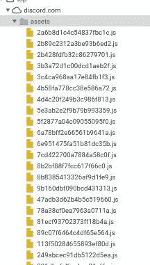
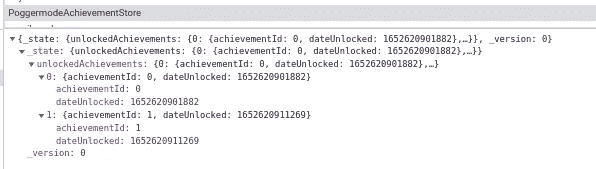
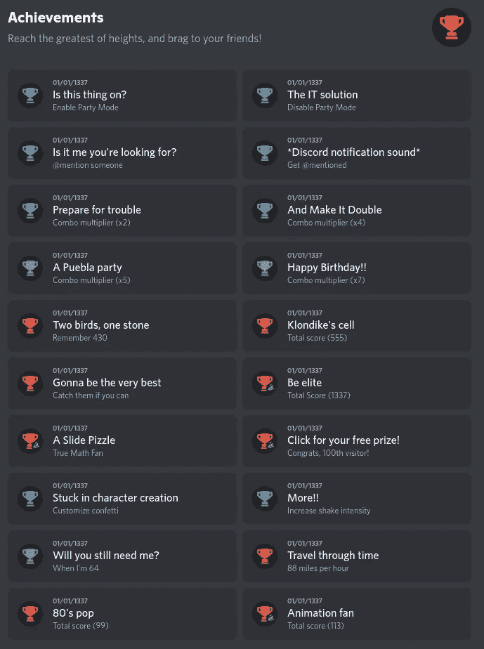

# 逆向工程 Discord 的聚会模式

> 原文：<https://blog.devgenius.io/reverse-engineering-discords-party-mode-d9c9dcaf0be4?source=collection_archive---------13----------------------->

如果你还没有注意到，Discord 增加了一个“派对模式”，因为他们正在庆祝他们的 7 岁生日。当一个朋友说服我启用它时，我做了最初的几个挑战，但很快注意到它们确实是重复的。

所以我做了唯一合理的事情:**自动化它**。我的朋友使用[木偶师](https://github.com/puppeteer/puppeteer)来自动化任务，但是我决定检查他们的源代码，找到处理这些成就的代码。



# 从哪里开始？

当你只有一个用户界面时，总是不知道从哪里开始。有很多地方可以找。由于 Discord 使用的是电子，我们可以浏览磁盘上的文件，也可以在浏览器中浏览。如果我们知道该特性只能在桌面应用程序上使用，我们只会选择第一个选项。不和谐叠加就是一个例子。但是由于派对模式也适用于浏览器，我们可以从那里开始。

在检查了 party 模式的 HTML 元素后，我看不到任何对 JavaScript 函数的引用。我还检查了网络选项卡，但没有传出或传入的请求。最后，我检查了控制台，但也没有输出。

因为我们所有的尝试都没有让我们更接近搞清楚派对模式是如何工作的，所以让我们试试别的。Discord 有一个资产文件夹，里面有他们所有的捆绑代码。捆绑器编译所有的 JavaScript 文件，缩小，有时甚至混淆它们。幸运的是，这些只是被缩小了，所以我们可以右击`assets`文件夹并搜索其中的所有文件。



我们现在可以搜索某些关键字，看看会出现什么。我试着输入关键字`party`、`combo`、`confetti`，很快就找到了相应的文件。

# 逆向工程 it

有很多参考文献，都包含了这样的映射。它们对我们来说并不真正有用，因为它们只是将某些变量映射到它们的 HTML 标识符。

```
440313: e=>{
	e.exports = {
		combo: "combo-2aK5O7",
		comboValue: "comboValue-1MDc9T",
		comboNameplate: "comboNameplate-2LHfRI",
		comboMultiplier: "comboMultiplier-YkNec8",
		comboSquare: "comboSquare-12yWYj",
		left: "left-2uQTLJ",
		right: "right-1c_YIP",
		confettiIcon: "confettiIcon-1nMd5V",
		tip: "tip-WcKlNf",
		messageComboScore: "messageComboScore-1cWPCc",
		comboScore: "comboScore-38MG6A"
	}
}
```

但是还有另一个文件(`78a38cf0ea7963a0711a.js`)，处理聚会模式逻辑。只要看看字符串和变量名，我们就已经能猜到它在做什么了。例如，您认为这段代码有什么作用？

```
!function(e) {
	e[e.ENABLE_POGGERMODE = 0] = "ENABLE_POGGERMODE";
	e[e.DISABLE_POGGERMODE = 1] = "DISABLE_POGGERMODE";
	e[e.PING_SOMEONE = 2] = "PING_SOMEONE";
	e[e.PING_ME = 3] = "PING_ME";
	e[e.COMBO_MULTI_LEVEL_1 = 4] = "COMBO_MULTI_LEVEL_1";
	e[e.COMBO_MULTI_LEVEL_2 = 5] = "COMBO_MULTI_LEVEL_2";
	e[e.COMBO_MULTI_LEVEL_3 = 6] = "COMBO_MULTI_LEVEL_3";
	e[e.COMBO_MULTI_LEVEL_4 = 7] = "COMBO_MULTI_LEVEL_4";
	e[e.TOTAL_SCORE_LEVEL_1 = 8] = "TOTAL_SCORE_LEVEL_1";
	e[e.TOTAL_SCORE_LEVEL_2 = 9] = "TOTAL_SCORE_LEVEL_2";
	e[e.TOTAL_SCORE_LEVEL_3 = 10] = "TOTAL_SCORE_LEVEL_3";
	e[e.TOTAL_SCORE_LEVEL_4 = 11] = "TOTAL_SCORE_LEVEL_4";
	e[e.TOTAL_SCORE_LEVEL_5 = 12] = "TOTAL_SCORE_LEVEL_5";
	e[e.VISITOR_100 = 13] = "VISITOR_100";
	e[e.CUSTOMIZE_CONFETTI = 14] = "CUSTOMIZE_CONFETTI";
	e[e.MORE = 15] = "MORE";
	e[e.COMBO_VALUE_LEVEL_1 = 16] = "COMBO_VALUE_LEVEL_1";
	e[e.COMBO_VALUE_LEVEL_2 = 17] = "COMBO_VALUE_LEVEL_2";
	e[e.COMBO_VALUE_LEVEL_3 = 18] = "COMBO_VALUE_LEVEL_3";
	e[e.COMBO_VALUE_LEVEL_4 = 19] = "COMBO_VALUE_LEVEL_4"
}(o || (t.PoggermodeAchievementId = o = {}));
```

如果您知道有哪些成就，您会立即意识到这是存储关于它们的一些数据的数组。向下滚动一点，您会发现正好 19 个代码块，看起来都有点像这样:

```
a[o.DISABLE_POGGERMODE] = {
	id: o.DISABLE_POGGERMODE,
	name: function() {
		return s.default.Messages.POGGERMODE_ACHIEVEMENT_DISABLE_POGGERMODE_NAME
	},
	description: function() {
		return s.default.Messages.POGGERMODE_ACHIEVEMENT_DISABLE_POGGERMODE_DESCRIPTION
	},
	rarity: i.UNCOMMON,
	hideDescriptionUntilUnlock: !1
},
```

甚至有一个传奇成就有一个事件处理器。你能猜出他们正在打开哪个视频吗？

```
a[o.VISITOR_100] = {
	id: o.VISITOR_100,
	name: function() {
		return s.default.Messages.POGGERMODE_ACHIEVEMENT_VISITOR_100_NAME
	},
	description: function() {
		return s.default.Messages.POGGERMODE_ACHIEVEMENT_VISITOR_100_DESCRIPTION
	},
	rarity: i.LEGENDARY,
	hideDescriptionUntilUnlock: !0,
	onAction: function() {
		window.open("https://www.youtube.com/watch?v=dQw4w9WgXcQ", "_blank")
	}
},
```

So now we know where the achievement logic is located, can we figure out whether it’s stored? I initially did some achievements by hand on the Desktop client, but when I opened the browser client, all of them were gone. Since there were also no outgoing or incoming requests when looking at the networking, we can be certain that the data is just stored locally.

You could now either go through the file and search for references to storage APIs or look through `LocalStorage`. Since there's not that many options, the `PoggermodeAchievementStore` key might stand out. When you look at the stored value, you can clearly see the unlocked achievements. Nice!



# Patching it

Now that we know where the achievements are stored, we can easily modify it. I wanted to write a simple JavaScript program for that, but for whatever reason, `window.localStorage` wasn't defined. So instead of wasting more time to find a workaround, I decided to manually replace it.

Since we already found the achievement array, we know that there’s 19 of them. We can just write it out like this and replace the value. The `dateUnlocked` value is a epoch timestamp. You can create your own timestamp on [this website](https://www.epochconverter.com/).

```
{
    "_state": {
        "unlockedAchievements": {
            "0": {
                "achievementId": 0,
                "dateUnlocked": -19975457838000
            },
            "1": {
                "achievementId": 1,
                "dateUnlocked": -19975457838000
            },
            "2": {
                "achievementId": 2,
                "dateUnlocked": -19975457838000
            },
            // Skipped...
            "18": {
                "achievementId": 18,
                "dateUnlocked": -19975457838000
            },
            "19": {
                "achievementId": 19,
                "dateUnlocked": -19975457838000
            }
        }
    },
    "_version": 0
}
```

After reloading the client, we got all the achievements. Now I can brag to all of you about how cool I am. :)



# What did we learn?

This was only a small project, but we still learned quite a lot. We now know how we can start reversing websites or Electron applications. I’m using Firefox for all my personal browsing, but I decided to spin up Chrome because I know how good their DevTools are. So make sure to **use the right tool for the job**.

I’m a big fan of [structured procrastination](https://www.urbandictionary.com/define.php?term=productive+procrastination) and [learning new things by starting a project](https://invidious.namazso.eu/watch?v=AMMOErxtahk). So if you catch yourself procrastinating or wasting time, try to turn it into a fun side project.

**After all, it is never a waste of time to learn something new.**

*Originally published at* [*https://not-matthias.github.io*](https://not-matthias.github.io/posts/discord-party-mode/)*.*