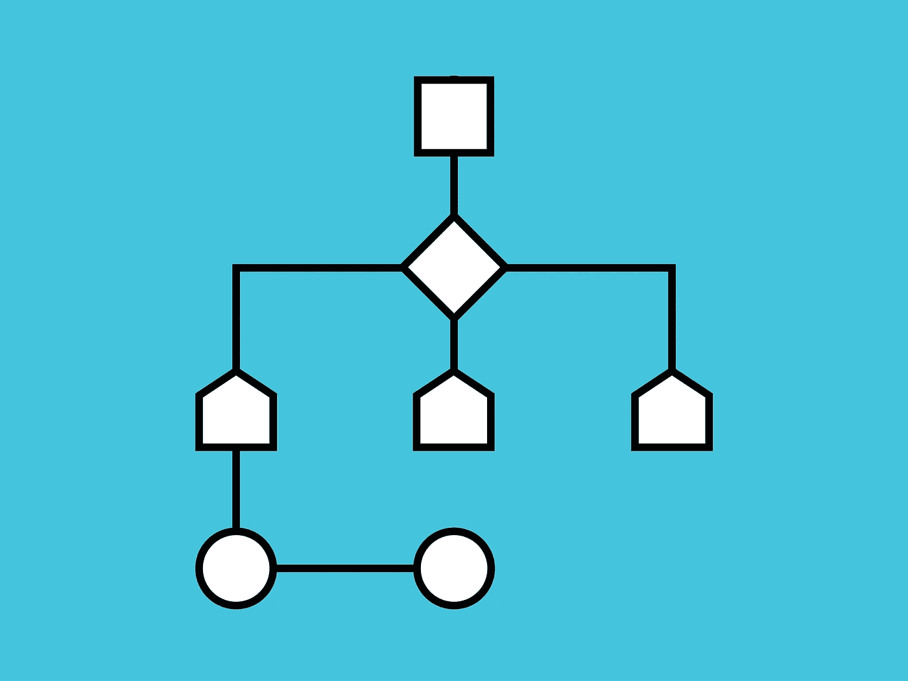
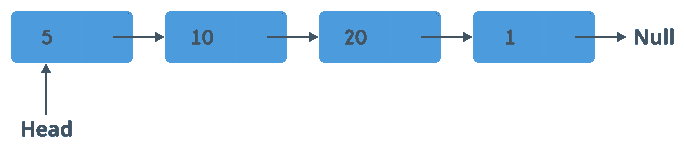

# 反转链接列表

> 原文：<https://blog.devgenius.io/reversing-a-linked-list-93f5680c6223?source=collection_archive---------34----------------------->



HOTLITTLEPOTATO 的信用

在准备你的编码面试时，你可能遇到过这个非常流行的链表问题，反转一个链表。这个问题初看起来很吓人，但是如果你记得链表的结构以及如何操作每个节点之间的指针，这个问题会变得简单得多。

**链表的结构**

所以很快，让我们回顾一下单链表的基本结构。链表本质上看起来像这样:



黑客地球的荣誉

有一个链表头，可以看作是链表的第一个元素。链表的每个元素称为一个“节点”，每个节点有两个属性。链表具有存储信息的数据属性和指向链表中下一个“节点”的指针的下一个属性。上图展示了一个叫做单链表的链表的例子。单链表只能单向运行，每个节点只能指向下一个节点。有一种类型的链表称为双向链表，其中每个“节点”都有一个指针指向下一个“节点”和前一个“节点”。

**反转链表**

既然我们已经讨论了什么是链表，那么让我们深入这个问题。假设你得到了这个单链表。

```
**Input:** 1->2->3->4->NULL
```

写一个函数，以一个链表作为参数，返回这个链表，但是取反。

```
**Expected Output:** 4->3->2->1->NULL
```

那么我们该如何解决这个问题呢？如果你熟悉链表的结构，你会意识到解决这个问题的关键是利用指针。

如果我们一步一步地遍历每个节点，并翻转下一个指针指向前一个节点，会怎么样？所以它看起来会像这样:

```
1<-2->3->4->NULL1<-2-3->4->NULLNULL<-1<-2<-3<-4
```

包含 4 的节点将成为新的头，包含 1 的节点现在将指向 NULL。那么代码是什么样子的呢？

**边缘病例？**

当处理算法问题时，你应该总是考虑可能使你的解决方案失败的边缘情况。

一种可能的边缘情况是链表为空。我们的解决方案仍然有效，因为 while 循环永远不会运行，因为 current 是`null`。因为我们返回的是设置为 null 的`prev`，所以我们的解决方案是可行的。

你还能想到什么吗？

如果你认为你已经掌握了这个链表问题，我肯定会建议测试一下你在[反转链表 II](https://leetcode.com/problems/reverse-linked-list-ii/) 上的知识。