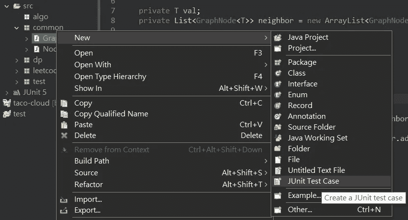
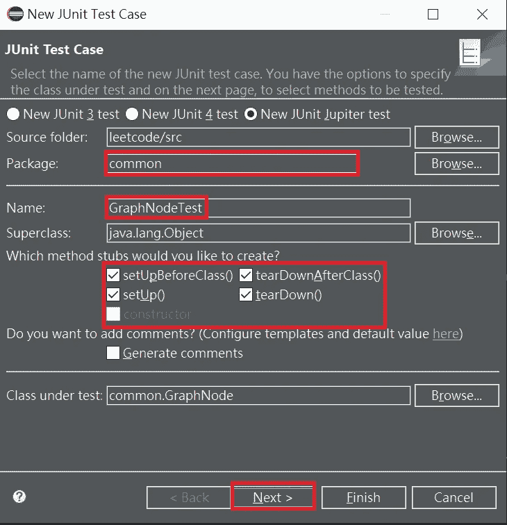
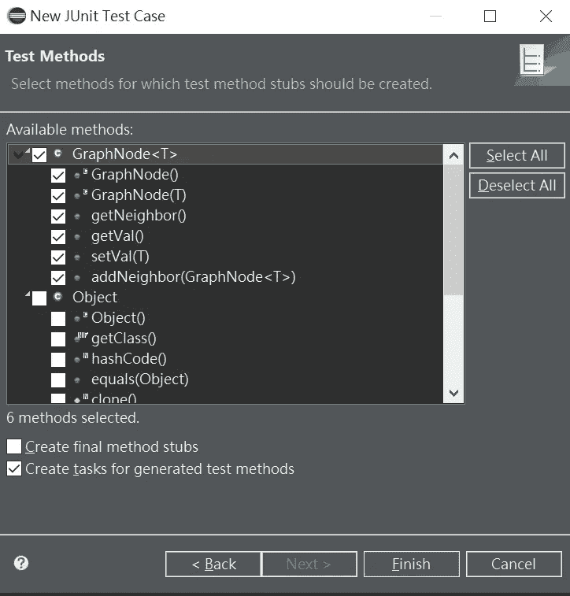
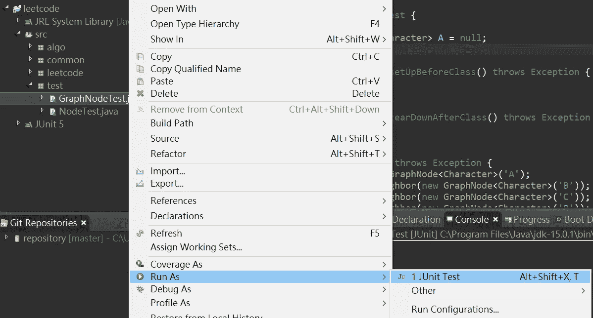
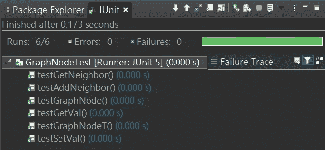

# 从构建连通无向图看单元测试

> 原文：<https://blog.devgenius.io/review-unit-testing-from-building-a-connected-undirected-graph-a827c1851c09?source=collection_archive---------4----------------------->

# 文章的出处

这些天来，我试图解决关于 [LeetCode](https://leetcode.com/) 的问题，每当我提交解决方案以通过验证时，我都会想到一个问题。

***如何验证自己提交的东西是否符合要求的问题？***

好吧，大多数开发人员会不断提交改进的解决方案，直到他们通过网站上的整个测试用例，检查时间/空间复杂度是否达到问题的标准，并继续上述循环。

然而，在真实的编程场景中，没有任何验证系统可以用来检查您的解决方案是否满足市场需求。你应该负责设计你自己的测试用例，以确保你所提交的能适应真实市场中的场景。为了实现这一点，当评估开发人员的质量交付能力时，测试的技巧很重要。

# **选择一个容易上手的测试框架**

嗯，这取决于你熟悉哪种编程语言。例如，我熟悉 Java/C++，所以 [JUnit 5](https://junit.org/junit5/) / [CppUnit](https://sourceforge.net/projects/cppunit/) 将是开始单元测试任务的第一选择。再说一次，无论您应用什么测试框架都没有关系；重要的是你开始习惯于在你的任务中随时进行测试。

对于编程语言， [wiki](https://en.wikipedia.org/wiki/List_of_unit_testing_frameworks) 页面提供了基于您选择的语言的各种测试框架。我们应该做的是发现问题来练习技巧。

# 如何在 IDE 上使用 JUnit？

幸运的是，大多数 ide 如 [VSCode](https://code.visualstudio.com/docs/java/java-testing) 或 [Eclipse](https://www.eclipse.org/community/eclipse_newsletter/2017/october/article5.php) 都支持默认测试框架，所以我们只需要知道如何在我们的工作中应用它们。在我的例子中，我将展示如何在 Eclipse 上应用 JUnit 来完成一个基本图形问题的单元测试任务——构建一个连通的无向图。来源如下图所示:

为了概括图形问题，我定义了一个模板形式的数据类，它包含 2 个构造函数和 4 个公共成员函数来操作图形构造任务。到目前为止，我们还不知道定义的成员是否可以照常工作。所以我们需要在每个成员函数上应用测试任务。在 eclipse 中，我们可以通过以下方式生成基本的单元测试用例

*   **右键单击源新 JUnit 测试案例**。



*   **选择包装设置文件名勾选存根方法接下来**



*   **选择要测试的方法完成**

由您来决定您想要为哪个方法创建任务，或者在生成测试运行程序之后编辑您自己的任务。



*   最终生成的脚本如下。最初，它只包含我们在之前的配置面板中勾选的方法。事实上，您可以通过在自定义任务上添加注释 **@Test** 来定义您的测试，以区别于默认生成的任务。

注意，用@Test 注释的每个方法都是一个要执行的函数范围的任务。例如，当要测试任何方法时，测试运行程序将按顺序运行方法:

```
setUpBeforeClass()->
...
setUp()->{tested method 1}->tearDown()
setUp()->{tested method 2}->tearDown()
setUp()->{tested method 3}->tearDown()
...
tearDownAfterClass()
```

如果您要预先准备相关联的资源，请在 setUpBeforeClass()/tearDown after class()或 setUp()/tearDown()中分配/取消分配它们。这四种方法的区别如下:

*   setUpBeforeClass():应该在这里配置所有测试周期所需的资源。
*   tearDownAfterClass():所有测试完成后，它释放资源。
*   setUp():仅在测试中需要的资源应该在这里定义。
*   tearDown():测试完成后，它释放资源。

因此，请记住，每个存根方法都有自己的函数范围，不要错误地应用它。

# 执行测试运行程序

提供的源代码是我用来验证单个功能的 JUnit 测试用例。
**{此处添加 GraphNodeTest.java }** 为了验证测试用例的正确性，就

*   右键单击测试源作为 JUnit 测试案例运行



测试运行人员将显示最终测试用例的状态。恭喜你！



# 其他隐藏的测试问题

如果你仅仅按照上面提到的步骤来完成你的模块的简单验证，这是不足以涵盖相关的测试主题的。事实上，当谈到软件的质量保证时，有许多值得讨论的话题。我在这里列出了一些，供你深入研究。

*   **代码覆盖率**

源可能包含条件规则以适应特定的条件。为了在一个函数中完全覆盖所有情况，我们可能需要设计各种场景案例来进行验证。因此，在一些公司中，代码覆盖率是证明他们的软件在极端场景发生时是否能正常运行的重要标准。

*   **测试命名惯例**

在我的例子中，我直接应用了由 JUnit 生成并编码的测试用例。尽管如此，会有比我上面测试的更多的案例。因此，如何为每个场景命名是一个重要的问题，因为那些接管资源的人会调查给定测试用例的领域知识，以了解它反映了什么样的场景。

*   **检测表格类别**

单元测试只是这个领域的测试类别之一。当您的系统规模扩大时，应该考虑更多的测试方法来验证稳定性、可修改性和可理解性。例如，集成测试、回归测试、白盒/黑盒测试等。

# 蔻驰的低语

不幸的是，在台湾，大多数公司不关心他们是否测试他们的软件，而是关心最后期限是否能得到满足，这总是让工程师对环境感到沮丧。然而，测试的基本技能决定了您的产品是否能存活足够长的时间，并迅速适应动态的市场。有许多人认为质量保证是一个没有价值的职位，因为通常它的工资较低，不需要加入开发工作。嗯，这在台湾是事实，但是这个想法应该被纠正。最好的方法之一是自己做，现在就开始测试你的源代码。