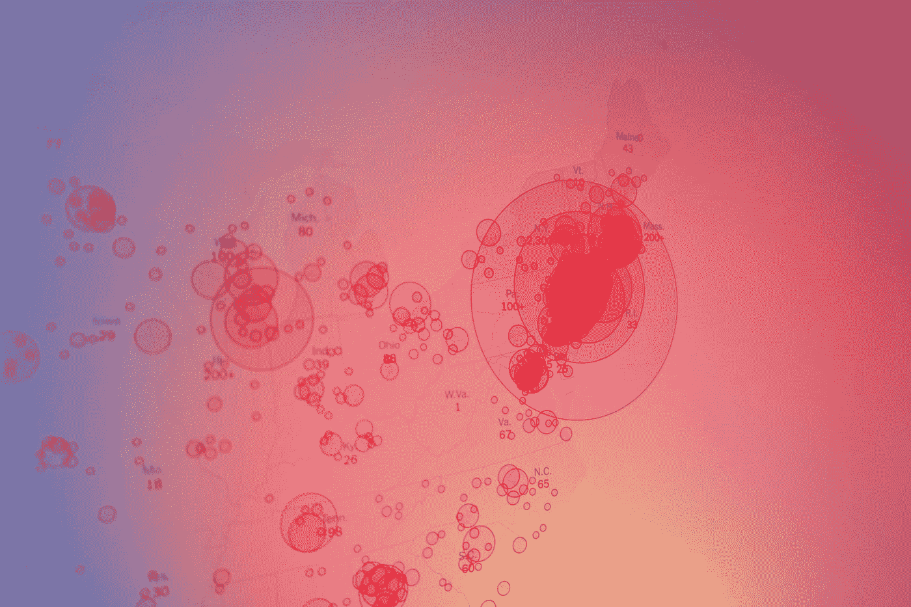
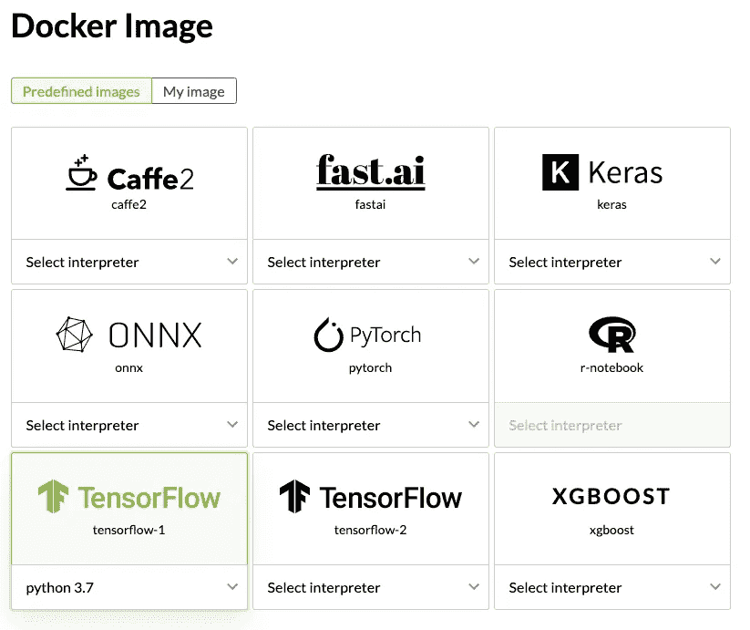
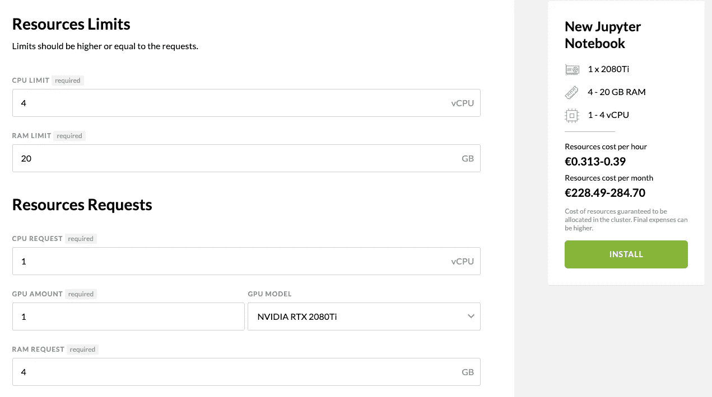
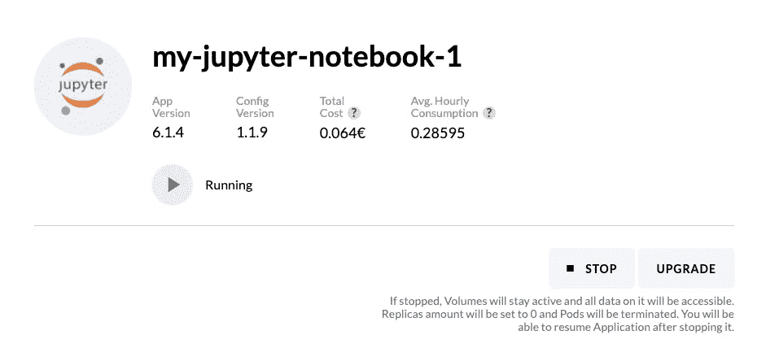
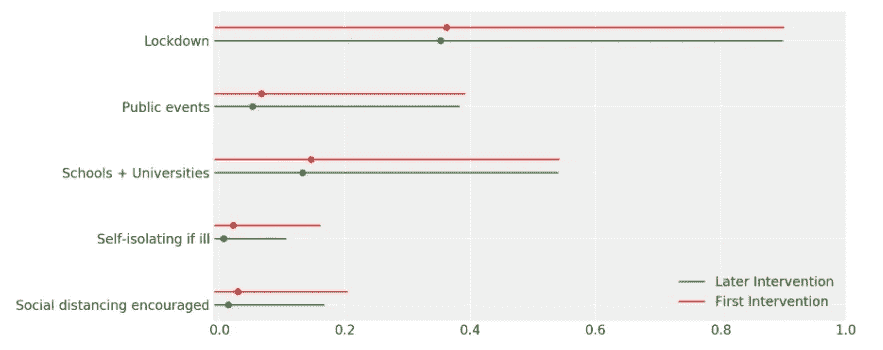
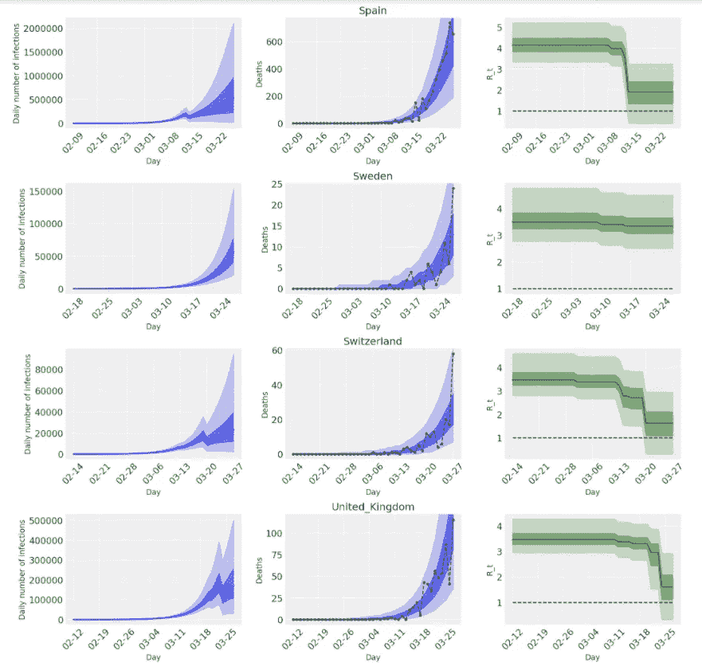
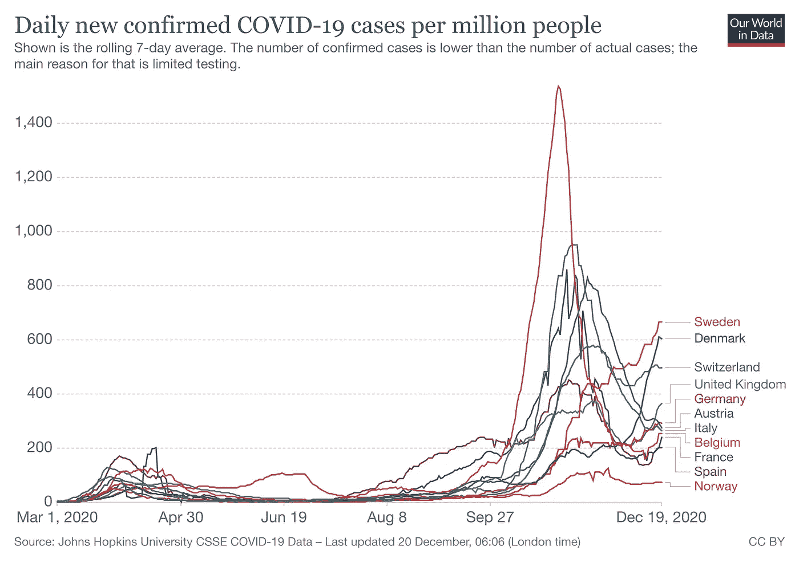
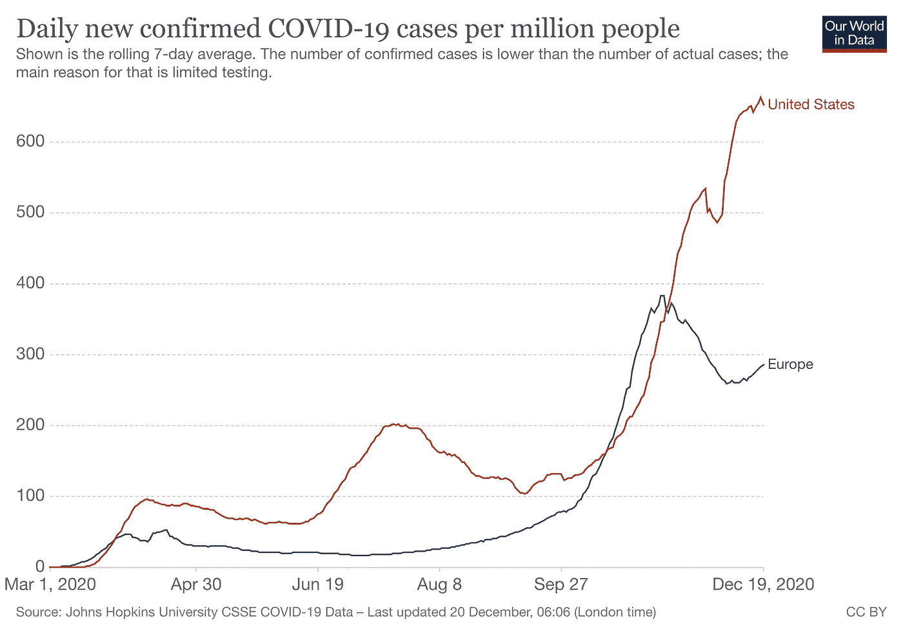

# 再论帝国理工学院的新冠肺炎传播模式

> 原文：<https://blog.devgenius.io/revisiting-imperial-colleges-covid-19-spread-models-daa7ac1a7862?source=collection_archive---------5----------------------->

如何在 Kubernetes 上运行开源 Tensorflow 模型，并评估新冠肺炎传播模型在衡量干预效果方面的有效性。

布莱恩·麦高恩在 [Unsplash](https://unsplash.com?utm_source=medium&utm_medium=referral) 上的照片

本月早些时候，英国成为第一个批准和管理辉瑞/BioNTech 的新冠肺炎疫苗的欧洲国家。美国迅速跟进，FDA 和 CDC 最近推荐 Moderna 的疫苗和辉瑞的疫苗，给世界带来一线希望。其他国际参与者，特别是中国和俄罗斯，也在推动批准和生产他们自己的疫苗。尽管新冠肺炎仍在继续肆虐，但疫苗的消息标志着一个充满希望的结局。

为此，我想重温一下帝国理工学院新冠肺炎应对团队的一项研究，该研究于 3 月份发表，名为“估计 11 个欧洲国家感染新冠肺炎病毒的人数和非药物干预的影响”。该研究使用半机械贝叶斯分层模型来估计非药物干预的影响，如隔离、关闭公共空间(如学校、教堂、体育场)以及大规模的社会距离措施。

*本文中使用的 Tensorflow 实现是在 MIT 许可下开源的，可以在*[*Tensorflow.org*](https://www.tensorflow.org/probability/examples/Estimating_COVID_19_in_11_European_countries)*和*[*Github*](https://github.com/tensorflow/probability/blob/master/tensorflow_probability/examples/jupyter_notebooks/Estimating_COVID_19_in_11_European_countries.ipynb)*获得。*

# 代码设置

虽然谷歌通过 [Google Colab](https://colab.research.google.com/) 提供免费托管的 Jupyter 笔记本服务，但我想在 Kubernetes 上运行分析，以练习在 Kubernetes 上运行数据科学和机器学习项目，并比较两者的开发人员体验。为了复制 Google Colab 的托管笔记本体验，我寻找了一个类似的 Kubernetes 体验，而不需要自己建立一个集群。与此同时，我希望对我的 Kubernetes 环境有一些控制，而不是像[谷歌人工智能平台](https://cloud.google.com/ai-platform)那样的完全托管的数据科学平台。

图片鸣谢: [https://puzl.ee](https://puzl.ee/)

我最终找到了 [puzl.ee](https://puzl.ee/) ，一个有 GPU 支持的 [Kubernetes 服务提供商](https://puzl.ee/gpu-cloud)，按 pod 使用量收费。Puzl.ee 为我的工作负载创建了一个独特的名称空间，并对资源使用收费，类似于无服务器的 Kubernetes 产品，如 [Google 的云运行](https://cloud.google.com/run)或 [AWS Fargate](https://aws.amazon.com/fargate/) 。目前打包的应用程序数量有限(Gitlab CI Runner、SSH Server 和 Jupyter Notebook)，但对 H2O.ai、PostgreSQL、Determined AI、Redis、Jupyter Hub、Drone CI、MongoDB 和 Airflow 的支持正在路线图上。幸运的是，puzl.ee 已经发布了一个使用 GPU 设置 Jupyter 笔记本的快速入门指南，所以我在注册了一个免费帐户后提供了我的 Jupyter 笔记本。

我得到了预定义 Docker 图像的各种选项(以及使用我自己的选项)。在安装我的 Jupyter 笔记本电脑之前，我还可以调整我的资源请求，包括 NVIDIA RTX 2080Ti GPU。

不到一分钟左右，我的装有 Tensorflow 的 Jupyter 笔记本就安装好了。后来，我意识到代码需要 Tensorflow 2+图像。即使进行了重新安装，配置过程也是顺利而轻松的。

不幸的是，我在尝试开箱即用运行 Tensorflow 时遇到了几个问题。我很惊讶地看到熊猫没有包括在提供的 Docker 图像的标准分布中，并遇到了几个错误，如`undefined symbol: _ZN10tensorflow8OpKernel11TraceStringEPNS_15OpKernelContextEb`。在 StackOverflow 的几次不成功的解决方案后，我决定用安装的必要 Tensorflow 组件编译自己的 Docker 映像，这使我可以继续前进。然而，这凸显了 AIOps 中的巨大挑战，其中版本控制和软件兼容性仍然很难，这使得这些半托管平台不太有效，因为它需要一些开发运维工作来理清和修复依赖性。

# 模型设置和数据预处理

在正确安装了所有必要的 Python 模块之后，我就可以按照代码来设置模型和加载数据了。整个设置发布在 [Github](https://github.com/tensorflow/probability/blob/master/tensorflow_probability/examples/jupyter_notebooks/Estimating_COVID_19_in_11_European_countries.ipynb) 上，但我将总结以下重要部分:

## 感染和死亡的机械模型

感染模型将干预的时间和类型、人口规模、每个国家的初始病例以及干预的有效性和疾病传播率作为参数，以模拟每个欧洲国家一段时间内的感染人数。该模型产生两个关键概率`conv_serial_interval`(以前每日感染的卷积以及在被感染和感染其他人的时间内的分布)和`conv_fatality_rate`(以前每日感染的卷积以及在感染和死亡的时间内的分布)。

## 参数和概率

假设参数值是独立的，包括每个国家初始病例的指数分布、死亡人数的负二项分布、每个感染者的感染率、每种干预类型的有效性以及感染死亡率中的噪声。给定这些参数，可以计算观察到的死亡的可能性以及感染导致的死亡概率。最后，感染传播假设为伽玛分布，将`conv_serial_interval`变为`predict_infections`。

## 关键假设

该研究旨在通过观察感染率和死亡率来模拟干预措施的有效性。在这里，该模型假设 COVID 病例数量的下降是对干预的直接反应，而不是行为的逐渐变化。此外，该研究假设干预措施将在所选的欧洲国家产生相同的效果，不考虑规模、人口密度以及公民的平均年龄，我们现在知道这些因素对死亡率有着巨大的影响。

# 复制结果

该数据集包括 11 个欧洲国家(奥地利、比利时、丹麦、法国、德国、意大利、挪威、西班牙、瑞典、瑞士和英国)实施的干预措施和感染率/死亡率。在应用 Github 帖子上描述的 Tensorflow 模型后，我能够复制干预措施的有效性图表以及按国家分列的感染/死亡人数:

干预措施的有效性(与原始文件中的图 4 相同):显示效果没有显著差异，因为大多数措施在大约相同的时间生效

按国家分列的感染、死亡和 R_t(与原始论文中的图 2 相同)

# 将模型与实际数据进行比较

该论文估计，各种干预措施成功地控制了欧洲的感染率，但警告说，鉴于新冠肺炎潜伏期长，传播和死亡之间的时间间隔长，当时收集的数据可能为时过早，无法断定在疫情处于萌芽阶段的某些国家是否有效。

回顾过去，我们现在知道，最初的措施在减缓欧洲的感染率方面有些成功。它采取了严厉的措施，如全国范围的封锁和执行大规模的社会距离指导方针，但数据显示感染率呈下降趋势，直到最近病例上升。

也许一个更能说明问题的图表是比较欧洲作为一个整体与美国的结果，在美国，干预措施是以一种不太协调的方式推出的:

现在我们有了更多的数据，如果能看到一项后续研究包括其他参数，以反映在全球范围内使干预措施或多或少取得成功的文化或政治因素，那将是很有趣的。

*您可以使用下面的链接创建自己的可视化效果:*

 [## 冠状病毒疫情数据浏览器

### 研究和数据推动解决世界上最大的问题

ourworldindata.org](https://ourworldindata.org/coronavirus-data-explorer?zoomToSelection=true&time=2020-03-01..latest&country=ESP~FRA~ITA~GBR~DEU~SWE~CHE~NOR~DNK~BEL~AUT&region=World&casesMetric=true&interval=smoothed&perCapita=true&smoothing=7&pickerMetric=total_deaths&pickerSort=desc) 

# Colab 对 Puzl.ee

回到数据科学方面，运行 Tensorflow 模型的这个练习让我想起了在让 Kubernetes 成为数据科学和机器学习任务的首选平台之前我们仍然面临的挑战。作为一个免费的工具，Google Colab 使得克隆开源笔记本和运行实验变得容易，而无需任何基础设施设置。有了定价 9.99 美元/月的 [Google Colab Pro](https://colab.research.google.com/signup) ，大部分工作负载都可以以托管的方式运行，没有太多限制。

然而，puzl.ee 上的初始供应过程出乎意料地顺利。随着团队致力于整合更多预定义的 Docker 映像，我希望我所面临的一些安装和配置挑战会减少。我还喜欢运行我自己的 Kubernetes pod 的选项，以潜在地扩展实验，添加其他微服务来获取/发布数据或将其与同一 Kubernetes 集群中的其他数据库集成。一旦 puzl.ee 通过仪表板添加了对流行头盔图表的原生支持，就像它提供预先制作的 Docker 图像一样，我计划再看看我的一些附带项目。