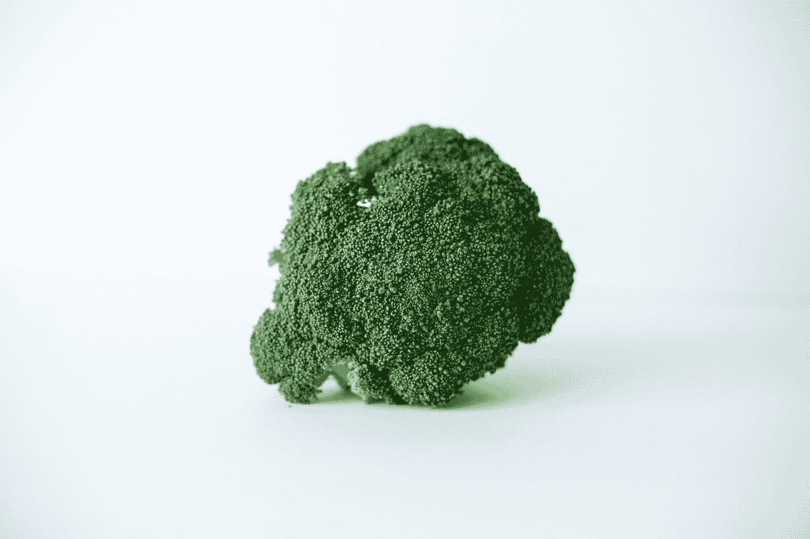
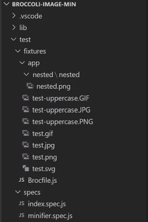
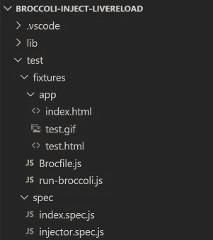

# BroccoliJS 构建和开发插件的测试自动化

> 原文：<https://blog.devgenius.io/revisiting-test-coverage-630ccdbf83b4?source=collection_archive---------40----------------------->

## /工程/ javascript

## 使用木偶师增加测试覆盖率

[蕾拉妮天使](https://unsplash.com/@leilaniangel?utm_source=medium&utm_medium=referral)在 [Unsplash](https://unsplash.com?utm_source=medium&utm_medium=referral) 上的照片

几周前，我注意到我的大多数 NodeJS 包都有过时的依赖项。虽然它们不会吸引太多的注意力，但我希望它们能再次跟上潮流。

我的大多数 NodeJS 模块已经有了很好的测试覆盖率。我更新了依赖项，并用 bash 脚本发布了它们。但是我的 BroccoliJS 插件缺乏测试。没有启动当前项目的完全生成并验证资源是否正确生成或提供的测试。

> 西兰花是一个 JavaScript 构建工具，它公开了一个简单的 JavaScript API 来执行基于文件的转换，允许开发人员使用简单的功能 API 轻松构建复杂的构建管道。
> 
> 插件是构建管道开发人员最常与之互动的东西。插件是在构建过程的每一步转换文件的实际工作。
> 
> 【broccoli.build/ 

对于简单的 web 应用程序，我喜欢使用 BroccoliJS 而不是 [Gulp](https://gulpjs.com/) 或 [Grunt](https://gruntjs.com/) 。我认为用它来配置、运行和维护构建管道要干净和简单得多。如果你有兴趣，可以看看这个。

因为我有一些空闲时间，所以我为 BroccoliJS 开发了一个[测试跑步者](https://www.npmjs.com/package/broccoli-test-runner)。在我之前的[文章中，我描述了它的需求和实现。目标是能够在 Travis CI 上运行自动化测试。](https://medium.com/@stfsy/testing-broccolijs-plugins-89a500c8e83e)

> 当您运行构建时，Travis CI 将您的 GitHub 存储库克隆到一个全新的虚拟环境中，并执行一系列任务来构建和测试您的代码。如果这些任务中的一个或多个失败了，那么构建就被认为是 [*中断*](https://docs.travis-ci.com/user/for-beginners#breaking-the-build) 。如果没有一个任务失败，构建就被认为是 [*通过了*](https://docs.travis-ci.com/user/for-beginners#breaking-the-build) ，Travis CI 可以将您的代码部署到 web 服务器或应用程序主机上。
> 
> CI 构建还可以自动化交付工作流的其他部分。这意味着您可以让作业与[构建阶段](https://docs.travis-ci.com/user/build-stages/)相互依赖，设置[通知](https://docs.travis-ci.com/user/notifications/)，在构建和许多其他任务之后准备[部署](https://docs.travis-ci.com/user/deployment/)。
> [docs.travis-ci.com](https://docs.travis-ci.com/user/for-beginners#ci-builds-and-automation-building-testing-deploying)/

发布 runner 之后，我开始在插件中添加缺失的集成测试。

格伦·卡斯滕斯-彼得斯在 [Unsplash](https://unsplash.com?utm_source=medium&utm_medium=referral) 上拍摄的照片

# 测试西兰花-图像-最小

这个插件压缩图像。测试应该验证在构建 gif、jpg、png 和 svg 图像之后，它们的大小比之前要小。于是我在项目的测试资源中添加了一组不同类型和名称的图片。

西兰花-图像-最小值

在实际的测试文件中，我使用 broccoli-test-runner 在 test/fixtures 目录中开始构建，并验证每个图像的大小只是原始大小的一个百分比。干净简单。🙂

# 测试西兰花-注射-肝脏负荷

这个插件将 livereload 脚本标签注入 HTML 文件。一旦加载到浏览器中，livereload 脚本将在项目中的文件被修改后强制部分或全部页面重新加载。这对于开发基于浏览器的应用程序来说非常方便。

我在 fixtures 文件夹中添加了两个 HTML 文件——test.html 和 index.html——并配置了 livereload 插件，只将 livereload 标签添加到 test.html。你可以在这里找到完整的配置。

西兰花-注射-肝脏加载

为了呈现 HTML 页面并找到插入的脚本标记节点，我使用了 puppeteer。这可能有点沉重，但我想使用一个真实的浏览器实例来接近实际使用。

> Puppeteer 是一个节点库，它提供了一个高级 API 来控制 Chrome 或通过 [DevTools 协议](https://chromedevtools.github.io/devtools-protocol/)的 Chrome。默认情况下，木偶师运行[无头](https://developers.google.com/web/updates/2017/04/headless-chrome)，但可以配置为运行全(非无头)铬或铬。【npmjs.com/package/puppeteer】/

首先，我验证了添加了 livereload 标记:

*   使用当前浏览器页面导航到/test.html，
*   找到一个脚本标签，然后
*   **检查脚本标签是否包含 livereload.js.**

其次，我断言 index.html 不包含 livereload 标签。

*   导航到/index.html，然后
*   **验证不存在脚本标签。**

对，就是这样。因为西兰花测试运行程序负责实际的 BroccoliJS 构建，所以我能够专注于测试插件功能。每个插件做一件事，所以我必须写的测试代码相对较少。如前所述，所有的测试都在 travis-ci.org/stfsy/上运行。

最后，我觉得我可以更频繁地发布我的 npm 模块，并在开发阶段立即发现 bug。

# 覆盖报告

这是两个插件的最终数字。西兰花注射肝脏加载的所有声明和行都包括在内。花椰菜图像最小插件构造器中的一个分支仍然没有被测试覆盖。我将在未来几天添加另一个测试配置，但希望与您分享当前的结果。

## 西兰花-图像-最小值

*   陈述:93.93 %
*   分支:50 %
*   线条:92.31 %

## 西兰花-注射-肝脏加载

*   声明:100 %
*   分支:100 %
*   线条:100 %

感谢来到这里，感谢你的阅读，
Stefan👋