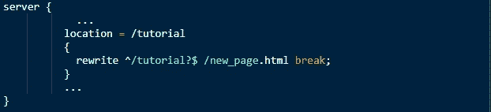
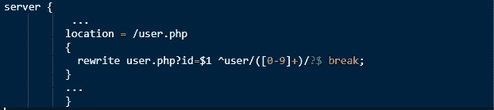

# 在 Nginx 中重写规则

> 原文：<https://blog.devgenius.io/rewrite-rules-in-nginx-130c3b8803f3?source=collection_archive---------4----------------------->

由 [Ritu Chaturvedi](https://blog.engineyard.com/author/ritu-chaturvedi)

*重写规则*修改部分或全部网址。这样做有两个原因。首先，通知客户端资源的重新分配，其次，控制到 Nginx 的流量。广泛用于重写 URL 的两种通用方法是 *return* 指令和 *rewrite* 指令。其中，重写指令更强大。让我们讨论一下为什么会这样，以及如何重写 URL。

对 NGINX 有更好的[理解会让关注这个博客更容易。](https://www.thegeekstuff.com/2013/11/nginx-vs-apache/)

**返回*指令*返回**

*Return* 是重写在服务器或本地机器上声明的 URL 的最简单的方法。

***返回服务器中的*:**

假设您的站点被迁移到一个新域，所有现有的 URL 都将被重定向到这里；运行下面的代码将任何新请求定向到您的站点。

这将引导所有命中 www 的请求。【previousdomain.com】*到[*www.currentdomain.com。*](http://www.currentdomain.com.)*[www。*previousomain.com*两个变量， *$scheme* 和 *$request_uri，*从输入的 URL 获取数据。*Listen 80’*表示该阻塞同时适用于 HTTP 和 HTTPS 请求。](http://www.previousomain.com)**

****中的*返回*中的****

**如果你想重定向页面来代替一个完整的域，你可以使用位置块下的 *return* 指令。**

**知道如何创建 Nginx 重写规则可以节省你大量的精力和时间。**

****重写指令****

**就像 *return* 指令一样，rewrite 指令也可以在服务器和本地起作用。与 *return* 指令相比， *rewrite* 指令可以处理复杂的 URL 替换。下面是*重写*的语法:**

****

***regex* 是一个正则表达式，用于匹配传入的 URI。**

***replacement_url* 是用于改变所请求的 URI 的字符串。**

***标志*的值决定是否需要更多的重定向或处理。**

****静态页面*改写*****

**假设你想把页面[*https://example.com/tutorial*](https://example.com/tutorial)重定向到[*https://example.com/new_page*。](https://example.com/new_page.)该指令将:**

****

**行 *location = /tutorial* 定义了指南的任何标识都将被替换。*重写*命令表示用'*new _ page . html '【t23]替换符号 *^* 和$中的短语，然后中断该命令。符号“？”被称为非贪婪修饰符，在此之后模式搜索停止。***

***动态页面*重写****

*考虑将网址[*https://www.sample.com/user.php?id=11*](https://www.sample.com/user.php?id=11)*改写为[*https://www.sample.com/user/11*。](https://www.sample.com/user/11.)此处，user=11 将被替换。通过使用静态重写方法，需要写重写命令 10 次。相反，让我们一步到位。**

****

**第*行 location = /user.php* 要求 Nginx 检查前缀'/user '。如前所述，Nginx 将在开始和结束符号之间搜索短语，如 *^* 和$以及非贪婪的“？”修饰语。我们例子中的短语是一个用户范围。它在方括号中被称为[0–9]+该表达式中的反向引用在括号中注明，并由$1 符号引用。因此，对于我们的例子，重写将自动为所有用户发生。**

**动态引用的一个特例是多个反向引用。**

**现在，我们已经讨论了如何为简单和复杂的 URL 编写重写规则。**

**通过一些处理各种场景的[例子](https://www.thegeekstuff.com/2017/08/nginx-rewrite-examples/)理解重写规则的详细工作。**

# **直接比较**

**让我们通过比较这两个指令来分析它们，并找出为什么重写派生指令更强大。**

****退货指令****

*   **使用和理解都很简单。**
*   **它可以在服务器和位置环境中使用。**
*   **它明确地提到了修正或更新的 URL，以便客户将来可以使用它们。**
*   **返回指令也可以包含多个错误代码。**
*   **对于代码 301、302、303 和 307，URL 参数定义重定向 URL。**

***返回(301 | 302 | 303 | 307)网址；***

*   **对于其他代码，文本将由用户明确提及。**

***return(1xx | 2xx | 4xx | 5xx)[" text "]；***

**例如:*返回 401“由于令牌过期或无效，访问被拒绝”；***

*   **该指令可用于返回的 URL 对于服务器和位置块都是正确的情况，并且重写的 URL 是用 Nginx 变量构建的。**

****重写指令****

*   **它可以适应更复杂的 URL 修改，其中需要在没有 Nginx 变量的情况下捕获元素或更新路径中的元素。**
*   **它可以在服务器和位置环境中使用。**
*   **重写指令只能返回代码 301 或 302。若要容纳其他代码，请在 rewrite 指令后显式添加 return 指令。**
*   **它可能不会向客户端发送重定向详细信息。**
*   **Nginx 请求处理不会暂停。**

# **结论**

***return* 和 *rewrite* 指令可用于在服务器和位置上下文中重定向 URL。虽然 return 指令简单得多，但是 rewrite 指令被广泛使用，因为它也可以处理对 URL 的复杂修改/更新。**

***原载于*[*https://blog.engineyard.com*](https://blog.engineyard.com/rewrite-rules-nginx?utm_source=medium.com&utm_medium=Devgraph&utm_id=QiWorks.in)*。***