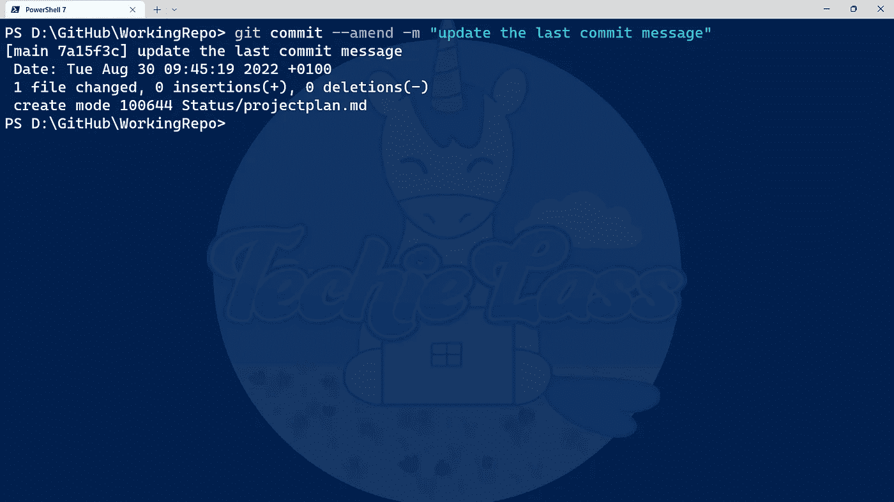

# 重写 Git 历史——Git 的 14 天

> 原文：<https://blog.devgenius.io/rewriting-git-history-14-days-of-git-aa16f00fcb3a?source=collection_archive---------12----------------------->

今天，我将看看如何用存储库重写 Git 历史。

# 重写历史

如果你一直在跟随我学习 Git，你会记得我看了如何[撤销提交和更改](https://www.techielass.com/undoing-commits-changes)。我开始思考，如果我们想改变提交，稍微改写一下历史，会怎么样？

有几个选项可以做到这一点。我真正想看的是 *git commit* 命令中的 *—修正*选项。

# 更改最近的 Git 提交消息

有时候你提交了一个消息，但是意识到你在提交消息中写错了东西。你是做什么的？

这是— amend 选项的使用案例之一。

如果发出*git commit-amend-m " update the last commit message "*它将修改最新提交的消息。

Git 提交—修改命令

如果您打错了字，或者错过了想要与同事分享的关于您所做更改的信息，这是更新最后一条提交消息的好方法。

# 向提交添加额外的更改

有时候，当你完成一个提交，然后意识到你想再添加一个修改，或者你忘记了什么。将它添加到 commit 中比打开另一个 commit 更有意义。

这是 *git commit — amend* 命令的另一个用例。

您的工作流程可能是:

1.  对文件 1 和文件 2 进行更改
2.  添加并提交这些更改
3.  意识到你已经忘记在文件 1 中添加一个小的改变
4.  进行附加更改
5.  使用命令*git commit—amend—no-edit*

命令上的附加选项 *— no-edit* 接受最后的更改，并将其放入之前的提交中，而不更改消息。对于其他任何人来说，看起来就像是在一次提交中完成的。

> *我要提醒你使用这个选项，并且只在你自己的提交中使用，不要通过修改别人的提交来迷惑别人。*

# 改写历史的其他方式

在我 14 天的 Git 学习之旅中，我还会看到其他几个命令，它们可以帮助改写历史。这些命令是 *git rebase* 和 *git squash* ，它们将分别在第 11 天和第 12 天发生。

# 14 天的饭钱

我喜欢深入研究 *git commit* 命令提供的附加选项，并了解如何使用它们来帮助纠正错误或重写我的 git 历史中的历史。我期待着探索其他命令，也将在这方面发挥作用。

我的 [14 天 Git](https://www.techielass.com/tag/14daysofgit) 学习之旅的下一步是查看 Git 分支！请务必[订阅](https://www.techielass.com/newsletter)，加入我们的学习之旅！

你可以跟着这里:【https://github.com/weeyin83/14daysofgit】T4

*原载于*[*https://www.techielass.com*](https://www.techielass.com/p/82c4e201-130f-41ca-9f84-2ae8c7e0c75c/)*。*