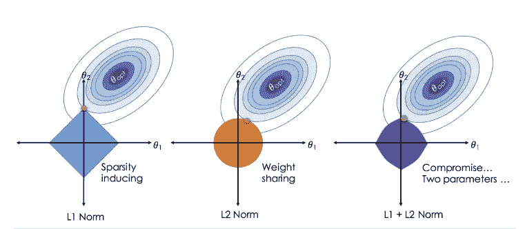

# 脊、套索和弹性网回归

> 原文：<https://blog.devgenius.io/ridge-lasso-elastic-net-regression-2ea752186e51?source=collection_archive---------3----------------------->

正规化技术([来源](https://miro.medium.com/max/788/1*q53XbAJdKv_l3sw-sUlCVA.png))

在本文中，我们将抛弃常用的线性回归算法，尝试探索一些其他的回归替代方法，即*套索、脊和弹性网*。到本文结束时，您将对上述三种算法的区别和工作原理、它们在机器学习问题中的应用以及何时使用它们有了很好的了解。

# 偏差-方差权衡:

在训练和测试我们的机器学习模型时，我们经常会遇到这样的情况，训练集和测试集之一或两者产生的错误比预期的要高。这可能由于几个原因而发生，其中之一是*偏差-方差权衡*。

*偏差*是模型做出与实际值不同的预测的趋势，而*方差*是不同数据样本的预测偏差。具有高偏差的模型试图过度简化模型，而具有高方差的模型无法对看不见的数据进行概括。在减少偏差时，模型变得易受高方差的影响，反之亦然。因此，这两种度量之间的权衡或平衡是定义好的预测模型的要素。

偏差-方差权衡([来源](https://upload.wikimedia.org/wikipedia/commons/thumb/9/9f/Bias_and_variance_contributing_to_total_error.svg/1920px-Bias_and_variance_contributing_to_total_error.svg.png))

具有低偏差和高方差的模型被称为 o *过拟合*，这是模型在训练集上表现非常好，但在看不见的实例集上表现不佳，导致高误差值的情况。解决过度拟合的一种方法是*正则化*，这正是下面讨论的回归技术所使用的。

# 正规化:

正则化是一种用于避免过度拟合的技术，其中系数(如果需要的话)被限制或缩减为零。减少不太重要的特征的影响会直接影响预测的质量，因为它*会减少自由度*，这反过来会使模型更难变得复杂或过度拟合数据。

线性回归成本函数

之前讨论的所有内容都是通过修改上面显示的传统线性回归成本函数来完成的。*一个惩罚项*被添加到成本函数中，它让我们控制将要在手边的模型上执行的正则化的类型和数量。如果你不熟悉上面显示的等式，你应该看看这个视频。

# 岭回归:

这种类型的正则化回归将代表 L2 范数的一半平方的惩罚项添加到成本函数中。这迫使学习算法不仅要适应数据，还要保持模型权重尽可能小。岭回归方程如下所示。

> L2 范数是特征向量上预测值和目标值之差的平方和。它也被称为欧几里得距离和均方根误差(RMSE)。

岭回归成本函数

收缩超参数λ (lambda)控制正则化的量，需要正确选择，因为如果λ = 0，则岭回归与线性回归相同，另一方面，如果λ非常大，则所有权重最终都非常接近于 0，导致模型欠拟合。选择正确λ的一个好方法是进行交叉验证。

# 套索回归:

简称为*最小绝对收缩和选择算子回归*，这种类型的正则化回归使用 L1 范数而不是 L2 范数的一半平方作为代价函数中的惩罚项。Lasso 回归的一个重要特征是，它倾向于完全消除最不重要的要素的权重，从而自动执行要素选择。

> L1 范数是特征向量上预测值和目标值之间的差值的大小的总和，或者可以理解为绝对差值的总和。它也被称为曼哈顿距离、出租车标准和平均绝对误差(MAE)。

Lasso 回归成本函数

收缩超参数λ的工作方式类似于岭回归，太小会导致无正则化，而太大则会导致模型欠拟合。

岭回归和套索回归之间的主要区别在于，即使两种回归技术都将系数缩小到接近于零，但如果收缩参数足够大，只有套索回归实际上会将系数设置为零。因此，产生了具有选定特征集的模型(稀疏模型),使其更易于解释和使用。

# 弹性净回归；

这种回归是岭回归和套索回归的简单混合。弹性网中的惩罚项是绝对值和平方值惩罚的组合。

> 弹性网最早出现是由于对 Lasso 的批评，其变量选择可能过于依赖数据，因此不稳定。解决方案是结合岭回归和套索的惩罚，以获得两全其美。([来源](https://www.datacamp.com/community/tutorials/tutorial-ridge-lasso-elastic-net)

弹性网络成本函数

脊和套索正则化之间的混合可以通过比率超参数(r)来控制。当 r = 0 时，弹性网等价于岭回归，当 r = 1 时，等价于套索回归。

山脊 vs 套索 vs 弹性网([来源](https://www.oreilly.com/library/view/machine-learning-with/9781787121515/assets/03902148-aac8-4968-a384-3ac2c2180e21.png))

# 需要记住的几点:

*   正如我们在介绍中看到的，正则化可以极大地帮助避免过度拟合，因此一点正则化几乎总是优于一般的线性回归。
*   在实施上述三种技术中的任何一种之前，缩放数据非常重要，因为它们都对输入要素的比例非常敏感。这可以使用 *sklearn 的标准定标器*来完成。
*   *岭回归*是一个很好的起点，但是如果有可能只有少数特征实际上是有用的，*套索和弹性网*可以派上用场，因为它们往往会将无用特征的权重降低到零。
*   另一方面，如果特征较少，并且所有特征似乎对目标都很重要，那么*岭回归*应该是首选，因为它倾向于给出较小但分布良好的权重。
*   *当特征的数量大于训练实例的数量或者当几个特征高度相关时，弹性网*优于*套索回归*，因为在这种情况下，套索会增加一点偏差。

# 结论:

在这篇文章中，我们了解了偏差-方差的权衡，为什么它是必要的，以及如何通过正则化来达到一个良好的平衡。然后，我们看了三种类型的回归技术:*脊、套索和弹性网*，它们的数学表达式，最后，我们回顾了选择一种技术时需要记住的区别和要点。谢谢大家！