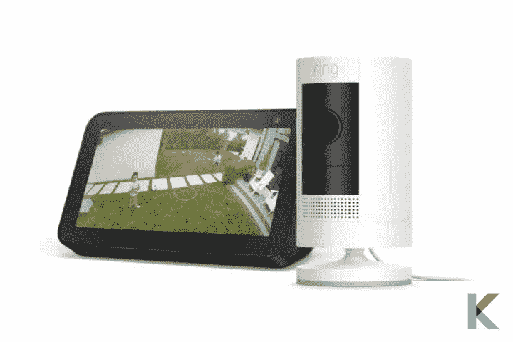

# 环形粘贴凸轮太阳能高清安全摄像机

> 原文：<https://blog.devgenius.io/ring-stick-up-cam-solar-6740e41b6bf9?source=collection_archive---------5----------------------->

为了选择最好的太阳能安全摄像机，您应该考虑一些因素，如安全摄像机如何传输数据，其太阳能电池板的容量和图像分辨率。太阳能供电的安全摄像机使用内部电池来存储来自阳光直射的能量，就像环形贴起来的 Cam Solar 一样。你不必担心太阳下山时相机会没电。这种立式摄像机依靠内置电池储存阳光能量。继续阅读，以了解更多关于环坚持凸轮太阳能高清安全摄像机。

**在这篇文章中，你会学到；**

*   什么是环形贴起来凸轮太阳能高清安全摄像机？
*   环坚持凸轮太阳能的利弊
*   环形支撑凸轮太阳能的特点
*   戒指应用
*   贴吧 Cam 太阳能、贴吧 Cam 电池、贴吧 Cam 插件、贴吧 Cam 精英有什么区别？
*   你如何连接你的太阳能电池板和你的环形相机？
*   振铃保护订阅
*   戒指的隐私特征
*   价格和可用性

# 什么是环形贴起来凸轮太阳能高清安全摄像机？

[全新的环形贴起来凸轮太阳能高清安全摄像机](https://kodmy.com/ring-stick-up-cam-solar/)是一款运动启动摄像机，带有连接的太阳能电池板和备用电池组。因此，您可以享受双电源的灵活性。它是您实现更智能安全的多功能解决方案。此外，使用您的手机监控重要的东西，并通过无限的放置选项将其放置在您需要的地方。

**购买前—检查智能设备的智能助手兼容性**

如果您有 Siri，您可以轻松检查智能家居设备与 Siri 的兼容性。而且，不仅仅是 Siri 兼容性，你还可以检查设备与 Alexa 和 Google Assistant 的兼容性。您现在可以[下载带有 Siri 的智能家居设备检查器](https://play.google.com/store/apps/details?id=com.knovik.canda)。

对于 iPhone 用户- [下载 Canda](https://apps.apple.com/us/app/canda-compatibility-checker/id1630339464)

Android 用户- [下载 Canda](https://play.google.com/store/apps/details?id=com.knovik.canda)

是下雨还是晴天？别担心。使用附带的电池组，无论晴雨，您都可以获得不间断的电力和保护。它有备用电源。你可以把它放在你家的上方，或者挂在院子的一个角落，用来监视你家的重要区域。放松点。它覆盖每个角落，鸟瞰所有的活动。

[您要将戒指设备与 Apple HomeKit 连接吗？](https://kodmy.com/ring-stick-up-cam-solar/#ring-homekit)

如果你有一个 [Alexa Echo Dot 智能音箱](https://kodmy.com/alexa-echo-dot/)，你可以听到来自 Echo Dot 的自定义通知。简直牛逼。您还可以使用 Echo Show 等功能发布视频。你知道什么可以轻松连接你的[戒指家庭安全套装](https://kodmy.com/ring-alarm-home-security-kit/)。您可以将您的安全摄像头和所有戒指设备链接到戒指应用程序，以便您可以从手机上控制它们。

快一点！你现在可以从亚马逊 获得全新的环形贴起来 Cam 太阳能高清安全摄像机[。](https://amzn.to/3HgdIIL)

如果您喜欢[比较环形支撑凸轮和 Reolink Argus 3 Pro](https://kodmy.com/compare/smart-security-cameras?modelList=ring-stick-up-cam,reolink-argus-3-pro) ，您可能会找到最佳对比。

# 环形推杆凸轮

粘贴式摄像机提供了您需要的所有功能，如运动激活通知、灵活的设计和几个电源选项。它是上一代产品的重新设计版本。因此，有了更新的贴起来凸轮太阳能，贴起来凸轮电池和贴起来凸轮精英，你可以找到你的[智能家居](https://kodmy.com/smart-home-technology/)的完美解决方案。

这种环形凸轮具有双重动力。这意味着这个摄像头有一个主电源(太阳能)和一个备用电源(快速释放电池组)来保持连接。

# 环形贴合凸轮太阳能电池板

环形太阳能电池板是聚光灯和摄像头的最佳不间断太阳能电源。它配备了持续充电的太阳能电池板。放心吧！因为有太阳能电池板，你永远不会没电。它具有耐候性设计和可调安装支架。

# 环坚持凸轮太阳能的利弊

**优点**

*   防风雨照相机
*   太阳能和电池电源
*   环形生态系统和 Alexa 集成
*   良好的电池寿命
*   光滑的应用程序
*   移动激活通知
*   高清视频和双向通话
*   彩色夜视
*   易于安装

**缺点**

*   基于订阅的云存储
*   没有 Google Home 或 Apple HomeKit 集成

# 环形支撑凸轮太阳能的特点

# 戒指应用

如果你想流畅的控制你的相机，Ring App 给你完全的控制权。当家里发生任何事情时，你会在智能手机和平板电脑上收到实时通知。使用实时视图按钮获取实时视频和音频，并随时随地查看您的住所。

有时，您的智能家中可能有多种铃声设备。因此，您可以从一个仪表板上连接和控制所有环设备。谈论安全和隐私控制很重要。它允许您查看、控制和自定义安全设置。此外，您还可以通过邻居提供的安全警报和实时犯罪信息与您的社区保持联系。此外，您可以通过 Ring App，用您最喜欢的智能门锁为朋友和家人开门，比如耶鲁智能门锁和西勒奇编码器。

# 斗杆凸轮太阳能、斗杆凸轮电池、斗杆凸轮插件和斗杆凸轮精英之间有什么区别？

# 您如何将太阳能电池板连接到直立式环形摄像机？

将您的太阳能电池板连接到[环贴凸轮太阳能](https://ring.com/products/stick-up-security-camera-solar)只需要三个步骤。让我们看看如何安装太阳能电池板。

步骤 1-首先将顶起凸轮放置在平坦的表面或墙壁上。接下来，插入电池。

第 2 步-连接将相机连接到太阳能电池板

第 3 步——最后，按照 Ring 应用程序中的说明连接到 WiFi

# 振铃保护订阅

不要错过环保套餐。以下是您须知的直立式凸轮环保护计划。

*   记录和捕获—在您不在的任何时间记录视频并捕获照片
*   人员提醒-当您的设备发现人员时，您可以收到人员提醒并自定义您的提醒。
*   丰富的通知——您无需打开带有照片预览的铃声应用程序，即可获得丰富的通知。
*   灵活的选项-每月 3 美元的 Protect Basic 计划套餐可覆盖一台设备，每月 10 美元的 protect plus 计划套餐可覆盖您家中所有设备的视频录制。

# 戒指的隐私特征

环行凸轮有多种隐私功能。您可以创建不想监控的隐私区域。此外，您可以直接从应用程序中禁用运动录制和音频警报。此外，您可以计划打开或关闭运动警报。

# 价格和可用性

一台带有太阳能电池板的相机的价格为 148.99 美元。其他版本包括棒起来凸轮电池(99.9 美元)，电线版本(99.99 美元)。所以，顶起凸轮太阳能电池板是这一类太阳能电池板的一套令人印象深刻的替代品。有两种不同的颜色可供选择:亚马逊的黑色和白色。

在选择一款出色的太阳能[智能安全摄像头](https://kodmy.com/best-home-security-cameras/)之前，重要的是要确定它是否与您的智能家庭、现有的无线网络或 4G 服务提供商兼容。

***我们的选择***

Ring Stick up Cam Solar HD 安全摄像机是最好的太阳能安全摄像机，具有彩色夜视、运动激活通知、防风雨摄像机等功能。这是毫无疑问的。对于你的家来说，这是一个很好的选择，但对于那些已经投资了 Ring 的生态系统或 Alexa 设备的人来说，这是最好的选择