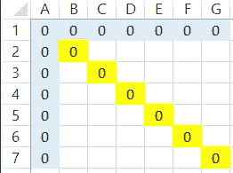
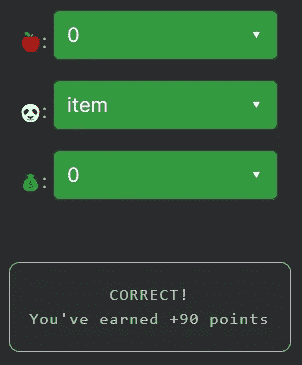

# 天才之路:进阶#28

> 原文：<https://blog.devgenius.io/road-to-genius-advanced-28-11c68462435a?source=collection_archive---------32----------------------->

每天我都要解决几个 Codr 分级模式的编码挑战和难题。目标是达到天才的等级，在这个过程中我解释了我是如何解决这些问题的。你不需要任何编程背景就可以开始，而且你会学到很多新的有趣的东西。

我们终于达到了高级水平，从现在开始事情会变得非常非常有趣。

```
function setZeroes(matrix) {
  if (matrix.length === 0)
    return matrix;
  const m = matrix.length;
  const n = matrix[0].length;
  let firstRow = false;
  let firstCol = false;
  for (let i = 0; i < m; i++) {
    for (let j = 0; j < n; j++) {
      const 🐼 = matrix[i][j];
      if (item === 0) {
        if (i === 0) {
          firstRow = true;
        }
        if (j === 0) {
          firstCol = true;
        }
        matrix[0][j] = 0;
        matrix[i][0] = 0;
      }
    }
  }
  for (let i = 1; i < m; i++) {
    for (let j = 1; j < n; j++) {
      const item = matrix[i][j];
      if (matrix[0][j] == 🍎 || matrix[i][💰] == 0) {
        matrix[i][j] = 0;
      }
    }
  }
  if (firstRow) {
    for (let i = 0; i < n; i++) {
      matrix[0][i] = 0;
    }
  }
  if (firstCol) {
    for (let i = 0; i < m; i++) {
      matrix[i][0] = 0;
    }
  }
  return matrix;
}
let arr = [[2, 0], [1, 1], [2, 0], [1, 2]];
setZeroes(arr);
let A = arr[2][0];// 🍎 = ? (number)
// 🐼 = ? (identifier)
// 💰 = ? (number)
// such that A = 0 (number)
```

哎呀，那是一大堆代码！幸运的是，我们只需要修复三个错误。让我们看看第一个 bug 行:

```
const 🐼 = matrix[i][j];
if (item === 0) {
```

我们的第一个 bug🐼看起来是一个变量声明，下一行通常显示变量名，在本例中是`item`。

接下来的两个 bug 出现在同一行，代码如下所示:

```
if (matrix[0][j] == 🍎 || matrix[i][💰] == 0)
    matrix[i][j] = 0;
```

我们来简单分析一下这几行。对象`matrix`被用作 2D 数组(就像一个由行和列组成的网格)。

第一个 if 条件检查第一列中的所有元素是否都等于🍎
:`matrix[0][j] == 🍎`

第二个条件检查💰第-行等于零:
`matrix[i][💰] == 0`

记住数学方程通常有对称的性质。很有可能🍎为 0，并且💰是 0。如果为真，If 条件将检查第一列的所有行，以及第一行的所有列(蓝色)。如果其中任何一个为零(由 or `||`运算符表示)，那么相应的对角线值(黄色)将变为零:



我们的直觉证明是正确的:



通过解决这些挑战，你可以训练自己成为一名更好的程序员。您将学到更新更好的分析、调试和改进代码的方法。因此，你在商业上会更有效率和价值。在[https://nevolin.be/codr/](https://nevolin.be/codr/)加入我的天才之路，提升你的编程技能