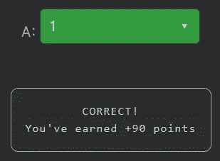

# 天才之路:进阶#29

> 原文：<https://blog.devgenius.io/road-to-genius-advanced-29-65708797fc35?source=collection_archive---------31----------------------->

每天我都要解决几个 Codr 分级模式的编码挑战和难题。目标是达到天才的等级，在这个过程中我解释了我是如何解决这些问题的。你不需要任何编程背景就可以开始，而且你会学到很多新的有趣的东西。

这是我们高级阶段的第二个挑战:

```
function mode(x) {
  let counts = {};
  let mode = [];
  let max = 0;
  let n = x.length;
  let i = -1;
  let d, k;
  while (++i < n) {
    d = x[i]
    if (d in counts)
      k = ++counts[d];
    else
      k = counts[d] = 1;
    if (k === max)
      mode.push(d);
    else if (k > max) {
      max = k;
      mode = [d];
    }
  }
  return mode;
}
let inp = [2,4,8,8,2,2]
let out = mode(inp)
let A = out.length// A = ? (number)
```

我们需要确定`A`的值，也就是数组`out`的大小，也就是函数`mode`的输出。

如果你简单分析一下这个函数，你不太可能认出来，除非你过去明确写过非常类似的东西。函数名`mode`是统计学中一个众所周知的运算，用于确定一个集合中出现次数最多的数字。换句话说，一组数的众数就是出现频率最高的数。

这个函数主要做的是跟踪最常出现的数字，这些数字存储在内部数组`mode`中，不要与函数`mode`混淆。

while 循环遍历输入数组`x`中的每个数字，每个元素被分配给变量`d`。第一个 if-else 语句将所有数字作为键值对象进行跟踪；其中变量`k`是数字`d`的出现次数。

第二个 if-else 检查`k`是否大于当前最高发生数(即其频率)。它使用变量`max`来跟踪最高频率。如果`k == max`，那么`d`被添加到`mode`数组中。因为这是到目前为止发生率最高的数字之一。
Else if`k > max`；意味着数字`d`比`mode`中的所有数字出现的频率都要高，然后它用`k`覆盖`max`，并且`mode`成为一个新的数组，第一个数字是`d`。

让我们用伪代码来描述这一切:

```
x = [2, 4, 8, 8, 2, 2]
mode = []
max = 0-> d = 2
   k = 1
   max = 1
   mode = [2]-> d = 4
   k = 1
   max = 1
   mode = [2, 4]-> d = 8
   k = 1
   max = 1
   mode = [2, 4, 8]-> d = 8
   k = 2
   max = 2
   mode = [8]-> d = 2
   k = 2
   max = 2
   mode = [8, 2]-> d = 2
   k = 3
   max = 3
   mode = [2]
return mode; --> out = mode(x) = [2]
    A = out.length = 1
```



通过解决这些挑战，你可以训练自己成为一名更好的程序员。您将学到更新更好的分析、调试和改进代码的方法。因此，你在商业上会更有效率和价值。在[https://nevolin.be/codr/](https://nevolin.be/codr/)加入我的天才之路，提升你的编程技能