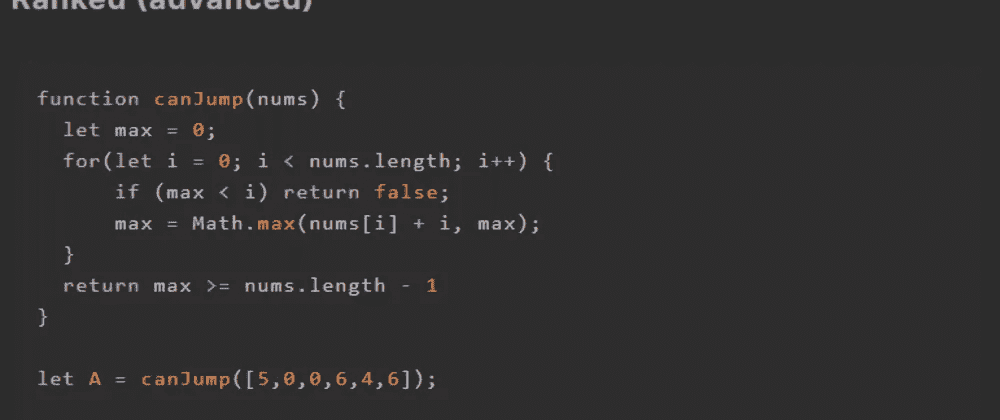
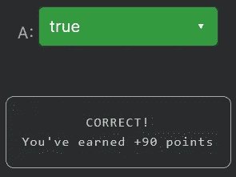

# 天才之路:高级#30

> 原文：<https://blog.devgenius.io/road-to-genius-advanced-30-4d3d4fb7559?source=collection_archive---------49----------------------->



每天我都要解决几个 Codr 分级模式的编码挑战和难题。目标是达到天才的等级，在这个过程中我解释了我是如何解决这些问题的。你不需要任何编程背景就可以开始，而且你会学到很多新的有趣的东西。

```
function canJump(nums) {
  let max = 0; 
  for(let i = 0; i < nums.length; i++) {
      if (max < i) return false; 
      max = Math.max(nums[i] + i, max);
  }
  return max >= nums.length - 1
}let A = canJump([5,0,0,6,4,6]);// A = ? (boolean)
```

这个挑战的代码很短，让我们看看它到底是怎么回事。我们必须弄清楚`A`的布尔值:
`let A = canJump([5,0,0,6,4,6]);`

乍一看，我不知道函数`canJump`是做什么的，所以我们必须更仔细地分析它。

```
for (let i = 0; i < nums.length; i++) {
    if (max < i) return false; 
    max = Math.max(nums[i] + i, max);
}
```

这三行代码做了以下事情:迭代数组`nums`中的每个数字；检查`max`是否小于`i`，如果是，函数立即返回假；最后，它确定新的最大值。if 条件实际上确保了`max`跳转大小大于 for 循环的当前索引`i`。

该算法实际上是关于确定它是否能够“跳到”某个位置，其中每个数字代表最大跳跃长度。

最后一行代码揭示了它的最终条件:
`return max >= nums.length - 1`
它检查 max 是否大于或等于`nums`的数组大小，这意味着整个算法检查是否可以从第一个索引开始到达数组的末尾。

下面是一些伪代码来说明这一点:

```
nums = [5, 0, 0, 6, 4, 6]-> i = 0
   nums[i] = 5
   max = max(5+0, 0) = 5
   * from this index, we can jump max 5 positions further-> i = 1
   nums[i] = 0
   max = max(0+1, 5) = 5
   * if we jump to here, we cannot jump any further (= 0)-> i = 2
   nums[i] = 0
   max = max(0+2, 5) = 5
   * if we jump to here, we cannot jump any further (= 0)-> i = 3
   nums[i] = 6
   max = max(6+3, 5) = 9
   * if we jump to here, we can jump max 6 positions further-> i = 4
   nums[i] = 4
   max = max(4+4, 9) = 9
   * if we jump to here, we can jump max 4 positions further-> i = 5
   nums[i] = 6
   max = max(6+5, 9) = 11
   * if we jump to here, we can jump max 6 positions further
```

这个挑战很简单，对我们有利，因为我们可以从第一个索引到达数组的末尾(i = 5 );因为第一个数字是 5。



我们甚至可以通过执行以下操作来优化该算法:

```
function canJump(nums) {
  let max = 0; 
  for(let i = 0; i < nums.length; i++) {
      if (max < i) return false; 
      else if (max >= nums.length - 1) return true;
      max = Math.max(nums[i] + i, max);
  }
  return max >= nums.length - 1
}let A = canJump([5,0,0,6,4,6]);
```

额外的 else 语句使函数在检测到可以到达末尾时更快地返回，因此它不必迭代所有的数字。

编写这段代码的另一种方法是:

```
function canJump(nums) {
  let max = 0; 
  for(let i = 0; i < nums.length; i++) {
      if (max < i) return false; 
      max = Math.max(nums[i] + i, max);
      if (max >= nums.length - 1) return true;
  }
  return false;
}let A = canJump([5,0,0,6,4,6]);
```

通过解决这些挑战，你可以训练自己成为一名更好的程序员。您将学到更新更好的分析、调试和改进代码的方法。因此，你在商业上会更有效率和价值。在[https://nevolin.be/codr/](https://nevolin.be/codr/)加入我的天才之路，提升你的编程技能