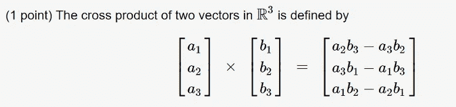

# 天才之路:高级#31

> 原文：<https://blog.devgenius.io/road-to-genius-advanced-31-5b399f4a30c1?source=collection_archive---------57----------------------->


每天我都要解决几个 Codr 分级模式的编码挑战和难题。目标是达到天才的等级，在这个过程中我解释了我是如何解决这些问题的。你不需要任何编程背景就可以开始，而且你会学到很多新的有趣的东西。

```
function cross(a, b) {
  return [a[1] * b[2] - a[🐼] * 💧[1], a[2] * b[0] - ☃️[0] * b[2], 😈[0] * b[1] - a[1] * b[0]];
}
let out = cross([8, 4, 2], [2, 6, 2]);
let A = out[1];
A = Math.abs(A);// 💧 = ? (identifier)
// ☃️ = ? (identifier)
// 😈 = ? (identifier)
// 🐼 = ? (number)
// such that A = 12 (number)
```

这个挑战是关于一些非常简单的数学矩阵运算。我们需要修复 4 个错误，它们都出现在同一行:

```
return [
  a[1] * b[2] - a[🐼] * 💧[1],
  a[2] * b[0] - ☃️[0] * b[2],
  😈[0] * b[1] - a[1] * b[0]
];
```

为了解决这个问题，我们必须仔细分析代码。函数的名字`cross`已经透露了很多。如果你学过代数，你可能听说过两个(或更多)矩阵的叉积。如果你没有，或者你已经忘记了它是如何工作的(像我一样)，一个快速的谷歌图片搜索给我们以下公式:



我们的代码看起来与这个公式非常相似，除了枚举(第一个元素是 0 而不是 1)。我们也可以利用我们之前对对称性的了解来解决这些问题，因为对称性是一个数学函数。
第一只虫子🐼必须是 2。
第二个 bug💧必须是`b`。
第三个 bug ☃️是`a`。
最后的 bug😈是`a`为好。


通过解决这些挑战，你可以训练自己成为一名更好的程序员。您将学到更新更好的分析、调试和改进代码的方法。因此，你在商业上会更有效率和价值。在[https://nevolin.be/codr/](https://nevolin.be/codr/)加入我的天才之路，提升你的编程技能