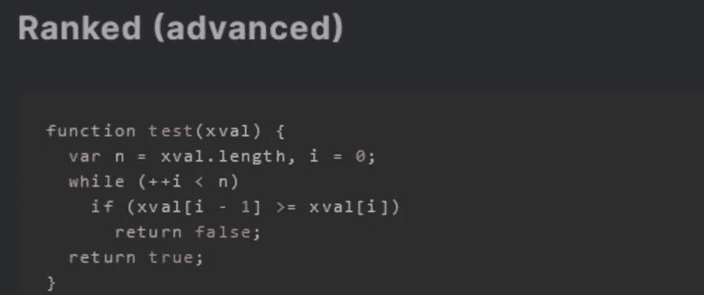
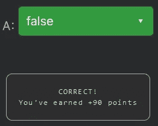

# 天才之路:高级#32

> 原文：<https://blog.devgenius.io/road-to-genius-advanced-32-bbadfbf90cfe?source=collection_archive---------35----------------------->



每天我都要解决几个 Codr 分级模式的编码挑战和难题。目标是达到天才的等级，在这个过程中我解释了我是如何解决这些问题的。你不需要任何编程背景就可以开始，而且你会学到很多新的有趣的东西。

```
function test(xval) {
  var n = xval.length, i = 0;
  while (++i < n)
    if (xval[i - 1] >= xval[i])
      return false;
  return true;
}
let A = test([2,6,6,9])// A = ? (boolean)
```

这似乎是一个简单的挑战，我希望我们能尽快完成。它从调用一个未知函数`test`开始，该函数将一个数组作为唯一参数。我们不知道这个函数做什么，所以我们必须分析它:

```
var n = xval.length, i = 0;
while (++i < n)
```

前两行基本上只是迭代数组中的每个元素，但略有不同，因为它跳过了第一个元素。

最后 3 行是:

```
while(...)
   if (xval[i - 1] >= xval[i])
      return false;
return true;
```

if 条件检查前一个值是否大于或等于当前值。如果是，它立即返回 false。如果这个 If 条件从未通过，函数将返回 true。

基本上，这个函数检查数组中的每个值是否严格大于前一个值。这个挑战中使用的输入是`[2,6,6,9]`，它有一个重复的 6，所以数组没有严格意义上更大的升序值。



通过解决这些挑战，你可以训练自己成为一名更好的程序员。您将学到更新更好的分析、调试和改进代码的方法。因此，你在商业上会更有效率和价值。在 https://nevolin.be/codr/[的](https://nevolin.be/codr/)，加入我的天才之路，提升你的编程技能