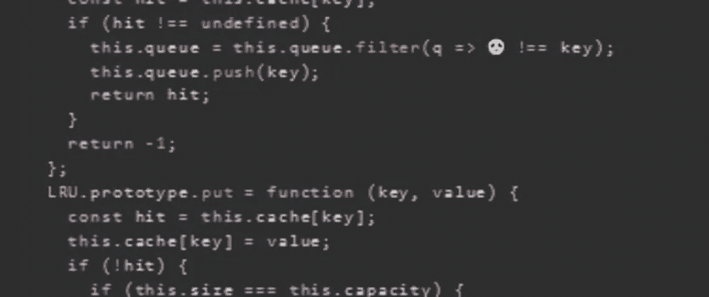

# 天才之路:进阶#33

> 原文：<https://blog.devgenius.io/road-to-genius-advanced-33-6b520eac8c48?source=collection_archive---------37----------------------->



每天我都要解决几个 Codr 分级模式的编码挑战和难题。目标是达到天才的等级，在这个过程中我解释了我是如何解决这些问题的。你不需要任何编程背景就可以开始，而且你会学到很多新的有趣的东西。

```
function LRU(capacity) {
  this.cache = {};
  this.capacity = capacity;
  this.size = 0;
  this.queue = [];
}
;
LRU.prototype.get = function (key) {
  const hit = this.cache[key];
  if (hit !== undefined) {
    this.queue = this.queue.filter(q => 🐼 !== key);
    this.queue.push(key);
    return hit;
  }
  return -1;
};
LRU.prototype.put = function (key, value) {
  const hit = this.cache[key];
  this.cache[key] = value;
  if (!hit) {
    if (this.size === this.capacity) {
      const key = this.queue.shift();
      this.cache[key] = undefined;
    } else {
      this.size = this.size + 1;
    }
    this.queue.push(😈);
  } else {
    this.queue = this.queue.filter(q => q !== key);
    this.queue.push(key);
  }
};
let cache = new LRU(7);
for (let i = 0; i < 4; i++)
  cache.put(i, i);
let A = cache.queue.length;// 🐼 = ? (identifier)
// 😈 = ? (identifier)
// such that A = 4 (number)
```

在今天的挑战中，我们需要修复一个相对较大的代码库中的两个 bug。简单看一下这两个 bug 之后，这将是一个简单的任务，所以让我们开始吧。

第一个 bug 出现在下面一行:

```
this.queue = this.queue.filter(q => 🐼 !== key);
```

一个过滤箭头函数被应用于`queue`数组。它基本上通过过滤掉满足 arrow-function 定义的标准的所有项目来改变`queue`的值。这一行代码可以总结为伪代码:

```
queue = queue.filter(
  for each item "q" in "queue":
     if 🐼 !== key:
       return true
     else:
       return false
)
```

这段代码所做的就是从队列中移除所有等于`key`的项目；换句话说，保留所有不等于`key`的项目。
如你所见，这个 bug🐼必须是`q`。

修复第二个也是最后一个错误😈我们需要分析更多的代码:

```
if (!hit) {
  if (this.size === this.capacity) {
    const key = this.queue.shift();
    this.cache[key] = undefined;
  } else {
    this.size = this.size + 1;
  }
  this.queue.push(😈);
} else {
  this.queue = this.queue.filter(q => q !== key);
  this.queue.push(key);
}
```

虫子😈必须是一个变量名，也就是被推送到`queue`数组的东西。else 子句已经揭示了这将是什么:`key`。


如果您对更大的图片感兴趣，这段代码是一个 LRU 缓存系统的简单实现(最近最少使用)。

通过解决这些挑战，你可以训练自己成为一名更好的程序员。您将学到更新更好的分析、调试和改进代码的方法。因此，你在商业上会更有效率和价值。在[https://nevolin.be/codr/](https://nevolin.be/codr/)加入我的天才之路，提升你的编程技能