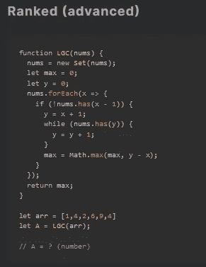
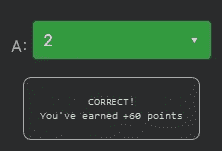

# 天才之路:进阶#34

> 原文：<https://blog.devgenius.io/road-to-genius-advanced-34-aa5bdb4b5300?source=collection_archive---------33----------------------->

每天我都要解决几个 Codr 分级模式的编码挑战和难题。目标是达到天才的等级，在这个过程中我解释了我是如何解决这些问题的。你不需要任何编程背景就可以开始，而且你会学到很多新的有趣的东西。



在这个挑战中，我们需要计算出`A`的值，它是一个未知函数`LGC`的输出，该函数将一组数字作为单个参数。

从第一行开始，我们注意到这个函数只对唯一的数字(没有重复的)感兴趣，因为它将数组转换成一个集合:

```
nums = new Set(nums)
```

然后使用`forEach`方法遍历集合中的每一项，其中`x`是数字。

它检查`nums`是否包含`x-1`，如果不包含，则设置`y=x+1`。接下来是一个 while 循环，只要`nums`包含`y`，它就会将`y`递增 1。最后设置`max`:

```
max = Math.max(max, y-x)
```

你可以用两种方法来解决这个问题，要么你在纸上/电子表格上算出每个数字。这是一个可行的方法，因为你只需要迭代 6 个数字，所以只需要一两分钟。

但是如果这个数组包含 50 个随机数，那么你需要一个更聪明的方法。诀窍是先搞清楚这个算法在做什么。

这里有一些我注意到的事情:我们有变量`x`和`y`，其中`x`保持静态，但是`y`增加了 1。看起来`x`是起点，`y`是终点。

然后我们有了这条线:

```
max = Math.max(max, y-x)
```

这将记录所有数量的`nums`中从`x`到`y`的最大距离。注意，只要`nums`包含`y`，while 循环的条件就是将`y`加 1。显然，该算法旨在找出`nums`中连续数字的最大长度/距离。

例:`nums = [1,2,6,7,8,9]`
连号最大长度为 4 ( `6 -> 9`)。

回到我们的挑战，最大长度是 2，唯一最长的连续序列是`1 -> 2`。



注意，这个算法不需要对输入数组(nums)进行排序，因为如果对它进行了排序，那么这个算法可以编写得更简单一些。

通过解决这些挑战，你可以训练自己成为一名更好的程序员。您将学到更新更好的分析、调试和改进代码的方法。因此，你在商业上会更有效率和价值。在[https://nevolin.be/codr/](https://nevolin.be/codr/)加入我的天才之路，提升你的编程技能