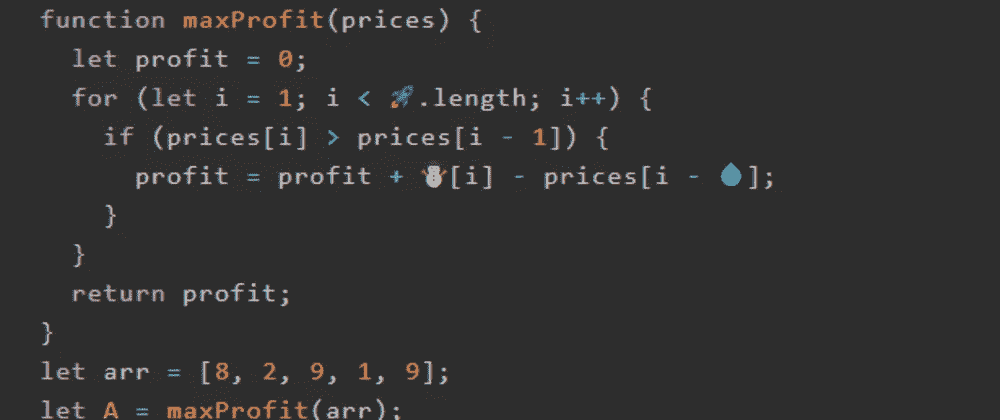
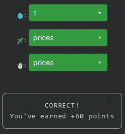

# 天才之路:高级#35

> 原文：<https://blog.devgenius.io/road-to-genius-advanced-35-481acfe14b27?source=collection_archive---------31----------------------->



每天我都要解决几个 Codr 分级模式的编码挑战和难题。目标是达到天才的等级，在这个过程中我解释了我是如何解决这些问题的。你不需要任何编程背景就可以开始，而且你会学到很多新的有趣的东西。

```
function maxProfit(prices) {
  let profit = 0;
  for (let i = 1; i < 🚀.length; i++) {
    if (prices[i] > prices[i - 1]) {
      profit = profit + ☃️[i] - prices[i - 💧];
    }
  }
  return profit;
}
let arr = [8, 2, 9, 1, 9];
let A = maxProfit(arr);// 💧 = ? (number)
// 🚀 = ? (identifier)
// ☃️ = ? (identifier)
// such that A = 15 (number)
```

我们在很多集前见过类似的挑战，我记得函数`maxProfit`。在这里，我们必须修复 3 个错误，让我们一个一个地检查它们。

```
for (let i = 1; i < 🚀.length; i++) {
```

第一个 bug🚀这一行使用了一个属性`length`，这个属性主要用在数组上，我们这里唯一的数组是`prices`。

最后两个错误出现在同一行:

```
if (prices[i] > prices[i - 1]) {
    profit = profit + ☃️[i] - prices[i - 💧];
}
```

你已经可以对☃️做一个计算猜测，它将是`prices`，因为它的邻居和 if 条件揭示了它。

最后的 bug💧应该是一个数字，我的初步猜测是💧应该是 1，因为它也像那样出现在 if 条件中。但是让我们通过分析代码来确定。

这个代码是用来计算最大利润的，它遍历价格，if-condition 决定是否销售，因为它重新计算利润(销售时)。换句话说，当新价格(`i`)高于先前价格(`i - 1`)时，它将“卖出”。

价格是:`[8, 2, 9, 1, 9]`
下面是一些伪代码:

```
profit = 0
i = 1
N = 2 (= new price)
O = 8 (= old price)
N < O  --> do nothingprofit = 0
i = 2
N = 9
O = 2
N > O --> profit = profit + N-O = 0 + 9-2 = 7profit = 7
i = 3
N = 1
O = 9
N < O --> do nothingprofit = 7
i = 4
N = 9
O = 1
N > O --> profit = profit + N-O = 7 + 9-1 = 15
```

最后`profit`是 15，这正是挑战所期待的:
`such that A = 15 (number)`



通过解决这些挑战，你可以训练自己成为一名更好的程序员。您将学到更新更好的分析、调试和改进代码的方法。因此，你在商业上会更有效率和价值。在[https://nevolin.be/codr/](https://nevolin.be/codr/)加入我的天才之路，提升你的编程技能